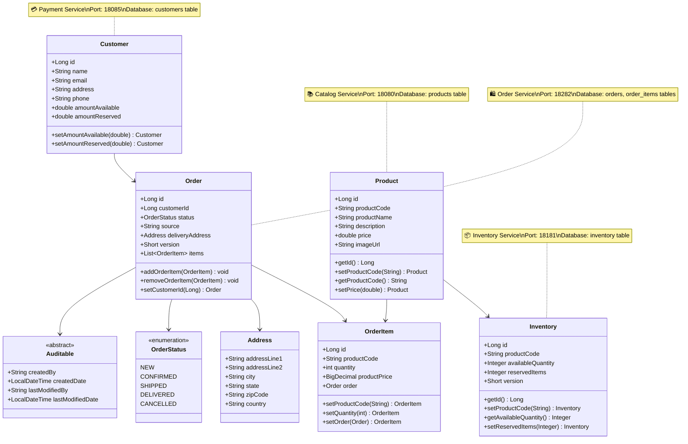
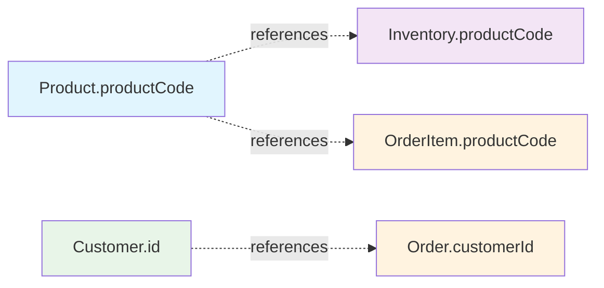

# 🏗️ Microservices Class Diagram

This document shows the entity relationships across all microservices in the Spring Boot Microservices Series project.

## 📊 Entity Relationship Diagram

## 🏢 Service Ownership

### 📚 Catalog Service (Port: 18080)
- **Entities**: `Product`
- **Database**: `products` table
- **Responsibility**: Product catalog management
- **Technology**: Spring Data R2DBC + PostgreSQL

### 📦 Inventory Service (Port: 18181)
- **Entities**: `Inventory`
- **Database**: `inventory` table
- **Responsibility**: Stock level management
- **Technology**: Spring Data JPA + PostgreSQL

### 🛍️ Order Service (Port: 18282)
- **Entities**: `Order`, `OrderItem`, `OrderStatus`, `Address`, `Auditable`
- **Database**: `orders`, `order_items` tables
- **Responsibility**: Order processing and orchestration
- **Technology**: Spring Data JPA + PostgreSQL

### 💳 Payment Service (Port: 18085)
- **Entities**: `Customer`
- **Database**: `customers` table
- **Responsibility**: Customer and payment management
- **Technology**: Spring Data + PostgreSQL

## 🔗 Cross-Service Relationships

### Logical Relationships (via productCode)

### Data Consistency
- **Product-Inventory**: Linked by `productCode` (String)
- **Product-OrderItem**: Linked by `productCode` (String)
- **Customer-Order**: Linked by `customerId` (Long)
- **Order-OrderItem**: JPA relationship with foreign key

## 🗄️ Database Schema Summary

| Service | Tables | Key Fields | Relationships |
|---------|--------|------------|---------------|
| **Catalog** | `products` | `id`, `product_code`, `product_name`, `price` | None (referenced by others) |
| **Inventory** | `inventory` | `id`, `product_code`, `quantity`, `reserved_items` | References Product via `product_code` |
| **Order** | `orders`, `order_items` | `orders.id`, `order_items.product_code` | `order_items` → `orders` (FK) |
| **Payment** | `customers` | `id`, `name`, `email`, `amount_available` | Referenced by Order via `customer_id` |

## 🚀 Communication Patterns

### Synchronous (REST API)
- Order Service → Catalog Service (product details)
- Order Service → Inventory Service (stock check)
- Order Service → Payment Service (customer validation)

### Asynchronous (Kafka Events)
- Order events for inventory updates
- Payment events for order confirmation
- Inventory events for stock notifications

---

*This diagram represents the current microservices architecture with clear service boundaries and entity ownership.*