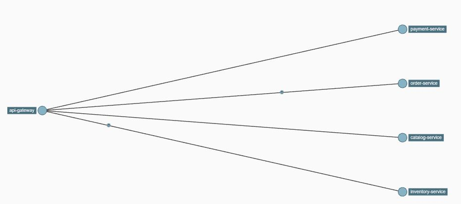
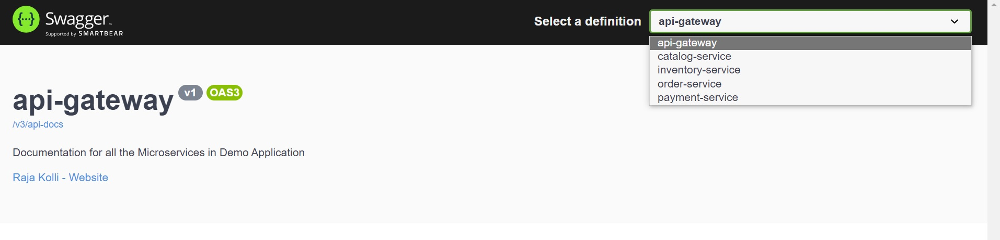

[](https://gitpod.io/#https://github.com/rajadilipkolli/spring-boot-microservices-series-v2) 

[](https://sonarcloud.io/summary/new_code?id=rajadilipkolli_spring-boot-microservices-series-v2)
[](https://sonarcloud.io/summary/new_code?id=rajadilipkolli_spring-boot-microservices-series-v2)
[](https://sonarcloud.io/summary/new_code?id=rajadilipkolli_spring-boot-microservices-series-v2)
[](https://sonarcloud.io/summary/new_code?id=rajadilipkolli_spring-boot-microservices-series-v2)


## Problem Statement

The `Retail Business management system` is a comprehensive platform for managing the sales and inventory of a retails business. It includes several different components that work together to provide a seamless experience for both the business and the customer.It includes four main components:

1. `Catalog`: The catalog component allows the business to create and maintain a list of products that are available for sale on their website. This includes details such as product descriptions, images, and pricing.

2. `Inventory`: The inventory component is responsible for tracking the availability of products and ensuring that orders can be fulfilled. It includes features such as inventory tracking and restocking alerts.

3. `Order`: The order component allows customers to place orders for products, and includes features such as order tracking and confirmation emails.

4. `Payment`: The payment service component handles the processing of payments and maintains customer information. This includes the ability to store payment details for future purchases and to handle transactions securely.

The process flow begins with an admin creating a catalog of products to sell on the website. This catalog is managed by an operator, who is responsible for updating the inventory levels of the products.

The end user, or customer, is then able to register their profile and payment details with a payment service. Once the customer places an order, the system checks to see if the customer has the necessary funds and is able to make the purchase. If the purchase is approved, the system reserves the amount of the purchase and checks to see if the product is available in the inventory. If the product is available, it is reserved for the customer.

Once both the payment and product availability checks have been successful, the order processing begins. The status of the order is changed and events are sent to both the payment and inventory systems to deduct the amount from the customer's account and reduce the inventory levels.

Overall, the `Retail Business management system` project provides a comprehensive solution for managing the sales and inventory of a business, with a focus on ensuring a smooth and seamless experience for both the business and the customer.


## Technical Concepts and requirement

`API Gateway`: An API Gateway is a microservice that sits between external clients and the various microservices that make up an application. It acts as a reverse proxy, routing requests from clients to the appropriate microservice and returning the response back to the client. This allows for a single point of entry into the application, making it easier to manage and scale.

`Service Registry`: A Service Registry is a microservice that maintains a list of all the other microservices in an application. It allows for service discovery, allowing microservices to find and communicate with each other without needing to know their specific locations. This is particularly useful in environments where microservices are frequently scaled up or down, as the Service Registry ensures that all microservices are aware of the current state of the system.

`Config Server`: A Config Server is a microservice that stores configuration information for an application. It allows for centralized management of configuration data, which can be accessed by other microservices as needed. This helps to ensure that all microservices are using the same configuration data, and makes it easier to update configuration information as needed.

`Observability` in a microservices architecture involves the ability to understand the current state and behavior of the system, including any issues or errors that may occur. This can be achieved through the use of tools such as distributed tracing, which allows for the tracking of requests and responses as they pass through the system.

Microservices `centralized logging` refers to the practice of collecting and storing log data from all microservices in a single location, typically a centralized log management system. This allows for easier tracking and analysis of log data, as it is all stored in a single location rather than spread across multiple microservices.

`Monitoring` in a microservices architecture involves tracking the performance and health of individual microservices and their interactions with other microservices. This can be done using tools such as application performance monitoring (APM) or infrastructure monitoring tools.

To implement centralized logging, monitoring, and observability in a microservices architecture, there are several technical requirements that must be met. These include:

1. **_Integration with log management and monitoring tools_**: The microservices must be able to send log data and performance metrics to the centralized log management system and monitoring tools.

2. **_Support for distributed tracing_**: The microservices must support distributed tracing to allow for the tracking of requests and responses as they pass through the system.

3. **_Security and privacy considerations_**: The centralized logging, monitoring, and observability systems must be secure and protect sensitive data.

4. **_Scalability_**: The centralized logging, monitoring, and observability systems must be able to handle the large volume of data generated by a microservices architecture.

5. **_Integration with existing systems_**: The centralized logging, monitoring, and observability systems must be able to integrate with existing systems and tools, such as monitoring and alerting systems.


Initial Code generated using [springboot generator](https://github.com/sivaprasadreddy/generator-springboot) where I have recently joined as co-commiter to the project

### Local SetUp and running using docker

To run in local, first build all services using command

```shell
./mvnw clean spotless:apply spring-boot:build-image -DskipTests
```

Once above step is completed, start solution in docker using

```shell
docker compose up
```

To start silently use `docker compose -d up` , which starts in detached mode and can observe logs using `docker compose logs -f `

To test end to end run the below script from project root directory

```shell
HOST=localhost PORT=8765 ./test-em-all.sh start stop

```

### Starting infrastructure

```bash
docker compose up zipkin-server postgresql pgadmin4 kafka config-server naming-server
```

### URLs to access pieces of software

- Service Registry : http://localhost:8761
- PgAdmin (UI for Postgres Database) : http://localhost:5050
- kafdrop (UI for kafka Messages) : http://localhost:9000
- Grafana : http://localhost:3000 (user/password)
- Prometheus : http://localhost:9090
- Zipkin (Centralized logs tracing) : http://localhost:9411/zipkin/


### Swagger URLs for accessing Services

| **Service Name**  | **URL**                                                  | **Gateway URL**                                             |
|-------------------|----------------------------------------------------------|-------------------------------------------------------------|
| api gateway       | http://localhost:8765/swagger-ui.html                    | http://localhost:8765/swagger-ui.html                       |
| catalog service   | http://localhost:18080/catalog-service/swagger-ui.html   | ~~http://localhost:8765/catalog-service/swagger-ui.html~~   |
| inventory service | http://localhost:18181/inventory-service/swagger-ui.html | ~~http://localhost:8765/inventory-service/swagger-ui.html~~ |
| order service     | http://localhost:18282/order-service/swagger-ui.html     | ~~http://localhost:8765/order-service/swagger-ui.html~~     |
| payment service   | http://localhost:18085/payment-service/swagger-ui.html   | ~~http://localhost:8765/payment-service/swagger-ui.html~~   |

Now, [Gateway Swagger](http://localhost:8765/swagger-ui.html) serves as an aggregate for multiple services, allowing users to access these services through the top dropdown menu as shown.

  


### Liquibase Formats

 - Liquibase will support various formats and these are implemented in below services

| Liquibase Formats | Service                                  |
|-------------------|------------------------------------------|
| XML               | [order-service](./order-service), [payment-service](./payment-service)       |
| YAML              | [catalog-service](./catalog-service)     |
| JSON              | [inventory-service](./inventory-service) |
| SQL               |                                          |

### Useful Docker Commands

>  Clean up everything using
 ```shell
 docker system prune -a -f --volumes
 ```
>  Claim unused volumes
 ```shell
 docker volume prune
 ```
> find Running container
 ```shell
 docker container ls
 ```
 > find logs of running container
 ```shell
 docker compose logs -f
 ```

### Kill Application running on port

- find process Id running on port
```shell
netstat -ano | findstr :18080
```
- Killing application using cmd
```shell
taskkill /PID <type PID here> /f
```


#### References
- https://piotrminkowski.com/2022/01/24/distributed-transactions-in-microservices-with-kafka-streams-and-spring-boot/

#### Projects unable to convert to native Image OOTB
- config-server (Due to presence of Netty)
- api-gateway (Due to presence of Netty)

#### Breaking Changes in 3.0
- Migration to jakarta namespace from javax
- Spring Cloud Seluth is deprecated in favor of Micrometer
- With New Observability we cant use Rabbit as sender type and use asynchronous communication
- Fluent-bit only supports AMD architecture hence swithced to pormtail. If you want to use fluent-bit please ensure grafana is started first and then other services are started.

- JOOQ expects `Transactional` annotation on repository though we have it on Service
