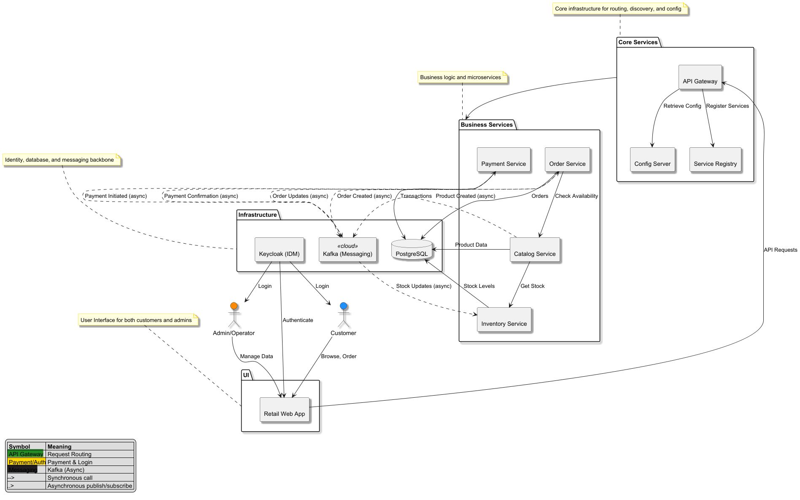
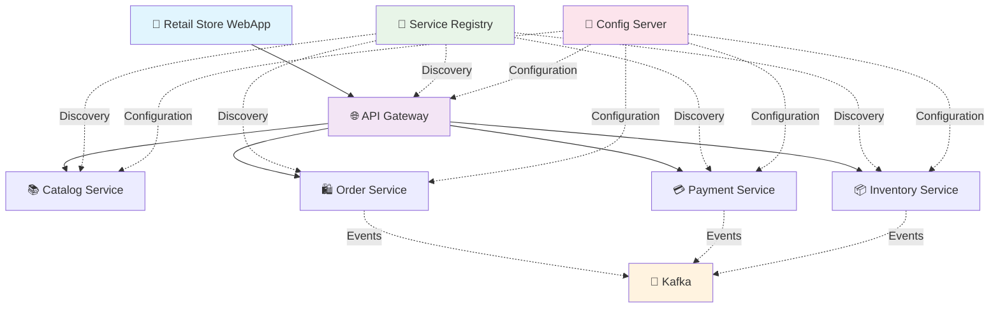
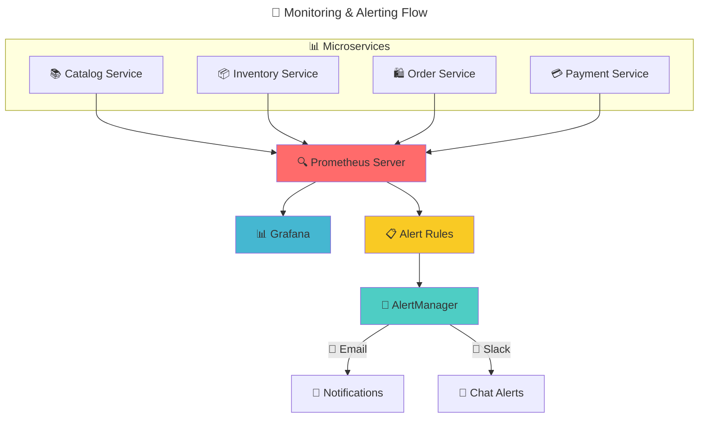

# 🚀 Spring Boot Microservices Series V2

<div align="center">

**A comprehensive microservices architecture showcase using modern cloud-native technologies**

*Building resilient, scalable, and observable distributed systems with Spring Boot ecosystem*



</div>

---

## 📖 Table of Contents

- [🎯 Overview](#-overview)
- [✨ Key Features](#-key-features)
- [🏗️ Architecture](#️-architecture)
- [🔧 Tech Stack](#-tech-stack)
- [🚀 Quick Start](#-quick-start)
- [🎛️ Service Discovery & API Access](#️-service-discovery--api-access)
- [📊 Observability](#-observability)
- [🗃️ Database Management](#️-database-management)
- [📦 Services Overview](#-services-overview)
- [💡 Development Tips](#-development-tips)
- [🤝 Contributing](#-contributing)
- [📄 License](#-license)

## 🎯 Overview

This project demonstrates a complete **microservices architecture** built with Spring Boot, Spring Cloud, and modern cloud-native technologies. It serves as a practical guide for developers looking to understand and implement production-ready distributed systems.

## ✨ Key Features

<table>
<tr>
<td>

🏢 **Microservice Architecture**
- Decoupled services for different business domains
- Independent deployment and scaling
- Domain-driven design principles

🌱 **Spring Boot & Spring Cloud**
- Service Registry (Eureka)
- API Gateway (Spring Cloud Gateway)
- Configuration Server
- Circuit Breakers & Load Balancing

</td>
<td>

🐳 **Containerization**
- Dockerized services
- Docker Compose orchestration
- Consistent development environments

📡 **Event-Driven Communication**
- Apache Kafka message streaming
- Asynchronous service communication
- Event sourcing patterns

</td>
</tr>
<tr>
<td>

📊 **Comprehensive Observability**
- Prometheus metrics collection
- Grafana dashboards
- Distributed tracing with Micrometer
- Centralized logging

🗄️ **Database Diversity**
- PostgreSQL
- Liquibase schema management
- Multiple changelog formats (XML, YAML, JSON)

</td>
<td>

🔍 **Service Discovery**
- Eureka service registry
- Dynamic service registration
- Health check monitoring

🛡️ **Production Ready**
- Security with OAuth2/OIDC
- Performance testing with Gatling
- CI/CD with GitHub Actions

</td>
</tr>
</table>

## 🏗️ Architecture

This project implements a **microservices pattern** where different functionalities are broken down into independent services. These services communicate asynchronously via **Apache Kafka** and are managed through **Spring Cloud Gateway** and **Eureka Service Discovery**.

### Architecture Highlights:
- 🌐 **API Gateway** as the single entry point
- 📋 **Service Registry** for dynamic service discovery  
- ⚙️ **Configuration Server** for centralized config management
- 📨 **Event-driven communication** via Kafka
- 📊 **Distributed monitoring** and tracing

## 📦 Services Overview

<div align="center">

| Service | Port | Description | Tech Stack |
|---------|------|-------------|------------|
| 🌐 **API Gateway** | 8765 | Single entry point, routing & load balancing | Spring Cloud Gateway |
| 📁 **Config Server** | 8888 | Centralized configuration management | Spring Cloud Config |
| 🏢 **Service Registry** | 8761 | Service discovery with Eureka | Spring Cloud Netflix |
| 📚 **Catalog Service** | 18080 | Product catalog management | PostgreSQL + Liquibase (YAML) |
| 📦 **Inventory Service** | 18181 | Stock level management | PostgreSQL + Liquibase (JSON) |
| 🛍️ **Order Service** | 18282 | Order processing & orchestration | PostgreSQL + Liquibase (XML) |
| 💳 **Payment Service** | 18085 | Payment processing | PostgreSQL + Liquibase (XML) |
| 🛒 **Retail Store Web** | 8080 | Customer-facing web application | Thymeleaf + Alpine.js |

</div>

### 🔗 Service Interactions



## 🔧 Tech Stack

<details>
<summary><strong>🖥️ Core Technologies</strong></summary>

### Languages & Frameworks
*  [Java 21+](https://www.java.com)
*  [Spring Framework](https://spring.io/projects/spring-framework)
*  [Spring Cloud](https://spring.io/projects/spring-cloud)
*  [Project Reactor](https://projectreactor.io/)

</details>

<details>
<summary><strong>📡 Communication & Messaging</strong></summary>

### Message Brokers & Streaming
*  [Apache Kafka](http://kafka.apache.org/)
*  [Kafka Streams](https://kafka.apache.org/documentation/streams/)
*  [Kafka REST](https://github.com/confluentinc/kafka-rest)

</details>

<details>
<summary><strong>🗄️ Data Storage & Management</strong></summary>

### Databases
*  [PostgreSQL](http://www.postgresql.org/)
*  MongoDB
*  [Redis](http://redis.io/)

### Database Tools
*  [Liquibase](https://www.liquibase.com)
*  [Spring Data](https://spring.io/projects/spring-data)
*  [jOOQ](http://www.jooq.org)

</details>

<details>
<summary><strong>🐳 DevOps & Deployment</strong></summary>

### Containerization & CI/CD
*  [Docker](https://www.docker.com/)
*  [Docker Compose](https://github.com/docker/compose)
*  [GitHub Actions](https://github.com/features/actions)

</details>

<details>
<summary><strong>📊 Monitoring & Observability</strong></summary>

### Metrics & Tracing
*  [Prometheus](http://prometheus.io/)
*  [Grafana](http://grafana.org/)
*  [Zipkin](https://zipkin.io/)
*  Micrometer

### Logging
*  [Logback](https://logback.qos.ch/)

</details>

<details>
<summary><strong>🧪 Testing</strong></summary>

### Testing Tools
*  [JUnit 5](http://junit.org/)
*  Gatling (Performance Testing)
*  Testcontainers

</details>

> 📋 For complete tech stack details, see [techstack.md](./techstack.md)

## 🚀 Quick Start

### 📋 Prerequisites

Before you begin, ensure you have the following installed:

| Tool | Version | Purpose |
|------|---------|---------|
| ☕ **Java** | 21+ | Runtime environment |
| 📦 **Maven** | 3.9.x+ | Build tool |
| 🐳 **Docker** | Latest | Containerization |
| 🔧 **Docker Compose** | Latest | Orchestration |
| 📚 **Git** | Latest | Version control |

> 💡 **Tip:** Ensure `JAVA_HOME` environment variable is properly set

### 🔨 Build the Project

1. **Clone the repository:**
   ```bash
   git clone https://github.com/rajadilipkolli/spring-boot-microservices-series-v2.git
   cd spring-boot-microservices-series-v2
   ```

2. **Build all modules:**

   **🐧 Linux/macOS:**
   ```bash
   ./mvnw clean install
   ```

   **🪟 Windows:**
   ```cmd
   .\mvnw.cmd clean install
   ```

### 🚀 Running the Application

Choose one of the following deployment options:

#### Option 1: Core Services Only
Perfect for development and basic functionality testing:

```bash
docker-compose -f deployment/docker-compose.yml up -d --remove-orphans
```

#### Option 2: Full Stack with Monitoring
Includes Prometheus, Grafana, and other observability tools:

```bash
docker-compose -f deployment/docker-compose-tools.yml up -d --remove-orphans
```

#### Option 3: Using Helper Scripts

**🐧 Linux/macOS:**
```bash
bash run.sh
```

**🪟 Windows:**
```powershell
.\start-services.ps1
```

### 🛑 Stopping Services

```bash
# Stop core services
docker-compose -f deployment/docker-compose.yml down

# Stop services with monitoring tools
docker-compose -f deployment/docker-compose-tools.yml down
```

### ✅ Verify Installation

Once all services are running, verify the setup:

- 🌐 **Service Registry:** [http://localhost:8761](http://localhost:8761)
- 📚 **API Documentation:** [http://localhost:8765/swagger-ui.html](http://localhost:8765/swagger-ui.html)
- 🛒 **Retail Store App:** [http://localhost:8080](http://localhost:8080)
- 📊 **Grafana Dashboard:** [http://localhost:3000](http://localhost:3000) (user/password)
- 🔍 **Zipkin Tracing:** [http://localhost:9411](http://localhost:9411)

## 🎛️ Service Discovery & API Access

### 🔍 Service Registry (Eureka)
Monitor all registered microservices and their health status:
- **Dashboard:** [http://localhost:8761/](http://localhost:8761/)
- **Features:** Real-time service health, load balancing, failover

### 📚 API Gateway & Documentation
Access all microservice APIs through a unified interface:
- **Swagger UI:** [http://localhost:8765/swagger-ui.html](http://localhost:8765/swagger-ui.html)
- **Features:** API aggregation, rate limiting, authentication


> 💡 **Pro Tip:** Use the dropdown menu in Swagger UI to switch between different service APIs

## 📊 Observability

### 📈 Metrics & Monitoring with Prometheus & Grafana

<table>
<tr>
<td width="50%">

**🔍 Prometheus**
- **URL:** [http://localhost:9090](http://localhost:9090)
- **Purpose:** Metrics collection and alerting
- **Features:** Custom queries, alert rules, service discovery

**📊 Grafana**
- **URL:** [http://localhost:3000](http://localhost:3000)
- **Credentials:** `user/password`
- **Features:** Beautiful dashboards, alerting, data visualization

</td>
<td width="50%">

**🚨 Alertmanager**
- **URL:** [http://localhost:9093](http://localhost:9093)
- **Purpose:** Alert routing and management
- **Features:** Email, Slack, webhook notifications

**📋 Key Metrics Monitored:**
- ⚡ Response times & throughput
- 💾 Memory & CPU usage
- 🔄 Service health & availability
- 📊 Business metrics & KPIs

</td>
</tr>
</table>

### 🔍 Distributed Tracing

**Zipkin Integration**
- **URL:** [http://localhost:9411/zipkin/](http://localhost:9411/zipkin/)
- **Features:** Request flow visualization, latency analysis, dependency mapping
- **Integration:** Micrometer Tracing with Spring Boot


### 📊 Alerting Architecture



## 🗃️ Database Management

### 📊 Liquibase Schema Management

This project demonstrates **flexible database schema management** using Liquibase with various changelog formats:

<div align="center">

| 🏷️ Format | 📁 Service Examples | 📝 Use Case |
|-----------|-------------------|-------------|
| **XML** | `order-service`, `payment-service` | Complex migrations, detailed documentation |
| **YAML** | `catalog-service` | Human-readable, simple structure |
| **JSON** | `inventory-service` | API-friendly, structured data |
| **SQL** | Custom implementations | Direct SQL control, legacy migrations |

</div>

### 📂 Changelog Location
```
src/main/resources/db/changelog/
├── db.changelog-master.xml     # Master changelog file
├── migrations/
│   ├── 001-initial-schema.xml
│   ├── 002-add-indexes.yaml
│   └── 003-seed-data.json
```

### 🗄️ Database Technologies

<table>
<tr>
<td width="100%">

**🐘 PostgreSQL Services**
- 📚 Catalog Service
- 📦 Inventory Service
- 🛍️ Order Service  
- 💳 Payment Service

*Features: ACID compliance, complex queries, relational integrity*

</td>
</tr>
</table>

> 💡 **Best Practice:** Each service manages its own database schema independently, following the **database-per-service** pattern

## 💡 Development Tips

### 🐳 Essential Docker Commands

<details>
<summary><strong>🧹 Cleanup Commands</strong></summary>

```bash
# 🗑️ Clean up entire Docker system (nuclear option)
docker system prune -a -f --volumes

# 📦 Remove unused volumes only
docker volume prune -f

# 🔍 List all running containers
docker ps

# 📋 List all containers (including stopped)
docker ps -a
```

</details>

<details>
<summary><strong>📋 Logging Commands</strong></summary>

```bash
# 📊 View logs for all services (with monitoring tools)
docker-compose -f deployment/docker-compose-tools.yml logs -f

# 🎯 View logs for specific service
docker-compose -f deployment/docker-compose.yml logs -f order-service

# 📜 Follow logs from last 100 lines
docker-compose -f deployment/docker-compose-tools.yml logs --tail=100 -f

# 🔍 Search logs for specific patterns
docker-compose logs | grep ERROR
```

</details>

### 🚫 Kill Processes by Port

<details>
<summary><strong>🪟 Windows (PowerShell/CMD)</strong></summary>

```powershell
# 🔍 Find process using port 18080
netstat -ano | findstr :18080

# ⚡ Kill process by PID
taskkill /PID <PID_FROM_ABOVE> /F

# 🎯 One-liner to kill process on port
$process = Get-NetTCPConnection -LocalPort 18080 -ErrorAction SilentlyContinue
if ($process) { Stop-Process -Id $process.OwningProcess -Force }
```

</details>

<details>
<summary><strong>🐧 Linux/macOS (Terminal)</strong></summary>

```bash
# 🔍 Find process using port 18080
sudo lsof -i :18080

# ⚡ Kill process by PID
kill -9 <PID_FROM_ABOVE>

# 🎯 One-liner to kill process on port
sudo kill -9 $(sudo lsof -t -i:18080)

# 🔥 Alternative using fuser
sudo fuser -k 18080/tcp
```

</details>

### ⚠️ Important Notes & Best Practices

<details>
<summary><strong>🔄 Spring Boot 3.x Migration Notes</strong></summary>

- **📦 Jakarta EE Namespace:** Migration from `javax.*` to `jakarta.*`
- **📊 Observability:** Spring Cloud Sleuth → Micrometer Tracing
- **🔧 Configuration:** Updated property names and patterns
- **🛡️ Security:** Enhanced OAuth2/OIDC integration

</details>

<details>
<summary><strong>🧪 Testing Best Practices</strong></summary>

```java
// 💰 BigDecimal testing with precision handling
import static org.hamcrest.Matchers.closeTo;

// ❌ Don't do this:
// .andExpected(jsonPath("$.totalPrice").value(100.00))

// ✅ Do this instead:
.andExpect(jsonPath("$.totalPrice").value(closeTo(new BigDecimal("100.00"), new BigDecimal("0.01"))))
```

</details>

<details>
<summary><strong>🏗️ Architecture Considerations</strong></summary>

- **🔄 Transaction Management:** Use `@Transactional` directly on jOOQ repository methods
- **📊 Event Sourcing:** Kafka integration for reliable message delivery
- **🚀 Native Images:** Some services may need additional GraalVM configuration
- **🔍 Service Discovery:** Health checks are crucial for proper load balancing

</details>

### 🎯 Performance Testing

```bash
# 🚀 Run Gatling performance tests
cd gatling-tests

# 📊 Basic performance test
./mvnw gatling:test

# 🔥 Stress test with custom parameters
./mvnw gatling:test -P stress -DmaxUsers=100 -DrampDurationMinutes=5
```

## 🤝 Contributing

We welcome contributions from the community! Here's how you can help:

### 🚀 How to Contribute

1. **🍴 Fork the repository**
2. **🌟 Create a feature branch:** `git checkout -b feature/amazing-feature`
3. **💻 Make your changes** with clear, tested code
4. **📝 Commit your changes:** `git commit -m 'Add amazing feature'`
5. **📤 Push to the branch:** `git push origin feature/amazing-feature`
6. **🔄 Open a Pull Request**

### 📋 Contribution Guidelines

- 📖 **Documentation:** Update documentation for any new features
- 🧪 **Testing:** Add tests for new functionality
- 🎨 **Code Style:** Follow existing code conventions
- 💬 **Discussion:** Open an issue first for significant changes

### 🤗 Community Standards

Please read our [**Code of Conduct**](./CODE_OF_CONDUCT.md) to understand our community standards and expectations.

---

## 📄 License

This project is licensed under the **MIT License** - see the [LICENSE](./LICENSE) file for details.

```
MIT License - Feel free to use, modify, and distribute! 🎉
```

---

## 🙏 Acknowledgements & References

### 📚 Inspiration & Resources

- 🌟 **Spring Ecosystem:** Built on the robust Spring Boot and Spring Cloud frameworks
- 📖 **Microservices Patterns:** Implementing industry best practices for distributed systems
- 📝 **Community Insights:** [Distributed Transactions in Microservices with Kafka Streams and Spring Boot](https://piotrminkowski.com/2022/01/24/distributed-transactions-in-microservices-with-kafka-streams-and-spring-boot/)

### 🎯 Special Thanks

- 🏗️ **Architecture Patterns:** Following domain-driven design principles
- 🔧 **DevOps Practices:** Docker, monitoring, and observability best practices
- 👥 **Community:** All contributors and users who make this project better

---

<div align="center">

### ⭐ If this project helped you, please give it a star! ⭐

**Made with ❤️ by the Spring Boot Microservices Community**

[🐛 Report Bug](https://github.com/rajadilipkolli/spring-boot-microservices-series-v2/issues) • [✨ Request Feature](https://github.com/rajadilipkolli/spring-boot-microservices-series-v2/issues) • [💬 Discussions](https://github.com/rajadilipkolli/spring-boot-microservices-series-v2/discussions)

</div>
