# API Gateway - Detailed Sequence Diagram

## Complete Gateway Routing & Resilience Flow with Spring Cloud Gateway

```mermaid
%%{init: {'theme':'dark', 'themeVariables': {'primaryColor':'#1f2937', 'primaryTextColor':'#ffffff', 'primaryBorderColor':'#374151', 'lineColor':'#ffffff', 'sectionBkColor':'#374151', 'altSectionBkColor':'#4b5563', 'gridColor':'#6b7280', 'secondaryColor':'#374151', 'tertiaryColor':'#4b5563', 'background':'#111827', 'mainBkg':'#1f2937', 'secondBkg':'#374151', 'tertiaryBkg':'#4b5563'}}}%%
sequenceDiagram
    participant Client as 🛒 Client<br/>(External/WebApp)
    participant Gateway as 🌐 API Gateway<br/>(Port: 8765)
    participant LoggingFilter as 📝 Logging Filter<br/>(Global Filter)
    participant CorrelationFilter as 🔗 Correlation Filter<br/>(Gateway Filter)
    participant RateLimiter as 🚦 Rate Limiter<br/>(Redis-based)
    participant CircuitBreaker as 🛡️ Circuit Breaker<br/>(Resilience4j)
    participant RetryFilter as 🔄 Retry Filter<br/>(Spring Retry)
    participant LoadBalancer as ⚖️ Load Balancer<br/>(Spring Cloud LB)
    participant ServiceRegistry as 🏢 Service Registry<br/>(Eureka)
    participant CatalogService as 📚 Catalog Service<br/>(Port: 18080)
    participant InventoryService as 📦 Inventory Service<br/>(Port: 18181)
    participant OrderService as 🛍️ Order Service<br/>(Port: 18282)
    participant PaymentService as 💳 Payment Service<br/>(Port: 18085)
    participant FallbackController as 🆘 Fallback Controller<br/>(Gateway Internal)

    Note over Client, FallbackController: 🌐 Gateway Request Processing Flow
    
    rect rgba(59, 130, 246, 0.3)
        Note over Client, Gateway: <span style="color: white">Request Ingress & Initial Processing</span>
        Client->>Gateway: HTTP Request<br/>(e.g., GET /catalog-service/api/catalog)
        Gateway->>LoggingFilter: @Component GlobalFilter<br/>(Order: Default)
        LoggingFilter->>LoggingFilter: StopWatch.start()<br/>Log request path & method
        LoggingFilter->>LoggingFilter: Skip actuator traces<br/>(performance optimization)
        
        LoggingFilter->>CorrelationFilter: @Order(1) GatewayFilter<br/>(Correlation ID processing)
        CorrelationFilter->>CorrelationFilter: Check X-Correlation-ID header
        
        alt Correlation ID exists
            CorrelationFilter->>CorrelationFilter: Use existing correlation ID<br/>log.debug("Using existing...")
        else No correlation ID
            CorrelationFilter->>CorrelationFilter: Generate UUID.randomUUID()<br/>log.debug("Generated new...")
        end
        
        CorrelationFilter->>CorrelationFilter: Mutate request with header<br/>Add X-Correlation-ID
        CorrelationFilter->>CorrelationFilter: Add to response headers<br/>(beforeCommit callback)
    end

    Note over Client, FallbackController: 🛣️ Route Matching & Service Selection
    
    rect rgba(34, 197, 94, 0.3)
        Note over Gateway, ServiceRegistry: <span style="color: white">Route Resolution & Service Discovery</span>
        Gateway->>Gateway: RouteLocator.gatewayRouter()<br/>Match request path to routes
        
        alt Path: /catalog-service/**
            Gateway->>Gateway: Route ID: catalog-service<br/>URI: lb://catalog-service
            Gateway->>Gateway: Apply Retry filter<br/>(retries: 3, backoff: 50ms-500ms)
            Gateway->>RetryFilter: Configure retry strategy<br/>GET methods only
            
        else Path: /inventory-service/**
            Gateway->>Gateway: Route ID: inventory-service<br/>URI: lb://inventory-service
            Gateway->>Gateway: Apply CircuitBreaker filter<br/>(name: exampleSlowCircuitBreaker)
            Gateway->>CircuitBreaker: Configure circuit breaker<br/>fallbackUri: /fallback/api/inventory
            
        else Path: /order-service/**
            Gateway->>Gateway: Route ID: order-service<br/>URI: lb://order-service
            Gateway->>Gateway: Apply RequestRateLimiter filter<br/>(Redis-based rate limiting)
            Gateway->>RateLimiter: Configure rate limits<br/>replenishRate: 60, burstCapacity: 10
            
        else Path: /payment-service/**
            Gateway->>Gateway: Route ID: payment-service<br/>URI: lb://payment-service
            Gateway->>Gateway: No additional filters<br/>(basic routing only)
        end
        
        Gateway->>ServiceRegistry: Resolve service instances<br/>lb:// protocol handler
        ServiceRegistry-->>Gateway: Available service instances<br/>(health-checked endpoints)
        Gateway->>LoadBalancer: Select service instance<br/>(round-robin/weighted)
        LoadBalancer-->>Gateway: Target service endpoint
    end

    Note over Client, FallbackController: 🚦 Rate Limiting Flow (Order Service)
    
    rect rgba(251, 146, 60, 0.3)
        Note over RateLimiter, OrderService: <span style="color: white">Rate Limiting with Redis</span>
        Gateway->>RateLimiter: RequestRateLimiter filter<br/>(Redis-based implementation)
        RateLimiter->>RateLimiter: userKeyResolver()<br/>Extract X-User-ID or IP address
        RateLimiter->>RateLimiter: Check Redis rate limit counters<br/>(replenishRate: 60/min, burst: 10)
        
        alt Rate limit not exceeded
            RateLimiter->>RateLimiter: Update Redis counters<br/>(increment request count)
            RateLimiter->>OrderService: Forward request<br/>(WebClient HTTP call)
            OrderService-->>RateLimiter: Service response
            RateLimiter-->>Gateway: Success response
            Gateway-->>LoggingFilter: Response with headers
            
        else Rate limit exceeded
            RateLimiter->>RateLimiter: Return 429 Too Many Requests<br/>(X-RateLimit headers)
            RateLimiter-->>Gateway: Rate limit error response
            Gateway-->>LoggingFilter: 429 status response
        end
    end

    Note over Client, FallbackController: 🛡️ Circuit Breaker Flow (Inventory Service)
    
    rect rgba(236, 72, 153, 0.3)
        Note over CircuitBreaker, FallbackController: <span style="color: white">Circuit Breaker with Fallback</span>
        Gateway->>CircuitBreaker: CircuitBreaker filter<br/>(Resilience4j integration)
        CircuitBreaker->>CircuitBreaker: Check circuit state<br/>(CLOSED/OPEN/HALF_OPEN)
        
        alt Circuit CLOSED (Normal operation)
            CircuitBreaker->>CircuitBreaker: TimeLimiterConfig<br/>(timeout: 5 seconds)
            CircuitBreaker->>InventoryService: Forward request<br/>(with timeout protection)
            
            alt Service responds within timeout
                InventoryService-->>CircuitBreaker: Success response
                CircuitBreaker->>CircuitBreaker: Record success<br/>(update metrics)
                CircuitBreaker-->>Gateway: Service response
                Gateway-->>LoggingFilter: Success response
                
            else Service timeout or error
                CircuitBreaker->>CircuitBreaker: Record failure<br/>(increment failure count)
                CircuitBreaker->>CircuitBreaker: Check failure threshold<br/>(slidingWindowSize: 10, failureRate: 50%)
                
                alt Failure threshold exceeded
                    CircuitBreaker->>CircuitBreaker: Transition to OPEN state<br/>(waitDuration: 10s)
                    CircuitBreaker->>FallbackController: Invoke fallback<br/>forward:/fallback/api/inventory
                    FallbackController->>FallbackController: @GetMapping("/{id}")<br/>fallback(@PathVariable String id)
                    FallbackController-->>CircuitBreaker: Mono.just("Hello %s".formatted(id))
                    CircuitBreaker-->>Gateway: Fallback response
                else Failure threshold not exceeded
                    CircuitBreaker-->>Gateway: Error response (503/timeout)
                end
            end
            
        else Circuit OPEN (Fail-fast mode)
            CircuitBreaker->>FallbackController: Direct fallback invocation<br/>(no service call)
            FallbackController-->>CircuitBreaker: Fallback response
            CircuitBreaker-->>Gateway: Fallback response
            
        else Circuit HALF_OPEN (Testing recovery)
            CircuitBreaker->>CircuitBreaker: Allow limited requests<br/>(permittedCalls: 5)
            CircuitBreaker->>InventoryService: Test request
            
            alt Test request succeeds
                InventoryService-->>CircuitBreaker: Success response
                CircuitBreaker->>CircuitBreaker: Transition to CLOSED<br/>(recovery successful)
                CircuitBreaker-->>Gateway: Service response
            else Test request fails
                CircuitBreaker->>CircuitBreaker: Transition back to OPEN<br/>(recovery failed)
                CircuitBreaker->>FallbackController: Invoke fallback
                FallbackController-->>CircuitBreaker: Fallback response
                CircuitBreaker-->>Gateway: Fallback response
            end
        end
    end

    Note over Client, FallbackController: 🔄 Retry Flow (Catalog Service)
    
    rect rgba(139, 92, 246, 0.3)
        Note over RetryFilter, CatalogService: <span style="color: white">Retry Logic with Exponential Backoff</span>
        Gateway->>RetryFilter: Retry filter configuration<br/>(retries: 3, GET methods only)
        RetryFilter->>RetryFilter: Check HTTP method<br/>(only GET requests retried)
        
        alt GET request
            RetryFilter->>CatalogService: Initial request attempt
            
            alt Service responds successfully
                CatalogService-->>RetryFilter: Success response (200 OK)
                RetryFilter-->>Gateway: Service response
                Gateway-->>LoggingFilter: Success response
                
            else Service error (5xx, timeout, connection refused)
                CatalogService-->>RetryFilter: Error response
                RetryFilter->>RetryFilter: Attempt 1 failed<br/>Wait 50ms (firstBackoff)
                RetryFilter->>CatalogService: Retry attempt 1
                
                alt Retry 1 fails
                    CatalogService-->>RetryFilter: Error response
                    RetryFilter->>RetryFilter: Attempt 2 failed<br/>Wait 100ms (factor: 2)
                    RetryFilter->>CatalogService: Retry attempt 2
                    
                    alt Retry 2 fails
                        CatalogService-->>RetryFilter: Error response
                        RetryFilter->>RetryFilter: Attempt 3 failed<br/>Wait 200ms (maxBackoff: 500ms)
                        RetryFilter->>CatalogService: Final retry attempt
                        
                        alt Final retry fails
                            CatalogService-->>RetryFilter: Error response
                            RetryFilter-->>Gateway: Final error response<br/>(all retries exhausted)
                            Gateway-->>LoggingFilter: Error response
                        else Final retry succeeds
                            CatalogService-->>RetryFilter: Success response
                            RetryFilter-->>Gateway: Service response
                            Gateway-->>LoggingFilter: Success response
                        end
                    else Retry 2 succeeds
                        CatalogService-->>RetryFilter: Success response
                        RetryFilter-->>Gateway: Service response
                    end
                else Retry 1 succeeds
                    CatalogService-->>RetryFilter: Success response
                    RetryFilter-->>Gateway: Service response
                end
            end
            
        else Non-GET request
            RetryFilter->>PaymentService: Direct forward<br/>(no retry for POST/PUT/DELETE)
            PaymentService-->>RetryFilter: Service response
            RetryFilter-->>Gateway: Service response
        end
    end

    Note over Client, FallbackController: 🎯 Service Orchestration Flow
    
    rect rgba(34, 197, 94, 0.3)
        Note over Gateway, PaymentService: <span style="color: white">Generate Controller - Service Orchestration</span>
        Client->>Gateway: GET /api/generate<br/>(Orchestrated data generation)
        Gateway->>Gateway: GenerateController.generate()<br/>@LoadBalanced WebClient
        
        Gateway->>Gateway: Step 1: Call catalog service<br/>callMicroservice(CATALOG_SERVICE_URL)
        Gateway->>LoadBalancer: Resolve lb://CATALOG-SERVICE
        LoadBalancer->>CatalogService: GET /catalog-service/api/catalog/generate<br/>(with timeout: 10s, retries: 3)
        
        alt Catalog service succeeds
            CatalogService-->>Gateway: HTTP 200 + generation result
            Gateway->>Gateway: delayElement(delayBetweenServices)<br/>(configurable delay: 5s)
            
            Gateway->>Gateway: Step 2: Call inventory service<br/>callMicroservice(INVENTORY_SERVICE_URL)
            Gateway->>LoadBalancer: Resolve lb://INVENTORY-SERVICE
            LoadBalancer->>InventoryService: GET /inventory-service/api/inventory/generate<br/>(with timeout: 10s, retries: 3)
            
            alt Inventory service succeeds
                InventoryService-->>Gateway: HTTP 200 + generation result
                Gateway->>Gateway: createResponseEntity()<br/>(combine both results)
                Gateway-->>Client: GenerationResponse<br/>(status: success, both service results)
                
            else Inventory service fails
                InventoryService-->>Gateway: Error response
                Gateway->>Gateway: handleCallError()<br/>(error handling logic)
                Gateway-->>Client: GenerationResponse<br/>(status: error, catalog success + inventory error)
            end
            
        else Catalog service fails
            CatalogService-->>Gateway: Error response
            Gateway->>Gateway: Skip inventory service call<br/>(fail-fast approach)
            Gateway-->>Client: GenerationResponse<br/>(status: error, catalog service error only)
        end
        
        Note over Gateway: Retry Logic:<br/>• Exponential backoff (500ms base)<br/>• Jitter (0.5) to avoid thundering herd<br/>• Retry on: 503, 502, 504, 429, connection refused<br/>• No retry on: 4xx client errors, timeouts
    end

    Note over Client, FallbackController: 📊 Response Processing & Logging
    
    rect rgba(239, 68, 68, 0.3)
        Note over LoggingFilter, Client: <span style="color: white">Response Processing & Metrics</span>
        Gateway->>LoggingFilter: Response processing<br/>(doFinally callback)
        LoggingFilter->>LoggingFilter: StopWatch.stop()<br/>Calculate total time
        LoggingFilter->>LoggingFilter: Extract response status<br/>(safe extraction with try-catch)
        LoggingFilter->>LoggingFilter: Log response metrics<br/>"Request {} {} -> status={} took={}ms"
        
        LoggingFilter->>CorrelationFilter: Add correlation ID to response<br/>(beforeCommit callback)
        CorrelationFilter->>CorrelationFilter: response.getHeaders()<br/>.add(X-Correlation-ID, correlationId)
        
        LoggingFilter-->>Client: Final HTTP response<br/>(with correlation ID, timing, status)
        
        Note over LoggingFilter: Logged Information:<br/>• Request method & path<br/>• Response status code<br/>• Total processing time<br/>• Correlation ID for tracing
    end

    Note over Client, FallbackController: 🔧 Configuration & Customization
    
    rect rgba(139, 92, 246, 0.3)
        Note over Gateway, ServiceRegistry: <span style="color: white">Gateway Configuration & Customization</span>
        
        Note over Gateway: Route Configuration (application.yml):<br/>• Path-based routing predicates<br/>• Load balancer URIs (lb://service-name)<br/>• Filter chains per route<br/>• Resilience patterns per service
        
        Note over Gateway: Custom Filters:<br/>• LoggingFilter: Global request/response logging<br/>• CorrelationIdFilter: Distributed tracing support<br/>• Built-in filters: RateLimiter, CircuitBreaker, Retry
        
        Note over Gateway: Resilience Configuration:<br/>• Circuit Breaker: Failure thresholds, timeouts<br/>• Rate Limiter: Redis-based, user/IP keying<br/>• Retry: Exponential backoff, method filtering<br/>• Load Balancer: Service discovery integration
        
        Gateway->>ServiceRegistry: Health check integration<br/>(automatic service discovery)
        ServiceRegistry-->>Gateway: Real-time service availability<br/>(healthy instances only)
    end
```



## Key Architecture Components

### 🌐 **Spring Cloud Gateway Architecture**
- **Reactive Gateway**: Built on Spring WebFlux for non-blocking I/O
- **Route Predicates**: Path-based routing with flexible matching
- **Filter Chains**: Composable request/response processing pipeline
- **Service Discovery**: Eureka integration with load balancing

### 🛡️ **Resilience Patterns**
- **Circuit Breaker**: Resilience4j integration with fallback mechanisms
- **Rate Limiting**: Redis-based distributed rate limiting
- **Retry Logic**: Configurable retry with exponential backoff
- **Load Balancing**: Spring Cloud LoadBalancer with health checks

### 🔗 **Cross-Cutting Concerns**
- **Correlation ID**: Distributed tracing support across services
- **Request Logging**: Comprehensive request/response logging with timing
- **Error Handling**: Graceful error handling with fallback responses
- **Metrics Collection**: Built-in observability and monitoring

### 🎯 **Service Orchestration**
- **Generate Controller**: Multi-service orchestration with error handling
- **Timeout Management**: Configurable timeouts per service call
- **Retry Strategy**: Intelligent retry logic with jitter
- **Error Propagation**: Structured error responses with service details

## Service Routing Configuration

| Route ID | Path Pattern | Target Service | Filters Applied |
|----------|-------------|----------------|-----------------|
| **catalog-service** | `/catalog-service/**` | `lb://catalog-service` | Retry (3 attempts, exponential backoff) |
| **inventory-service** | `/inventory-service/**` | `lb://inventory-service` | Circuit Breaker (fallback enabled) |
| **order-service** | `/order-service/**` | `lb://order-service` | Rate Limiter (60/min, burst: 10) |
| **payment-service** | `/payment-service/**` | `lb://payment-service` | Basic routing only |

## Gateway Filter Pipeline

```mermaid
%%{init: {'theme':'dark', 'themeVariables': {'primaryColor':'#1f2937', 'primaryTextColor':'#ffffff', 'primaryBorderColor':'#374151', 'lineColor':'#ffffff', 'sectionBkColor':'#374151', 'altSectionBkColor':'#4b5563', 'gridColor':'#6b7280', 'secondaryColor':'#374151', 'tertiaryColor':'#4b5563', 'background':'#111827', 'mainBkg':'#1f2937', 'secondBkg':'#374151', 'tertiaryBkg':'#4b5563'}}}%%
graph TB
    subgraph "🌐 Gateway Filter Pipeline"
        REQ[Incoming Request] --> LF[Logging Filter]
        LF --> CF[Correlation Filter]
        CF --> RM[Route Matching]
        RM --> RF{Route-Specific Filters}
        
        RF --> |catalog-service| RT[Retry Filter]
        RF --> |inventory-service| CB[Circuit Breaker]
        RF --> |order-service| RL[Rate Limiter]
        RF --> |payment-service| LB[Load Balancer]
        
        RT --> LB
        CB --> FB[Fallback Controller]
        CB --> LB
        RL --> LB
        
        LB --> SVC[Target Service]
        SVC --> RESP[Response Processing]
        FB --> RESP
        RESP --> CF2[Add Correlation ID]
        CF2 --> LF2[Log Response]
        LF2 --> CLIENT[Client Response]
    end
    
    style REQ fill:#3b82f6,stroke:#ffffff,stroke-width:2px,color:#ffffff
    style LF fill:#22c55e,stroke:#ffffff,stroke-width:2px,color:#ffffff
    style CF fill:#8b5cf6,stroke:#ffffff,stroke-width:2px,color:#ffffff
    style CB fill:#ef4444,stroke:#ffffff,stroke-width:2px,color:#ffffff
    style RL fill:#f59e0b,stroke:#ffffff,stroke-width:2px,color:#ffffff
    style RT fill:#06b6d4,stroke:#ffffff,stroke-width:2px,color:#ffffff
    style FB fill:#ec4899,stroke:#ffffff,stroke-width:2px,color:#ffffff
```



## Resilience Configuration

### 🛡️ **Circuit Breaker Settings**
```yaml
resilience4j:
  circuitbreaker:
    instances:
      catalogService:
        slidingWindowSize: 10
        permittedNumberOfCallsInHalfOpenState: 5
        failureRateThreshold: 50
        waitDurationInOpenState: 10000
        registerHealthIndicator: true
```

### 🚦 **Rate Limiter Settings**
```yaml
filters:
  - name: RequestRateLimiter
    args:
      redis-rate-limiter:
        replenishRate: 60    # Requests per minute
        burstCapacity: 10    # Maximum burst size
```

### 🔄 **Retry Settings**
```yaml
filters:
  - name: Retry
    args:
      retries: 3
      method: GET
      backoff:
        firstBackoff: 50ms
        maxBackoff: 500ms
        factor: 2
        basedOnPreviousValue: true
```

## Key Features

### 🔒 **Security & Tracing**
- **Correlation ID**: Automatic generation and propagation for distributed tracing
- **Request Logging**: Comprehensive logging with timing and status information
- **Header Management**: Automatic header injection and response enrichment
- **Error Sanitization**: Safe error handling without information leakage

### 🎯 **Performance Optimizations**
- **Reactive Architecture**: Non-blocking I/O for high concurrency
- **Connection Pooling**: Optimized HTTP client configuration
- **Load Balancing**: Intelligent service instance selection
- **Caching**: Route and service discovery caching

### 🛠️ **Operational Excellence**
- **Health Checks**: Integration with service registry health monitoring
- **Metrics Collection**: Built-in observability with Micrometer
- **Configuration Management**: Externalized configuration with Spring Cloud Config
- **Graceful Degradation**: Fallback mechanisms for service failures

### 📊 **Monitoring & Observability**
- **Request Tracing**: End-to-end request tracking with correlation IDs
- **Performance Metrics**: Response times, error rates, and throughput
- **Circuit Breaker Metrics**: State transitions and failure rates
- **Rate Limiting Metrics**: Request counts and throttling statistics