# Catalog Service - Detailed Sequence Diagram

## Complete Product Catalog Management Flow with Reactive Architecture

```mermaid
%%{init: {'theme':'dark', 'themeVariables': {'primaryColor':'#1f2937', 'primaryTextColor':'#ffffff', 'primaryBorderColor':'#374151', 'lineColor':'#ffffff', 'sectionBkColor':'#374151', 'altSectionBkColor':'#4b5563', 'gridColor':'#6b7280', 'secondaryColor':'#374151', 'tertiaryColor':'#4b5563', 'background':'#111827', 'mainBkg':'#1f2937', 'secondBkg':'#374151', 'tertiaryBkg':'#4b5563'}}}%%
sequenceDiagram
    participant Client as 🛒 Client<br/>(WebApp/API)
    participant Gateway as 🌐 API Gateway<br/>(Port: 8765)
    participant CatalogAPI as 📚 Catalog Service<br/>(Port: 18080)
    participant CatalogDB as 🗄️ PostgreSQL<br/>(Products DB)
    participant InventoryProxy as 📦 Inventory Proxy<br/>(WebClient)
    participant InventoryService as 📦 Inventory Service<br/>(Port: 18181)
    participant Kafka as 📡 Kafka Broker
    participant ProductTopic as 📚 Product Topic<br/>(productTopic)
    participant StreamBridge as 🌊 Spring Cloud Stream<br/>(Kafka Producer)
    participant CircuitBreaker as 🛡️ Circuit Breaker<br/>(Resilience4j)

    Note over Client, CircuitBreaker: 📚 Product Catalog Management Flow
    
    rect rgba(59, 130, 246, 0.3)
        Note over Client, CatalogAPI: <span style="color: white">Product Retrieval Operations (Reactive)</span>
        Client->>Gateway: GET /catalog-service/api/catalog?pageNo=0&pageSize=10
        Gateway->>CatalogAPI: Forward paginated request
        CatalogAPI->>CatalogAPI: @Observed + @Loggable<br/>Create Pageable (reactive)
        
        CatalogAPI->>CatalogDB: Mono<Long> count()<br/>(R2DBC reactive query)
        CatalogDB-->>CatalogAPI: Total products count
        
        CatalogAPI->>CatalogDB: Flux<Product> findAllBy(pageable)<br/>(R2DBC reactive pagination)
        CatalogDB-->>CatalogAPI: Flux<Product> stream
        
        CatalogAPI->>CatalogAPI: Mono.zip(count, productList)<br/>(combine reactive streams)
        CatalogAPI->>CatalogAPI: Flux.fromIterable(products)<br/>.map(productMapper::toProductResponse)
        
        CatalogAPI->>CatalogAPI: enrichWithAvailability()<br/>(inventory integration)
        CatalogAPI->>InventoryProxy: getInventoryByProductCodes(productCodes)
        InventoryProxy->>InventoryProxy: @CircuitBreaker + @RateLimiter<br/>+ @Retry + @TimeLimiter
        InventoryProxy->>InventoryService: GET /api/inventory/product?codes=P1,P2,P3<br/>(WebClient reactive call)
        InventoryService-->>InventoryProxy: Flux<InventoryResponse>
        InventoryProxy-->>CatalogAPI: Inventory availability data
        
        CatalogAPI->>CatalogAPI: updateProductAvailability()<br/>(merge product + inventory data)
        CatalogAPI-->>Gateway: Mono<PagedResult<ProductResponse>>
        Gateway-->>Client: Paginated products with stock info
    end

    rect rgba(34, 197, 94, 0.3)
        Note over Client, CatalogAPI: <span style="color: white">Single Product Retrieval</span>
        Client->>Gateway: GET /catalog-service/api/catalog/productCode/{code}?fetchInStock=true
        Gateway->>CatalogAPI: Forward request
        CatalogAPI->>CatalogAPI: @Observed("product.findByCode")
        
        CatalogAPI->>CatalogDB: Mono<Product> findByProductCodeAllIgnoreCase()<br/>(R2DBC case-insensitive query)
        CatalogDB-->>CatalogAPI: Mono<Product>
        
        alt Product found
            CatalogAPI->>CatalogAPI: ProductMapper.toProductResponse()
            
            alt fetchInStock = true
                CatalogAPI->>InventoryProxy: getInventoryByProductCode(productCode)
                InventoryProxy->>InventoryProxy: executeWithFallback()<br/>(resilience patterns)
                InventoryProxy->>InventoryService: GET /api/inventory/{productCode}<br/>(WebClient call)
                
                alt Inventory service available
                    InventoryService-->>InventoryProxy: InventoryResponse
                    InventoryProxy-->>CatalogAPI: Stock availability data
                    CatalogAPI->>CatalogAPI: productResponse.withInStock(quantity > 0)
                else Circuit breaker open / Service unavailable
                    InventoryProxy->>InventoryProxy: getInventoryByProductCodeFallBack()
                    InventoryProxy-->>CatalogAPI: InventoryResponse(productCode, 0)
                    CatalogAPI->>CatalogAPI: productResponse.withInStock(false)
                end
            end
            
            CatalogAPI-->>Gateway: Mono<ProductResponse> (200 OK)
            Gateway-->>Client: Product with stock status
        else Product not found
            CatalogAPI-->>Gateway: ProductNotFoundException (404)
            Gateway-->>Client: Error response
        end
    end

    Note over Client, CircuitBreaker: 📝 Product Creation & Management
    
    rect rgba(236, 72, 153, 0.3)
        Note over Client, StreamBridge: <span style="color: white">Product Creation Flow</span>
        Client->>Gateway: POST /catalog-service/api/catalog<br/>(ProductRequest)
        Gateway->>CatalogAPI: Forward request
        CatalogAPI->>CatalogAPI: @Transactional + @Observed("product.save")<br/>@Valid ProductRequest
        
        CatalogAPI->>CatalogDB: Mono<Product> findByProductCodeAllIgnoreCase()<br/>(idempotency check)
        CatalogDB-->>CatalogAPI: Optional<Product>
        
        alt Product doesn't exist
            CatalogAPI->>CatalogAPI: createAndSaveProduct()<br/>(helper method)
            CatalogAPI->>CatalogAPI: ProductMapper.toEntity(productRequest)
            CatalogAPI->>CatalogDB: Mono<Product> save(product)<br/>(R2DBC reactive save)
            CatalogDB-->>CatalogAPI: Saved Product
            
            CatalogAPI->>StreamBridge: catalogKafkaProducer.send(productRequest)
            StreamBridge->>StreamBridge: ProductMapper.toProductDto()
            StreamBridge->>StreamBridge: ObjectMapper.writeValueAsString()<br/>(JSON serialization)
            StreamBridge->>Kafka: streamBridge.send("inventory-out-0", productDto)
            Kafka-->>StreamBridge: Kafka send confirmation
            StreamBridge-->>CatalogAPI: Mono<Boolean> success
            
            CatalogAPI->>CatalogAPI: ProductMapper.toProductResponse()
            CatalogAPI-->>Gateway: ProductResponse (201 Created)
            Gateway-->>Client: Created product
            
        else Product exists (idempotent)
            CatalogAPI->>CatalogAPI: ProductMapper.toProductResponse()
            CatalogAPI-->>Gateway: Existing ProductResponse (200 OK)
            Gateway-->>Client: Existing product (idempotent)
        end
        
        Note over CatalogAPI: Concurrent Save Handling:<br/>DuplicateKeyException → Recovery mechanism<br/>Fetch existing product that was concurrently saved
    end

    rect rgba(251, 146, 60, 0.3)
        Note over Client, CatalogAPI: <span style="color: white">Product Update & Delete</span>
        Client->>Gateway: PUT /catalog-service/api/catalog/{id}<br/>(ProductRequest)
        Gateway->>CatalogAPI: Forward update request
        CatalogAPI->>CatalogDB: Mono<Product> findById(id)
        CatalogDB-->>CatalogAPI: Mono<Product>
        
        alt Product exists
            CatalogAPI->>CatalogAPI: ProductMapper.mapProductWithRequest()<br/>(update entity)
            CatalogAPI->>CatalogDB: Mono<Product> save(updatedProduct)<br/>(@Transactional)
            CatalogDB-->>CatalogAPI: Updated product
            CatalogAPI->>CatalogAPI: ProductMapper.toProductResponse()
            CatalogAPI-->>Gateway: ProductResponse (200 OK)
            Gateway-->>Client: Updated product
        else Product not found
            CatalogAPI-->>Gateway: ProductNotFoundException (404)
            Gateway-->>Client: Error response
        end
        
        Client->>Gateway: DELETE /catalog-service/api/catalog/{id}
        Gateway->>CatalogAPI: Forward delete request
        CatalogAPI->>CatalogDB: Mono<Product> findById(id)
        CatalogDB-->>CatalogAPI: Product check
        
        alt Product exists
            CatalogAPI->>CatalogDB: Mono<Void> deleteById(id)<br/>(@Transactional)
            CatalogDB-->>CatalogAPI: Deletion confirmed
            CatalogAPI-->>Gateway: ProductResponse (200 OK)
            Gateway-->>Client: Deleted product data
        else Product not found
            CatalogAPI-->>Gateway: 404 Not Found
            Gateway-->>Client: Error response
        end
    end

    Note over Client, CircuitBreaker: 🔍 Advanced Search Operations
    
    rect rgba(139, 92, 246, 0.3)
        Note over Client, CatalogAPI: <span style="color: white">Product Search & Filtering</span>
        Client->>Gateway: GET /catalog-service/api/catalog/search?term=laptop&minPrice=500&maxPrice=2000
        Gateway->>CatalogAPI: Forward search request
        CatalogAPI->>CatalogAPI: Analyze search parameters<br/>(term + price range)
        
        alt Term + Price Range search
            CatalogAPI->>CatalogDB: Flux<Product> findByProductNameContaining...<br/>AndPriceBetween(term, minPrice, maxPrice)
            CatalogDB-->>CatalogAPI: Filtered products flux
        else Term only search
            CatalogAPI->>CatalogDB: Flux<Product> findByProductNameContaining<br/>OrDescriptionContaining(term)
            CatalogDB-->>CatalogAPI: Text-matched products flux
        else Price range only search
            CatalogAPI->>CatalogDB: Flux<Product> findByPriceBetween<br/>(minPrice, maxPrice)
            CatalogDB-->>CatalogAPI: Price-filtered products flux
        else No criteria (fallback)
            CatalogAPI->>CatalogDB: Flux<Product> findAllBy(pageable)
            CatalogDB-->>CatalogAPI: All products flux
        end
        
        CatalogAPI->>CatalogAPI: processSearchResults()<br/>(common processing)
        CatalogAPI->>CatalogAPI: enrichWithAvailability()<br/>(inventory integration)
        CatalogAPI->>InventoryProxy: getInventoryByProductCodes(productCodes)
        InventoryProxy->>InventoryService: Bulk inventory lookup
        InventoryService-->>InventoryProxy: Flux<InventoryResponse>
        InventoryProxy-->>CatalogAPI: Inventory data
        
        CatalogAPI->>CatalogAPI: updateProductAvailability()<br/>(merge search results + inventory)
        CatalogAPI-->>Gateway: Mono<PagedResult<ProductResponse>>
        Gateway-->>Client: Filtered products with stock info
        
        Client->>Gateway: GET /catalog-service/api/catalog/exists?productCodes=P1,P2,P3
        Gateway->>CatalogAPI: Product existence check
        CatalogAPI->>CatalogDB: Mono<Long> countDistinctByProductCodeIn(codes)
        CatalogDB-->>CatalogAPI: Count of existing products
        CatalogAPI->>CatalogAPI: count == productCodes.size()
        CatalogAPI-->>Gateway: Mono<Boolean> (all exist?)
        Gateway-->>Client: Boolean existence result
    end

    Note over Client, CircuitBreaker: 🛡️ Resilience & Error Handling
    
    rect rgba(239, 68, 68, 0.3)
        Note over InventoryProxy, CircuitBreaker: <span style="color: white">Circuit Breaker & Resilience Patterns</span>
        
        InventoryProxy->>CircuitBreaker: executeWithFallback()<br/>(resilience chain)
        CircuitBreaker->>CircuitBreaker: TimeLimiterOperator.of(timeLimiter)<br/>(timeout protection)
        CircuitBreaker->>CircuitBreaker: RateLimiterOperator.of(rateLimiter)<br/>(rate limiting)
        CircuitBreaker->>CircuitBreaker: RetryOperator.of(retry)<br/>(retry logic)
        CircuitBreaker->>CircuitBreaker: CircuitBreakerOperator.of(circuitBreaker)<br/>(circuit breaker)
        
        alt Service call successful
            CircuitBreaker->>InventoryService: WebClient HTTP call
            InventoryService-->>CircuitBreaker: InventoryResponse
            CircuitBreaker-->>InventoryProxy: Success response
        else TimeoutException
            CircuitBreaker->>CircuitBreaker: onErrorResume(TimeoutException)<br/>(fallback execution)
            CircuitBreaker-->>InventoryProxy: Fallback response (quantity=0)
        else RequestNotPermitted (Rate Limited)
            CircuitBreaker->>CircuitBreaker: onErrorResume(RequestNotPermitted)<br/>(rate limit fallback)
            CircuitBreaker-->>InventoryProxy: Fallback response (quantity=0)
        else CallNotPermittedException (Circuit Open)
            CircuitBreaker->>CircuitBreaker: Circuit breaker is OPEN<br/>(service unavailable)
            CircuitBreaker-->>InventoryProxy: CustomResponseStatusException<br/>(SERVICE_UNAVAILABLE)
        end
        
        Note over CircuitBreaker: Circuit Breaker States:<br/>CLOSED → OPEN → HALF_OPEN<br/>Registry event consumers log state changes
    end

    Note over Client, CircuitBreaker: 🎯 Utility Operations
    
    rect rgba(34, 197, 94, 0.3)
        Note over Client, CatalogAPI: <span style="color: white">Product Generation & Utilities</span>
        Client->>Gateway: GET /catalog-service/api/catalog/generate
        Gateway->>CatalogAPI: Trigger product generation
        CatalogAPI->>CatalogAPI: @Transactional + Flux.range(0, 101)<br/>(reactive stream generation)
        
        loop For ProductCode0 to ProductCode100
            CatalogAPI->>CatalogAPI: Generate random price (1-100)<br/>SecureRandom.nextInt()
            CatalogAPI->>CatalogAPI: new ProductRequest(<br/>"ProductCode" + i, "Gen Product" + i, ...)
            CatalogAPI->>CatalogAPI: saveProduct(productRequest)<br/>(reuse save logic)
            CatalogAPI->>CatalogDB: Reactive save operation
            CatalogDB-->>CatalogAPI: Saved product
            CatalogAPI->>StreamBridge: Kafka product event
            StreamBridge->>Kafka: Product creation notification
        end
        
        CatalogAPI->>CatalogAPI: Flux.then(Mono.just(Boolean.TRUE))
        CatalogAPI-->>Gateway: Mono<Boolean> true (generation complete)
        Gateway-->>Client: Success response
    end

    Note over Client, CircuitBreaker: 📊 Reactive Architecture Benefits
    
    rect rgba(139, 92, 246, 0.3)
        Note over CatalogAPI, CatalogDB: <span style="color: white">Reactive Data Flow</span>
        
        Note over CatalogAPI: Reactive Patterns:<br/>• Mono<T>: Single value or empty<br/>• Flux<T>: Stream of 0-N values<br/>• Non-blocking I/O operations<br/>• Backpressure handling
        
        Note over CatalogAPI: Key Benefits:<br/>• High concurrency with fewer threads<br/>• Efficient resource utilization<br/>• Composable async operations<br/>• Built-in error handling
        
        CatalogAPI->>CatalogDB: R2DBC reactive database driver<br/>(non-blocking database operations)
        CatalogDB-->>CatalogAPI: Reactive streams (Mono/Flux)
        
        CatalogAPI->>InventoryProxy: WebClient reactive HTTP client<br/>(non-blocking HTTP calls)
        InventoryProxy-->>CatalogAPI: Reactive responses
        
        CatalogAPI->>StreamBridge: Spring Cloud Stream reactive<br/>(non-blocking Kafka publishing)
        StreamBridge-->>CatalogAPI: Reactive confirmations
    end
```



## Key Architecture Components

### 🏗️ **Reactive Architecture**
- **Spring WebFlux**: Non-blocking reactive web framework
- **R2DBC**: Reactive database connectivity with PostgreSQL
- **WebClient**: Reactive HTTP client for service-to-service communication
- **Spring Cloud Stream**: Reactive Kafka integration with StreamBridge

### 📚 **Product Management Logic**
- **Idempotent Operations**: Safe duplicate product creation handling
- **Concurrent Save Protection**: DuplicateKeyException recovery mechanism
- **Advanced Search**: Multi-criteria filtering (term, price range, combined)
- **Inventory Integration**: Real-time stock availability enrichment

### 🛡️ **Resilience Patterns**
- **Circuit Breaker**: Inventory service protection with state monitoring
- **Rate Limiting**: API call throttling and protection
- **Retry Logic**: Configurable retry with exponential backoff
- **Time Limiting**: Request timeout protection
- **Fallback Mechanisms**: Graceful degradation when services unavailable

### 🎯 **Event-Driven Architecture**
- **Product Events**: Kafka publishing for inventory service integration
- **Spring Cloud Stream**: Declarative messaging with StreamBridge
- **JSON Serialization**: ObjectMapper for message payload conversion
- **Topic Configuration**: Configurable destination and content type

### 📊 **Data Management**
- **R2DBC Integration**: Reactive database operations with PostgreSQL
- **Liquibase**: Database schema management with YAML migrations
- **Pagination**: Efficient reactive pagination with Flux/Mono
- **Search Optimization**: Multiple search strategies for different criteria

## Service Endpoints Summary

| Endpoint | Method | Description | Features |
|----------|--------|-------------|----------|
| `/api/catalog` | GET | Get paginated products | Reactive pagination, inventory enrichment |
| `/api/catalog/id/{id}` | GET | Get product by ID | Reactive lookup with stock info |
| `/api/catalog/productCode/{code}` | GET | Get product by code | Case-insensitive search, optional stock |
| `/api/catalog/exists?productCodes=` | GET | Check product existence | Bulk existence validation |
| `/api/catalog/search` | GET | Advanced product search | Multi-criteria filtering |
| `/api/catalog` | POST | Create product | Idempotent creation, Kafka events |
| `/api/catalog/{id}` | PUT | Update product | Reactive updates |
| `/api/catalog/{id}` | DELETE | Delete product | Safe deletion |
| `/api/catalog/generate` | GET | Generate test products | Reactive bulk creation |

## Reactive Event Flow & Integration


## Database Schema

```sql
-- Products table with catalog information
CREATE TABLE products (
    id BIGSERIAL PRIMARY KEY,
    product_code VARCHAR(255) UNIQUE NOT NULL,
    product_name VARCHAR(255) NOT NULL,
    description TEXT,
    price DECIMAL(10,2) NOT NULL,
    image_url VARCHAR(500),
    created_date TIMESTAMP DEFAULT CURRENT_TIMESTAMP,
    updated_date TIMESTAMP DEFAULT CURRENT_TIMESTAMP
);

-- Indexes for performance
CREATE INDEX idx_products_product_code ON products(product_code);
CREATE INDEX idx_products_name ON products(product_name);
CREATE INDEX idx_products_price ON products(price);
```

## Resilience State Machine


## Key Features

### 🔄 **Reactive Programming**
- **Non-blocking I/O**: Efficient resource utilization with reactive streams
- **Backpressure Handling**: Automatic flow control for high-load scenarios
- **Composable Operations**: Chainable Mono/Flux operations
- **Error Handling**: Built-in reactive error recovery mechanisms

### 🛡️ **Resilience Engineering**
- **Circuit Breaker**: Automatic failure detection and recovery
- **Bulkhead Pattern**: Resource isolation for critical operations
- **Timeout Protection**: Request timeout with graceful fallbacks
- **Retry Logic**: Configurable retry strategies with backoff

### 🎯 **Event-Driven Integration**
- **Product Lifecycle Events**: Automatic inventory creation notifications
- **Reactive Messaging**: Non-blocking Kafka integration
- **Idempotent Processing**: Safe duplicate event handling
- **Schema Evolution**: JSON-based message serialization

### 📊 **Performance Optimizations**
- **Reactive Pagination**: Efficient large dataset handling
- **Inventory Enrichment**: Parallel stock data fetching
- **Connection Pooling**: Optimized database and HTTP connections
- **Caching Strategy**: Circuit breaker state caching for performance