# Config Server - Detailed Sequence Diagram

## Complete Centralized Configuration Management Flow

```mermaid
%%{init: {'theme':'dark', 'themeVariables': {'primaryColor':'#1f2937', 'primaryTextColor':'#ffffff', 'primaryBorderColor':'#374151', 'lineColor':'#ffffff', 'sectionBkColor':'#374151', 'altSectionBkColor':'#4b5563', 'gridColor':'#6b7280', 'secondaryColor':'#374151', 'tertiaryColor':'#4b5563', 'background':'#111827', 'mainBkg':'#1f2937', 'secondBkg':'#374151', 'tertiaryBkg':'#4b5563'}}}%%
sequenceDiagram
    participant Client as 🛒 Client Service<br/>(Microservice)
    participant ConfigServer as ⚙️ Config Server<br/>(Port: 8888)
    participant Security as 🔐 Spring Security<br/>(HTTP Basic Auth)
    participant ConfigRepository as 📁 Config Repository<br/>(Native/Classpath)
    participant PropertySource as 📄 Property Sources<br/>(Files & Profiles)
    participant Actuator as 📊 Actuator Endpoints<br/>(Management)
    participant EncryptDecrypt as 🔒 Encrypt/Decrypt<br/>(Cipher Support)

    Note over Client, EncryptDecrypt: ⚙️ Config Server Startup & Initialization
    
    rect rgba(59, 130, 246, 0.3)
        Note over ConfigServer, ConfigRepository: <span style="color: white">Config Server Bootstrap</span>
        ConfigServer->>ConfigServer: @EnableConfigServer<br/>@SpringBootApplication
        ConfigServer->>ConfigServer: Load application.properties<br/>(server.port=8888)
        ConfigServer->>ConfigServer: Configure native profile<br/>(spring.profiles.include=native)
        ConfigServer->>ConfigRepository: Initialize native repository<br/>(classpath:/config-repository)
        ConfigRepository-->>ConfigServer: Repository ready
        
        ConfigServer->>Security: Configure SecurityFilterChain<br/>(HTTP Basic Auth)
        Security->>Security: Set credentials<br/>(dev-usr/dev-pass)
        Security->>Security: Disable CSRF<br/>(allow /encrypt, /decrypt)
        Security-->>ConfigServer: Security configuration ready
        
        ConfigServer->>Actuator: Enable management endpoints<br/>(exposure.include=*)
        Actuator->>Actuator: Configure health probes<br/>(show-details=always)
        Actuator-->>ConfigServer: Management endpoints ready
        
        ConfigServer-->>ConfigServer: Config Server started<br/>(Ready to serve configurations)
    end

    Note over Client, EncryptDecrypt: 📋 Configuration Retrieval Flow
    
    rect rgba(34, 197, 94, 0.3)
        Note over Client, PropertySource: <span style="color: white">Service Configuration Request</span>
        Client->>ConfigServer: GET /{application}/{profile}/{label}<br/>(e.g., /catalog-service/default/main)
        ConfigServer->>Security: Authenticate request<br/>(HTTP Basic Auth)
        Security->>Security: Validate credentials<br/>(dev-usr/dev-pass)
        
        alt Authentication successful
            Security-->>ConfigServer: Authentication passed
            ConfigServer->>ConfigServer: Parse request parameters<br/>(application, profile, label)
            ConfigServer->>ConfigRepository: Locate configuration files<br/>(native search locations)
            
            ConfigRepository->>PropertySource: Load application.yml<br/>(common configuration)
            PropertySource-->>ConfigRepository: Global properties
            
            ConfigRepository->>PropertySource: Load {application}.yml<br/>(service-specific config)
            PropertySource-->>ConfigRepository: Service properties
            
            ConfigRepository->>PropertySource: Load {application}-{profile}.yml<br/>(profile-specific config)
            PropertySource-->>ConfigRepository: Profile properties
            
            ConfigRepository-->>ConfigServer: Merged property sources<br/>(precedence: profile > service > global)
            
            ConfigServer->>ConfigServer: Build PropertySource response<br/>(JSON format with metadata)
            ConfigServer-->>Client: Configuration response<br/>(200 OK + JSON properties)
            
        else Authentication failed
            Security-->>ConfigServer: 401 Unauthorized
            ConfigServer-->>Client: Authentication required
        end
    end

    rect rgba(251, 146, 60, 0.3)
        Note over Client, PropertySource: <span style="color: white">Specific Service Configuration Examples</span>
        
        Note over Client: Catalog Service Configuration Request
        Client->>ConfigServer: GET /catalog-service/default/main<br/>(Basic Auth: dev-usr/dev-pass)
        ConfigServer->>ConfigRepository: Load catalog-service configurations
        ConfigRepository->>PropertySource: application.yml (global config)
        PropertySource-->>ConfigRepository: Eureka, logging, management settings
        ConfigRepository->>PropertySource: catalog-service.yml (service config)
        PropertySource-->>ConfigRepository: Resilience4j circuit breaker config<br/>retry, bulkhead, rate limiter settings
        ConfigRepository-->>ConfigServer: Merged catalog service config
        ConfigServer-->>Client: Catalog service configuration<br/>(circuit breaker, retry, observability)
        
        Note over Client: Order Service Configuration Request
        Client->>ConfigServer: GET /order-service/default/main<br/>(Basic Auth: dev-usr/dev-pass)
        ConfigServer->>ConfigRepository: Load order-service configurations
        ConfigRepository->>PropertySource: application.yml (global config)
        PropertySource-->>ConfigRepository: Common database, Eureka settings
        ConfigRepository->>PropertySource: order-service.properties (service config)
        PropertySource-->>ConfigRepository: Catalog service URL, resilience4j config<br/>circuit breaker, retry, rate limiter settings
        ConfigRepository-->>ConfigServer: Merged order service config
        ConfigServer-->>Client: Order service configuration<br/>(service URLs, resilience patterns)
        
        Note over Client: API Gateway Configuration Request
        Client->>ConfigServer: GET /api-gateway/default/main<br/>(Basic Auth: dev-usr/dev-pass)
        ConfigServer->>ConfigRepository: Load api-gateway configurations
        ConfigRepository->>PropertySource: application.yml (global config)
        PropertySource-->>ConfigRepository: Management endpoints, observability
        ConfigRepository->>PropertySource: api-gateway.properties (service config)
        PropertySource-->>ConfigRepository: Gateway-specific settings
        ConfigRepository-->>ConfigServer: Merged gateway config
        ConfigServer-->>Client: API Gateway configuration<br/>(routing, management endpoints)
    end

    Note over Client, EncryptDecrypt: 🔒 Encryption & Decryption Support
    
    rect rgba(236, 72, 153, 0.3)
        Note over Client, EncryptDecrypt: <span style="color: white">Property Encryption/Decryption</span>
        Client->>ConfigServer: POST /encrypt<br/>(plaintext property value)
        ConfigServer->>Security: Authenticate request<br/>(HTTP Basic Auth)
        Security-->>ConfigServer: Authentication passed
        ConfigServer->>EncryptDecrypt: Encrypt property value<br/>(using configured cipher)
        EncryptDecrypt->>EncryptDecrypt: Apply encryption algorithm<br/>(AES, RSA, or custom)
        EncryptDecrypt-->>ConfigServer: Encrypted value<br/>({cipher}encrypted_text)
        ConfigServer-->>Client: Encrypted property value<br/>(for storage in config files)
        
        Client->>ConfigServer: POST /decrypt<br/>(encrypted property value)
        ConfigServer->>Security: Authenticate request<br/>(HTTP Basic Auth)
        Security-->>ConfigServer: Authentication passed
        ConfigServer->>EncryptDecrypt: Decrypt property value<br/>(remove {cipher} prefix)
        EncryptDecrypt->>EncryptDecrypt: Apply decryption algorithm<br/>(matching encryption method)
        EncryptDecrypt-->>ConfigServer: Decrypted plaintext value
        ConfigServer-->>Client: Plaintext property value<br/>(for verification/testing)
        
        Note over ConfigServer: Automatic Decryption:<br/>Properties with {cipher} prefix<br/>are automatically decrypted<br/>when served to clients
    end

    Note over Client, EncryptDecrypt: 📊 Management & Monitoring
    
    rect rgba(139, 92, 246, 0.3)
        Note over Actuator, ConfigServer: <span style="color: white">Actuator Management Endpoints</span>
        Client->>ConfigServer: GET /actuator/health<br/>(Health check endpoint)
        ConfigServer->>Actuator: Process health request
        Actuator->>Actuator: Check component health<br/>(config repository, security)
        Actuator->>ConfigRepository: Verify repository access
        ConfigRepository-->>Actuator: Repository status
        Actuator-->>ConfigServer: Health status response
        ConfigServer-->>Client: Health information<br/>(UP/DOWN + component details)
        
        Client->>ConfigServer: GET /actuator/env<br/>(Environment properties)
        ConfigServer->>Actuator: Process environment request
        Actuator->>Actuator: Gather environment info<br/>(active profiles, property sources)
        Actuator-->>ConfigServer: Environment details
        ConfigServer-->>Client: Environment information<br/>(profiles, properties, sources)
        
        Client->>ConfigServer: GET /actuator/configprops<br/>(Configuration properties)
        ConfigServer->>Actuator: Process config props request
        Actuator->>Actuator: Collect configuration beans<br/>(@ConfigurationProperties)
        Actuator-->>ConfigServer: Configuration properties
        ConfigServer-->>Client: Configuration beans info<br/>(bound properties, validation)
        
        Client->>ConfigServer: POST /actuator/refresh<br/>(Refresh configuration)
        ConfigServer->>Actuator: Process refresh request
        Actuator->>Actuator: Reload configuration<br/>(re-read property sources)
        Actuator->>ConfigRepository: Re-scan config files
        ConfigRepository-->>Actuator: Updated configurations
        Actuator-->>ConfigServer: Refresh completed
        ConfigServer-->>Client: Refresh status<br/>(changed properties list)
    end

    Note over Client, EncryptDecrypt: 🌍 Profile & Environment Support
    
    rect rgba(34, 197, 94, 0.3)
        Note over Client, PropertySource: <span style="color: white">Multi-Environment Configuration</span>
        
        Note over Client: Default Profile Request
        Client->>ConfigServer: GET /catalog-service/default/main
        ConfigServer->>ConfigRepository: Load default profile configs
        ConfigRepository->>PropertySource: application.yml (global defaults)
        PropertySource-->>ConfigRepository: Common configuration
        ConfigRepository->>PropertySource: catalog-service.yml (service defaults)
        PropertySource-->>ConfigRepository: Service-specific defaults
        ConfigRepository-->>ConfigServer: Default configuration
        ConfigServer-->>Client: Default profile configuration
        
        Note over Client: Docker Profile Request
        Client->>ConfigServer: GET /catalog-service/docker/main
        ConfigServer->>ConfigRepository: Load docker profile configs
        ConfigRepository->>PropertySource: application.yml (global defaults)
        PropertySource-->>ConfigRepository: Base configuration
        ConfigRepository->>PropertySource: catalog-service-docker.properties
        PropertySource-->>ConfigRepository: Docker-specific overrides<br/>(database URLs, service URLs)
        ConfigRepository-->>ConfigServer: Docker profile configuration
        ConfigServer-->>Client: Docker environment configuration<br/>(containerized service URLs)
        
        Note over Client: Native Profile Request
        Client->>ConfigServer: GET /order-service/native/main
        ConfigServer->>ConfigRepository: Load native profile configs
        ConfigRepository->>PropertySource: application.yml (with native profile)
        PropertySource-->>ConfigRepository: Native-specific settings<br/>(local development URLs)
        ConfigRepository->>PropertySource: order-service.properties
        PropertySource-->>ConfigRepository: Service configuration
        ConfigRepository-->>ConfigServer: Native profile configuration
        ConfigServer-->>Client: Local development configuration
    end

    Note over Client, EncryptDecrypt: 🔄 Configuration Refresh & Updates
    
    rect rgba(239, 68, 68, 0.3)
        Note over Client, ConfigRepository: <span style="color: white">Dynamic Configuration Updates</span>
        
        Note over ConfigServer: Configuration File Update
        ConfigServer->>ConfigRepository: Monitor config file changes<br/>(if using Git backend)
        ConfigRepository->>PropertySource: Detect file modifications<br/>(catalog-service.yml updated)
        PropertySource-->>ConfigRepository: New property values
        ConfigRepository-->>ConfigServer: Configuration change detected
        
        Client->>ConfigServer: POST /actuator/refresh<br/>(Manual refresh trigger)
        ConfigServer->>Actuator: Process refresh request
        Actuator->>ConfigRepository: Re-read all config files
        ConfigRepository->>PropertySource: Load updated configurations
        PropertySource-->>ConfigRepository: Fresh property values
        ConfigRepository-->>Actuator: Updated configuration cache
        Actuator->>Actuator: Compare old vs new properties<br/>(identify changes)
        Actuator-->>ConfigServer: List of changed properties
        ConfigServer-->>Client: Refresh response<br/>(changed property keys)
        
        Note over Client: Client-side Refresh
        Client->>Client: Receive refresh notification<br/>(Spring Cloud Bus or manual)
        Client->>ConfigServer: GET /catalog-service/default/main<br/>(fetch updated config)
        ConfigServer->>ConfigRepository: Serve updated configuration
        ConfigRepository-->>ConfigServer: Latest property values
        ConfigServer-->>Client: Updated configuration<br/>(new property values)
        Client->>Client: Apply new configuration<br/>(@RefreshScope beans)
    end

    Note over Client, EncryptDecrypt: 📁 Configuration Repository Structure
    
    rect rgba(139, 92, 246, 0.3)
        Note over ConfigRepository, PropertySource: <span style="color: white">Native Repository Organization</span>
        
        Note over ConfigRepository: Repository Structure:<br/>config-repository/<br/>├── application.yml (global)<br/>├── api-gateway.properties<br/>├── catalog-service.yml<br/>├── catalog-service-docker.properties<br/>├── inventory-service.properties<br/>├── order-service.properties<br/>├── order-service-docker.properties<br/>└── naming-server-docker.yml
        
        ConfigRepository->>PropertySource: application.yml<br/>(Global configuration)
        PropertySource-->>ConfigRepository: Eureka client settings<br/>Database configuration<br/>Logging patterns<br/>Management endpoints<br/>Observability settings
        
        ConfigRepository->>PropertySource: {service}.yml/properties<br/>(Service-specific configuration)
        PropertySource-->>ConfigRepository: Resilience4j settings<br/>Circuit breaker configuration<br/>Retry policies<br/>Rate limiting<br/>Service URLs
        
        ConfigRepository->>PropertySource: {service}-{profile}.properties<br/>(Environment-specific overrides)
        PropertySource-->>ConfigRepository: Docker container URLs<br/>Environment-specific endpoints<br/>Profile-based settings
        
        Note over PropertySource: Property Precedence:<br/>1. {service}-{profile}.properties<br/>2. {service}.yml/properties<br/>3. application.yml<br/>4. Default values
    end
```



## Key Architecture Components

### ⚙️ **Spring Cloud Config Server**
- **Centralized Configuration**: Single source of truth for all microservice configurations
- **Native Repository**: Classpath-based configuration storage for development
- **Profile Support**: Environment-specific configuration management
- **Security Integration**: HTTP Basic Authentication for configuration access

### 🔐 **Security & Encryption**
- **HTTP Basic Auth**: Secure access to configuration endpoints
- **Property Encryption**: Support for encrypted sensitive properties
- **Cipher Support**: Automatic encryption/decryption of {cipher} prefixed values
- **CSRF Disabled**: Allow POST requests to /encrypt and /decrypt endpoints

### 📁 **Configuration Management**
- **Multi-Format Support**: YAML and Properties file formats
- **Profile-Based**: Environment-specific configuration overrides
- **Hierarchical Loading**: Global → Service → Profile property precedence
- **Dynamic Refresh**: Runtime configuration updates without restart

### 📊 **Observability & Management**
- **Actuator Integration**: Comprehensive management endpoints
- **Health Monitoring**: Configuration repository health checks
- **Environment Inspection**: Runtime property source examination
- **Refresh Capability**: Manual and automatic configuration refresh

## Configuration Repository Structure

```
config-repository/
├── application.yml                    # Global configuration for all services
├── api-gateway.properties            # API Gateway specific settings
├── catalog-service.yml               # Catalog service configuration
├── catalog-service-docker.properties # Catalog service Docker overrides
├── inventory-service.properties      # Inventory service settings
├── order-service.properties          # Order service configuration
├── order-service-docker.properties   # Order service Docker overrides
└── naming-server-docker.yml          # Service registry Docker config
```

## Configuration Endpoints

| Endpoint | Method | Description | Authentication |
|----------|--------|-------------|----------------|
| `/{application}/{profile}/{label}` | GET | Get service configuration | HTTP Basic |
| `/encrypt` | POST | Encrypt property value | HTTP Basic |
| `/decrypt` | POST | Decrypt property value | HTTP Basic |
| `/actuator/health` | GET | Config server health | HTTP Basic |
| `/actuator/env` | GET | Environment properties | HTTP Basic |
| `/actuator/refresh` | POST | Refresh configuration | HTTP Basic |
| `/actuator/configprops` | GET | Configuration properties | HTTP Basic |

## Configuration Flow Diagram


## Sample Configuration Files

### 📄 **Global Configuration (application.yml)**
```yaml
eureka:
  client:
    serviceUrl:
      defaultZone: http://localhost:8761/eureka/
management:
  endpoints:
    web:
      exposure:
        include: health,info,metrics,refresh
  tracing:
    sampling:
      probability: 1.0
spring:
  datasource:
    hikari:
      auto-commit: false
  threads:
    virtual:
      enabled: true
```

### 📄 **Service Configuration (catalog-service.yml)**
```yaml
resilience4j:
  circuitbreaker:
    instances:
      default:
        slidingWindowSize: 10
        failureRateThreshold: 50
        waitDurationInOpenState: 5s
  retry:
    instances:
      default:
        maxAttempts: 3
        waitDuration: 100ms
```

### 📄 **Profile Configuration (order-service-docker.properties)**
```properties
application.catalog-service-url=http://catalog-service:18080/catalog-service
spring.datasource.url=jdbc:postgresql://postgresql:5432/appdb
eureka.client.service-url.defaultZone=http://naming-server:8761/eureka/
```

## Key Features

### 🔄 **Dynamic Configuration**
- **Runtime Updates**: Configuration changes without service restart
- **Profile Switching**: Environment-specific configuration activation
- **Refresh Scope**: Automatic bean refresh on configuration change
- **Change Tracking**: Identification of modified properties

### 🛡️ **Security & Compliance**
- **Authentication**: HTTP Basic Auth for all configuration access
- **Property Encryption**: Sensitive data protection with cipher support
- **Access Control**: Secured management endpoints
- **Audit Trail**: Configuration access logging

### 🎯 **Operational Excellence**
- **Health Monitoring**: Configuration repository health checks
- **Metrics Collection**: Configuration server performance metrics
- **Environment Inspection**: Runtime configuration analysis
- **Centralized Management**: Single point of configuration control

### 📊 **Integration Patterns**
- **Service Discovery**: Eureka client configuration distribution
- **Resilience Patterns**: Circuit breaker, retry, and rate limiter configuration
- **Observability**: Distributed tracing and monitoring configuration
- **Database Settings**: Centralized database connection management