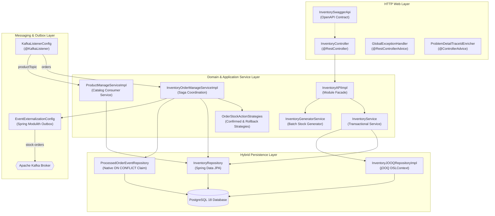

# Component Architecture Diagram: Inventory Service

This diagram illustrates the internal Spring Modulith component structure, layers, and data flows within `inventory-service`.

```mermaid
flowchart TD
    subgraph Edge["HTTP Web Layer"]
        Controller["InventoryController\n(@RestController)"]
        SwaggerDoc["InventorySwaggerApi\n(OpenAPI Contract)"]
        ExHandler["GlobalExceptionHandler\n(@RestControllerAdvice)"]
        Enricher["ProblemDetailTraceIdEnricher\n(@ControllerAdvice)"]
    end

    subgraph ServiceLayer["Domain & Application Service Layer"]
        Facade["InventoryAPIImpl\n(Module Facade)"]
        StockService["InventoryService\n(Transactional Service)"]
        OrderManager["InventoryOrderManageServiceImpl\n(Saga Coordination)"]
        ProductManager["ProductManageServiceImpl\n(Catalog Consumer Service)"]
        Generator["InventoryGeneratorService\n(Batch Stock Generator)"]
        Strategies["OrderStockActionStrategies\n(Confirmed & Rollback Strategies)"]
    end

    subgraph PersistenceLayer["Hybrid Persistence Layer"]
        JPARepo["InventoryRepository\n(Spring Data JPA)"]
        JOOQRepo["InventoryJOOQRepositoryImpl\n(jOOQ DSLContext)"]
        EventClaimRepo["ProcessedOrderEventRepository\n(Native ON CONFLICT Claim)"]
        Postgres[("PostgreSQL 18 Database")]
    end

    subgraph MessagingLayer["Messaging & Outbox Layer"]
        KafkaConsumer["KafkaListenerConfig\n(@KafkaListener)"]
        OutboxConfig["EventExternalizationConfig\n(Spring Modulith Outbox)"]
        KafkaBrokers{{"Apache Kafka Broker"}}
    end

    SwaggerDoc -.-> Controller
    Controller --> Facade
    Facade --> StockService
    Facade --> Generator
    
    KafkaConsumer -->|"orders"| OrderManager
    KafkaConsumer -->|"productTopic"| ProductManager
    
    OrderManager --> Strategies
    OrderManager --> JPARepo
    OrderManager --> EventClaimRepo
    OrderManager --> OutboxConfig
    
    ProductManager --> JPARepo
    StockService --> JPARepo
    StockService --> JOOQRepo
    
    JPARepo --> Postgres
    JOOQRepo --> Postgres
    EventClaimRepo --> Postgres
    OutboxConfig -->|"stock-orders"| KafkaBrokers
```
