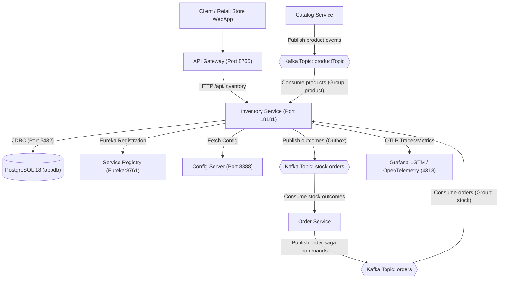

# System Context Diagram: Inventory Service

This diagram illustrates the external system context and communication boundaries of `inventory-service` within the microservices reference platform.

```mermaid
flowchart TD
    Client["Client / Retail Store WebApp"] --> Gateway["API Gateway (Port 8765)"]
    Gateway -->|"HTTP /api/inventory"| InvSvc["Inventory Service (Port 18181)"]
    
    InvSvc -->|"JDBC (Port 5432)"| DB[("PostgreSQL 18 (appdb)")]
    InvSvc -->|"Eureka Registration"| Eureka["Service Registry (Eureka:8761)"]
    InvSvc -->|"Fetch Config"| ConfigServer["Config Server (Port 8888)"]
    
    CatalogSvc["Catalog Service"] -->|"Publish product events"| KafkaTopicProd{{"Kafka Topic: productTopic"}}
    KafkaTopicProd -->|"Consume products (Group: product)"| InvSvc

    OrderSvc["Order Service"] -->|"Publish order saga commands"| KafkaTopicOrders{{"Kafka Topic: orders"}}
    KafkaTopicOrders -->|"Consume orders (Group: stock)"| InvSvc
    
    InvSvc -->|"Publish outcomes (Outbox)"| KafkaTopicStock{{"Kafka Topic: stock-orders"}}
    KafkaTopicStock -->|"Consume stock outcomes"| OrderSvc

    InvSvc -->|"OTLP Traces/Metrics"| LGTM["Grafana LGTM / OpenTelemetry (4318)"]
```
