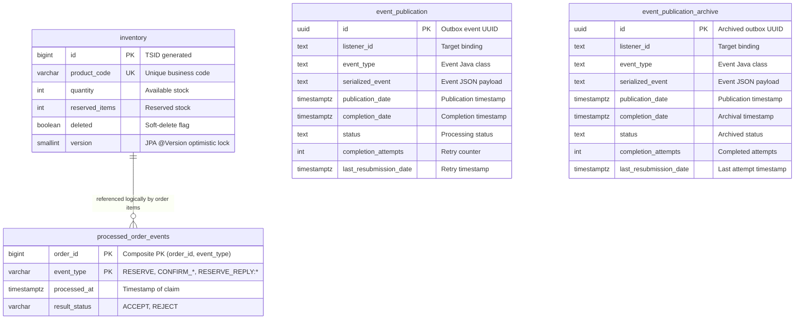

# Entity-Relationship (ER) Diagram: Inventory Service

This diagram illustrates the relational schema, primary keys, indexes, and tables managed by Liquibase in `inventory-service`.

```mermaid
erDiagram
    inventory {
        bigint id PK "TSID generated"
        varchar product_code UK "Unique business code"
        int quantity "Available stock"
        int reserved_items "Reserved stock"
        boolean deleted "Soft-delete flag"
        smallint version "JPA @Version optimistic lock"
    }

    processed_order_events {
        bigint order_id PK "Composite PK (order_id, event_type)"
        varchar event_type PK "RESERVE, CONFIRM_*, RESERVE_REPLY:*"
        timestamptz processed_at "Timestamp of claim"
        varchar result_status "ACCEPT, REJECT"
    }

    event_publication {
        uuid id PK "Outbox event UUID"
        text listener_id "Target binding"
        text event_type "Event Java class"
        text serialized_event "Event JSON payload"
        timestamptz publication_date "Publication timestamp"
        timestamptz completion_date "Completion timestamp"
        text status "Processing status"
        int completion_attempts "Retry counter"
        timestamptz last_resubmission_date "Retry timestamp"
    }

    event_publication_archive {
        uuid id PK "Archived outbox UUID"
        text listener_id "Target binding"
        text event_type "Event Java class"
        text serialized_event "Event JSON payload"
        timestamptz publication_date "Publication timestamp"
        timestamptz completion_date "Archival timestamp"
        text status "Archived status"
        int completion_attempts "Completed attempts"
        timestamptz last_resubmission_date "Last attempt timestamp"
    }

    inventory ||--o{ processed_order_events : "referenced logically by order items"
```
