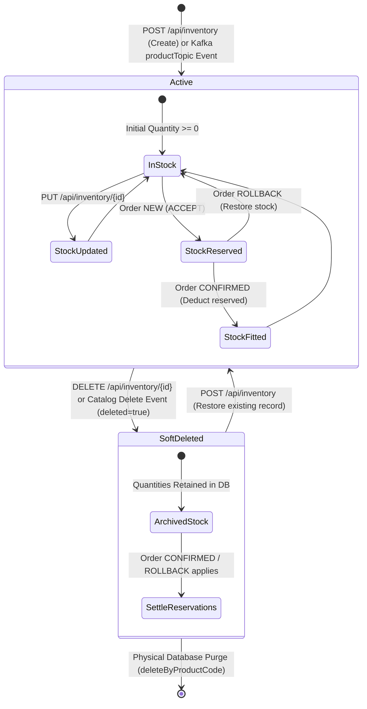

# Inventory Record State Machine Diagram

This diagram models the lifecycle states and transitions of an individual `Inventory` entity in `inventory-service`.

```mermaid
stateDiagram-v2
    [*] --> Active : POST /api/inventory (Create) or Kafka productTopic Event
    
    state Active {
        [*] --> InStock : Initial Quantity >= 0
        InStock --> StockUpdated : PUT /api/inventory/{id}
        StockUpdated --> InStock
        InStock --> StockReserved : Order NEW (ACCEPT)
        StockReserved --> InStock : Order ROLLBACK (Restore stock)
        StockReserved --> StockFitted : Order CONFIRMED (Deduct reserved)
        StockFitted --> InStock
    }

    Active --> SoftDeleted : DELETE /api/inventory/{id} or Catalog Delete Event (deleted=true)
    
    state SoftDeleted {
        [*] --> ArchivedStock : Quantities Retained in DB
        ArchivedStock --> SettleReservations : Order CONFIRMED / ROLLBACK applies
    }

    SoftDeleted --> Active : POST /api/inventory (Restore existing record)
    SoftDeleted --> [*] : Physical Database Purge (deleteByProductCode)
```
