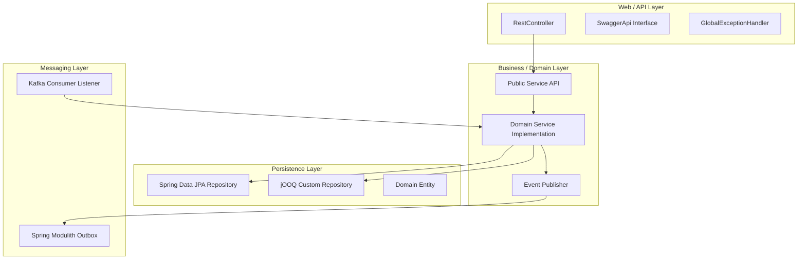

# Component Architecture Diagram

```mermaid
flowchart TD
    subgraph WebLayer["Web / API Layer"]
        Controller["RestController"]
        Swagger["SwaggerApi Interface"]
        Advice["GlobalExceptionHandler"]
    end

    subgraph DomainLayer["Business / Domain Layer"]
        Service["Domain Service Implementation"]
        API["Public Service API"]
        EventPublisher["Event Publisher"]
    end

    subgraph PersistenceLayer["Persistence Layer"]
        JPA["Spring Data JPA Repository"]
        JOOQ["jOOQ Custom Repository"]
        Entity["Domain Entity"]
    end

    subgraph MessagingLayer["Messaging Layer"]
        Listener["Kafka Consumer Listener"]
        Outbox["Spring Modulith Outbox"]
    end

    Controller --> API
    API --> Service
    Service --> JPA
    Service --> JOOQ
    Service --> EventPublisher
    EventPublisher --> Outbox
    Listener --> Service
```
