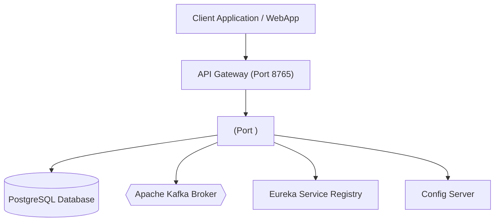

# System Context Diagram

```mermaid
flowchart TD
    Client["Client Application / WebApp"] --> Gateway["API Gateway (Port 8765)"]
    Gateway --> Service["<service-name> (Port <port>)"]
    Service --> DB[("PostgreSQL Database")]
    Service --> Kafka{{"Apache Kafka Broker"}}
    Service --> Eureka["Eureka Service Registry"]
    Service --> ConfigServer["Config Server"]
```
