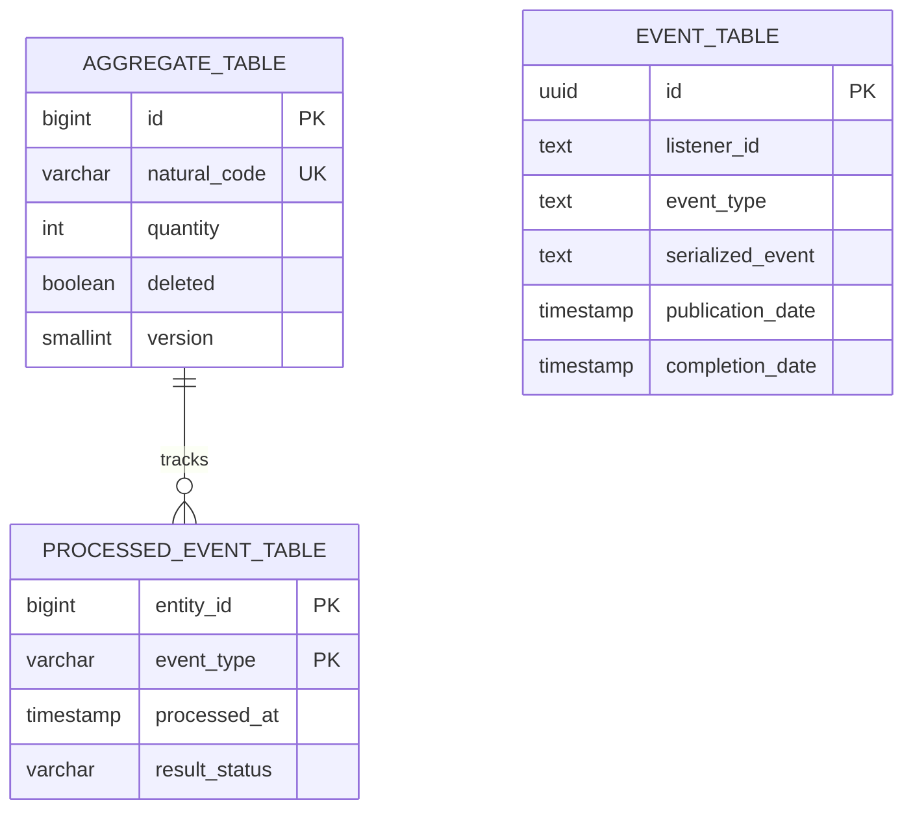

# Entity-Relationship (ER) Diagram

```mermaid
erDiagram
    AGGREGATE_TABLE {
        bigint id PK
        varchar natural_code UK
        int quantity
        boolean deleted
        smallint version
    }

    EVENT_TABLE {
        uuid id PK
        text listener_id
        text event_type
        text serialized_event
        timestamp publication_date
        timestamp completion_date
    }

    PROCESSED_EVENT_TABLE {
        bigint entity_id PK
        varchar event_type PK
        timestamp processed_at
        varchar result_status
    }

    AGGREGATE_TABLE ||--o{ PROCESSED_EVENT_TABLE : tracks
```
