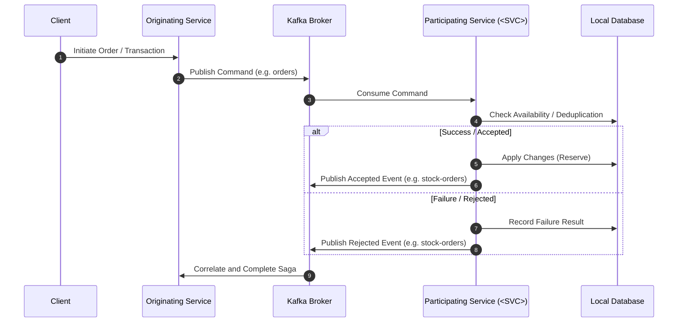

# Saga Sequence Diagram

```mermaid
sequenceDiagram
    autonumber
    participant Client
    participant ServiceA as Originating Service
    participant Broker as Kafka Broker
    participant ServiceB as Participating Service (<SVC>)
    participant DB as Local Database

    Client->>ServiceA: Initiate Order / Transaction
    ServiceA->>Broker: Publish Command (e.g. orders)
    Broker->>ServiceB: Consume Command
    ServiceB->>DB: Check Availability / Deduplication
    alt Success / Accepted
        ServiceB->>DB: Apply Changes (Reserve)
        ServiceB->>Broker: Publish Accepted Event (e.g. stock-orders)
    else Failure / Rejected
        ServiceB->>DB: Record Failure Result
        ServiceB->>Broker: Publish Rejected Event (e.g. stock-orders)
    end
    Broker->>ServiceA: Correlate and Complete Saga
```
