# Inventory Service - Detailed Sequence Diagram

## Complete Inventory Management Flow with Event-Driven Architecture

```mermaid
%%{init: {'theme':'dark', 'themeVariables': {'primaryColor':'#1f2937', 'primaryTextColor':'#ffffff', 'primaryBorderColor':'#374151', 'lineColor':'#ffffff', 'sectionBkColor':'#374151', 'altSectionBkColor':'#4b5563', 'gridColor':'#6b7280', 'secondaryColor':'#374151', 'tertiaryColor':'#4b5563', 'background':'#111827', 'mainBkg':'#1f2937', 'secondBkg':'#374151', 'tertiaryBkg':'#4b5563'}}}%%
sequenceDiagram
    participant Client as 🛒 Client<br/>(WebApp/API)
    participant Gateway as 🌐 API Gateway<br/>(Port: 8765)
    participant InventoryAPI as 📦 Inventory Service<br/>(Port: 18181)
    participant InventoryDB as 🗄️ PostgreSQL<br/>(Inventory DB)
    participant Kafka as 📡 Kafka Broker
    participant OrdersTopic as 🛍️ Orders Topic<br/>(orders)
    participant StockTopic as 📦 Stock Topic<br/>(stock-orders)
    participant ProductTopic as 📚 Product Topic<br/>(productTopic)
    participant KafkaListener as 🎧 Kafka Listener<br/>(Stock Consumer)
    participant RetryTopic as 🔄 Retry Topics<br/>(orders-retry-0,1,2)
    participant DLT as ☠️ Dead Letter Topic<br/>(orders-dlt)

    Note over Client, DLT: 📦 Inventory Management Flow
    
    rect rgba(59, 130, 246, 0.3)
        Note over Client, InventoryAPI: <span style="color: white">Inventory CRUD Operations</span>
        Client->>Gateway: GET /inventory-service/api/inventory?pageNo=0&pageSize=10
        Gateway->>InventoryAPI: Forward paginated request
        InventoryAPI->>InventoryAPI: @Loggable + Create Pageable<br/>(Sort by id, direction)
        InventoryAPI->>InventoryDB: jOOQ findAll(pageable)<br/>(type-safe queries)
        InventoryDB-->>InventoryAPI: Page<Inventory>
        InventoryAPI->>InventoryAPI: new PagedResult<>(page)
        InventoryAPI-->>Gateway: PagedResult<Inventory>
        Gateway-->>Client: Paginated inventory list
        
        Client->>Gateway: GET /inventory-service/api/inventory/{productCode}
        Gateway->>InventoryAPI: Forward request
        InventoryAPI->>InventoryDB: jOOQ findByProductCode()<br/>(custom query)
        InventoryDB-->>InventoryAPI: Optional<Inventory>
        InventoryAPI-->>Gateway: Inventory (200 OK) or 404
        Gateway-->>Client: Product inventory details
        
        Client->>Gateway: GET /inventory-service/api/inventory/product?codes=P1,P2,P3
        Gateway->>InventoryAPI: Forward bulk request
        InventoryAPI->>InventoryDB: jOOQ findByProductCodeIn()<br/>(batch query)
        InventoryDB-->>InventoryAPI: List<Inventory>
        InventoryAPI-->>Gateway: List<Inventory> (200 OK)
        Gateway-->>Client: Bulk inventory data
    end

    rect rgba(34, 197, 94, 0.3)
        Note over Client, InventoryAPI: <span style="color: white">Inventory Create & Update</span>
        Client->>Gateway: POST /inventory-service/api/inventory<br/>(InventoryRequest)
        Gateway->>InventoryAPI: Forward request
        InventoryAPI->>InventoryAPI: @Validated + InventoryMapper.toEntity()
        InventoryAPI->>InventoryDB: INSERT INTO inventory<br/>(@Transactional)
        InventoryDB-->>InventoryAPI: Saved Inventory (201 Created)
        InventoryAPI-->>Gateway: Inventory entity
        Gateway-->>Client: Created inventory
        
        Client->>Gateway: PUT /inventory-service/api/inventory/{id}<br/>(InventoryRequest)
        Gateway->>InventoryAPI: Forward update request
        InventoryAPI->>InventoryDB: jOOQ findById(id)
        InventoryDB-->>InventoryAPI: Optional<Inventory>
        
        alt Inventory exists
            InventoryAPI->>InventoryAPI: InventoryMapper.updateInventoryFromRequest()
            InventoryAPI->>InventoryDB: UPDATE inventory SET ...<br/>(@Transactional)
            InventoryDB-->>InventoryAPI: Updated inventory
            InventoryAPI-->>Gateway: Inventory (200 OK)
            Gateway-->>Client: Updated inventory
        else Inventory not found
            InventoryAPI-->>Gateway: 404 Not Found
            Gateway-->>Client: Error response
        end
    end

    Note over Client, DLT: 🎧 Event-Driven Stock Processing
    
    rect rgba(236, 72, 153, 0.3)
        Note over Kafka, InventoryAPI: <span style="color: white">Order Stock Reservation Flow</span>
        
        Kafka->>OrdersTopic: OrderDto published<br/>(from Order Service)
        OrdersTopic->>KafkaListener: @KafkaListener(topics="orders")<br/>groupId="stock"
        KafkaListener->>KafkaListener: Check orderDto.status == "NEW"
        
        KafkaListener->>InventoryAPI: inventoryOrderManageService.reserve()
        InventoryAPI->>InventoryAPI: @Transactional + Extract product codes<br/>from OrderItemDto list
        
        InventoryAPI->>InventoryDB: SELECT * FROM inventory<br/>WHERE product_code IN (codes)
        InventoryDB-->>InventoryAPI: List<Inventory> from DB
        
        alt All products exist in inventory
            InventoryAPI->>InventoryAPI: Create inventoryMap<br/>(productCode -> Inventory)
            
            InventoryAPI->>InventoryAPI: Phase 1: Validation Pass<br/>(check availability without mutations)
            
            loop For each OrderItemDto
                InventoryAPI->>InventoryAPI: Check: quantity <= availableQuantity
            end
            
            alt All items available
                InventoryAPI->>InventoryAPI: Phase 2: Mutation Pass<br/>(safe to persist changes)
                
                loop For each OrderItemDto
                    InventoryAPI->>InventoryAPI: reservedItems += quantity<br/>availableQuantity -= quantity
                end
                
                InventoryAPI->>InventoryDB: saveAll(updatedInventoryList)<br/>(@Transactional batch update)
                InventoryDB-->>InventoryAPI: Batch update confirmation
                
                InventoryAPI->>InventoryAPI: orderDto.withStatus("ACCEPT")
                InventoryAPI->>InventoryAPI: orderDto.withSource("INVENTORY")
                InventoryAPI->>Kafka: Send to stock-orders topic<br/>(OrderDto with ACCEPT status)
                Kafka-->>InventoryAPI: Kafka send confirmation
                
            else Insufficient stock
                InventoryAPI->>InventoryAPI: orderDto.withStatus("REJECT")<br/>(no inventory changes saved)
                InventoryAPI->>InventoryAPI: orderDto.withSource("INVENTORY")
                InventoryAPI->>Kafka: Send to stock-orders topic<br/>(OrderDto with REJECT status)
                Kafka-->>InventoryAPI: Kafka send confirmation
            end
            
        else Products missing from inventory
            InventoryAPI->>InventoryAPI: Log error: products not found<br/>orderDto.withStatus("REJECT")
            InventoryAPI->>InventoryAPI: orderDto.withSource("INVENTORY")
            InventoryAPI->>Kafka: Send to stock-orders topic<br/>(OrderDto with REJECT status)
            Kafka-->>InventoryAPI: Kafka send confirmation
        end
    end

    rect rgba(251, 146, 60, 0.3)
        Note over Kafka, InventoryAPI: <span style="color: white">Order Confirmation/Rollback Flow</span>
        
        Kafka->>OrdersTopic: Final OrderDto<br/>(from Kafka Streams processing)
        OrdersTopic->>KafkaListener: @KafkaListener receives<br/>CONFIRMED/ROLLBACK status
        KafkaListener->>KafkaListener: Check orderDto.status != "NEW"
        
        KafkaListener->>InventoryAPI: inventoryOrderManageService.confirm()
        InventoryAPI->>InventoryAPI: @Transactional + Extract product codes
        
        InventoryAPI->>InventoryDB: SELECT * FROM inventory<br/>WHERE product_code IN (codes)
        InventoryDB-->>InventoryAPI: List<Inventory>
        
        InventoryAPI->>InventoryAPI: Create inventoryMap<br/>(productCode -> Inventory)
        
        loop For each OrderItemDto
            alt Status = "CONFIRMED"
                InventoryAPI->>InventoryAPI: Finalize reservation:<br/>reservedItems -= quantity<br/>(stock permanently allocated)
            else Status = "ROLLBACK" AND source != "INVENTORY"
                InventoryAPI->>InventoryAPI: Release reservation:<br/>reservedItems -= quantity<br/>availableQuantity += quantity
            end
        end
        
        InventoryAPI->>InventoryDB: saveAll(inventoryMap.values())<br/>(@Transactional batch update)
        InventoryDB-->>InventoryAPI: Confirmation update complete
    end

    Note over Client, DLT: 📚 Product Management Flow
    
    rect rgba(139, 92, 246, 0.3)
        Note over Kafka, InventoryAPI: <span style="color: white">Product Creation Event Handling</span>
        
        Kafka->>ProductTopic: ProductDto published<br/>(from Catalog Service)
        ProductTopic->>KafkaListener: @KafkaListener(topics="productTopic")<br/>groupId="product"
        KafkaListener->>KafkaListener: ObjectMapper.readValue()<br/>(JSON to ProductDto)
        
        KafkaListener->>InventoryAPI: productManageService.manage()
        InventoryAPI->>InventoryAPI: @Loggable + Extract productCode
        
        InventoryAPI->>InventoryDB: SELECT EXISTS WHERE product_code = ?<br/>(idempotency check)
        InventoryDB-->>InventoryAPI: Boolean exists
        
        alt Product doesn't exist
            InventoryAPI->>InventoryAPI: new Inventory().setProductCode()
            InventoryAPI->>InventoryDB: INSERT INTO inventory<br/>(productCode, quantity=0, reserved=0)
            
            alt Insert successful
                InventoryDB-->>InventoryAPI: Inventory created
            else DataIntegrityViolationException (concurrent insert)
                InventoryAPI->>InventoryDB: Double-check EXISTS<br/>(race condition handling)
                InventoryDB-->>InventoryAPI: Product exists check
                
                alt Product now exists
                    InventoryAPI->>InventoryAPI: Ignore exception<br/>(idempotency maintained)
                else Still doesn't exist
                    InventoryAPI-->>KafkaListener: Re-throw exception
                end
            end
        else Product already exists
            InventoryAPI->>InventoryAPI: Skip creation<br/>(idempotent operation)
        end
    end

    Note over Client, DLT: 🔄 Error Handling & Resilience
    
    rect rgba(239, 68, 68, 0.3)
        Note over KafkaListener, DLT: <span style="color: white">Retry & Dead Letter Processing</span>
        
        alt Processing fails
            KafkaListener-->>RetryTopic: @RetryableTopic<br/>@Backoff(delay=1000, multiplier=2.0)
            RetryTopic->>RetryTopic: orders-retry-0 (1s delay)
            RetryTopic->>RetryTopic: orders-retry-1 (2s delay)
            RetryTopic->>RetryTopic: orders-retry-2 (4s delay)
            
            alt All retries exhausted
                RetryTopic->>DLT: @DltHandler<br/>orders-dlt topic
                DLT->>KafkaListener: dlt(OrderDto, topic)
                KafkaListener->>KafkaListener: Log error message
            end
        end
    end

    Note over Client, DLT: 🎯 Utility Operations
    
    rect rgba(34, 197, 94, 0.3)
        Note over Client, InventoryAPI: <span style="color: white">Inventory Generation & Management</span>
        Client->>Gateway: GET /inventory-service/api/inventory/generate
        Gateway->>InventoryAPI: Trigger inventory generation
        InventoryAPI->>InventoryAPI: @Transactional + IntStream.rangeClosed(0, 100)
        
        loop For ProductCode0 to ProductCode100
            InventoryAPI->>InventoryAPI: Generate random quantity (1-10,000)
            InventoryAPI->>InventoryDB: findByProductCode("ProductCode" + i)
            InventoryDB-->>InventoryAPI: Optional<Inventory>
            
            alt Inventory exists
                InventoryAPI->>InventoryAPI: updateInventory(randomQuantity)
                InventoryAPI->>InventoryDB: UPDATE inventory SET quantity = ?
                InventoryDB-->>InventoryAPI: Update confirmation
            end
        end
        
        InventoryAPI-->>Gateway: Boolean true (generation complete)
        Gateway-->>Client: Success response
        
        Client->>Gateway: DELETE /inventory-service/api/inventory/{id}
        Gateway->>InventoryAPI: Forward delete request
        InventoryAPI->>InventoryDB: jOOQ findById(id)
        InventoryDB-->>InventoryAPI: Optional<Inventory>
        
        alt Inventory exists
            InventoryAPI->>InventoryDB: DELETE FROM inventory WHERE id = ?<br/>(@Transactional)
            InventoryDB-->>InventoryAPI: Deletion confirmed
            InventoryAPI-->>Gateway: Deleted inventory (200 OK)
            Gateway-->>Client: Deleted inventory data
        else Inventory not found
            InventoryAPI-->>Gateway: 404 Not Found
            Gateway-->>Client: Error response
        end
    end

    Note over Client, DLT: 📊 Inventory State Management
    
    rect rgba(139, 92, 246, 0.3)
        Note over InventoryAPI, InventoryDB: <span style="color: white">Stock Level Tracking</span>
        
        Note over InventoryAPI: Inventory State Model:<br/>• availableQuantity: Stock ready for orders<br/>• reservedItems: Stock allocated to pending orders<br/>• Total Stock = Available + Reserved
        
        Note over InventoryAPI: State Transitions:<br/>NEW → Reserve stock (Available→Reserved)<br/>CONFIRMED → Finalize allocation<br/>ROLLBACK → Release reserved stock
        
        InventoryAPI->>InventoryDB: Atomic stock updates<br/>with @Transactional safety + @Version
        InventoryDB-->>InventoryAPI: Optimistic locking prevents<br/>concurrent modification issues
    end
```



## Key Architecture Components

### 🏗️ **Core Service Architecture**
- **REST API**: Spring Boot with comprehensive inventory CRUD operations
- **Database**: PostgreSQL with jOOQ integration for type-safe queries
- **Event Processing**: Dual Kafka consumers for orders and product events
- **Observability**: Comprehensive logging aspects and method tracing

### 📦 **Inventory Management Logic**
- **Stock Reservation**: Two-phase validation and mutation pattern
- **Optimistic Locking**: @Version annotation prevents concurrent modifications
- **Batch Operations**: Efficient bulk updates for multiple inventory items
- **Idempotency**: Safe duplicate event processing with existence checks

### 🎧 **Event-Driven Architecture**
- **Order Consumer**: Listens to `orders` topic with stock group ID
- **Product Consumer**: Listens to `productTopic` for new product creation
- **Producer**: Publishes to `stock-orders` topic for order orchestration
- **Retry Logic**: Exponential backoff with configurable retry attempts

### 🔄 **Resilience Patterns**
- **Two-Phase Processing**: Validation → Mutation for data consistency
- **Retry Topics**: `orders-retry-0`, `orders-retry-1`, `orders-retry-2`
- **Dead Letter Queue**: Failed message handling with monitoring
- **Race Condition Handling**: DataIntegrityViolationException management

### 📊 **Data Management**
- **jOOQ Integration**: Type-safe SQL queries with code generation
- **Liquibase**: Database schema management with JSON migrations
- **Pagination**: Efficient inventory listing with sorting support
- **Batch Updates**: Optimized multi-record operations

## Service Endpoints Summary

| Endpoint | Method | Description | Features |
|----------|--------|-------------|----------|
| `/api/inventory` | GET | Get paginated inventory | Pagination, sorting, jOOQ queries |
| `/api/inventory/{productCode}` | GET | Get inventory by product code | Direct product lookup |
| `/api/inventory/product?codes=` | GET | Get inventory by product codes | Bulk inventory retrieval |
| `/api/inventory` | POST | Create inventory | Validation, entity mapping |
| `/api/inventory/{id}` | PUT | Update inventory | Transactional updates |
| `/api/inventory/{id}` | DELETE | Delete inventory | Safe deletion |
| `/api/inventory/generate` | GET | Generate test inventory | Development utility |

## Kafka Event Flow & Topics


## Database Schema

```sql
-- Inventory table with stock tracking
CREATE TABLE inventory (
    id BIGSERIAL PRIMARY KEY,
    product_code VARCHAR(255) UNIQUE NOT NULL,
    quantity INTEGER DEFAULT 0,           -- Available stock
    reserved_items INTEGER DEFAULT 0,     -- Reserved for pending orders
    version SMALLINT DEFAULT 0,           -- Optimistic locking
    created_date TIMESTAMP DEFAULT CURRENT_TIMESTAMP,
    updated_date TIMESTAMP DEFAULT CURRENT_TIMESTAMP
);

-- Indexes for performance
CREATE INDEX idx_inventory_product_code ON inventory(product_code);
CREATE INDEX idx_inventory_quantity ON inventory(quantity);
```

## Inventory State Machine


## Key Features

### 🔒 **Stock Consistency**
- **Two-Phase Processing**: Validation → Mutation for atomic operations
- **Optimistic Locking**: @Version prevents concurrent modification conflicts
- **Batch Updates**: Efficient multi-item stock operations
- **Idempotent Processing**: Safe duplicate message handling

### 🎯 **Event Processing**
- **Dual Consumers**: Separate handling for orders and product events
- **Selective Processing**: Different logic for NEW vs CONFIRMED/ROLLBACK
- **Retry Strategy**: Exponential backoff with dead letter handling
- **Race Condition Safety**: DataIntegrityViolationException handling

### 🚀 **Performance Optimizations**
- **jOOQ Integration**: Type-safe, efficient SQL queries
- **Batch Operations**: saveAll() for multiple inventory updates
- **Connection Pooling**: Optimized database connections
- **Pagination**: Efficient large dataset handling

### 📊 **Stock Management**
- **Available vs Reserved**: Clear separation of stock states
- **Product Lifecycle**: Automatic inventory creation from product events
- **Stock Validation**: Multi-phase availability checking
- **Compensation Logic**: Automatic stock release on transaction rollback