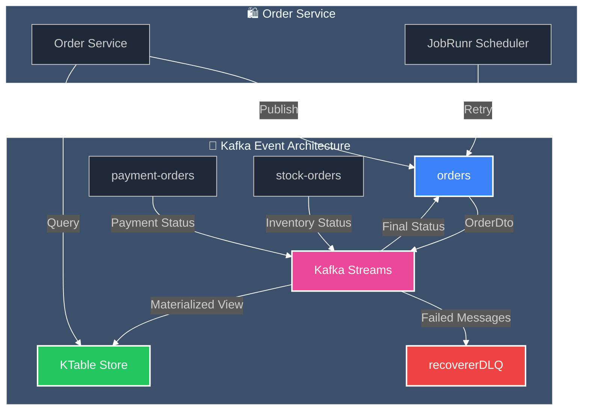

# Order Service - Detailed Sequence Diagram

## Complete Order Processing Flow with Event-Driven Architecture

```mermaid
%%{init: {'theme':'dark', 'themeVariables': {'primaryColor':'#1f2937', 'primaryTextColor':'#ffffff', 'primaryBorderColor':'#374151', 'lineColor':'#ffffff', 'sectionBkColor':'#374151', 'altSectionBkColor':'#4b5563', 'gridColor':'#6b7280', 'secondaryColor':'#374151', 'tertiaryColor':'#4b5563', 'background':'#111827', 'mainBkg':'#1f2937', 'secondBkg':'#374151', 'tertiaryBkg':'#4b5563'}}}%%
sequenceDiagram
    participant Client as 🛒 Client<br/>(WebApp/API)
    participant Gateway as 🌐 API Gateway<br/>(Port: 8765)
    participant OrderAPI as 🛍️ Order Service<br/>(Port: 18282)
    participant OrderDB as 🗄️ PostgreSQL<br/>(Orders DB)
    participant Catalog as 📚 Catalog Service<br/>(Port: 18080)
    participant Kafka as 📡 Kafka Broker
    participant PaymentTopic as 💳 Payment Topic<br/>(payment-orders)
    participant StockTopic as 📦 Stock Topic<br/>(stock-orders)
    participant OrdersTopic as 🛍️ Orders Topic<br/>(orders)
    participant KafkaStreams as 🌊 Kafka Streams<br/>(Order Processing)
    participant JobRunr as ⏰ JobRunr<br/>(Background Jobs)

    Note over Client, JobRunr: 🛍️ Order Creation Flow
    Client->>Gateway: POST /order-service/api/orders<br/>(OrderRequest + JWT)
    Gateway->>OrderAPI: Forward request with auth
    OrderAPI->>OrderAPI: @Loggable + @Observed<br/>Validate request
    
    Note over OrderAPI: Extract product codes from order items
    OrderAPI->>Catalog: GET /api/catalog/exists<br/>(productCodes validation)
    Catalog-->>OrderAPI: Boolean (products exist & in stock)
    
    alt Products exist and in stock
        OrderAPI->>OrderAPI: OrderMapper.orderRequestToEntity()
        OrderAPI->>OrderDB: INSERT Order + OrderItems<br/>(@Transactional)
        OrderDB-->>OrderAPI: Saved Order (with ID)
        
        OrderAPI->>OrderAPI: OrderMapper.toDto(savedOrder)
        OrderAPI->>Kafka: @Async sendOrder(OrderDto)<br/>Topic: "orders"
        Kafka-->>OrderAPI: Kafka send confirmation
        
        OrderAPI->>OrderAPI: OrderMapper.toResponse(savedOrder)
        OrderAPI-->>Gateway: OrderResponse (201 Created)
        Gateway-->>Client: Order confirmation
        
    else Products don't exist or out of stock
        OrderAPI-->>Gateway: ProductNotFoundException (400)
        Gateway-->>Client: Error response
    end

    Note over Client, JobRunr: 📊 Order Retrieval Flows
    
    rect rgba(59, 130, 246, 0.3)
        Note over Client, OrderAPI: <span style="color: white">Get All Orders (Paginated)</span>
        Client->>Gateway: GET /order-service/api/orders?pageNo=0&pageSize=10
        Gateway->>OrderAPI: Forward request
        OrderAPI->>OrderDB: SELECT orders with pagination<br/>(fetch IDs first to avoid N+1)
        OrderDB-->>OrderAPI: Page<Long> orderIds
        OrderAPI->>OrderDB: SELECT orders WHERE id IN (ids)<br/>(fetch with items)
        OrderDB-->>OrderAPI: List<Order> with OrderItems
        OrderAPI->>OrderAPI: CompletableFuture.supplyAsync()<br/>(parallel mapping)
        OrderAPI-->>Gateway: PagedResult<OrderResponse>
        Gateway-->>Client: Paginated orders
    end

    rect rgba(34, 197, 94, 0.3)
        Note over Client, OrderAPI: <span style="color: white">Get Order by ID (with Circuit Breaker)</span>
        Client->>Gateway: GET /order-service/api/orders/{id}
        Gateway->>OrderAPI: Forward request
        OrderAPI->>OrderAPI: @CircuitBreaker + @RateLimiter<br/>+ @Bulkhead resilience
        OrderAPI->>OrderDB: SELECT order WHERE id = ?
        OrderDB-->>OrderAPI: Order with OrderItems
        OrderAPI-->>Gateway: OrderResponse (200 OK)
        Gateway-->>Client: Order details
        
        Note over OrderAPI: If circuit breaker opens
        OrderAPI-->>Gateway: Fallback response<br/>("fallback-response for id: {id}")
    end

    rect rgba(251, 146, 60, 0.3)
        Note over Client, OrderAPI: <span style="color: white">Get Orders by Customer ID</span>
        Client->>Gateway: GET /order-service/api/orders/customer/{customerId}
        Gateway->>OrderAPI: Forward request
        OrderAPI->>OrderDB: SELECT orders WHERE customerId = ?<br/>(paginated)
        OrderDB-->>OrderAPI: Customer's orders
        OrderAPI-->>Gateway: PagedResult<OrderResponse>
        Gateway-->>Client: Customer order history
    end

    Note over Client, JobRunr: 🌊 Event-Driven Processing (Kafka Streams)
    
    rect rgba(236, 72, 153, 0.3)
        Note over Kafka, KafkaStreams: <span style="color: white">Distributed Transaction Processing</span>
        Kafka->>PaymentTopic: OrderDto published<br/>(from Payment Service)
        Kafka->>StockTopic: OrderDto published<br/>(from Inventory Service)
        
        KafkaStreams->>PaymentTopic: Stream from payment-orders
        KafkaStreams->>StockTopic: Stream from stock-orders
        
        KafkaStreams->>KafkaStreams: Join streams within 10s window<br/>StreamJoined.with()
        KafkaStreams->>KafkaStreams: OrderManageService.confirm()<br/>(business logic)
        
        Note over KafkaStreams: Status Resolution Logic:<br/>ACCEPT + ACCEPT = CONFIRMED<br/>REJECT + REJECT = REJECTED<br/>ACCEPT + REJECT = ROLLBACK
        
        KafkaStreams->>OrdersTopic: Publish final OrderDto<br/>(with resolved status)
        KafkaStreams->>OrderDB: UPDATE order SET status = ?<br/>WHERE id = ?
        
        KafkaStreams->>KafkaStreams: Store in KTable<br/>(materialized view)
    end

    Note over Client, JobRunr: 📋 Kafka Streams Query API
    Client->>Gateway: GET /order-service/api/orders/all?pageNo=0
    Gateway->>OrderAPI: Forward request
    OrderAPI->>KafkaStreams: Query ReadOnlyKeyValueStore<br/>(from materialized KTable)
    KafkaStreams-->>OrderAPI: List<OrderDto> from Kafka Store
    OrderAPI-->>Gateway: Orders from stream store
    Gateway-->>Client: Real-time order data

    Note over Client, JobRunr: ⏰ Background Job Processing
    JobRunr->>JobRunr: @Job("reProcessNewOrders")<br/>Scheduled every 5 minutes
    JobRunr->>OrderDB: SELECT orders WHERE status = 'NEW'<br/>AND createdDate < now() - 5min
    OrderDB-->>JobRunr: List<Order> stuck orders
    
    loop For each stuck order
        JobRunr->>JobRunr: OrderMapper.toDto(order)
        JobRunr->>Kafka: Republish OrderDto<br/>Topic: "orders"
        Kafka-->>JobRunr: Retry confirmation
    end

    Note over Client, JobRunr: 🔄 Order Update & Delete Operations
    
    rect rgba(34, 197, 94, 0.3)
        Note over Client, OrderAPI: <span style="color: white">Update Order</span>
        Client->>Gateway: PUT /order-service/api/orders/{id}<br/>(OrderRequest)
        Gateway->>OrderAPI: Forward request
        OrderAPI->>OrderDB: SELECT order WHERE id = ?
        OrderDB-->>OrderAPI: Existing order
        OrderAPI->>OrderAPI: OrderMapper.updateOrderFromOrderRequest()
        OrderAPI->>OrderDB: UPDATE order (@Transactional)
        OrderDB-->>OrderAPI: Updated order
        OrderAPI-->>Gateway: OrderResponse (200 OK)
        Gateway-->>Client: Updated order
    end

    rect rgba(239, 68, 68, 0.3)
        Note over Client, OrderAPI: <span style="color: white">Delete Order</span>
        Client->>Gateway: DELETE /order-service/api/orders/{id}
        Gateway->>OrderAPI: Forward request
        OrderAPI->>OrderDB: SELECT order WHERE id = ?
        OrderDB-->>OrderAPI: Order exists check
        OrderAPI->>OrderDB: DELETE FROM orders WHERE id = ?<br/>(@Transactional)
        OrderDB-->>OrderAPI: Deletion confirmed
        OrderAPI-->>Gateway: 202 Accepted
        Gateway-->>Client: Deletion confirmed
    end

    Note over Client, JobRunr: 🎯 Batch Operations & Performance
    
    rect rgba(139, 92, 246, 0.3)
        Note over Client, OrderAPI: <span style="color: white">Batch Order Creation</span>
        Client->>Gateway: POST /order-service/api/orders/batch<br/>(List<OrderRequest>)
        Gateway->>OrderAPI: Forward batch request
        OrderAPI->>OrderAPI: Extract all product codes<br/>(distinct validation)
        OrderAPI->>Catalog: Validate all products at once
        Catalog-->>OrderAPI: Batch validation result
        
        OrderAPI->>OrderDB: saveAll(List<Order>)<br/>(@Transactional batch)
        OrderDB-->>OrderAPI: List<Order> saved
        
        OrderAPI->>OrderAPI: parallelStream().map(toDto)<br/>(parallel processing)
        OrderAPI->>Kafka: Parallel Kafka publishing<br/>(forEach async send)
        Kafka-->>OrderAPI: Batch confirmations
        
        OrderAPI-->>Gateway: List<OrderResponse>
        Gateway-->>Client: Batch creation success
    end

    Note over Client, JobRunr: 🛡️ Resilience & Error Handling
    
    rect rgba(239, 68, 68, 0.3)
        Note over OrderAPI, Kafka: <span style="color: white">Circuit Breaker Patterns</span>
        OrderAPI->>Catalog: @CircuitBreaker("default")
        
        alt Circuit Open (Catalog unavailable)
            OrderAPI->>OrderAPI: productsExistsDefaultValue()<br/>(fallback method)
            OrderAPI->>OrderAPI: Check applicationProperties<br/>.byPassCircuitBreaker()
            OrderAPI-->>Gateway: Fallback response or error
        end
        
        Note over Kafka, KafkaStreams: Kafka Error Handling
        KafkaStreams->>KafkaStreams: RecoveringDeserializationExceptionHandler
        KafkaStreams->>Kafka: DeadLetterPublishingRecoverer<br/>Topic: "recovererDLQ"
        
        Note over KafkaStreams: Stream Configuration:<br/>- EXACTLY_ONCE_V2 processing<br/>- 10MB state store cache<br/>- 2 stream threads<br/>- 1s commit interval
    end
```



## Key Architecture Components

### 🏗️ **Core Service Architecture**
- **REST API**: Spring Boot with comprehensive CRUD operations
- **Database**: PostgreSQL with Liquibase migrations (XML format)
- **Resilience**: Circuit Breaker, Rate Limiter, Bulkhead patterns
- **Observability**: Micrometer tracing, logging aspects, metrics

### 📡 **Event-Driven Architecture**
- **Kafka Producer**: Async order publishing to `orders` topic
- **Kafka Streams**: Real-time stream processing with windowed joins
- **Topics**: `orders`, `payment-orders`, `stock-orders`, `recovererDLQ`
- **Materialized Views**: KTable for queryable order state

### 🔄 **Distributed Transaction Management**
- **Saga Pattern**: Choreography-based with Kafka Streams
- **Status Flow**: NEW → ACCEPT/REJECT → CONFIRMED/ROLLBACK
- **Compensation**: Automatic rollback on payment/inventory failures
- **Exactly-Once**: Guaranteed message processing semantics

### ⏰ **Background Processing**
- **JobRunr Integration**: Scheduled job execution and monitoring
- **Retry Logic**: Automatic reprocessing of stuck orders
- **Dashboard**: Web UI at port 28282 for job monitoring

### 🛡️ **Resilience Patterns**
- **Circuit Breaker**: Catalog service integration protection
- **Rate Limiting**: API endpoint protection
- **Bulkhead**: Resource isolation for critical operations
- **Dead Letter Queue**: Failed message recovery

### 📊 **Performance Optimizations**
- **Pagination**: Efficient N+1 query prevention
- **Parallel Processing**: CompletableFuture for response mapping
- **Batch Operations**: Bulk order creation and validation
- **Connection Pooling**: Optimized database connections

## Service Endpoints Summary

| Endpoint | Method | Description | Features |
|----------|--------|-------------|----------|
| `/api/orders` | GET | Get paginated orders | Pagination, sorting, N+1 prevention |
| `/api/orders/{id}` | GET | Get order by ID | Circuit breaker, rate limiting |
| `/api/orders` | POST | Create new order | Product validation, Kafka publishing |
| `/api/orders/{id}` | PUT | Update existing order | Transactional updates |
| `/api/orders/{id}` | DELETE | Delete order | Soft/hard deletion |
| `/api/orders/customer/{id}` | GET | Get customer orders | Customer-specific pagination |
| `/api/orders/all` | GET | Query Kafka streams | Real-time materialized view |
| `/api/orders/generate` | GET | Generate mock orders | Development/testing utility |

## Kafka Topics & Event Flow



## Database Schema

```sql
-- Orders table with audit fields
CREATE TABLE orders (
    id BIGSERIAL PRIMARY KEY,
    customer_id BIGINT NOT NULL,
    status VARCHAR(20) DEFAULT 'NEW',
    source VARCHAR(50),
    delivery_address_line1 VARCHAR(255),
    delivery_address_line2 VARCHAR(255),
    delivery_address_city VARCHAR(100),
    delivery_address_state VARCHAR(100),
    delivery_address_zip_code VARCHAR(20),
    delivery_address_country VARCHAR(100),
    version SMALLINT DEFAULT 0,
    created_date TIMESTAMP DEFAULT CURRENT_TIMESTAMP,
    created_by VARCHAR(100),
    last_modified_date TIMESTAMP,
    last_modified_by VARCHAR(100)
);

-- Order items with product details
CREATE TABLE order_items (
    id BIGSERIAL PRIMARY KEY,
    order_id BIGINT REFERENCES orders(id),
    product_code VARCHAR(100) NOT NULL,
    product_name VARCHAR(255),
    product_price DECIMAL(10,2),
    quantity INTEGER NOT NULL
);
```