# 🌊 Kafka Streams Deep Dive

> 📊 **For detailed data flow analysis, sample data structures, and storage mechanisms, see:** [**03-Kafka-Streams-Data-Flow-Analysis.md**](./03-Kafka-Streams-Data-Flow-Analysis.md)

## 📊 Visual Overview

### Kafka Streams Architecture


## 🎯 Table of Contents
1. [Kafka Streams Fundamentals](#kafka-streams-fundamentals)
2. [Why Kafka Streams vs Regular Kafka](#why-kafka-streams-vs-regular-kafka)
3. [Stream vs Consumer Differences](#stream-vs-consumer-differences)
4. [Dead Letter Queue (DLQ) Usage](#dead-letter-queue-dlq-usage)
5. [Critical Kafka Streams Configurations](#critical-kafka-streams-configurations)
6. [Advanced Kafka Streams Concepts](#advanced-kafka-streams-concepts)
7. [Monitoring & Observability](#monitoring--observability)
8. [Performance Optimization Tips](#performance-optimization-tips)
9. [Error Handling Strategies](#error-handling-strategies)
10. [Testing Kafka Streams](#testing-kafka-streams)
11. [Deployment Considerations](#deployment-considerations)

---

## 🌊 Kafka Streams Fundamentals

### What is Kafka Streams?
Kafka Streams is a **client library** for building applications and microservices where input and output data are stored in Kafka clusters. It combines the simplicity of writing and deploying standard Java applications with the benefits of Kafka's server-side cluster technology.

### Core Concepts

#### 1. **Stream Processing Topology**

```mermaid
flowchart TD
    subgraph "🔄 Stream Processing Topology"
        SOURCE1[📥 Source: payment-orders]
        SOURCE2[📥 Source: stock-orders]
        
        STREAM1[🌊 KStream: Payment Events]
        STREAM2[🌊 KStream: Stock Events]
        
        JOIN[🔗 Stream Join]
        WINDOW[⏰ 10s Time Window]
        
        PROCESSOR[⚙️ Business Logic Processor]
        
        SINK1[📤 Sink: orders]
        SINK2[📤 Sink: recovererDLQ]
        
        STORE[💾 State Store: orders-store]
        TABLE[📋 KTable: Materialized View]
    end
    
    SOURCE1 --> STREAM1
    SOURCE2 --> STREAM2
    
    STREAM1 --> JOIN
    STREAM2 --> JOIN
    JOIN --> WINDOW
    WINDOW --> PROCESSOR
    
    PROCESSOR --> SINK1
    PROCESSOR --> SINK2
    
    SINK1 --> STORE
    STORE --> TABLE
    
    style JOIN fill:#ec4899,color:#ffffff
    style WINDOW fill:#f59e0b,color:#ffffff
    style PROCESSOR fill:#22c55e,color:#ffffff
    style STORE fill:#8b5cf6,color:#ffffff
```


```java
// Stream processing pipeline
KStream<Long, OrderDto> paymentStream = builder.stream("payment-orders");
KStream<Long, OrderDto> stockStream = builder.stream("stock-orders");

// Join two streams within a time window
paymentStream
    .join(stockStream, 
          this::processOrder,           // Value joiner function
          JoinWindows.of(Duration.ofSeconds(10)),  // Time window
          StreamJoined.with(Serdes.Long(), orderSerde, orderSerde))
    .to("orders");                    // Output topic
```

#### 2. **KStream vs KTable**
- **KStream**: Represents a **stream of records** (insert-only)
  - Each record is an independent event
  - Suitable for event logs, transactions
  
- **KTable**: Represents a **changelog stream** (upsert semantics)
  - Latest value for each key
  - Suitable for current state, aggregations

```java
// KStream: Every order event
KStream<Long, OrderDto> orderEvents = builder.stream("orders");

// KTable: Current order state (latest status per order ID)
KTable<Long, OrderDto> orderState = orderEvents.toTable();
```

#### 3. **Stateful vs Stateless Operations**

**Stateless Operations** (no local state):
```java
stream.filter(order -> order.amount() > 100)     // Filter
      .map(order -> order.withDiscount(0.1))     // Transform
      .peek((k,v) -> log.info("Processing: {}", v)); // Side effect
```

**Stateful Operations** (maintain local state):
```java
stream.groupByKey()
      .aggregate(() -> 0.0,                      // Initial value
                (k, order, total) -> total + order.amount(), // Aggregator
                Materialized.as("order-totals"));  // State store
```

---

## 🤔 Why Kafka Streams vs Regular Kafka?

### Architecture Comparison


### Traditional Kafka Consumer Approach
```java
@KafkaListener(topics = "payment-orders")
public void handlePayment(OrderDto payment) {
    // ❌ Problems:
    // 1. Manual correlation with stock events
    // 2. Complex state management
    // 3. No built-in windowing
    // 4. Manual offset management
    
    // Store in database/cache for correlation
    paymentCache.put(payment.orderId(), payment);
    
    // Check if corresponding stock event exists
    OrderDto stock = stockCache.get(payment.orderId());
    if (stock != null) {
        processOrder(payment, stock);
        // Manual cleanup
        paymentCache.remove(payment.orderId());
        stockCache.remove(payment.orderId());
    }
}
```

### Kafka Streams Approach
```java
// ✅ Advantages:
// 1. Automatic event correlation
// 2. Built-in windowing and time semantics
// 3. Exactly-once processing
// 4. Automatic state management
// 5. Fault tolerance and recovery

paymentStream
    .join(stockStream,
          this::processOrder,                    // Business logic only
          JoinWindows.ofTimeDifferenceWithNoGrace(Duration.ofSeconds(10)),
          StreamJoined.with(Serdes.Long(), orderSerde, orderSerde))
    .to("orders");
```

### Key Benefits in This Project

1. **Automatic Event Correlation**
   - No manual caching or correlation logic
   - Built-in join operations handle complexity

2. **Time Window Management**
   - 10-second window for payment + inventory events
   - Automatic cleanup of expired windows

3. **Exactly-Once Processing**
   - Prevents duplicate order processing
   - Critical for financial transactions

4. **Fault Tolerance**
   - Automatic recovery from failures
   - State store replication

5. **Scalability**
   - Horizontal scaling through partitioning
   - Load balancing across instances

---

## ⚖️ Stream vs Consumer Differences

| Aspect | Kafka Consumer | Kafka Streams |
|--------|----------------|---------------|
| **Processing Model** | Pull-based, manual polling | Push-based, declarative |
| **State Management** | Manual (DB/Cache) | Built-in (RocksDB) |
| **Windowing** | Manual implementation | Built-in time windows |
| **Joins** | Manual correlation | Native stream joins |
| **Exactly-Once** | Manual deduplication | Built-in EXACTLY_ONCE_V2 |
| **Scaling** | Consumer groups | Stream threads + partitions |
| **Fault Tolerance** | Manual offset management | Automatic checkpointing |
| **Latency** | Lower (direct processing) | Slightly higher (processing overhead) |
| **Complexity** | High (manual orchestration) | Low (declarative topology) |

### When to Use Each?

**Use Kafka Consumer when:**
- Simple event processing
- Direct database writes
- Low latency requirements
- Simple business logic

**Use Kafka Streams when:**
- Event correlation needed
- Complex transformations
- Windowed operations
- Stateful processing
- **This project's use case: Order + Payment + Inventory correlation**

---

## 🚨 Dead Letter Queue (DLQ) Usage

### DLQ Flow Diagram

```mermaid
sequenceDiagram
    participant Producer as 📤 Producer
    participant Topic as 📋 payment-orders
    participant Streams as 🌊 Kafka Streams
    participant DLQ as 🚨 recovererDLQ
    participant Monitor as 👁️ DLQ Monitor
    participant Ops as 👨‍💻 Operations Team
    
    Note over Producer, Ops: Normal Processing Flow
    Producer->>Topic: Valid OrderDto JSON
    Topic->>Streams: Consume message
    Streams->>Streams: ✅ Deserialize successfully
    Streams->>Streams: Process business logic
    
    Note over Producer, Ops: Error Handling Flow
    Producer->>Topic: Corrupted JSON payload
    Topic->>Streams: Consume corrupted message
    Streams->>Streams: ❌ Deserialization fails
    
    Note over Streams: RecoveringDeserializationExceptionHandler
    Streams->>DLQ: Route failed message with metadata
    
    Note over DLQ: Message includes:
    Note over DLQ: - Original topic/partition/offset
    Note over DLQ: - Exception details
    Note over DLQ: - Timestamp
    Note over DLQ: - Original payload
    
    DLQ->>Monitor: @KafkaListener detects DLQ message
    Monitor->>Monitor: Log error details
    Monitor->>Ops: 🚨 Alert: DLQ message received
    
    Ops->>Ops: Analyze root cause
    Ops->>Topic: Fix and republish (if recoverable)
    
    Note over Producer, Ops: Recovery Options:
    Note over Producer, Ops: 1. Fix data and republish
    Note over Producer, Ops: 2. Update schema/deserializer
    Note over Producer, Ops: 3. Business compensation
```



### What is recovererDLQ?
The `recovererDLQ` topic captures **failed messages** that cannot be processed due to:
- Deserialization errors
- Processing exceptions
- Poison messages

### Implementation in Project

```java
@Bean
DeadLetterPublishingRecoverer deadLetterPublishingRecoverer(
        ProducerFactory<byte[], byte[]> producerFactory) {
    return new DeadLetterPublishingRecoverer(
        new KafkaTemplate<>(producerFactory),
        // Route ALL failed messages to recovererDLQ topic
        (record, ex) -> new TopicPartition(RECOVER_DLQ_TOPIC, -1));
}
```

### Configuration Integration
```java
// Enable DLQ for deserialization failures
streamsConfiguration.put(
    StreamsConfig.DEFAULT_DESERIALIZATION_EXCEPTION_HANDLER_CLASS_CONFIG,
    RecoveringDeserializationExceptionHandler.class);

// Link DLQ recoverer
streamsConfiguration.put(
    RecoveringDeserializationExceptionHandler.KSTREAM_DESERIALIZATION_RECOVERER,
    deadLetterPublishingRecoverer);
```

### DLQ Message Structure
```json
{
  "originalTopic": "payment-orders",
  "originalPartition": 0,
  "originalOffset": 12345,
  "exception": "JsonParseException: Unexpected character...",
  "timestamp": "2024-01-15T10:30:00Z",
  "headers": {
    "__TypeId__": "com.example.common.dtos.OrderDto"
  },
  "value": "corrupted-json-payload"
}
```

### DLQ Monitoring & Recovery

```java
// Monitor DLQ for failed messages
@KafkaListener(topics = "recovererDLQ")
public void handleDLQMessages(ConsumerRecord<String, String> record) {
    log.error("DLQ Message from topic: {}, partition: {}, offset: {}, error: {}",
        record.headers().lastHeader("kafka_original-topic"),
        record.headers().lastHeader("kafka_original-partition"),
        record.headers().lastHeader("kafka_original-offset"),
        record.headers().lastHeader("kafka_exception-message"));
    
    // Implement recovery logic:
    // 1. Alert operations team
    // 2. Attempt message repair
    // 3. Manual reprocessing
    // 4. Business compensation
}
```

### DLQ Best Practices
1. **Monitor DLQ size** - High volume indicates systemic issues
2. **Set up alerts** - Immediate notification for DLQ messages
3. **Implement recovery** - Automated or manual reprocessing
4. **Root cause analysis** - Fix underlying issues causing failures

---

## ⚙️ Critical Kafka Streams Configurations

### Configuration Impact Diagram

```mermaid
graph TD
    subgraph "⚙️ Kafka Streams Configuration"
        subgraph "🔒 Processing Guarantees"
            EO[EXACTLY_ONCE_V2]
            ALO[AT_LEAST_ONCE]
            AMO[AT_MOST_ONCE]
        end
        
        subgraph "🚀 Performance Tuning"
            CACHE[Cache Size: 10MB]
            THREADS[Threads: 2]
            COMMIT[Commit Interval: 1s]
        end
        
        subgraph "🛡️ Reliability"
            TIMEOUT[Request Timeout: 60s]
            METRICS[Metrics Level: INFO]
            DLQ_CONFIG[DLQ Handler]
        end
        
        subgraph "💾 State Management"
            STORE[Persistent Store]
            CHANGELOG[Changelog Topic]
            WINDOW_CONFIG[Join Window: 10s]
        end
    end
    
    subgraph "📊 Impact Areas"
        CONSISTENCY[Data Consistency]
        THROUGHPUT[Throughput]
        LATENCY[Latency]
        DURABILITY[Durability]
        MONITORING[Observability]
        RECOVERY[Fault Recovery]
    end
    
    EO --> CONSISTENCY
    ALO --> THROUGHPUT
    AMO --> LATENCY
    
    CACHE --> LATENCY
    THREADS --> THROUGHPUT
    COMMIT --> DURABILITY
    
    TIMEOUT --> RECOVERY
    METRICS --> MONITORING
    DLQ_CONFIG --> RECOVERY
    
    STORE --> DURABILITY
    CHANGELOG --> RECOVERY
    WINDOW_CONFIG --> CONSISTENCY
    
    style EO fill:#22c55e,color:#ffffff
    style CACHE fill:#3b82f6,color:#ffffff
    style STORE fill:#8b5cf6,color:#ffffff
    style CONSISTENCY fill:#f59e0b,color:#ffffff
```



### 1. Processing Guarantees
```java
// EXACTLY_ONCE_V2: Strongest consistency guarantee
streamsConfiguration.put(
    StreamsConfig.PROCESSING_GUARANTEE_CONFIG, 
    StreamsConfig.EXACTLY_ONCE_V2);
```

**Why EXACTLY_ONCE_V2?**
- Prevents duplicate order processing
- Critical for financial transactions
- Handles producer/consumer failures gracefully
- Better performance than EXACTLY_ONCE (legacy)

### 2. Performance Tuning
```java
// Cache Size: 10MB for better read performance
streamsConfiguration.put(
    StreamsConfig.STATESTORE_CACHE_MAX_BYTES_CONFIG, "10485760");

// Thread Count: 2 threads for parallel processing
streamsConfiguration.put(
    StreamsConfig.NUM_STREAM_THREADS_CONFIG, "2");

// Commit Interval: 1 second for durability vs performance balance
streamsConfiguration.put(
    StreamsConfig.COMMIT_INTERVAL_MS_CONFIG, "1000");
```

**Performance Impact:**
- **Cache Size**: Reduces RocksDB reads, improves latency
- **Thread Count**: Parallel processing, should match partition count
- **Commit Interval**: Lower = more durable, higher = better performance

### 3. Reliability & Monitoring
```java
// Request Timeout: 60 seconds for network resilience
streamsConfiguration.put(
    StreamsConfig.REQUEST_TIMEOUT_MS_CONFIG, "60000");

// Metrics Level: INFO for operational visibility
streamsConfiguration.put(
    StreamsConfig.METRICS_RECORDING_LEVEL_CONFIG, "INFO");
```

### 4. State Store Configuration
```java
// Persistent state store for order data
KeyValueBytesStoreSupplier store = Stores.persistentKeyValueStore(ORDERS_TOPIC);

// Materialized view configuration
Materialized.<Long, OrderDto>as(store)
    .withKeySerde(Serdes.Long())
    .withValueSerde(orderSerde)
    .withCachingEnabled()     // Enable caching for performance
    .withLoggingEnabled();    // Enable changelog for recovery
```

### 5. Join Window Configuration
```java
// 10-second window for payment + inventory correlation
JoinWindows.ofTimeDifferenceWithNoGrace(Duration.ofSeconds(10))
```

**Window Considerations:**
- **Too small**: Messages may arrive after window closes
- **Too large**: Higher memory usage, delayed processing
- **No grace period**: Strict time boundaries
- **10 seconds**: Reasonable for microservice response times

### 6. Serialization Configuration
```java
// JSON serialization for OrderDto
JsonSerde<OrderDto> orderSerde = new JsonSerde<>(OrderDto.class);

// Trusted packages for security
streamsConfiguration.put(
    "spring.json.trusted.packages", 
    "com.example.common.dtos");
```

---

## 🔍 Advanced Kafka Streams Concepts

### Stream Processing Semantics Comparison

```mermaid
graph TB
    subgraph "📊 Processing Guarantees Comparison"
        subgraph "🔴 AT_MOST_ONCE"
            AMO_DESC["Messages may be lost<br/>but never duplicated"]
            AMO_PERF["⚡ Fastest Performance"]
            AMO_USE["📊 Metrics, Logs"]
        end
        
        subgraph "🟡 AT_LEAST_ONCE"
            ALO_DESC["Messages may be duplicated<br/>but never lost"]
            ALO_PERF["⚖️ Balanced Performance"]
            ALO_USE["📈 Analytics, Aggregations"]
        end
        
        subgraph "🟢 EXACTLY_ONCE_V2"
            EO_DESC["Messages processed<br/>exactly once"]
            EO_PERF["🐌 Slower but Consistent"]
            EO_USE["💰 Financial, Critical Data"]
        end
    end
    
    subgraph "⚖️ Trade-offs"
        SPEED[Speed]
        RELIABILITY[Reliability]
        COMPLEXITY[Complexity]
    end
    
    AMO_PERF --> SPEED
    EO_DESC --> RELIABILITY
    EO_PERF --> COMPLEXITY
    
    style AMO_DESC fill:#ef4444,color:#ffffff
    style ALO_DESC fill:#f59e0b,color:#ffffff
    style EO_DESC fill:#22c55e,color:#ffffff
```



### Windowing Types Visualization


### 1. Stream Processing Semantics

#### **At-Most-Once** (Default)
```java
// Messages may be lost but never duplicated
// Fast but not suitable for critical data
streamsConfiguration.put(
    StreamsConfig.PROCESSING_GUARANTEE_CONFIG, 
    StreamsConfig.AT_LEAST_ONCE);
```

#### **At-Least-Once**
```java
// Messages may be duplicated but never lost
// Requires idempotent processing logic
streamsConfiguration.put(
    StreamsConfig.PROCESSING_GUARANTEE_CONFIG, 
    StreamsConfig.AT_LEAST_ONCE);
```

#### **Exactly-Once** (Used in Project)
```java
// Messages processed exactly once
// Strongest guarantee, slight performance cost
streamsConfiguration.put(
    StreamsConfig.PROCESSING_GUARANTEE_CONFIG, 
    StreamsConfig.EXACTLY_ONCE_V2);
```

### 2. State Store Types

#### **In-Memory Store** (Fast, Volatile)
```java
Stores.inMemoryKeyValueStore("orders-cache")
```

#### **Persistent Store** (Durable, Used in Project)
```java
Stores.persistentKeyValueStore(ORDERS_TOPIC)  // RocksDB backend
```

#### **Windowed Store** (Time-based)
```java
Stores.persistentWindowStore("windowed-orders", 
    Duration.ofHours(1),    // Window size
    Duration.ofMinutes(5),  // Window retention
    false);                 // Retain duplicates
```

### 3. Stream Time Concepts

#### **Event Time vs Processing Time**
```java
// Event time: When event actually occurred
// Processing time: When event is processed
// Stream time: Determined by timestamp extractor

// Custom timestamp extractor
streamsConfiguration.put(
    StreamsConfig.DEFAULT_TIMESTAMP_EXTRACTOR_CLASS_CONFIG,
    "org.apache.kafka.streams.processor.WallclockTimestampExtractor");
```

#### **Windowing Types**
```java
// Tumbling Window (non-overlapping)
TimeWindows.of(Duration.ofMinutes(5))

// Hopping Window (overlapping)
TimeWindows.of(Duration.ofMinutes(5))
    .advanceBy(Duration.ofMinutes(1))

// Session Window (activity-based)
SessionWindows.with(Duration.ofMinutes(5))

// Join Window (used in project)
JoinWindows.ofTimeDifferenceWithNoGrace(Duration.ofSeconds(10))
```

---

## 📊 Monitoring & Observability

### Kafka Streams Monitoring Dashboard

```mermaid
graph TB
    subgraph "📊 Kafka Streams Metrics Dashboard"
        subgraph "🚀 Throughput Metrics"
            PROCESS_RATE["📈 Process Rate<br/>Records/sec"]
            CONSUME_RATE["📥 Consume Rate<br/>Records/sec"]
            PRODUCE_RATE["📤 Produce Rate<br/>Records/sec"]
        end
        
        subgraph "⏱️ Latency Metrics"
            PROCESS_LAT["⚡ Process Latency<br/>Avg/P99"]
            COMMIT_LAT["💾 Commit Latency<br/>Avg/P99"]
            JOIN_LAT["🔗 Join Latency<br/>Window Processing"]
        end
        
        subgraph "❌ Error Metrics"
            SKIP_RATE["⏭️ Skipped Records<br/>(DLQ Messages)"]
            DROP_RATE["🗑️ Dropped Records<br/>(Processing Errors)"]
            RETRY_RATE["🔄 Retry Rate<br/>(Failed Operations)"]
        end
        
        subgraph "💾 State Store Metrics"
            STORE_SIZE["📦 Store Size<br/>MB/GB"]
            CACHE_HIT["🎯 Cache Hit Rate<br/>%"]
            FLUSH_RATE["💧 Flush Rate<br/>Operations/sec"]
        end
        
        subgraph "🧵 Thread Metrics"
            THREAD_STATE["🟢 Thread State<br/>Running/Failed"]
            REBALANCE["⚖️ Rebalance Count<br/>Frequency"]
            LAG["📏 Consumer Lag<br/>Messages Behind"]
        end
    end
    
    subgraph "🚨 Alerting Rules"
        HIGH_LAG["High Consumer Lag > 1000"]
        LOW_THROUGHPUT["Low Throughput < 100/sec"]
        HIGH_ERROR["Error Rate > 5%"]
        THREAD_FAILURE["Thread Failure Detected"]
    end
    
    LAG --> HIGH_LAG
    PROCESS_RATE --> LOW_THROUGHPUT
    SKIP_RATE --> HIGH_ERROR
    THREAD_STATE --> THREAD_FAILURE
    
    style PROCESS_RATE fill:#22c55e,color:#ffffff
    style PROCESS_LAT fill:#3b82f6,color:#ffffff
    style SKIP_RATE fill:#ef4444,color:#ffffff
    style HIGH_LAG fill:#f59e0b,color:#ffffff
```



### 1. Key Metrics to Monitor

#### **Throughput Metrics**
```java
// Records processed per second
kafka.streams.thread.process.rate

// Records consumed per second  
kafka.streams.thread.consume.rate

// Records produced per second
kafka.streams.thread.produce.rate
```

#### **Latency Metrics**
```java
// Processing latency
kafka.streams.thread.process.latency.avg

// Commit latency
kafka.streams.thread.commit.latency.avg
```

#### **Error Metrics**
```java
// Deserialization errors (sent to DLQ)
kafka.streams.thread.skipped.records.rate

// Processing errors
kafka.streams.thread.dropped.records.rate
```

### 2. Health Checks
```java
@Component
public class KafkaStreamsHealthIndicator implements HealthIndicator {
    
    @Autowired
    private KafkaStreamsFactory streamsFactory;
    
    @Override
    public Health health() {
        KafkaStreams streams = streamsFactory.getKafkaStreams();
        
        if (streams.state() == KafkaStreams.State.RUNNING) {
            return Health.up()
                .withDetail("state", streams.state())
                .withDetail("threads", streams.localThreadsMetadata().size())
                .build();
        }
        
        return Health.down()
            .withDetail("state", streams.state())
            .build();
    }
}
```

---

## 🚀 Performance Optimization Tips

### 1. Partitioning Strategy
```java
// Ensure related events go to same partition
// Order ID as key ensures payment + inventory events 
// for same order are processed by same stream thread
kafkaTemplate.send(topic, orderDto.orderId(), orderDto);
```

### 2. Batch Processing
```java
// Increase batch size for better throughput
streamsConfiguration.put(
    StreamsConfig.BATCH_SIZE_CONFIG, "16384");

// Increase linger time for batching
streamsConfiguration.put(
    StreamsConfig.LINGER_MS_CONFIG, "100");
```

### 3. Memory Optimization
```java
// Tune RocksDB settings
streamsConfiguration.put(
    StreamsConfig.ROCKSDB_CONFIG_SETTER_CLASS_CONFIG,
    CustomRocksDBConfigSetter.class);

public class CustomRocksDBConfigSetter implements RocksDBConfigSetter {
    @Override
    public void setConfig(String storeName, Options options, 
                         Map<String, Object> configs) {
        // Optimize for your workload
        options.setMaxWriteBufferNumber(3);
        options.setWriteBufferSize(16 * 1024 * 1024); // 16MB
    }
}
```

---

## 🛡️ Error Handling Strategies

### 1. Deserialization Errors
```java
// Current: Send to DLQ
RecoveringDeserializationExceptionHandler

// Alternative: Skip and log
LogAndContinueExceptionHandler

// Alternative: Fail fast
LogAndFailExceptionHandler
```

### 2. Processing Errors
```java
@Bean
public StreamsUncaughtExceptionHandler streamsUncaughtExceptionHandler() {
    return (exception) -> {
        log.error("Kafka Streams uncaught exception", exception);
        
        // Options:
        // REPLACE_THREAD: Replace failed thread
        // SHUTDOWN_CLIENT: Shutdown streams instance  
        // SHUTDOWN_APPLICATION: Shutdown entire app
        
        return StreamsUncaughtExceptionHandler.StreamThreadExceptionResponse.REPLACE_THREAD;
    };
}
```

### 3. Retry Logic
```java
// Implement retry with exponential backoff
paymentStream
    .mapValues(this::processWithRetry)
    .filter((k, v) -> v != null)  // Filter failed processing
    .to("orders");

private OrderDto processWithRetry(OrderDto order) {
    return Retry.decorateFunction(
        Retry.ofDefaults("order-processing"),
        this::processOrder
    ).apply(order);
}
```

---

## 📝 Testing Kafka Streams

### Testing Strategy Overview


### Test Data Flow

```mermaid
sequenceDiagram
    participant Test as 🧪 Test Case
    participant TTD as 🔬 TopologyTestDriver
    participant InputTopic as 📥 Test Input Topic
    participant Topology as ⚙️ Stream Topology
    participant OutputTopic as 📤 Test Output Topic
    participant Assertions as ✅ Assertions
    
    Test->>TTD: Create test driver with topology
    Test->>InputTopic: Create input topics (payment, stock)
    Test->>OutputTopic: Create output topic (orders)
    
    Note over Test, Assertions: Test Execution
    Test->>InputTopic: Send payment event (ACCEPT)
    Test->>InputTopic: Send stock event (ACCEPT)
    
    InputTopic->>Topology: Process events through join
    Topology->>Topology: Apply business logic
    Topology->>OutputTopic: Produce result (CONFIRMED)
    
    OutputTopic->>Test: Read output message
    Test->>Assertions: Assert status = "CONFIRMED"
    Test->>Assertions: Assert orderId matches
    Test->>Assertions: Assert timestamp within window
    
    Note over Test, Assertions: Cleanup
    Test->>TTD: Close test driver
```



### 1. Unit Testing with TopologyTestDriver
```java
@Test
void testOrderProcessingTopology() {
    // Create test topology
    StreamsBuilder builder = new StreamsBuilder();
    // ... build topology
    
    Topology topology = builder.build();
    
    try (TopologyTestDriver testDriver = new TopologyTestDriver(topology, props)) {
        // Create test input topics
        TestInputTopic<Long, OrderDto> paymentTopic = 
            testDriver.createInputTopic("payment-orders", 
                Serdes.Long().serializer(), 
                new JsonSerde<>(OrderDto.class).serializer());
        
        TestInputTopic<Long, OrderDto> stockTopic = 
            testDriver.createInputTopic("stock-orders", 
                Serdes.Long().serializer(), 
                new JsonSerde<>(OrderDto.class).serializer());
        
        // Create test output topic
        TestOutputTopic<Long, OrderDto> outputTopic = 
            testDriver.createOutputTopic("orders", 
                Serdes.Long().deserializer(), 
                new JsonSerde<>(OrderDto.class).deserializer());
        
        // Send test data
        paymentTopic.pipeInput(1L, createPaymentOrder(1L, "ACCEPT"));
        stockTopic.pipeInput(1L, createStockOrder(1L, "ACCEPT"));
        
        // Verify output
        KeyValue<Long, OrderDto> result = outputTopic.readKeyValue();
        assertThat(result.value.status()).isEqualTo("CONFIRMED");
    }
}
```

### 2. Integration Testing
```java
@SpringBootTest
@EmbeddedKafka(partitions = 1, topics = {"orders", "payment-orders", "stock-orders"})
class KafkaStreamsIntegrationTest {
    
    @Test
    void testEndToEndOrderProcessing() {
        // Send events to actual Kafka topics
        // Verify processing through streams
        // Check final state in database
    }
}
```

---

## 🔄 Deployment Considerations

### 1. Scaling Strategies
```yaml
# Kubernetes deployment
apiVersion: apps/v1
kind: Deployment
metadata:
  name: order-service
spec:
  replicas: 3  # Scale based on partition count
  template:
    spec:
      containers:
      - name: order-service
        env:
        - name: KAFKA_STREAMS_NUM_THREADS
          value: "2"  # Threads per instance
        - name: KAFKA_STREAMS_CACHE_SIZE
          value: "10485760"  # 10MB cache
```

### 2. Rolling Updates
```java
// Ensure graceful shutdown
@PreDestroy
public void cleanup() {
    if (kafkaStreams != null) {
        kafkaStreams.close(Duration.ofSeconds(30));
    }
}
```

### 3. State Store Backup
```java
// Enable changelog topics for state store recovery
Materialized.<Long, OrderDto>as("orders-store")
    .withLoggingEnabled(Map.of(
        "cleanup.policy", "compact",
        "min.compaction.lag.ms", "60000"
    ));
```

---

## 🎯 Summary

This comprehensive guide covers all aspects of Kafka Streams implementation in the Order Service:

- **Fundamentals**: Core concepts and topology design
- **Comparison**: Why Streams over traditional consumers
- **Configuration**: Critical settings for production
- **Advanced Topics**: State stores, windowing, time semantics
- **Operations**: Monitoring, error handling, testing
- **Deployment**: Scaling and production considerations

The implementation demonstrates advanced stream processing patterns essential for modern microservices architectures with strong consistency guarantees and high performance.