# 📊 Kafka Streams Data Flow Analysis

## 🎯 Overview
This document provides a comprehensive analysis of data flow, storage, and transformation in the Order Service's Kafka Streams implementation. It includes sample data structures, storage mechanisms, and visual representations of data movement through the system.

## 📋 Table of Contents
1. [Data Flow Architecture](#data-flow-architecture)
2. [Sample Data Structures](#sample-data-structures)
3. [Topic Data Analysis](#topic-data-analysis)
4. [State Store Data Management](#state-store-data-management)
5. [RocksDB Storage Deep Dive](#rocksdb-storage-deep-dive)
6. [Changelog Topic Analysis](#changelog-topic-analysis)
7. [Cache Layer Data](#cache-layer-data)
8. [Data Transformation Pipeline](#data-transformation-pipeline)
9. [Serialization & Deserialization](#serialization--deserialization)
10. [Data Lifecycle Management](#data-lifecycle-management)

---

## 🏗️ Data Flow Architecture

### Complete Data Flow Overview


---

## 📄 Sample Data Structures

### 1. OrderDto Structure
```json
{
  "orderId": 12345,
  "customerId": 67890,
  "status": "NEW",
  "source": "ORDER_SERVICE",
  "items": [
    {
      "productCode": "LAPTOP_001",
      "productName": "Gaming Laptop",
      "productPrice": 1299.99,
      "quantity": 1
    },
    {
      "productCode": "MOUSE_002", 
      "productName": "Wireless Mouse",
      "productPrice": 29.99,
      "quantity": 2
    }
  ],
  "deliveryAddress": {
    "addressLine1": "123 Main Street",
    "addressLine2": "Apt 4B",
    "city": "New York",
    "state": "NY",
    "zipCode": "10001",
    "country": "USA"
  },
  "createdDate": "2024-01-15T10:30:00Z",
  "lastModifiedDate": "2024-01-15T10:30:00Z"
}
```

### 2. Payment Event Data
```json
{
  "orderId": 12345,
  "customerId": 67890,
  "status": "ACCEPT",
  "source": "PAYMENT_SERVICE",
  "items": [
    {
      "productCode": "LAPTOP_001",
      "productPrice": 1299.99,
      "quantity": 1
    },
    {
      "productCode": "MOUSE_002",
      "productPrice": 29.99,
      "quantity": 2
    }
  ],
  "totalAmount": 1359.97,
  "paymentMethod": "CREDIT_CARD",
  "transactionId": "TXN_789123",
  "processedAt": "2024-01-15T10:30:05Z"
}
```

### 3. Stock Event Data
```json
{
  "orderId": 12345,
  "customerId": 67890,
  "status": "ACCEPT",
  "source": "INVENTORY_SERVICE",
  "items": [
    {
      "productCode": "LAPTOP_001",
      "availableQuantity": 15,
      "reservedQuantity": 1,
      "status": "RESERVED"
    },
    {
      "productCode": "MOUSE_002",
      "availableQuantity": 50,
      "reservedQuantity": 2,
      "status": "RESERVED"
    }
  ],
  "warehouseId": "WH_NYC_001",
  "reservationId": "RSV_456789",
  "processedAt": "2024-01-15T10:30:03Z"
}
```

---

## 📡 Topic Data Analysis

### Topic Configuration & Sample Messages

#### 1. Orders Topic
```yaml
Topic: orders
Partitions: 3
Replication Factor: 1
Key: Long (orderId)
Value: OrderDto (JSON)
Retention: 7 days
Cleanup Policy: delete
```

**Sample Message:**
```json
{
  "key": 12345,
  "value": {
    "orderId": 12345,
    "status": "CONFIRMED",
    "source": null,
    "totalAmount": 1359.97,
    "confirmedAt": "2024-01-15T10:30:08Z"
  },
  "timestamp": 1705315808000,
  "partition": 0,
  "offset": 1001
}
```

#### 2. Payment-Orders Topic
```yaml
Topic: payment-orders
Partitions: 3
Replication Factor: 1
Key: Long (orderId)
Value: OrderDto (JSON)
Retention: 24 hours
Cleanup Policy: delete
```

#### 3. Stock-Orders Topic
```yaml
Topic: stock-orders
Partitions: 3
Replication Factor: 1
Key: Long (orderId)
Value: OrderDto (JSON)
Retention: 24 hours
Cleanup Policy: delete
```

### Message Flow Sequence

```mermaid
sequenceDiagram
    participant API as 🛍️ Order API
    participant OrdersTopic as 📋 orders
    participant PaymentSvc as 💳 Payment Service
    participant PaymentTopic as 💰 payment-orders
    participant InventorySvc as 📦 Inventory Service
    participant StockTopic as 📊 stock-orders
    participant Streams as 🌊 Kafka Streams
    participant StateStore as 💾 State Store
    
    Note over API, StateStore: 1️⃣ Order Creation
    API->>OrdersTopic: OrderDto (status: NEW)
    Note right of OrdersTopic: Key: 12345<br/>Partition: 0<br/>Offset: 1001
    
    Note over API, StateStore: 2️⃣ External Processing
    OrdersTopic->>PaymentSvc: Order event consumed
    PaymentSvc->>PaymentTopic: OrderDto (status: ACCEPT/REJECT)
    Note right of PaymentTopic: Key: 12345<br/>Partition: 0<br/>Offset: 501
    
    OrdersTopic->>InventorySvc: Order event consumed
    InventorySvc->>StockTopic: OrderDto (status: ACCEPT/REJECT)
    Note right of StockTopic: Key: 12345<br/>Partition: 0<br/>Offset: 301
    
    Note over API, StateStore: 3️⃣ Stream Processing
    PaymentTopic->>Streams: Payment event
    StockTopic->>Streams: Stock event
    
    Note over Streams: Join within 10s window<br/>Business logic processing
    Streams->>Streams: Process join result
    Streams->>OrdersTopic: Final OrderDto (status: CONFIRMED)
    Note right of OrdersTopic: Key: 12345<br/>Partition: 0<br/>Offset: 1002
    
    Note over API, StateStore: 4️⃣ State Management
    Streams->>StateStore: Update materialized view
    Note right of StateStore: RocksDB: orders-store<br/>Cache: In-memory<br/>Changelog: Persistent
```


---

## 💾 State Store Data Management

### State Store Architecture

```mermaid
graph TB
    subgraph "🌊 Kafka Streams Application"
        STREAM_THREAD_1[Stream Thread 1]
        STREAM_THREAD_2[Stream Thread 2]
    end
    
    subgraph "💾 State Store: orders-store"
        subgraph "🚀 Cache Layer (10MB)"
            CACHE_PARTITION_0[Cache Partition 0]
            CACHE_PARTITION_1[Cache Partition 1]
            CACHE_PARTITION_2[Cache Partition 2]
        end
        
        subgraph "🗄️ RocksDB Layer"
            ROCKSDB_PARTITION_0[(RocksDB P0)]
            ROCKSDB_PARTITION_1[(RocksDB P1)]
            ROCKSDB_PARTITION_2[(RocksDB P2)]
        end
    end
    
    subgraph "📡 Kafka Topics"
        CHANGELOG_0[orders-store-changelog-0]
        CHANGELOG_1[orders-store-changelog-1]
        CHANGELOG_2[orders-store-changelog-2]
    end
    
    STREAM_THREAD_1 --> CACHE_PARTITION_0
    STREAM_THREAD_1 --> CACHE_PARTITION_1
    STREAM_THREAD_2 --> CACHE_PARTITION_2
    
    CACHE_PARTITION_0 --> ROCKSDB_PARTITION_0
    CACHE_PARTITION_1 --> ROCKSDB_PARTITION_1
    CACHE_PARTITION_2 --> ROCKSDB_PARTITION_2
    
    ROCKSDB_PARTITION_0 --> CHANGELOG_0
    ROCKSDB_PARTITION_1 --> CHANGELOG_1
    ROCKSDB_PARTITION_2 --> CHANGELOG_2
    
    style CACHE_PARTITION_0 fill:#3b82f6,color:#ffffff
    style ROCKSDB_PARTITION_0 fill:#8b5cf6,color:#ffffff
    style CHANGELOG_0 fill:#22c55e,color:#ffffff
```


### Sample State Store Data

#### Cache Layer (In-Memory)
```json
{
  "cacheSize": "10485760",
  "currentSize": "2048576",
  "hitRate": 0.85,
  "entries": {
    "12345": {
      "orderId": 12345,
      "status": "CONFIRMED",
      "lastAccessed": "2024-01-15T10:35:00Z",
      "dirty": false
    },
    "12346": {
      "orderId": 12346,
      "status": "PROCESSING",
      "lastAccessed": "2024-01-15T10:34:30Z",
      "dirty": true
    }
  }
}
```

---

## 🗄️ RocksDB Storage Deep Dive

### RocksDB File Structure
```
/tmp/kafka-streams/order-service/0_0/rocksdb/orders-store/
├── 000001.log          # Write-Ahead Log
├── 000002.sst          # Sorted String Table (Level 0)
├── 000003.sst          # Sorted String Table (Level 1)
├── CURRENT             # Current manifest file pointer
├── IDENTITY            # Database identity
├── LOCK                # Database lock file
├── LOG                 # RocksDB operation log
├── MANIFEST-000001     # Metadata about SST files
└── OPTIONS-000001      # RocksDB configuration
```

### Sample RocksDB Key-Value Pairs
```
Key Format: [orderId] (8 bytes - Long)
Value Format: [serialized OrderDto] (variable length - JSON bytes)

Examples:
Key: 0x0000000000003039 (12345 in hex)
Value: {"orderId":12345,"status":"CONFIRMED",...}

Key: 0x000000000000303A (12346 in hex)  
Value: {"orderId":12346,"status":"PROCESSING",...}
```

### RocksDB Configuration in Project
```java
// From KafkaStreamsConfig.java
Properties streamsConfiguration = new Properties();

// Cache configuration
streamsConfiguration.put(
    StreamsConfig.STATESTORE_CACHE_MAX_BYTES_CONFIG, 
    "10485760"); // 10MB cache

// RocksDB tuning (if custom config setter used)
public class CustomRocksDBConfigSetter implements RocksDBConfigSetter {
    @Override
    public void setConfig(String storeName, Options options, Map<String, Object> configs) {
        // Write buffer size
        options.setWriteBufferSize(16 * 1024 * 1024); // 16MB
        
        // Number of write buffers
        options.setMaxWriteBufferNumber(3);
        
        // Compression
        options.setCompressionType(CompressionType.SNAPPY_COMPRESSION);
        
        // Block cache size
        BlockBasedTableConfig tableConfig = new BlockBasedTableConfig();
        tableConfig.setBlockCacheSize(32 * 1024 * 1024); // 32MB
        options.setTableFormatConfig(tableConfig);
    }
}
```

---

## 📝 Changelog Topic Analysis

### Changelog Topic Structure
```yaml
Topic: order-service-orders-store-changelog
Partitions: 3 (matches state store partitions)
Replication Factor: 1
Key: StateStore Key (Long - orderId)
Value: StateStore Value (OrderDto JSON)
Retention: compact (keeps latest value per key)
Cleanup Policy: compact
```

### Sample Changelog Messages
```json
{
  "topic": "order-service-orders-store-changelog",
  "partition": 0,
  "offset": 1001,
  "key": 12345,
  "value": {
    "orderId": 12345,
    "status": "NEW",
    "createdDate": "2024-01-15T10:30:00Z"
  },
  "timestamp": 1705315800000
}

{
  "topic": "order-service-orders-store-changelog", 
  "partition": 0,
  "offset": 1002,
  "key": 12345,
  "value": {
    "orderId": 12345,
    "status": "CONFIRMED",
    "lastModifiedDate": "2024-01-15T10:30:08Z"
  },
  "timestamp": 1705315808000
}
```

### Changelog Recovery Process

```mermaid
sequenceDiagram
    participant App as 🚀 Streams App
    participant StateStore as 💾 State Store
    participant Changelog as 📝 Changelog Topic
    participant RocksDB as 🗄️ RocksDB
    
    Note over App, RocksDB: Application Restart Scenario
    
    App->>StateStore: Initialize state store
    StateStore->>RocksDB: Check existing data
    
    alt RocksDB Empty or Corrupted
        StateStore->>Changelog: Read from beginning
        loop For each changelog message
            Changelog->>StateStore: Replay state change
            StateStore->>RocksDB: Apply change to local store
        end
        Note over StateStore: State fully recovered
    else RocksDB Has Data
        StateStore->>Changelog: Read from last checkpoint
        loop For recent messages only
            Changelog->>StateStore: Apply incremental changes
            StateStore->>RocksDB: Update local store
        end
        Note over StateStore: State synchronized
    end
    
    App->>StateStore: ✅ Ready for processing
```


---

## 🚀 Cache Layer Data

### Cache Implementation Details
```java
// Cache configuration from StreamsConfig
STATESTORE_CACHE_MAX_BYTES_CONFIG = "10485760" // 10MB

// Cache behavior
- Write-through: Updates go to both cache and RocksDB
- Read-through: Misses fetch from RocksDB and populate cache
- LRU eviction: Least recently used entries evicted when full
- Dirty tracking: Tracks which entries need flushing
```

### Cache Data Structure
```json
{
  "cacheMetrics": {
    "maxSize": 10485760,
    "currentSize": 3145728,
    "entryCount": 1250,
    "hitRate": 0.87,
    "missRate": 0.13,
    "evictionCount": 45
  },
  "sampleEntries": [
    {
      "key": 12345,
      "value": {
        "orderId": 12345,
        "status": "CONFIRMED",
        "customerId": 67890
      },
      "metadata": {
        "lastAccessed": "2024-01-15T10:35:00Z",
        "accessCount": 15,
        "dirty": false,
        "size": 256
      }
    },
    {
      "key": 12346,
      "value": {
        "orderId": 12346,
        "status": "PROCESSING", 
        "customerId": 67891
      },
      "metadata": {
        "lastAccessed": "2024-01-15T10:34:45Z",
        "accessCount": 3,
        "dirty": true,
        "size": 248
      }
    }
  ]
}
```

### Cache Flush Behavior


---

## 🔄 Data Transformation Pipeline

### Stream Join Data Transformation


### Data Transformation Examples

#### Before Join (Payment Event)
```json
{
  "orderId": 12345,
  "status": "ACCEPT",
  "source": "PAYMENT_SERVICE",
  "totalAmount": 1359.97,
  "transactionId": "TXN_789123"
}
```

#### Before Join (Stock Event)
```json
{
  "orderId": 12345,
  "status": "ACCEPT", 
  "source": "INVENTORY_SERVICE",
  "reservationId": "RSV_456789"
}
```

#### After Join (Business Logic Applied)
```json
{
  "orderId": 12345,
  "status": "CONFIRMED",
  "source": null,
  "totalAmount": 1359.97,
  "transactionId": "TXN_789123",
  "reservationId": "RSV_456789",
  "confirmedAt": "2024-01-15T10:30:08Z"
}
```

---

## 🔧 Serialization & Deserialization

### JSON Serialization Configuration
```java
// From KafkaStreamsConfig.java
JsonSerde<OrderDto> orderSerde = new JsonSerde<>(OrderDto.class);

// Trusted packages configuration
streamsConfiguration.put(
    "spring.json.trusted.packages", 
    "com.example.common.dtos");
```

### Serialized Data Examples

#### JSON Serialized OrderDto
```json
{
  "@class": "com.example.common.dtos.OrderDto",
  "orderId": 12345,
  "customerId": 67890,
  "status": "CONFIRMED",
  "source": null,
  "items": [
    {
      "@class": "com.example.common.dtos.OrderItemDto",
      "productCode": "LAPTOP_001",
      "productName": "Gaming Laptop",
      "productPrice": 1299.99,
      "quantity": 1
    }
  ],
  "deliveryAddress": {
    "@class": "com.example.orderservice.model.Address",
    "addressLine1": "123 Main Street",
    "city": "New York",
    "state": "NY",
    "zipCode": "10001",
    "country": "USA"
  },
  "createdDate": "2024-01-15T10:30:00Z",
  "lastModifiedDate": "2024-01-15T10:30:08Z"
}
```

#### Binary Representation (Kafka Message)
```
Message Header:
- magic: 2
- attributes: 0
- timestamp: 1705315808000
- key_length: 8
- key: [0x00, 0x00, 0x00, 0x00, 0x00, 0x00, 0x30, 0x39] // 12345 as Long

Value (JSON bytes):
[0x7B, 0x22, 0x40, 0x63, 0x6C, 0x61, 0x73, 0x73, 0x22, 0x3A, ...] // JSON string as UTF-8 bytes
```

---

## ♻️ Data Lifecycle Management

### Data Retention & Cleanup


### Cleanup Policies by Component

#### Topics
```yaml
orders:
  retention.ms: 604800000  # 7 days
  cleanup.policy: delete

payment-orders:
  retention.ms: 86400000   # 24 hours  
  cleanup.policy: delete

stock-orders:
  retention.ms: 86400000   # 24 hours
  cleanup.policy: delete

orders-store-changelog:
  cleanup.policy: compact  # Keep latest per key
  min.compaction.lag.ms: 60000
```

#### State Store
```java
// RocksDB cleanup configuration
options.setDeleteObsoleteFilesPeriodMicros(6 * 60 * 60 * 1000000); // 6 hours
options.setMaxBackgroundCompactions(4);
options.setMaxBackgroundFlushes(2);

// Cache cleanup
STATESTORE_CACHE_MAX_BYTES_CONFIG: "10485760" // LRU eviction when full
COMMIT_INTERVAL_MS_CONFIG: "1000" // Flush dirty entries every second
```

---

## 🎯 Summary

This comprehensive data analysis covers:

- **📊 Complete data flow** from API to storage layers
- **📄 Real sample data** showing actual message structures  
- **💾 Storage mechanisms** including cache, RocksDB, and changelog
- **🔄 Data transformations** through stream processing
- **🗂️ Serialization formats** and binary representations
- **♻️ Lifecycle management** and cleanup policies

The implementation demonstrates sophisticated data management patterns essential for production Kafka Streams applications, ensuring data consistency, performance, and reliability across the distributed system.

### Key Takeaways

1. **🔑 Partitioning Strategy**: Order ID as key ensures related events are co-located
2. **💾 Multi-layer Storage**: Cache → RocksDB → Changelog provides performance + durability
3. **🔄 State Recovery**: Changelog topics enable fast recovery after failures
4. **📊 Data Transformation**: Stream joins correlate events with business logic
5. **♻️ Retention Policies**: Different retention for different data types optimizes storage