# 🛡️ Resilience Patterns Deep Dive

## Overview
The Order Service implements comprehensive resilience patterns including Circuit Breaker, Rate Limiting, Bulkhead, and Dead Letter Queue to ensure system stability under various failure conditions.

## 🏗️ Resilience Architecture

```mermaid
graph TB
    subgraph "🛒 Client Layer"
        C[Client Requests]
    end
    
    subgraph "🛡️ Resilience Layer"
        RL[Rate Limiter] --> CB[Circuit Breaker]
        CB --> BH[Bulkhead]
        BH --> API[API Layer]
    end
    
    subgraph "🔄 Service Integration"
        API --> CS[Catalog Service]
        API --> KP[Kafka Producer]
    end
    
    subgraph "📡 Error Handling"
        KP --> DLQ[Dead Letter Queue]
        CS --> FB[Fallback Methods]
        FB --> AC[Application Config]
    end
    
    C --> RL
    
    style RL fill:#ec4899,color:#ffffff
    style CB fill:#f59e0b,color:#ffffff
    style BH fill:#22c55e,color:#ffffff
    style DLQ fill:#ef4444,color:#ffffff
```



## 🔄 Resilience Pattern Flow

```mermaid
sequenceDiagram
    participant Client as 🛒 Client
    participant RateLimiter as 🚦 Rate Limiter
    participant CircuitBreaker as ⚡ Circuit Breaker
    participant Bulkhead as 🏗️ Bulkhead
    participant OrderController as 🛍️ Order Controller
    participant CatalogService as 📚 Catalog Service
    participant Fallback as 🔄 Fallback Method
    
    Note over Client, Fallback: 🛡️ Request Processing with Resilience
    Client->>RateLimiter: GET /api/orders/123
    
    alt Rate limit not exceeded
        RateLimiter->>CircuitBreaker: Forward request
        
        alt Circuit is CLOSED
            CircuitBreaker->>Bulkhead: Forward request
            
            alt Thread pool available
                Bulkhead->>OrderController: Execute request
                OrderController->>CatalogService: Validate products
                
                alt Service responds normally
                    CatalogService-->>OrderController: Product validation result
                    OrderController-->>Bulkhead: Order response
                    Bulkhead-->>CircuitBreaker: Success
                    CircuitBreaker-->>RateLimiter: Success
                    RateLimiter-->>Client: 200 OK
                else Service fails/timeout
                    CatalogService-->>OrderController: Exception
                    OrderController->>Fallback: Trigger fallback
                    Fallback-->>OrderController: Fallback response
                    OrderController-->>Bulkhead: Fallback result
                    Bulkhead-->>CircuitBreaker: Record failure
                    CircuitBreaker-->>RateLimiter: Fallback response
                    RateLimiter-->>Client: Fallback result
                end
            else Thread pool exhausted
                Bulkhead-->>CircuitBreaker: BulkheadFullException
                CircuitBreaker-->>RateLimiter: 503 Service Unavailable
                RateLimiter-->>Client: 503 Service Unavailable
            end
        else Circuit is OPEN
            CircuitBreaker->>Fallback: Direct to fallback
            Fallback-->>CircuitBreaker: Fallback response
            CircuitBreaker-->>RateLimiter: Fallback result
            RateLimiter-->>Client: Fallback response
        end
    else Rate limit exceeded
        RateLimiter-->>Client: 429 Too Many Requests
    end
```



## 📋 Code Implementation Mapping

### 1. Circuit Breaker Implementation
**File:** `OrderController.java` (Lines 65-85)
```java
@GetMapping("/{id}")
@CircuitBreaker(name = "default", fallbackMethod = "hardcodedResponse")
@RateLimiter(name = "default")
@Bulkhead(name = "order-api")
public ResponseEntity<OrderResponse> getOrderById(
        @PathVariable Long id, 
        @RequestParam(required = false) Integer delay) {
    
    // Simulate slow responses for testing
    if (delay != null && delay > 0) {
        try {
            TimeUnit.SECONDS.sleep(delay);
        } catch (InterruptedException e) {
            Thread.currentThread().interrupt();
        }
    }
    
    return orderService.findOrderByIdAsResponse(id)
        .map(ResponseEntity::ok)
        .orElseThrow(() -> new OrderNotFoundException(id));
}

// Fallback method for circuit breaker
ResponseEntity<String> hardcodedResponse(Long id, Exception ex) {
    if (ex instanceof OrderNotFoundException orderNotFoundException) {
        throw orderNotFoundException; // Don't fallback for business exceptions
    }
    log.error("Circuit breaker activated for order: {}", id, ex);
    return ResponseEntity.ok("fallback-response for id : " + id);
}
```

**Key Features:**
- **Circuit Breaker:** `@CircuitBreaker(name = "default")`
- **Rate Limiting:** `@RateLimiter(name = "default")`
- **Bulkhead:** `@Bulkhead(name = "order-api")`
- **Fallback Logic:** Exception-aware fallback method

### 2. Catalog Service Circuit Breaker
**File:** `CatalogService.java` (Lines 25-40)
```java
@Service
@Loggable
public class CatalogService {
    
    private final CatalogServiceProxy catalogServiceProxy;
    private final ApplicationProperties applicationProperties;
    
    @CircuitBreaker(name = "default", fallbackMethod = "productsExistsDefaultValue")
    public boolean productsExistsByCodes(List<String> productCodes) {
        return catalogServiceProxy.productsExistsByCodes(productCodes);
    }
    
    // Fallback method with configurable behavior
    boolean productsExistsDefaultValue(List<String> productCodes, Exception e) {
        log.error("Circuit breaker activated for productCodes: {}, Exception: {}", 
            productCodes, e.getMessage());
        
        // Configurable fallback behavior
        return applicationProperties.byPassCircuitBreaker();
    }
}
```

**Configuration Integration:** `ApplicationProperties.java`
```java
@ConfigurationProperties("application")
public record ApplicationProperties(
    @NotBlank String catalogServiceUrl,
    boolean byPassCircuitBreaker,  // Fallback configuration
    Cors cors
) {}
```

### 3. Kafka Dead Letter Queue
**File:** `KafkaStreamsConfig.java` (Lines 63-70)
```java
@Bean
DeadLetterPublishingRecoverer deadLetterPublishingRecoverer(
        ProducerFactory<byte[], byte[]> producerFactory) {
    return new DeadLetterPublishingRecoverer(
        new KafkaTemplate<>(producerFactory),
        (record, ex) -> {
            log.error("Sending message to DLQ: {}", record, ex);
            return new TopicPartition(RECOVER_DLQ_TOPIC, -1);
        });
}

// Integration with Kafka Streams error handling
@Bean
StreamsBuilderFactoryBeanConfigurer configurer(
        DeadLetterPublishingRecoverer deadLetterPublishingRecoverer) {
    return factoryBean -> {
        Properties streamsConfiguration = factoryBean.getStreamsConfiguration();
        
        // Configure deserialization exception handler
        streamsConfiguration.put(
            StreamsConfig.DEFAULT_DESERIALIZATION_EXCEPTION_HANDLER_CLASS_CONFIG,
            RecoveringDeserializationExceptionHandler.class);
        
        // Link DLQ recoverer
        streamsConfiguration.put(
            RecoveringDeserializationExceptionHandler.KSTREAM_DESERIALIZATION_RECOVERER,
            deadLetterPublishingRecoverer);
    };
}
```

## 🎯 Resilience Configuration

### 1. Circuit Breaker Configuration
**File:** `application.yml` (Resilience4j configuration)
```yaml
resilience4j:
  circuitbreaker:
    instances:
      default:
        registerHealthIndicator: true
        slidingWindowSize: 10
        minimumNumberOfCalls: 5
        permittedNumberOfCallsInHalfOpenState: 3
        automaticTransitionFromOpenToHalfOpenEnabled: true
        waitDurationInOpenState: 5s
        failureRateThreshold: 50
        eventConsumerBufferSize: 10
        recordExceptions:
          - org.springframework.web.client.HttpServerErrorException
          - java.util.concurrent.TimeoutException
          - java.io.IOException
        ignoreExceptions:
          - com.example.orderservice.exception.OrderNotFoundException
```

### 2. Rate Limiter Configuration
```yaml
resilience4j:
  ratelimiter:
    instances:
      default:
        limitForPeriod: 10
        limitRefreshPeriod: 1s
        timeoutDuration: 0
        registerHealthIndicator: true
        eventConsumerBufferSize: 100
```

### 3. Bulkhead Configuration
```yaml
resilience4j:
  bulkhead:
    instances:
      order-api:
        maxConcurrentCalls: 25
        maxWaitDuration: 0
        registerHealthIndicator: true
```

## 🔄 Failure Scenario Handling

### 1. Circuit Breaker State Transitions


### 2. Rate Limiting Behavior
```java
// Rate limiter implementation (conceptual)
public class RateLimiterExample {
    
    // Configuration: 10 requests per second
    private final RateLimiter rateLimiter = RateLimiter.create(10.0);
    
    public ResponseEntity<?> handleRequest() {
        if (rateLimiter.tryAcquire()) {
            // Process request normally
            return processRequest();
        } else {
            // Rate limit exceeded
            return ResponseEntity.status(429)
                .header("Retry-After", "1")
                .body("Rate limit exceeded");
        }
    }
}
```

### 3. Bulkhead Thread Pool Isolation
```java
// Bulkhead configuration (conceptual)
@Component
public class BulkheadExample {
    
    // Separate thread pools for different operations
    private final Executor orderProcessingPool = 
        Executors.newFixedThreadPool(10);
    
    private final Executor catalogQueryPool = 
        Executors.newFixedThreadPool(5);
    
    @Bulkhead(name = "order-processing", type = Bulkhead.Type.THREADPOOL)
    public CompletableFuture<OrderResponse> processOrder(OrderRequest request) {
        return CompletableFuture.supplyAsync(() -> {
            // Order processing logic
            return orderService.processOrder(request);
        }, orderProcessingPool);
    }
}
```

## 🚨 Error Recovery Strategies

### 1. Graceful Degradation
**File:** `CatalogService.java` - Enhanced fallback
```java
boolean productsExistsDefaultValue(List<String> productCodes, Exception e) {
    log.error("Catalog service unavailable for products: {}", productCodes, e);
    
    // Strategy 1: Check configuration
    if (applicationProperties.byPassCircuitBreaker()) {
        log.warn("Bypassing product validation due to configuration");
        return true; // Allow order to proceed
    }
    
    // Strategy 2: Use cached data (if available)
    Optional<Boolean> cachedResult = productCache.get(productCodes);
    if (cachedResult.isPresent()) {
        log.info("Using cached product validation result");
        return cachedResult.get();
    }
    
    // Strategy 3: Conservative fallback
    log.warn("No fallback data available, rejecting order");
    return false; // Fail safe
}
```

### 2. Retry with Exponential Backoff
```java
@Component
public class ResilientCatalogService {
    
    @Retryable(
        value = {ConnectException.class, SocketTimeoutException.class},
        maxAttempts = 3,
        backoff = @Backoff(delay = 1000, multiplier = 2)
    )
    public boolean validateProducts(List<String> productCodes) {
        try {
            return catalogServiceProxy.productsExistsByCodes(productCodes);
        } catch (Exception e) {
            log.warn("Attempt failed, will retry: {}", e.getMessage());
            throw e;
        }
    }
    
    @Recover
    public boolean recoverFromValidationFailure(Exception e, List<String> productCodes) {
        log.error("All retry attempts failed for products: {}", productCodes, e);
        return applicationProperties.byPassCircuitBreaker();
    }
}
```

### 3. Dead Letter Queue Processing
```java
@Component
public class DLQProcessor {
    
    @KafkaListener(topics = "recovererDLQ")
    public void processDLQMessage(
            @Payload String message,
            @Header Map<String, Object> headers) {
        
        log.warn("Processing DLQ message: {}", message);
        
        try {
            // Attempt to parse and reprocess
            OrderDto orderDto = jsonMapper.readValue(message, OrderDto.class);
            
            // Apply business rules for DLQ handling
            if (shouldRetryMessage(orderDto, headers)) {
                retryMessage(orderDto);
            } else {
                archiveMessage(orderDto, headers);
            }
            
        } catch (Exception e) {
            log.error("Failed to process DLQ message: {}", message, e);
            // Send to manual review queue or alert
            alertService.notifyDLQProcessingFailure(message, e);
        }
    }
    
    private boolean shouldRetryMessage(OrderDto orderDto, Map<String, Object> headers) {
        // Check retry count, message age, business rules
        Integer retryCount = (Integer) headers.get("retry-count");
        return retryCount == null || retryCount < 3;
    }
}
```

## 📊 Monitoring & Observability

### 1. Resilience Metrics
```java
@Component
public class ResilienceMetrics {
    
    private final MeterRegistry meterRegistry;
    
    @EventListener
    public void onCircuitBreakerStateTransition(CircuitBreakerOnStateTransitionEvent event) {
        meterRegistry.counter("circuit.breaker.state.transition",
            "name", event.getCircuitBreakerName(),
            "from", event.getStateTransition().getFromState().name(),
            "to", event.getStateTransition().getToState().name())
            .increment();
    }
    
    @EventListener
    public void onRateLimiterEvent(RateLimiterOnFailureEvent event) {
        meterRegistry.counter("rate.limiter.rejected",
            "name", event.getRateLimiterName())
            .increment();
    }
    
    @EventListener
    public void onBulkheadEvent(BulkheadOnCallRejectedEvent event) {
        meterRegistry.counter("bulkhead.rejected",
            "name", event.getBulkheadName())
            .increment();
    }
}
```

### 2. Health Indicators
```java
@Component
public class ResilienceHealthIndicator implements HealthIndicator {
    
    private final CircuitBreakerRegistry circuitBreakerRegistry;
    private final RateLimiterRegistry rateLimiterRegistry;
    
    @Override
    public Health health() {
        Health.Builder builder = Health.up();
        
        // Check circuit breaker states
        circuitBreakerRegistry.getAllCircuitBreakers().forEach(cb -> {
            CircuitBreaker.State state = cb.getState();
            builder.withDetail("circuitBreaker." + cb.getName(), state.name());
            
            if (state == CircuitBreaker.State.OPEN) {
                builder.down();
            }
        });
        
        // Check rate limiter status
        rateLimiterRegistry.getAllRateLimiters().forEach(rl -> {
            RateLimiter.Metrics metrics = rl.getMetrics();
            builder.withDetail("rateLimiter." + rl.getName() + ".availablePermissions", 
                metrics.getAvailablePermissions());
        });
        
        return builder.build();
    }
}
```

## 🚨 Current Implementation Issues & Improvements

### ❌ Identified Issues

1. **Static Configuration**
   - **Issue:** Resilience parameters are not dynamically configurable
   - **Location:** `application.yml` configuration
   - **Impact:** Cannot adapt to changing load patterns

2. **Limited Fallback Strategies**
   - **Issue:** Simple boolean fallback for catalog service
   - **Location:** `CatalogService.java:35`
   - **Impact:** Reduced functionality during outages

3. **No Adaptive Rate Limiting**
   - **Issue:** Fixed rate limits regardless of system load
   - **Location:** Rate limiter configuration
   - **Impact:** May be too restrictive or too permissive

4. **DLQ Processing Gaps**
   - **Issue:** No automated DLQ message reprocessing
   - **Location:** Dead letter queue handling
   - **Impact:** Manual intervention required for recovery

### ✅ Recommended Improvements

1. **Dynamic Configuration**
```java
@Component
@RefreshScope
public class DynamicResilienceConfig {
    
    @Value("${resilience.circuit-breaker.failure-rate:50}")
    private int failureRateThreshold;
    
    @EventListener
    public void updateCircuitBreakerConfig(ConfigurationUpdateEvent event) {
        circuitBreakerRegistry.getAllCircuitBreakers().forEach(cb -> {
            cb.getCircuitBreakerConfig().toBuilder()
                .failureRateThreshold(failureRateThreshold)
                .build();
        });
    }
}
```

2. **Enhanced Fallback Strategies**
```java
public class SmartCatalogFallback {
    
    public boolean smartFallback(List<String> productCodes, Exception e) {
        // Strategy 1: Use ML model for prediction
        if (mlModelService.isAvailable()) {
            return mlModelService.predictProductAvailability(productCodes);
        }
        
        // Strategy 2: Use historical data
        if (historicalDataService.hasData(productCodes)) {
            return historicalDataService.getAverageAvailability(productCodes) > 0.8;
        }
        
        // Strategy 3: Business rules
        return applyBusinessRules(productCodes);
    }
}
```

3. **Adaptive Rate Limiting**
```java
@Component
public class AdaptiveRateLimiter {
    
    private volatile int currentLimit = 10;
    
    @Scheduled(fixedRate = 30000) // Every 30 seconds
    public void adjustRateLimit() {
        double systemLoad = systemMetrics.getCpuUsage();
        double errorRate = systemMetrics.getErrorRate();
        
        if (systemLoad > 0.8 || errorRate > 0.1) {
            currentLimit = Math.max(5, currentLimit - 2);
        } else if (systemLoad < 0.5 && errorRate < 0.01) {
            currentLimit = Math.min(50, currentLimit + 5);
        }
        
        updateRateLimiterConfig(currentLimit);
    }
}
```

This comprehensive resilience implementation provides multiple layers of protection against various failure modes while maintaining system availability and performance.