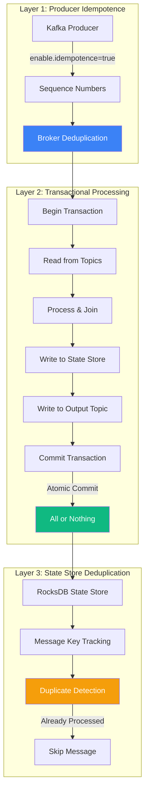
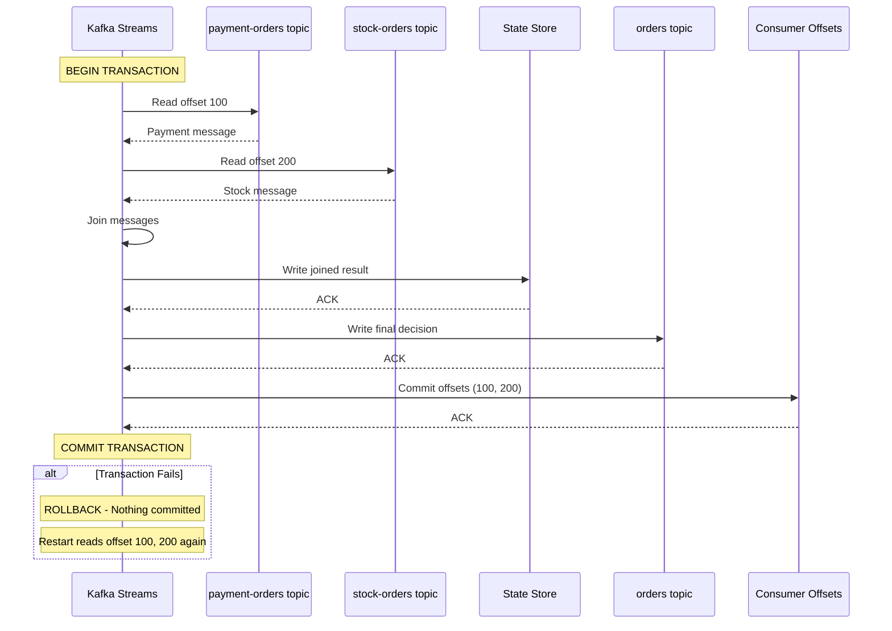
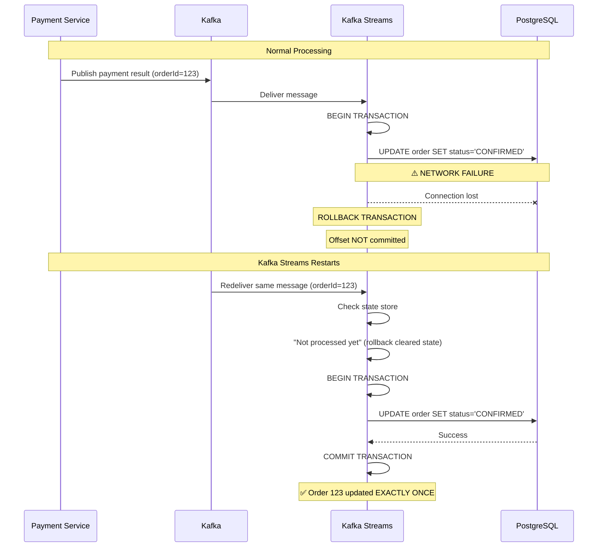
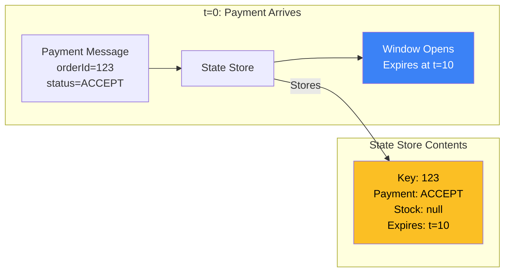
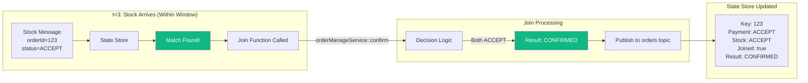
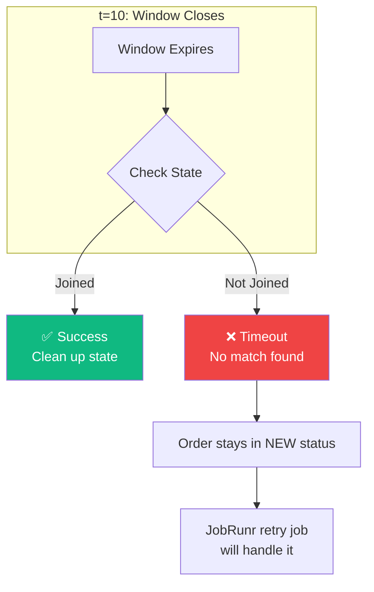
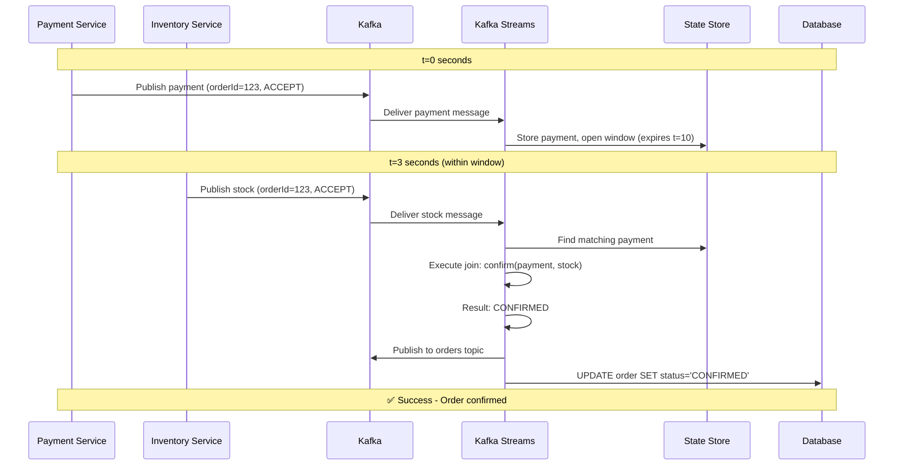
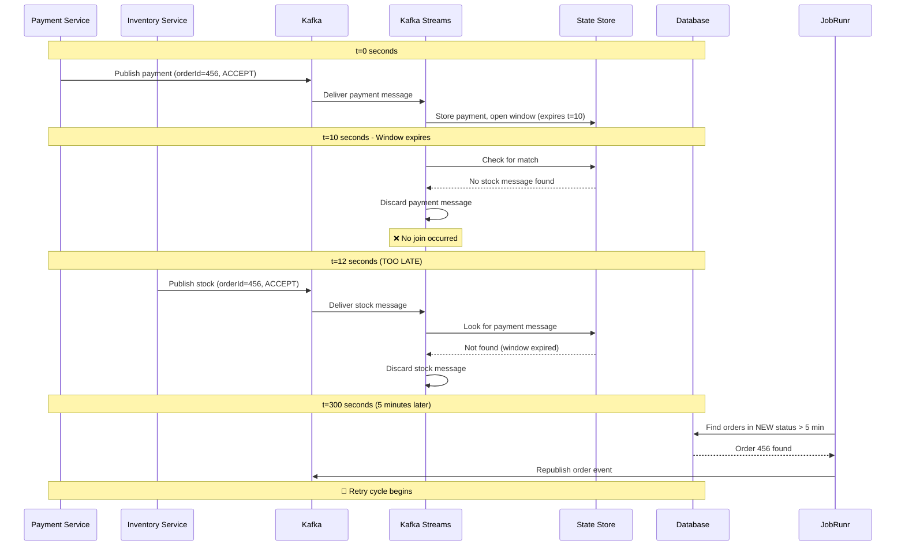
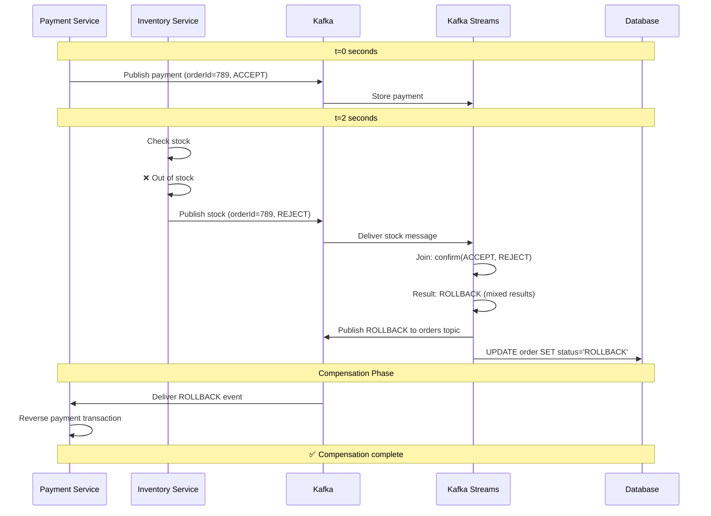

# 🔍 Saga Pattern Confusion Points - Detailed Clarification

## 1️⃣ Exactly-Once Processing - How It's Achieved

### ❓ The Question
"Under Saga Coordination Logic, it says **Exactly-Once: Guarantees no duplicate processing**. How is this achieved in detail?"

### ✅ The Answer

Exactly-once processing is achieved through **Kafka Streams' transactional processing** combined with **idempotent producers** and **state store deduplication**.

---

## 🔧 Technical Implementation

### Configuration in Code
**File:** `order-service/src/main/resources/application.yml`

```yaml
spring:
  kafka:
    streams:
      properties:
        processing.guarantee: exactly_once_v2  # ← KEY CONFIGURATION
        num.stream.threads: 2
        commit.interval.ms: 1000
        cache.max.bytes.buffering: 10485760
```

---

## 🎯 Three-Layer Exactly-Once Guarantee



---

## 📋 Detailed Breakdown

### **Layer 1: Producer Idempotence**

When Order Service publishes events to Kafka:

```java
// Automatic configuration by Spring Boot
@Bean
public ProducerFactory<Long, OrderDto> producerFactory() {
    Map<String, Object> config = new HashMap<>();
    config.put(ProducerConfig.ENABLE_IDEMPOTENCE_CONFIG, true);  // ← Automatic
    config.put(ProducerConfig.ACKS_CONFIG, "all");
    config.put(ProducerConfig.RETRIES_CONFIG, Integer.MAX_VALUE);
    return new DefaultKafkaProducerFactory<>(config);
}
```

**What happens:**
1. Each message gets a **sequence number** (0, 1, 2, 3...)
2. Kafka broker tracks sequence numbers per producer
3. If producer retries due to network failure, broker detects duplicate sequence number
4. Broker **silently discards** duplicate messages

**Example:**
```
Producer sends: Message #5 → Network timeout → Retry Message #5
Broker sees: "Already have #5, discarding duplicate"
Result: Message #5 appears ONCE in topic
```

---

### **Layer 2: Transactional Processing**

Kafka Streams wraps all operations in a transaction:

```java
// Conceptual view of what Kafka Streams does internally
BEGIN TRANSACTION
    1. Read payment-orders topic (offset 100)
    2. Read stock-orders topic (offset 200)
    3. Join messages in memory
    4. Write result to state store
    5. Write result to orders topic
    6. Commit consumer offsets (payment: 101, stock: 201)
COMMIT TRANSACTION
```

**Atomic Guarantee:**
- If ANY step fails → **entire transaction rolls back**
- Consumer offsets are NOT committed
- Next restart processes same messages again
- Output topic does NOT receive partial results

**Visual Flow:**



---

### **Layer 3: State Store Deduplication**

Kafka Streams maintains a **RocksDB state store** that tracks processed messages:

```java
// Internal state store structure (conceptual)
StateStore<Long, ProcessedMessage> {
    Key: orderId (e.g., 12345)
    Value: {
        paymentProcessed: true,
        stockProcessed: true,
        joinedAt: 2024-01-15T10:30:00Z,
        result: "CONFIRMED"
    }
}
```

**Deduplication Logic:**

```java
// Simplified view of what Kafka Streams does
public OrderDto processMessage(Long orderId, OrderDto message) {
    ProcessedMessage state = stateStore.get(orderId);
    
    if (state != null && state.isAlreadyProcessed(message)) {
        log.info("Duplicate detected for order {}, skipping", orderId);
        return state.getResult();  // Return cached result
    }
    
    // Process new message
    OrderDto result = processNewMessage(message);
    stateStore.put(orderId, new ProcessedMessage(result));
    return result;
}
```

---

## 🧪 Proof: Exactly-Once in Action

### Scenario: Network Failure During Processing



---

## 🎯 Summary: Exactly-Once Guarantee

| Component | Mechanism | Prevents |
|-----------|-----------|----------|
| **Idempotent Producer** | Sequence numbers | Duplicate messages in topics |
| **Transactional Processing** | Atomic commit | Partial processing |
| **State Store** | Message tracking | Reprocessing same message |
| **Offset Management** | Transactional commits | Skipping or duplicating messages |

**Result:** Even with failures, retries, and restarts → **each order is processed exactly once**.

---

---

## 2️⃣ The 10-Second Window - Deep Dive

### ❓ The Question
"What happens in the 10-second window? What is its use? What happens after the window? What could go wrong?"

### ✅ The Answer

The 10-second window is a **time-based join window** that determines how long Kafka Streams will wait to match payment and inventory responses for the same order.

---

## 🕐 Window Behavior Explained

### Configuration in Code
**File:** `KafkaStreamsConfig.java`

```java
paymentStream
    .join(
        stockStream,
        orderManageService::confirm,
        JoinWindows.ofTimeDifferenceWithNoGrace(Duration.ofSeconds(10)),  // ← THE WINDOW
        StreamJoined.with(Serdes.Long(), orderSerde, orderSerde)
    )
```

---

## 📊 Visual Timeline: What Happens in 10 Seconds

```mermaid
gantt
    title Order Processing Timeline (10-Second Window)
    dateFormat ss
    axisFormat %S sec
    
    section Order 123
    Payment arrives (t=0)     :milestone, m1, 00, 0s
    Window opens              :active, w1, 00, 10s
    Stock arrives (t=3)       :milestone, m2, 03, 0s
    Join happens              :crit, j1, 03, 1s
    Window closes (t=10)      :milestone, m3, 10, 0s
    
    section Order 456
    Payment arrives (t=0)     :milestone, m4, 00, 0s
    Window opens              :active, w2, 00, 10s
    Window closes (t=10)      :milestone, m5, 10, 0s
    Stock arrives (t=12) ❌   :milestone, m6, 12, 0s
```



---

## 🔄 Detailed Window Mechanics

### **Phase 1: First Message Arrives (t=0)**



**What happens:**
1. Payment message arrives with `orderId=123`
2. Kafka Streams stores it in **RocksDB state store**
3. Window timer starts: "Wait until t=10 for matching stock message"
4. No output yet - waiting for join partner

---

### **Phase 2: Second Message Arrives (t=3)**



**What happens:**
1. Stock message arrives with same `orderId=123`
2. Kafka Streams finds matching payment in state store
3. **Join function executes:** `orderManageService.confirm(payment, stock)`
4. Result published to `orders` topic
5. State store marked as "joined" - prevents duplicate joins

---

### **Phase 3: Window Expires (t=10)**



**What happens:**
1. Window timer reaches 10 seconds
2. Kafka Streams checks if join occurred
3. **If joined:** State cleaned up, transaction complete
4. **If not joined:** Partial message discarded, order stays in `NEW` status

---

## 🎬 Complete Scenarios

### ✅ Scenario 1: Happy Path (Both Arrive Within Window)



---

### ⚠️ Scenario 2: Late Arrival (After Window Closes)



---

### 🔥 Scenario 3: Partial Failure (One Service Fails)



---

## ⚠️ What Could Go Wrong?

### Problem 1: Window Too Short

```
Timeline:
t=0:  Payment arrives → Window opens
t=8:  Inventory service processing (slow database query)
t=10: Window closes ❌
t=11: Stock message arrives → TOO LATE

Result: Order stuck in NEW status, requires retry
```

**Solution:**
```java
// Increase window size for slow services
JoinWindows.ofTimeDifferenceWithNoGrace(Duration.ofSeconds(30))
```

---

### Problem 2: Message Ordering Issues

```
Scenario: Stock arrives BEFORE payment

t=0:  Stock arrives (orderId=123) → Window opens
t=3:  Payment arrives (orderId=123) → Join succeeds ✅

This works! Window is bidirectional.
```

**Kafka Streams handles this automatically** - window works in both directions.

---

### Problem 3: Service Restart During Window

```
t=0:  Payment arrives → Stored in state store
t=5:  Kafka Streams crashes 💥
t=6:  Kafka Streams restarts
t=7:  Stock arrives

Question: Will join still work?
Answer: YES ✅ - State store is persisted to disk (RocksDB)
```

**State Store Persistence:**
```
/tmp/kafka-streams/order-service/
├── payment-orders-store/
│   └── 0_0/
│       ├── 000001.sst  ← RocksDB files (persisted)
│       └── MANIFEST
└── stock-orders-store/
    └── 0_0/
        └── 000001.sst
```

---

### Problem 4: Clock Skew Between Services

```
Payment Service clock: 10:00:00
Inventory Service clock: 10:00:15 (15 seconds ahead)

t=0 (Payment):  Message timestamp: 10:00:00
t=3 (Stock):    Message timestamp: 10:00:18

Kafka Streams sees: 18-second difference → Outside 10-second window ❌
```

**Solution:** Use Kafka broker timestamps (not service timestamps)
```java
// Kafka Streams uses broker timestamp by default
TimestampExtractor.FAIL_ON_INVALID_TIMESTAMP
```

---

## 🎯 Window Configuration Best Practices

### Choosing the Right Window Size

| Service Latency | Recommended Window | Rationale |
|-----------------|-------------------|-----------|
| < 100ms | 5 seconds | Fast services, tight SLA |
| 100ms - 1s | 10 seconds | **Current setting** - balanced |
| 1s - 5s | 30 seconds | Slow database queries |
| > 5s | 60 seconds | External API calls |

### Current Configuration Analysis

```java
// Current: 10 seconds with NO grace period
JoinWindows.ofTimeDifferenceWithNoGrace(Duration.ofSeconds(10))

// Breakdown:
// - Window size: 10 seconds
// - Grace period: 0 seconds (no late arrivals accepted)
// - Bidirectional: Yes (payment→stock or stock→payment)
```

**Recommendation:** Add grace period for late messages
```java
// Better configuration
JoinWindows.ofTimeDifferenceAndGrace(
    Duration.ofSeconds(10),  // Main window
    Duration.ofSeconds(5)    // Grace period for late arrivals
)
```

---

## 📊 Monitoring Window Effectiveness

### Key Metrics to Track

```java
// Add these metrics to OrderManageService
@Component
public class SagaMetrics {
    private final MeterRegistry registry;
    
    public void recordJoinLatency(Duration latency) {
        Timer.builder("saga.join.latency")
            .description("Time between first and second message arrival")
            .register(registry)
            .record(latency);
    }
    
    public void recordWindowTimeout() {
        Counter.builder("saga.window.timeout")
            .description("Number of joins that timed out")
            .register(registry)
            .increment();
    }
}
```

### Prometheus Queries

```promql
# Average join latency
avg(saga_join_latency_seconds)

# Window timeout rate
rate(saga_window_timeout_total[5m])

# If timeout rate > 1% → increase window size
```

---

## 🎓 Summary

### Exactly-Once Processing
✅ Achieved through 3 layers:
1. **Idempotent producers** - prevent duplicate messages
2. **Transactional processing** - atomic commits
3. **State store deduplication** - track processed messages

### 10-Second Window
✅ Purpose: Wait for both payment and stock responses
✅ Bidirectional: Works regardless of arrival order
✅ Persisted: Survives restarts via RocksDB
⚠️ Risk: Late arrivals cause timeouts → retry needed

### Key Takeaway
The window is a **trade-off**:
- **Too short** → More timeouts, more retries
- **Too long** → Slower transaction completion
- **Current 10s** → Balanced for typical microservice latency
