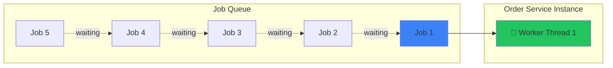
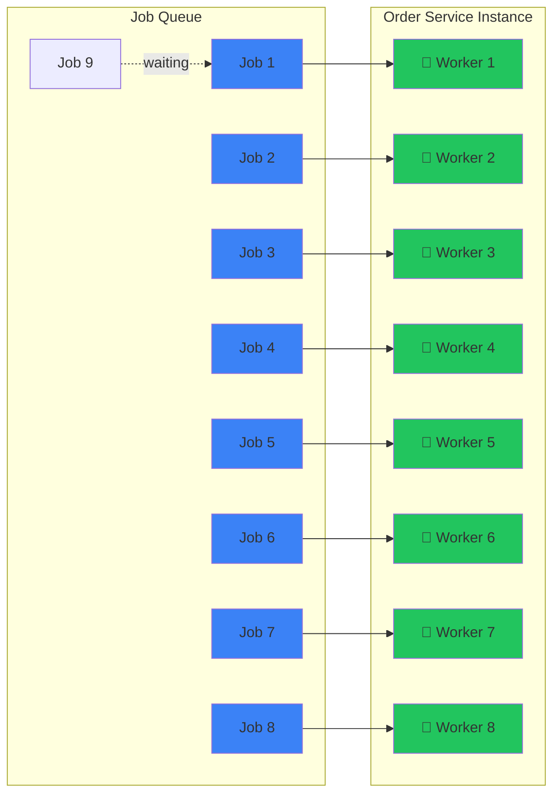
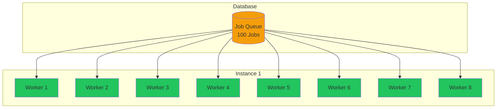
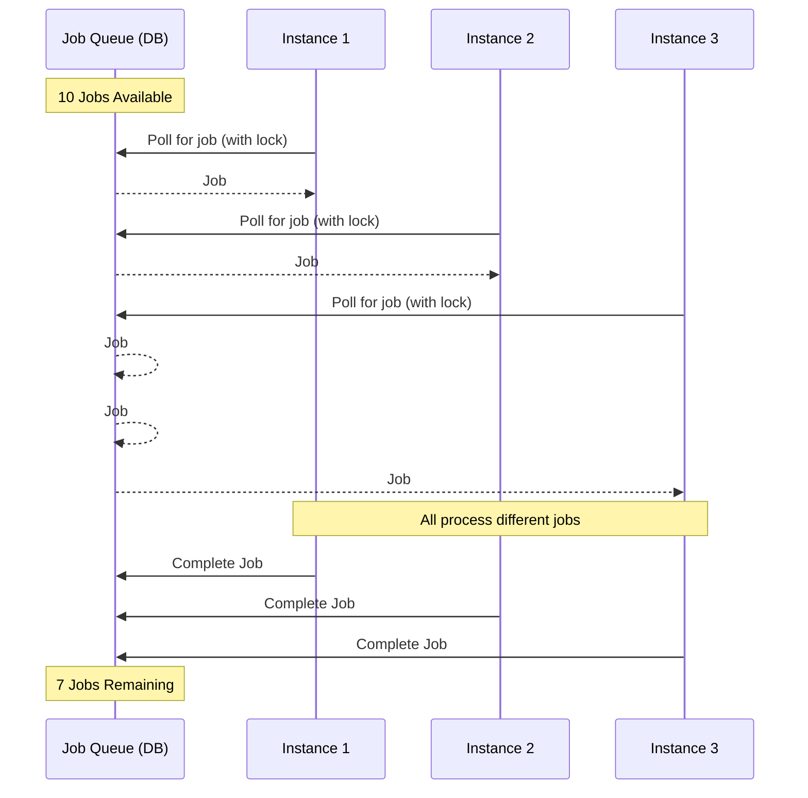
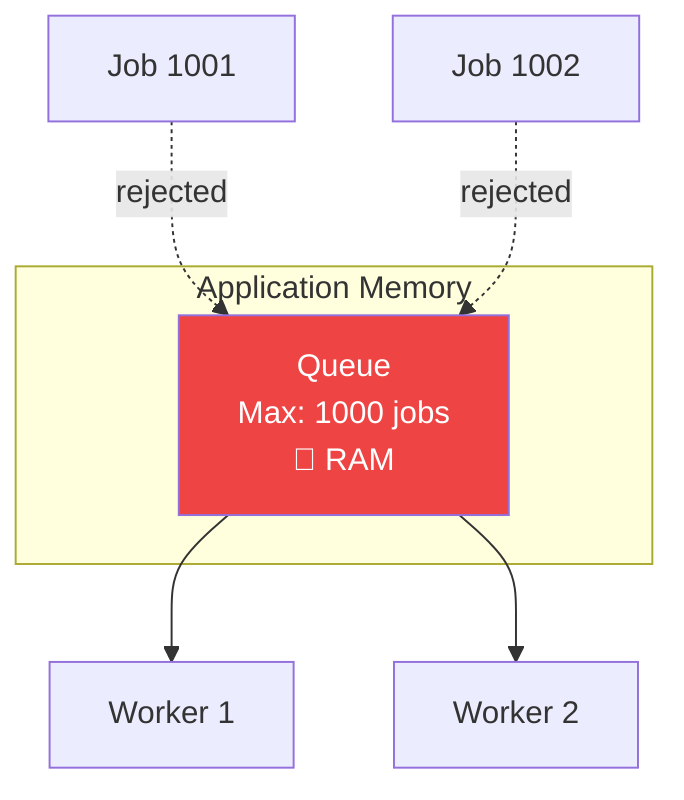
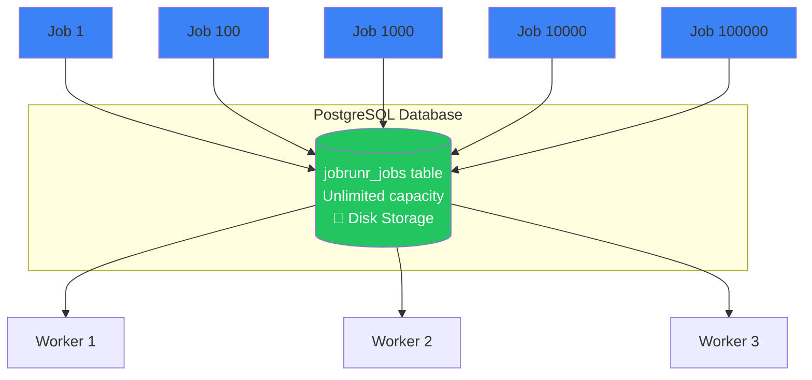
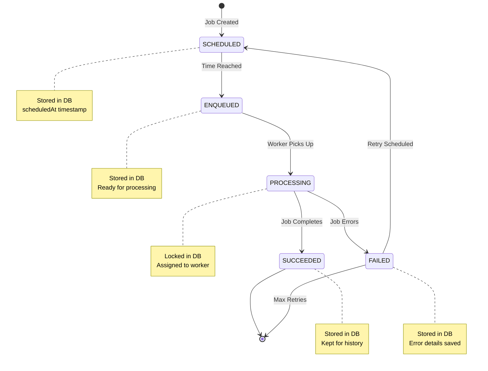
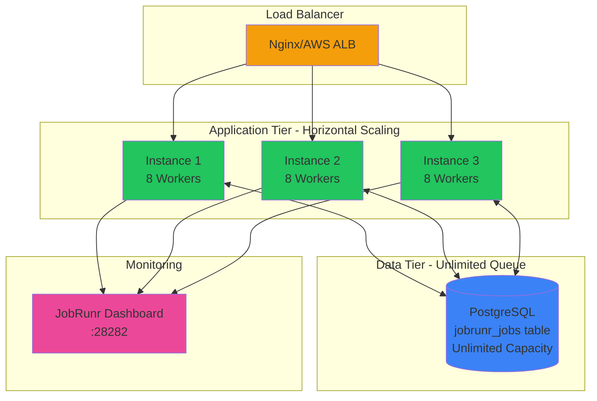

# 🎯 JobRunr Scalability Concepts - Visual Guide

## 1️⃣ Worker Count: 8 Threads

### What is worker-count?
The number of **concurrent threads** that can process jobs simultaneously within a single application instance.

### Visual Representation

#### ❌ worker-count: 1 (Sequential Processing)

**Result:** Jobs processed one at a time. If Job 1 takes 10 seconds, Job 5 waits 40+ seconds.

---

#### ✅ worker-count: 8 (Parallel Processing)

**Result:** 8 jobs processed simultaneously. Job 9 only waits for one worker to become free (~10 seconds max).

### 📊 Performance Comparison

| Scenario | Worker Count | 100 Jobs (5s each) | Total Time |
|----------|--------------|-------------------|------------|
| Sequential | 1 | 100 × 5s | **500 seconds** (8.3 min) |
| Parallel | 8 | (100 ÷ 8) × 5s | **~65 seconds** (1 min) |

**Benefit:** **7.7x faster** processing with 8 workers!

### 🎯 Real-World Example: Retry Stuck Orders

```
Scenario: 80 stuck orders need retry at 5-minute interval

worker-count: 1
├─ Order 1  [████████] 5s
├─ Order 2  [████████] 5s
├─ Order 3  [████████] 5s
└─ ... (80 orders × 5s = 400 seconds = 6.6 minutes)
❌ Problem: Takes longer than the 5-minute cron interval!

worker-count: 8
├─ Orders 1-8   [████████] 5s (parallel)
├─ Orders 9-16  [████████] 5s (parallel)
├─ Orders 17-24 [████████] 5s (parallel)
└─ ... (80 ÷ 8 = 10 batches × 5s = 50 seconds)
✅ Solution: Completes in under 1 minute!
```

---

## 2️⃣ Horizontal Scaling: Multiple Instances Share Job Processing

### What is Horizontal Scaling?
Running **multiple application instances** that share the same job queue from the database.

### Visual Representation

#### Single Instance (Vertical Scaling)

**Capacity:** 8 concurrent jobs

---

#### Multiple Instances (Horizontal Scaling)

```mermaid
graph TB
    subgraph "Shared Database"
        Q[(Job Queue<br/>100 Jobs<br/>🔒 Distributed Lock)]
    end
    
    subgraph "Instance 1 - Server A"
        W1A[Worker 1]
        W2A[Worker 2]
        W3A[Worker 3]
        W4A[Worker 4]
        W5A[Worker 5]
        W6A[Worker 6]
        W7A[Worker 7]
        W8A[Worker 8]
    end
    
    subgraph "Instance 2 - Server B"
        W1B[Worker 1]
        W2B[Worker 2]
        W3B[Worker 3]
        W4B[Worker 4]
        W5B[Worker 5]
        W6B[Worker 6]
        W7B[Worker 7]
        W8B[Worker 8]
    end
    
    subgraph "Instance 3 - Server C"
        W1C[Worker 1]
        W2C[Worker 2]
        W3C[Worker 3]
        W4C[Worker 4]
        W5C[Worker 5]
        W6C[Worker 6]
        W7C[Worker 7]
        W8C[Worker 8]
    end
    
    Q --> W1A
    Q --> W2A
    Q --> W3A
    Q --> W4A
    Q --> W5A
    Q --> W6A
    Q --> W7A
    Q --> W8A
    
    Q --> W1B
    Q --> W2B
    Q --> W3B
    Q --> W4B
    Q --> W5B
    Q --> W6B
    Q --> W7B
    Q --> W8B
    
    Q --> W1C
    Q --> W2C
    Q --> W3C
    Q --> W4C
    Q --> W5C
    Q --> W6C
    Q --> W7C
    Q --> W8C
    
    style Q fill:#f59e0b
    style W1A fill:#22c55e
    style W2A fill:#22c55e
    style W3A fill:#22c55e
    style W4A fill:#22c55e
    style W5A fill:#22c55e
    style W6A fill:#22c55e
    style W7A fill:#22c55e
    style W8A fill:#22c55e
    style W1B fill:#3b82f6
    style W2B fill:#3b82f6
    style W3B fill:#3b82f6
    style W4B fill:#3b82f6
    style W5B fill:#3b82f6
    style W6B fill:#3b82f6
    style W7B fill:#3b82f6
    style W8B fill:#3b82f6
    style W1C fill:#ec4899
    style W2C fill:#ec4899
    style W3C fill:#ec4899
    style W4C fill:#ec4899
    style W5C fill:#ec4899
    style W6C fill:#ec4899
    style W7C fill:#ec4899
    style W8C fill:#ec4899
```

**Capacity:** 24 concurrent jobs (8 × 3 instances)

### 🔒 How Job Distribution Works



### 📊 Scaling Comparison

| Setup | Instances | Workers/Instance | Total Workers | 1000 Jobs (5s each) |
|-------|-----------|------------------|---------------|---------------------|
| Small | 1 | 8 | 8 | ~625 seconds (10 min) |
| Medium | 2 | 8 | 16 | ~312 seconds (5 min) |
| Large | 4 | 8 | 32 | ~156 seconds (2.6 min) |
| X-Large | 8 | 8 | 64 | ~78 seconds (1.3 min) |

**Benefit:** Linear scalability - double instances = half the time!

### 🎯 Real-World Scenario: Black Friday Sale

```
Normal Day:
├─ 1 instance × 8 workers = 8 concurrent jobs
└─ Handles 100 orders/minute ✅

Black Friday:
├─ 1000 orders/minute (10x load)
├─ Scale to 10 instances × 8 workers = 80 concurrent jobs
└─ Handles 1000 orders/minute ✅

Auto-scaling:
├─ Monitor queue length
├─ If queue > 100 jobs → Add instance
└─ If queue < 20 jobs → Remove instance
```

---

## 3️⃣ Queue Capacity: Unlimited (Database-Backed)

### What is Database-Backed Queue?
Jobs are stored in **PostgreSQL tables**, not in-memory, providing unlimited capacity.

### ✅ Our Configuration
This project uses **PostgreSQL-backed queues** (not in-memory).

**How it's configured:**
```xml
<!-- pom.xml -->
<dependency>
    <groupId>org.jobrunr</groupId>
    <artifactId>jobrunr-spring-boot-3-starter</artifactId>
    <version>8.1.0</version>
</dependency>

<!-- PostgreSQL datasource -->
<dependency>
    <groupId>org.postgresql</groupId>
    <artifactId>postgresql</artifactId>
</dependency>
```

```yaml
# application.yml
spring:
  datasource:
    url: jdbc:postgresql://localhost:5432/appdb
    username: appuser
    password: secret

jobrunr:
  job-scheduler:
    enabled: true
  background-job-server:
    enabled: true
  dashboard:
    enabled: true
    port: 28282
  # No explicit storage config needed!
  # JobRunr auto-detects PostgreSQL datasource
```

**JobRunr automatically:**
- Detects the PostgreSQL datasource
- Creates required tables on startup
- Stores all jobs in the database

### Visual Comparison

#### ❌ In-Memory Queue (Limited)

**Problem:** 
- ❌ Queue full = jobs rejected
- ❌ App restart = all jobs lost
- ❌ Limited by RAM

---

#### ✅ Database-Backed Queue (Unlimited)

**Benefits:**
- ✅ No job rejection
- ✅ Survives app restarts
- ✅ Limited only by disk space

### 📊 Database Schema

**Verify PostgreSQL tables exist:**
```sql
-- Check JobRunr tables
SELECT tablename 
FROM pg_tables 
WHERE tablename LIKE 'jobrunr%';

/*
Expected output:
  tablename
  --------------------------
  jobrunr_jobs
  jobrunr_recurring_jobs
  jobrunr_backgroundjobservers
  jobrunr_metadata
*/
```

**Main table structure:**
```sql
-- JobRunr stores jobs in PostgreSQL
CREATE TABLE jobrunr_jobs (
    id UUID PRIMARY KEY,
    version INT,
    jobSignature VARCHAR(512),
    jobName VARCHAR(128),
    jobDetails TEXT,          -- Serialized job data
    state VARCHAR(36),        -- ENQUEUED, PROCESSING, SUCCEEDED, FAILED
    createdAt TIMESTAMP,
    updatedAt TIMESTAMP,
    scheduledAt TIMESTAMP
);

-- Example data
SELECT id, jobName, state, createdAt 
FROM jobrunr_jobs 
WHERE state = 'ENQUEUED'
ORDER BY createdAt;

/*
id                                   | jobName              | state     | createdAt
-------------------------------------|----------------------|-----------|-------------------
a1b2c3d4-e5f6-7890-abcd-ef1234567890 | reProcessNewOrders   | ENQUEUED  | 2024-01-15 10:00:00
b2c3d4e5-f6a7-8901-bcde-f12345678901 | reProcessNewOrders   | ENQUEUED  | 2024-01-15 10:05:00
c3d4e5f6-a7b8-9012-cdef-123456789012 | reProcessNewOrders   | ENQUEUED  | 2024-01-15 10:10:00
... (millions of rows possible)
*/
```

### 🎯 Capacity Comparison

| Queue Type | Max Capacity | Persistence | Restart Safe |
|------------|--------------|-------------|--------------|
| In-Memory (Redis) | ~10,000 jobs | ❌ RAM only | ❌ Lost on restart |
| In-Memory (RabbitMQ) | ~100,000 jobs | ⚠️ Optional | ⚠️ Depends on config |
| Database (PostgreSQL) | **Unlimited** | ✅ Disk | ✅ Fully persistent |

### 🔄 Job Lifecycle in Database



### 🎯 Real-World Example: System Crash Recovery

```
Scenario: 10,000 jobs in queue, then server crashes

In-Memory Queue:
├─ Before crash: 10,000 jobs in RAM
├─ Server crashes 💥
├─ After restart: 0 jobs
└─ ❌ Result: 10,000 jobs LOST

Database-Backed Queue:
├─ Before crash: 10,000 jobs in PostgreSQL
├─ Server crashes 💥
├─ After restart: Query database
├─ Found: 10,000 jobs (state = ENQUEUED)
└─ ✅ Result: Resume processing from where it stopped
```

---

## 🎯 Combined Power: All Three Together

### Optimal Configuration
```yaml
jobrunr:
  background-job-server:
    enabled: true
    worker-count: 8              # 8 parallel threads per instance
  database:
    type: postgresql             # Unlimited, persistent queue
```

### Deployment Strategy
```
Production Setup:
├─ 3 instances (horizontal scaling)
├─ 8 workers each (worker-count: 8)
├─ PostgreSQL queue (unlimited capacity)
└─ Total capacity: 24 concurrent jobs + unlimited queue

Load Handling:
├─ Normal: 1 instance (8 workers) = 100 jobs/min
├─ Peak: 3 instances (24 workers) = 300 jobs/min
├─ Extreme: 10 instances (80 workers) = 1000 jobs/min
└─ Queue: Millions of jobs waiting in database
```

### 📊 Complete Architecture



---

## 📈 Performance Summary

| Metric | Single Worker | 8 Workers | 3 Instances × 8 Workers |
|--------|---------------|-----------|-------------------------|
| Concurrent Jobs | 1 | 8 | 24 |
| 1000 Jobs (5s each) | 83 min | 10 min | 3.5 min |
| Queue Capacity | Unlimited (DB) | Unlimited (DB) | Unlimited (DB) |
| Fault Tolerance | ❌ Single point | ❌ Single point | ✅ Distributed |
| Restart Safety | ✅ DB persisted | ✅ DB persisted | ✅ DB persisted |

**Key Takeaway:** 
- **worker-count: 8** = 8x faster processing per instance
- **Horizontal scaling** = Linear scalability (2x instances = 2x throughput)
- **Database-backed** = Unlimited capacity + crash recovery
