# 🌐 Kafka Streams Distributed Architecture - Multi-Instance Deep Dive

## 1. 📅 Commit Interval Explained

### What is Commit Interval?
**Commit Interval** is the frequency at which Kafka Streams flushes dirty cache entries to persistent storage and commits consumer offsets.

```java
// From application.yml
spring:
  kafka:
    streams:
      properties:
        commit:
          interval:
            ms: 1000  # Commit every 1 second
```

### What Commit Interval Does:

```mermaid
sequenceDiagram
    participant Timer as ⏰ Commit Timer
    participant Cache as 🚀 Cache Layer
    participant RocksDB as 🗄️ RocksDB
    participant Changelog as 📝 Changelog
    participant Kafka as 📡 Kafka Broker
    
    Note over Timer, Kafka: 🔄 Every 1000ms (Commit Interval)
    
    Timer->>Cache: Trigger commit process
    Cache->>Cache: Scan for dirty entries
    Note over Cache: Found 150 dirty entries
    
    Cache->>RocksDB: Flush dirty entries to disk
    RocksDB->>Changelog: Send state changes
    Changelog->>Kafka: Publish changelog messages
    
    Cache->>Kafka: Commit consumer offsets
    Note over Kafka: Mark messages as processed<br/>Offset: orders-0:1001<br/>Offset: payment-orders-1:502
    
    Kafka-->>Cache: ✅ Commit successful
    Cache->>Cache: Clear dirty flags
    
    Note over Timer: ⏰ Reset timer for next 1000ms
```



### Commit Interval Impact:
- **Durability**: How often data is persisted
- **Performance**: Batches writes for efficiency  
- **Recovery**: Determines maximum data loss on failure
- **Offset Management**: Controls when Kafka marks messages as processed

## 2. 🔄 Cache Write Strategy to RocksDB

### Write Strategy: **Write-Through with Batching**


### Write Strategy Details:

#### Immediate Cache Write (Synchronous)
```java
// When stream processing updates state
public void put(Long key, OrderDto value) {
    // 1. Write to cache immediately
    cache.put(key, value);
    
    // 2. Mark as dirty for later flush
    cacheEntry.setDirty(true);
    cacheEntry.setLastModified(System.currentTimeMillis());
    
    // 3. Return immediately (no disk I/O)
    return; // Fast response ~1ms
}
```

#### Batched RocksDB Write (Asynchronous)
```java
// Every commit interval (1000ms)
public void flushDirtyEntries() {
    List<CacheEntry> dirtyEntries = cache.getDirtyEntries();
    
    // Create batch for efficiency
    WriteBatch batch = new WriteBatch();
    for (CacheEntry entry : dirtyEntries) {
        batch.put(entry.getKey(), entry.getValue());
    }
    
    // Single disk write operation
    rocksDB.write(writeOptions, batch); // ~15ms for 1000 entries
    
    // Clear dirty flags
    dirtyEntries.forEach(entry -> entry.setDirty(false));
}
```

## 3. 🔄 Write Order: Cache → RocksDB → Changelog

### Sequential Write Process (NOT in one go):

```mermaid
sequenceDiagram
    participant App as 🛍️ Application
    participant Cache as 🚀 Cache
    participant RocksDB as 🗄️ RocksDB
    participant Changelog as 📝 Changelog
    participant Kafka as 📡 Kafka
    
    Note over App, Kafka: ⚡ Step 1: Immediate Cache Write
    App->>Cache: put(1001, orderDto)
    Cache->>Cache: Store in memory + mark dirty
    Cache-->>App: ✅ Success (1ms)
    
    Note over App, Kafka: ⏰ Step 2: Commit Interval (1000ms later)
    Cache->>Cache: Scan dirty entries
    Cache->>RocksDB: Batch write (150 entries)
    Note over RocksDB: Write to disk<br/>Time: ~15ms
    RocksDB-->>Cache: ✅ Write complete
    
    Note over App, Kafka: 📝 Step 3: Changelog Publishing
    RocksDB->>Changelog: Generate changelog entries
    Changelog->>Kafka: Publish to changelog topic
    Note over Kafka: Topic: orders-store-changelog<br/>Messages: 150<br/>Time: ~25ms
    Kafka-->>Changelog: ✅ Ack received
    
    Note over App, Kafka: 🏁 Step 4: Commit Complete
    Cache->>Cache: Clear dirty flags
    Cache->>Kafka: Commit consumer offsets
    Kafka-->>Cache: ✅ Offsets committed
```



### Write Guarantees:
1. **Cache**: Immediate consistency (1ms)
2. **RocksDB**: Eventual consistency (within 1000ms)
3. **Changelog**: Eventual durability (within 1025ms)
4. **Consumer Offsets**: Committed after all writes succeed

## 4. 🌐 Multi-Instance Distributed Environment

### ⚠️ **Critical Architecture Clarification**

**Kafka Partitions ≠ Microservice Pods**


### 🏗️ **Component Location Breakdown**

| Component | Location | Description |
|-----------|----------|-------------|
| 📡 **Kafka Partitions** | **External Kafka Brokers** | Stored on separate Kafka cluster infrastructure |
| 🖥️ **Microservice Pods** | **Kubernetes/Docker** | Contains Order Service application instances |
| 💾 **Cache** | **Inside Pod JVM Heap** | Local to each microservice instance |
| 🗄️ **RocksDB** | **Pod Local Filesystem** | Persistent storage within each pod |
| 🌐 **Network Communication** | **TCP/IP** | Pods connect to Kafka brokers over network |

### Architecture Clarifications:

**🖥️ Pod = Complete Order Service Microservice Instance**
- Each pod contains the entire order-service application
- Includes: REST API, Kafka Streams processing, local state stores
- Runs in separate JVM/container (Docker/Kubernetes pod)

**💾 Cache Location: Inside Each Microservice Instance**
- Cache lives in the **heap memory** of each order-service JVM
- **NOT** in external cluster (Redis/Hazelcast)
- Each instance has its **own independent cache**

**🗄️ RocksDB Location: Local Disk of Each Instance**
- RocksDB files stored on **local filesystem** of each pod
- **NOT** in external cluster
- Each instance manages its own RocksDB databases

**📡 Kafka Partitions: External Broker Infrastructure**
- Partitions are stored on **separate Kafka broker servers**
- **NOT** inside microservice pods
- Pods connect to brokers over **network** to consume messages

### Complete Distributed Architecture:


### 🏗️ Physical Architecture Breakdown:

#### 🖥️ **What Each Pod Contains:**
```yaml
Kubernetes Pod 1 (order-service-1):
  Container: order-service:latest
  JVM Process:
    - OrderController (REST API)
    - KafkaStreamsConfig (Stream processing)
    - OrderService (Business logic)
    - In-Memory Cache (10MB heap)
    - RocksDB files (local disk)
  Assigned Kafka Partitions: [0, 1, 3, 4]
  Memory: 1GB
  CPU: 2 cores
  Disk: 20GB (for RocksDB)
```

#### 💾 **Cache Distribution (All In-Memory):**
```java
// Each microservice instance has its own cache
Pod 1 JVM Heap:
├── Cache Partition 0: 2.5MB (orders 1001, 1007, 1013...)
├── Cache Partition 1: 2.1MB (orders 1002, 1008, 1014...)
├── Cache Partition 3: 2.8MB (orders 1004, 1010, 1016...)
└── Cache Partition 4: 2.6MB (orders 1005, 1011, 1017...)

Pod 2 JVM Heap:
├── Cache Partition 2: 4.2MB (orders 1003, 1009, 1015...)
└── Cache Partition 5: 3.8MB (orders 1006, 1012, 1018...)
```

#### 🗄️ **RocksDB Distribution (All Local Disk):**
```bash
# Pod 1 filesystem
/tmp/kafka-streams/order-service/
├── 0_0/rocksdb/orders-store/  # Partition 0 data
├── 0_1/rocksdb/orders-store/  # Partition 1 data
├── 0_3/rocksdb/orders-store/  # Partition 3 data
└── 0_4/rocksdb/orders-store/  # Partition 4 data

# Pod 2 filesystem  
/tmp/kafka-streams/order-service/
├── 0_2/rocksdb/orders-store/  # Partition 2 data
└── 0_5/rocksdb/orders-store/  # Partition 5 data
```

### 🔍 **Key Architecture Points:**

1. **🖥️ Pod = Complete Microservice**
   - Each pod runs the full order-service application
   - Includes REST API, Kafka Streams, and local storage
   - Independent JVM process with its own memory/disk

2. **💾 Cache = JVM Heap Memory**
   - Cache lives **inside** each microservice instance
   - **NOT** external cache cluster (Redis/Hazelcast)
   - Each instance caches only its assigned partitions

3. **🗄️ RocksDB = Local Filesystem**
   - RocksDB files stored on **local disk** of each pod
   - **NOT** shared database cluster
   - Each instance manages its own RocksDB databases

4. **📡 Kafka = External Shared Infrastructure**
   - Kafka cluster is **separate** from microservice pods
   - Provides coordination and durability
   - Changelog topics enable state recovery

### Distributed Data Flow Example:

```mermaid
sequenceDiagram
    participant Client1 as 🛒 Client 1
    participant LB as ⚖️ Load Balancer
    participant Pod1 as 🖥️ Pod 1 (P0,P1,P3,P4)
    participant Pod2 as 🖥️ Pod 2 (P2,P5)
    participant Kafka as 📡 Kafka Cluster
    participant PaymentSvc as 💳 Payment Service
    participant InventorySvc as 📦 Inventory Service
    
    Note over Client1, InventorySvc: 🔄 Order 1001 Processing (Hash → Partition 0)
    
    Client1->>LB: POST /orders (orderId will be 1001)
    LB->>Pod1: Route to Pod 1 (has P0)
    Pod1->>Pod1: Create order, assign ID 1001
    Pod1->>Pod1: Cache P0: put(1001, orderDto)
    Pod1->>Kafka: Publish to orders-0
    Pod1-->>LB: 201 Created
    LB-->>Client1: Order 1001 created
    
    Note over Client1, InventorySvc: 📡 External Service Processing
    
    Kafka->>PaymentSvc: Order 1001 from orders-0
    PaymentSvc->>PaymentSvc: Process payment
    PaymentSvc->>Kafka: Publish to payment-orders-0 (ACCEPT)
    
    Kafka->>InventorySvc: Order 1001 from orders-0  
    InventorySvc->>InventorySvc: Reserve stock
    InventorySvc->>Kafka: Publish to stock-orders-0 (ACCEPT)
    
    Note over Client1, InventorySvc: 🌊 Stream Processing (Pod 1 handles P0)
    
    Kafka->>Pod1: Payment event from payment-orders-0
    Kafka->>Pod1: Stock event from stock-orders-0
    Pod1->>Pod1: Join events in 10s window
    Pod1->>Pod1: Business logic: ACCEPT + ACCEPT = CONFIRMED
    Pod1->>Pod1: Cache P0: put(1001, confirmedOrder) [DIRTY]
    Pod1->>Kafka: Publish final result to orders-0
    
    Note over Client1, InventorySvc: ⏰ Commit Interval (1000ms later)
    
    Pod1->>Pod1: Scan Cache P0 for dirty entries
    Pod1->>Pod1: RocksDB P0: batch write [1001, ...]
    Pod1->>Kafka: Publish to orders-store-changelog-0
    Pod1->>Pod1: Clear dirty flags in Cache P0
    Pod1->>Kafka: Commit consumer offsets for P0
```



### Partition Distribution Strategy:

```yaml
# 6 partitions across 2 microservice instances
Order Service Instance 1 (Pod 1):
  Hardware: 4 cores, 1GB RAM, 20GB disk
  Kafka Partitions: 0, 1, 3, 4
  Stream Threads:
    - Thread 1: Handles P0, P3
    - Thread 2: Handles P1, P4
  Local Storage:
    - Cache: 10MB JVM heap (partitions 0,1,3,4)
    - RocksDB: Local disk (partitions 0,1,3,4)
  Load: 67% (4/6 partitions)

Order Service Instance 2 (Pod 2):
  Hardware: 2 cores, 1GB RAM, 20GB disk
  Kafka Partitions: 2, 5
  Stream Threads:
    - Thread 1: Handles P2, P5
  Local Storage:
    - Cache: 10MB JVM heap (partitions 2,5)
    - RocksDB: Local disk (partitions 2,5)
  Load: 33% (2/6 partitions)

# Order routing examples:
orderId: 1001 → hash % 6 = 1 → Partition 1 → Pod 1 (Cache P1 + RocksDB P1)
orderId: 1002 → hash % 6 = 2 → Partition 2 → Pod 2 (Cache P2 + RocksDB P2)
orderId: 1003 → hash % 6 = 3 → Partition 3 → Pod 1 (Cache P3 + RocksDB P3)
```

### Instance Failure & Recovery:

```mermaid
sequenceDiagram
    participant Pod1 as 🖥️ Pod 1 (P0,P1,P3,P4)
    participant Pod2 as 🖥️ Pod 2 (P2,P5)
    participant Pod3 as 🖥️ Pod 3 (New)
    participant Kafka as 📡 Kafka Cluster
    
    Note over Pod1, Kafka: 💥 Pod 1 Crashes
    
    Pod1->>Pod1: ❌ Instance failure
    Note over Pod1: Partitions P0,P1,P3,P4 unassigned
    
    Kafka->>Kafka: Detect consumer group rebalance
    Kafka->>Pod2: Reassign partitions
    Note over Pod2: Now handles: P0,P1,P2,P3,P4,P5
    
    Pod2->>Pod2: Initialize state stores for P0,P1,P3,P4
    Pod2->>Kafka: Read changelog topics for recovery
    
    loop For each partition (P0,P1,P3,P4)
        Kafka->>Pod2: Replay changelog messages
        Pod2->>Pod2: Rebuild RocksDB from changelog
        Pod2->>Pod2: Initialize empty cache
    end
    
    Note over Pod2: ✅ Recovery complete, processing resumed
    
    Note over Pod1, Kafka: 🚀 Pod 3 Joins (Scale Up)
    
    Pod3->>Kafka: Join consumer group
    Kafka->>Kafka: Trigger rebalance
    Kafka->>Pod2: Release partitions P3,P4
    Kafka->>Pod3: Assign partitions P3,P4
    
    Pod3->>Kafka: Read changelog for P3,P4
    Pod3->>Pod3: Rebuild state stores
    
    Note over Pod2, Pod3: ✅ Load balanced:<br/>Pod2: P0,P1,P2,P5<br/>Pod3: P3,P4
```



## Key Insights:

### 1. Commit Interval Purpose:
- **Batching**: Groups writes for efficiency
- **Durability**: Controls data loss window  
- **Performance**: Balances speed vs. safety
- **Offset Management**: Ensures exactly-once processing

### 2. Write Strategy Benefits:
- **Fast Reads**: Cache provides sub-millisecond access
- **Efficient Writes**: Batching reduces disk I/O
- **Durability**: Changelog enables recovery
- **Consistency**: Sequential write order ensures correctness

### 3. Distributed Characteristics:
- **Partition Affinity**: Each instance owns specific partitions
- **Local State**: No cross-instance state sharing
- **Automatic Rebalancing**: Handles failures and scaling
- **Changelog Recovery**: Enables stateful processing across restarts