# 🏗️ Kafka Streams State Store Architecture Deep Dive

## 1. State Store Partition Architecture with Data Examples

### How Partitions Are Decided


### Partition Assignment Logic

```java
// Kafka's default partitioner for Long keys (orderId)
public int partition(Long orderId, int numPartitions) {
    return Math.abs(orderId.hashCode()) % numPartitions;
}

// Examples:
// orderId: 1001 → hash: 1001 → 1001 % 3 = 2 → Partition 2
// orderId: 1002 → hash: 1002 → 1002 % 3 = 0 → Partition 0  
// orderId: 1003 → hash: 1003 → 1003 % 3 = 1 → Partition 1
```

### Sample Data in Each Partition

#### Cache Partition 0 (Orders ending in 1, 4, 7...)
```json
{
  "partition": 0,
  "cacheSize": "2621440", // 2.5MB
  "entries": {
    "1001": {
      "orderId": 1001,
      "customerId": 5001,
      "status": "CONFIRMED",
      "totalAmount": 299.99,
      "lastModified": "2024-01-15T10:30:00Z",
      "dirty": false,
      "accessCount": 15
    },
    "1004": {
      "orderId": 1004,
      "customerId": 5004,
      "status": "NEW", 
      "totalAmount": 1299.99,
      "lastModified": "2024-01-15T10:35:00Z",
      "dirty": true,
      "accessCount": 2
    },
    "1007": {
      "orderId": 1007,
      "customerId": 5007,
      "status": "PROCESSING",
      "totalAmount": 599.99,
      "lastModified": "2024-01-15T10:32:00Z",
      "dirty": false,
      "accessCount": 8
    }
  }
}
```

#### RocksDB Partition 1 (Persistent storage)
```
Key-Value Pairs in RocksDB:
┌─────────────┬──────────────────────────────────────┐
│ Key (Long)  │ Value (Serialized OrderDto)         │
├─────────────┼──────────────────────────────────────┤
│ 1002        │ {"orderId":1002,"status":"CONFIRMED"}│
│ 1005        │ {"orderId":1005,"status":"ROLLBACK"} │
│ 1008        │ {"orderId":1008,"status":"NEW"}      │
│ 1011        │ {"orderId":1011,"status":"FAILED"}   │
│ ...         │ ...                                  │
└─────────────┴──────────────────────────────────────┘

Statistics:
- Total entries: ~60,000
- Disk usage: 180MB
- Average value size: 3KB
- Compression ratio: 65%
```

## 2. Cache Flush Behavior with Detailed Sequence

### When Data Becomes "Dirty"

```mermaid
sequenceDiagram
    participant Client as 🛒 Client Request
    participant Streams as 🌊 Kafka Streams
    participant Cache as 🚀 Cache Layer
    participant RocksDB as 🗄️ RocksDB
    participant Changelog as 📝 Changelog Topic
    
    Note over Client, Changelog: 🔄 Data Modification Flow
    
    Client->>Streams: Order update (orderId: 1001)
    Streams->>Cache: put(1001, newOrderDto)
    
    Note over Cache: Entry 1001 marked as DIRTY<br/>dirty=true, lastModified=now()
    Cache->>Cache: Mark entry dirty
    
    Note over Cache: Cache State:<br/>1001: {status:"PROCESSING", dirty:true}<br/>1002: {status:"CONFIRMED", dirty:false}<br/>1003: {status:"NEW", dirty:true}
    
    Cache-->>Streams: ✅ Write acknowledged (in-memory)
    Streams-->>Client: 200 OK (fast response)
    
    Note over Client, Changelog: ⏰ Commit Interval Trigger (1 second)
    
    Cache->>Cache: Scan for dirty entries
    Note over Cache: Found dirty entries: [1001, 1003]
    
    Cache->>RocksDB: Batch write dirty entries
    Note over RocksDB: Write batch:<br/>1001 → {"status":"PROCESSING"}<br/>1003 → {"status":"NEW"}
    
    RocksDB->>Changelog: Publish changelog entries
    Note over Changelog: Changelog messages:<br/>P0: 1001 → {"status":"PROCESSING"}<br/>P2: 1003 → {"status":"NEW"}
    
    Cache->>Cache: Clear dirty flags
    Note over Cache: All entries now: dirty=false
    
    RocksDB-->>Cache: ✅ Flush complete
    Cache-->>Streams: ✅ Commit successful
```



### Cache Flush Triggers with Data Examples

```mermaid
graph TB
    subgraph "🚨 Flush Triggers"
        T1[⏰ Commit Interval<br/>Every 1000ms<br/>Current: 847ms elapsed]
        T2[💾 Cache Size Limit<br/>10MB threshold<br/>Current: 9.2MB used]
        T3[🔄 Manual Flush<br/>Application shutdown<br/>Or explicit call]
        T4[📊 Dirty Entry Count<br/>Threshold: 1000 entries<br/>Current: 856 dirty]
    end
    
    subgraph "🔍 Cache Analysis"
        SCAN[Scan Cache Entries<br/>Total: 3,247 entries<br/>Dirty: 856 entries<br/>Clean: 2,391 entries]
    end
    
    subgraph "📦 Batch Preparation"
        BATCH[Prepare Write Batch<br/>Dirty entries by partition:<br/>P0: 285 entries 742KB<br/>P1: 312 entries 823KB<br/>P2: 259 entries 681KB]
    end
    
    subgraph "💾 Persistence Operations"
        ROCKSDB_WRITE[RocksDB Batch Write<br/>Total size: 2.2MB<br/>Write time: ~15ms]
        CHANGELOG_SEND[Changelog Publishing<br/>856 messages sent<br/>Ack time: ~25ms]
        CACHE_CLEAN[Clear Dirty Flags<br/>856 entries updated<br/>Memory freed: 2.2MB]
    end
    
    T1 --> SCAN
    T2 --> SCAN
    T3 --> SCAN
    T4 --> SCAN
    
    SCAN --> BATCH
    BATCH --> ROCKSDB_WRITE
    ROCKSDB_WRITE --> CHANGELOG_SEND
    CHANGELOG_SEND --> CACHE_CLEAN
    
    style T2 fill:#ef4444,color:#ffffff
    style BATCH fill:#f59e0b,color:#ffffff
    style ROCKSDB_WRITE fill:#8b5cf6,color:#ffffff
    style CHANGELOG_SEND fill:#22c55e,color:#ffffff
```



### Detailed Cache Entry Lifecycle


### Sample Cache Flush Log Output

```java
// Actual log output during cache flush
2024-01-15 10:30:01.000 INFO  [StreamThread-1] Cache flush triggered: 
  - Trigger: COMMIT_INTERVAL (1000ms elapsed)
  - Cache usage: 9.2MB / 10MB (92%)
  - Total entries: 3,247
  - Dirty entries: 856
  - Partitions affected: [0, 1, 2]

2024-01-15 10:30:01.005 DEBUG [StreamThread-1] Preparing batch write:
  - Partition 0: 285 dirty entries, 742KB
  - Partition 1: 312 dirty entries, 823KB  
  - Partition 2: 259 dirty entries, 681KB
  - Total batch size: 2.2MB

2024-01-15 10:30:01.020 DEBUG [StreamThread-1] RocksDB batch write completed:
  - Write time: 15ms
  - Entries written: 856
  - Disk sync: true

2024-01-15 10:30:01.045 DEBUG [StreamThread-1] Changelog publishing completed:
  - Messages sent: 856
  - Ack time: 25ms
  - Failed sends: 0

2024-01-15 10:30:01.047 INFO  [StreamThread-1] Cache flush completed:
  - Total time: 47ms
  - Dirty entries cleared: 856
  - Cache usage after flush: 7.0MB / 10MB (70%)
  - Next flush in: 1000ms
```

### Cache Performance Metrics

```json
{
  "cacheMetrics": {
    "flushFrequency": {
      "commitInterval": "85%",
      "sizeLimit": "12%", 
      "manualFlush": "2%",
      "shutdown": "1%"
    },
    "flushPerformance": {
      "averageFlushTime": "45ms",
      "p95FlushTime": "78ms",
      "p99FlushTime": "125ms",
      "maxFlushTime": "340ms"
    },
    "dirtyEntryStats": {
      "averageDirtyCount": 650,
      "maxDirtyCount": 1200,
      "dirtyRatio": 0.21,
      "avgTimeToFlush": "850ms"
    },
    "cacheEfficiency": {
      "hitRate": 0.87,
      "missRate": 0.13,
      "evictionRate": 0.05,
      "memoryUtilization": 0.78
    }
  }
}
```

## Key Insights

### Partition Decision Factors
1. **Hash-based Distribution**: OrderId hash determines partition
2. **Co-location**: Related events (payment, stock) use same key → same partition
3. **Load Balancing**: Hash function distributes load evenly across partitions
4. **Thread Assignment**: Stream threads handle multiple partitions for efficiency

### Cache Dirty State Triggers
1. **Stream Processing**: Join results create dirty entries
2. **External Updates**: API calls modify existing orders
3. **State Restoration**: Recovery from changelog creates dirty state
4. **Batch Operations**: Multiple updates in single transaction

### Performance Implications
- **Cache Hit Rate**: 87% reduces RocksDB reads
- **Flush Batching**: Groups writes for efficiency
- **Async Changelog**: Non-blocking durability
- **Memory Management**: LRU eviction prevents OOM