# 🌊 Kafka Streams Fundamentals & Architecture

## 📖 Table of Contents
1. [What is Kafka Streams?](#what-is-kafka-streams)
2. [Core Concepts](#core-concepts)
3. [Why Kafka Streams vs Regular Kafka?](#why-kafka-streams-vs-regular-kafka)
4. [Stream vs Consumer Differences](#stream-vs-consumer-differences)
5. [Order Service Implementation](#order-service-implementation)
6. [Stream Processing Topology](#stream-processing-topology)

## 🎯 What is Kafka Streams?

Kafka Streams is a **client library** for building applications and microservices where input and output data are stored in Kafka clusters. It combines the simplicity of writing and deploying standard Java applications with the benefits of Kafka's server-side cluster technology.

### Key Characteristics
- **Library, not framework** - Embedded in your application
- **No external dependencies** - Just Kafka cluster required
- **Fault tolerant** - Automatic recovery and rebalancing
- **Scalable** - Horizontal scaling through partitioning
- **Exactly-once processing** - Strong consistency guarantees

## 🏗️ Core Concepts

### 1. Stream Processing Topology

```mermaid
flowchart TD
    subgraph "🔄 Stream Processing Topology"
        SOURCE1[📥 Source: payment-orders]
        SOURCE2[📥 Source: stock-orders]
        
        STREAM1[🌊 KStream: Payment Events]
        STREAM2[🌊 KStream: Stock Events]
        
        JOIN[🔗 Stream Join]
        WINDOW[⏰ 10s Time Window]
        
        PROCESSOR[⚙️ Business Logic Processor]
        
        SINK1[📤 Sink: orders]
        SINK2[📤 Sink: recovererDLQ]
        
        STORE[💾 State Store: orders-store]
        TABLE[📋 KTable: Materialized View]
    end
    
    SOURCE1 --> STREAM1
    SOURCE2 --> STREAM2
    
    STREAM1 --> JOIN
    STREAM2 --> JOIN
    JOIN --> WINDOW
    WINDOW --> PROCESSOR
    
    PROCESSOR --> SINK1
    PROCESSOR --> SINK2
    
    SINK1 --> STORE
    STORE --> TABLE
    
    style JOIN fill:#ec4899,color:#ffffff
    style WINDOW fill:#f59e0b,color:#ffffff
    style PROCESSOR fill:#22c55e,color:#ffffff
    style STORE fill:#8b5cf6,color:#ffffff
```



### 2. KStream vs KTable

#### **KStream - Event Stream**
```java
// Represents a stream of records (insert-only)
KStream<Long, OrderDto> orderEvents = builder.stream("orders");

// Each record is an independent event
// Example: Order created, Order updated, Order cancelled
```

#### **KTable - State Table**
```java
// Represents a changelog stream (upsert semantics)
KTable<Long, OrderDto> orderState = orderEvents.toTable();

// Latest value for each key
// Example: Current order status per order ID
```

### 3. Stateful vs Stateless Operations

#### **Stateless Operations** (No local state)
```java
stream.filter(order -> order.amount() > 100)     // Filter
      .map(order -> order.withDiscount(0.1))     // Transform
      .peek((k,v) -> log.info("Processing: {}", v)); // Side effect
```

#### **Stateful Operations** (Maintain local state)
```java
stream.groupByKey()
      .aggregate(() -> 0.0,                      // Initial value
                (k, order, total) -> total + order.amount(), // Aggregator
                Materialized.as("order-totals"));  // State store
```

## 🤔 Why Kafka Streams vs Regular Kafka?

### Architecture Comparison


### Traditional Kafka Consumer Problems

```java
@KafkaListener(topics = "payment-orders")
public void handlePayment(OrderDto payment) {
    // ❌ Problems:
    // 1. Manual correlation with stock events
    // 2. Complex state management
    // 3. No built-in windowing
    // 4. Manual offset management
    // 5. No exactly-once guarantees
    
    // Store in database/cache for correlation
    paymentCache.put(payment.orderId(), payment);
    
    // Check if corresponding stock event exists
    OrderDto stock = stockCache.get(payment.orderId());
    if (stock != null) {
        processOrder(payment, stock);
        // Manual cleanup
        paymentCache.remove(payment.orderId());
        stockCache.remove(payment.orderId());
    }
    // What if stock event never arrives?
    // What if this instance crashes?
    // How to handle duplicates?
}
```

### Kafka Streams Solution

```java
// ✅ Advantages:
// 1. Automatic event correlation
// 2. Built-in windowing and time semantics
// 3. Exactly-once processing
// 4. Automatic state management
// 5. Fault tolerance and recovery

paymentStream
    .join(stockStream,
          this::processOrder,                    // Business logic only
          JoinWindows.ofTimeDifferenceWithNoGrace(Duration.ofSeconds(10)),
          StreamJoined.with(Serdes.Long(), orderSerde, orderSerde))
    .to("orders");
```

## ⚖️ Stream vs Consumer Differences

| Aspect | Kafka Consumer | Kafka Streams |
|--------|----------------|---------------|
| **Processing Model** | Pull-based, manual polling | Push-based, declarative |
| **State Management** | Manual (DB/Cache) | Built-in (RocksDB) |
| **Windowing** | Manual implementation | Built-in time windows |
| **Joins** | Manual correlation | Native stream joins |
| **Exactly-Once** | Manual deduplication | Built-in EXACTLY_ONCE_V2 |
| **Scaling** | Consumer groups | Stream threads + partitions |
| **Fault Tolerance** | Manual offset management | Automatic checkpointing |
| **Latency** | Lower (direct processing) | Slightly higher (processing overhead) |
| **Complexity** | High (manual orchestration) | Low (declarative topology) |

### When to Use Each?

#### **Use Kafka Consumer when:**
- Simple event processing
- Direct database writes
- Low latency requirements (< 10ms)
- Simple business logic
- No event correlation needed

#### **Use Kafka Streams when:**
- Event correlation needed ✅ **Our use case**
- Complex transformations
- Windowed operations ✅ **10-second join window**
- Stateful processing ✅ **Order state management**
- Exactly-once processing ✅ **Financial transactions**

## 🛍️ Order Service Implementation

### Business Problem
The Order Service needs to:
1. **Receive order creation** from REST API
2. **Wait for payment processing** result (ACCEPT/REJECT)
3. **Wait for inventory reservation** result (ACCEPT/REJECT)
4. **Correlate both results** within a time window
5. **Apply business logic** to determine final order status
6. **Update order status** and notify other services

### Why Kafka Streams is Perfect Here


### Stream Processing Benefits

1. **Automatic Correlation**: No manual cache management
2. **Time Windows**: 10-second window for event correlation
3. **Exactly-Once**: Prevents duplicate order processing
4. **Fault Tolerance**: Automatic recovery from failures
5. **Scalability**: Horizontal scaling through partitioning

## 🔄 Stream Processing Topology

### Complete Topology Implementation

```java
@Bean
KStream<Long, OrderDto> stream(StreamsBuilder kafkaStreamBuilder) {
    Serde<OrderDto> orderSerde = new JsonSerde<>(OrderDto.class);
    
    // Create streams for payment and inventory responses
    KStream<Long, OrderDto> paymentStream = kafkaStreamBuilder.stream(
        PAYMENT_ORDERS_TOPIC, Consumed.with(Serdes.Long(), orderSerde));
    
    // Join payment and inventory streams within time window
    paymentStream
        .join(
            kafkaStreamBuilder.stream(STOCK_ORDERS_TOPIC),
            orderManageService::confirm,  // Business logic
            JoinWindows.ofTimeDifferenceWithNoGrace(Duration.ofSeconds(10)),
            StreamJoined.with(Serdes.Long(), orderSerde, orderSerde))
        .peek((k, o) -> log.info("Processed order: {} with status: {}", k, o.status()))
        .to(ORDERS_TOPIC);  // Publish final result
    
    return paymentStream;
}
```

### Materialized View for Queries

```java
@Bean
KTable<Long, OrderDto> table(StreamsBuilder streamsBuilder) {
    KeyValueBytesStoreSupplier store = Stores.persistentKeyValueStore(ORDERS_TOPIC);
    JsonSerde<OrderDto> orderSerde = new JsonSerde<>(OrderDto.class);
    
    KStream<Long, OrderDto> stream = streamsBuilder.stream(
        ORDERS_TOPIC, Consumed.with(Serdes.Long(), orderSerde));
    
    return stream.toTable(
        Materialized.<Long, OrderDto>as(store)
            .withKeySerde(Serdes.Long())
            .withValueSerde(orderSerde));
}
```

### Interactive Queries

```java
public List<OrderDto> getAllOrders(int pageNo, int pageSize) {
    ReadOnlyKeyValueStore<Long, OrderDto> store = 
        kafkaStreamsFactory.getKafkaStreams()
            .store(StoreQueryParameters.fromNameAndType(
                ORDERS_TOPIC, 
                QueryableStoreTypes.keyValueStore()));
    
    // Query materialized view directly
    long from = (long) pageNo * pageSize;
    long to = from + pageSize;
    
    List<OrderDto> orders = new ArrayList<>();
    try (KeyValueIterator<Long, OrderDto> it = store.range(from + 1, to)) {
        it.forEachRemaining(kv -> orders.add(kv.value));
    }
    return orders;
}
```

## 🎯 Key Takeaways

### Why Kafka Streams for Order Service?

1. **Event Correlation**: Automatically correlates payment and inventory events
2. **Time Windows**: Built-in 10-second window for event matching
3. **Business Logic**: Clean separation of stream processing and business rules
4. **State Management**: Automatic state store management with RocksDB
5. **Exactly-Once**: Critical for financial transaction processing
6. **Scalability**: Horizontal scaling through partition assignment
7. **Fault Tolerance**: Automatic recovery and rebalancing

### Architecture Benefits

- **Declarative**: Topology describes what to do, not how
- **Composable**: Easy to add new streams and processors
- **Testable**: TopologyTestDriver for unit testing
- **Observable**: Built-in metrics and monitoring
- **Maintainable**: Clear separation of concerns

This foundation enables sophisticated event-driven processing with minimal complexity, making it ideal for the Order Service's requirements of correlating multiple asynchronous events within time constraints while maintaining strong consistency guarantees.

---

**Next**: [Configuration & Setup](./02-configuration-and-setup.md) - Learn about critical configuration parameters and performance tuning.