# ⚙️ Kafka Streams Configuration & Setup

## 📖 Table of Contents
1. [Critical Configuration Parameters](#critical-configuration-parameters)
2. [Processing Guarantees](#processing-guarantees)
3. [Performance Tuning](#performance-tuning)
4. [Error Handling Configuration](#error-handling-configuration)
5. [Serialization Setup](#serialization-setup)
6. [State Store Configuration](#state-store-configuration)
7. [Production Configuration](#production-configuration)

## 🎯 Critical Configuration Parameters

### Configuration Impact Overview

```mermaid
graph TD
    subgraph "⚙️ Kafka Streams Configuration"
        subgraph "🔒 Processing Guarantees"
            EO[EXACTLY_ONCE_V2]
            ALO[AT_LEAST_ONCE]
            AMO[AT_MOST_ONCE]
        end
        
        subgraph "🚀 Performance Tuning"
            CACHE[Cache Size: 10MB]
            THREADS[Threads: 2]
            COMMIT[Commit Interval: 1s]
        end
        
        subgraph "🛡️ Reliability"
            TIMEOUT[Request Timeout: 60s]
            METRICS[Metrics Level: INFO]
            DLQ_CONFIG[DLQ Handler]
        end
        
        subgraph "💾 State Management"
            STORE[Persistent Store]
            CHANGELOG[Changelog Topic]
            WINDOW_CONFIG[Join Window: 10s]
        end
    end
    
    subgraph "📊 Impact Areas"
        CONSISTENCY[Data Consistency]
        THROUGHPUT[Throughput]
        LATENCY[Latency]
        DURABILITY[Durability]
        MONITORING[Observability]
        RECOVERY[Fault Recovery]
    end
    
    EO --> CONSISTENCY
    ALO --> THROUGHPUT
    AMO --> LATENCY
    
    CACHE --> LATENCY
    THREADS --> THROUGHPUT
    COMMIT --> DURABILITY
    
    TIMEOUT --> RECOVERY
    METRICS --> MONITORING
    DLQ_CONFIG --> RECOVERY
    
    STORE --> DURABILITY
    CHANGELOG --> RECOVERY
    WINDOW_CONFIG --> CONSISTENCY
    
    style EO fill:#22c55e,color:#ffffff
    style CACHE fill:#3b82f6,color:#ffffff
    style STORE fill:#8b5cf6,color:#ffffff
    style CONSISTENCY fill:#f59e0b,color:#ffffff
```



### Application Configuration (application.yml)

```yaml
spring:
  kafka:
    producer:
      key-serializer: org.apache.kafka.common.serialization.LongSerializer
      value-serializer: org.springframework.kafka.support.serializer.JsonSerializer
      properties:
        spring:
          json:
            add:
              type:
                headers: true
    streams:
      clientId: order-service-stream-client
      replicationFactor: 1
      producer:
        acks: all
      application-id: ${spring.application.name}
      properties:
        # ⏰ COMMIT INTERVAL - Controls flush frequency
        commit:
          interval:
            ms: 1000  # Flush dirty cache every 1 second
        
        # 🕐 TIMESTAMP EXTRACTION
        default:
          timestamp:
            extractor: org.apache.kafka.streams.processor.WallclockTimestampExtractor
          key:
            serde: org.apache.kafka.common.serialization.Serdes$LongSerde
          value:
            serde: org.springframework.kafka.support.serializer.JsonSerde
        
        # 🔒 SECURITY & SERIALIZATION
        spring:
          json:
            trusted:
              packages: 'com.example.common.dtos'
        
        # 🎯 PROCESSING GUARANTEE
        processing.guarantee: exactly_once_v2
```

### Java Configuration (KafkaStreamsConfig.java)

```java
@Bean
StreamsBuilderFactoryBeanConfigurer configurer(
        DeadLetterPublishingRecoverer deadLetterPublishingRecoverer) {
    return factoryBean -> {
        Properties streamsConfiguration = factoryBean.getStreamsConfiguration();
        
        // 🛡️ ENHANCED ERROR HANDLING
        streamsConfiguration.put(
            StreamsConfig.DEFAULT_DESERIALIZATION_EXCEPTION_HANDLER_CLASS_CONFIG,
            RecoveringDeserializationExceptionHandler.class);
        streamsConfiguration.put(
            RecoveringDeserializationExceptionHandler.KSTREAM_DESERIALIZATION_RECOVERER,
            deadLetterPublishingRecoverer);

        // 🚀 PERFORMANCE OPTIMIZATIONS
        streamsConfiguration.put(StreamsConfig.REQUEST_TIMEOUT_MS_CONFIG, "60000");
        streamsConfiguration.put(StreamsConfig.COMMIT_INTERVAL_MS_CONFIG, "1000");
        streamsConfiguration.put(StreamsConfig.PROCESSING_GUARANTEE_CONFIG, 
            StreamsConfig.EXACTLY_ONCE_V2);

        // 💾 MEMORY MANAGEMENT
        streamsConfiguration.put(StreamsConfig.STATESTORE_CACHE_MAX_BYTES_CONFIG, 
            "10485760"); // 10MB
        streamsConfiguration.put(StreamsConfig.NUM_STREAM_THREADS_CONFIG, "2");

        // 📊 MONITORING
        streamsConfiguration.put(StreamsConfig.METRICS_RECORDING_LEVEL_CONFIG, "INFO");
    };
}
```

## 🔒 Processing Guarantees

### Processing Semantics Comparison

```mermaid
graph TB
    subgraph "📊 Processing Guarantees Comparison"
        subgraph "🔴 AT_MOST_ONCE"
            AMO_DESC["Messages may be lost<br/>but never duplicated"]
            AMO_PERF["⚡ Fastest Performance"]
            AMO_USE["📊 Metrics, Logs"]
        end
        
        subgraph "🟡 AT_LEAST_ONCE"
            ALO_DESC["Messages may be duplicated<br/>but never lost"]
            ALO_PERF["⚖️ Balanced Performance"]
            ALO_USE["📈 Analytics, Aggregations"]
        end
        
        subgraph "🟢 EXACTLY_ONCE_V2"
            EO_DESC["Messages processed<br/>exactly once"]
            EO_PERF["🐌 Slower but Consistent"]
            EO_USE["💰 Financial, Critical Data"]
        end
    end
    
    subgraph "⚖️ Trade-offs"
        SPEED[Speed]
        RELIABILITY[Reliability]
        COMPLEXITY[Complexity]
    end
    
    AMO_PERF --> SPEED
    EO_DESC --> RELIABILITY
    EO_PERF --> COMPLEXITY
    
    style AMO_DESC fill:#ef4444,color:#ffffff
    style ALO_DESC fill:#f59e0b,color:#ffffff
    style EO_DESC fill:#22c55e,color:#ffffff
```



### Why EXACTLY_ONCE_V2 for Order Service?

```java
// Configuration
streamsConfiguration.put(
    StreamsConfig.PROCESSING_GUARANTEE_CONFIG, 
    StreamsConfig.EXACTLY_ONCE_V2);
```

**Benefits for Order Processing:**
1. **No Duplicate Orders**: Prevents double-charging customers
2. **Consistent State**: Order status updates are atomic
3. **Financial Safety**: Critical for payment processing
4. **Idempotent Operations**: Safe to retry failed operations

**Performance Impact:**
- ~10-15% throughput reduction vs AT_LEAST_ONCE
- Slightly higher latency due to transaction coordination
- **Worth it for financial data integrity**

### Processing Guarantee Implementation

```mermaid
sequenceDiagram
    participant Producer as 📤 Producer
    participant Kafka as 📡 Kafka Broker
    participant Streams as 🌊 Kafka Streams
    participant StateStore as 💾 State Store
    participant Changelog as 📝 Changelog
    
    Note over Producer, Changelog: EXACTLY_ONCE_V2 Transaction Flow
    
    Streams->>Kafka: Begin transaction
    Kafka-->>Streams: Transaction ID assigned
    
    Streams->>StateStore: Read current state
    StateStore-->>Streams: Current order data
    
    Streams->>Streams: Process business logic
    
    par Atomic Commit
        Streams->>StateStore: Update local state
        Streams->>Changelog: Write state changes
        Streams->>Kafka: Commit consumer offsets
    end
    
    Streams->>Kafka: Commit transaction
    Kafka-->>Streams: ✅ Transaction committed
    
    Note over Streams: All operations succeed or all fail
```



## 🚀 Performance Tuning

### Cache Configuration Deep Dive

```java
// Cache size: 10MB for better read performance
streamsConfiguration.put(
    StreamsConfig.STATESTORE_CACHE_MAX_BYTES_CONFIG, "10485760");
```

#### **What Does Cache Size Control?**


#### **Cache Size Guidelines:**
- **Too Small (< 5MB)**: Frequent cache misses, poor performance
- **Optimal (10MB)**: Good hit rate, reasonable memory usage
- **Too Large (> 50MB)**: Longer flush times, memory pressure

### Thread Configuration

```java
// Thread count: 2 threads for parallel processing
streamsConfiguration.put(StreamsConfig.NUM_STREAM_THREADS_CONFIG, "2");
```

#### **Thread Assignment Strategy:**

```yaml
# 6 partitions across 2 threads
Thread 1: Partitions [0, 2, 4]
Thread 2: Partitions [1, 3, 5]

# Load balancing
Thread 1 Load: 50% (3/6 partitions)
Thread 2 Load: 50% (3/6 partitions)

# Scaling considerations
Threads <= Partitions (optimal)
Threads > Partitions (wasted resources)
```

### Commit Interval Tuning

```java
// Commit interval: 1 second for durability vs performance balance
streamsConfiguration.put(StreamsConfig.COMMIT_INTERVAL_MS_CONFIG, "1000");
```

#### **Commit Interval Impact:**

| Interval | Durability | Performance | Memory Usage |
|----------|------------|-------------|--------------|
| 100ms | Excellent | Poor | Low |
| 1000ms | Good | Good | Medium |
| 5000ms | Fair | Excellent | High |
| 30000ms | Poor | Excellent | Very High |

**Why 1000ms?**
- **Durability**: Maximum 1 second of data loss
- **Performance**: Batches writes efficiently
- **Memory**: Reasonable dirty cache size
- **Recovery**: Fast restart times

## 🛡️ Error Handling Configuration

### Dead Letter Queue Setup

```java
@Bean
DeadLetterPublishingRecoverer deadLetterPublishingRecoverer(
        ProducerFactory<byte[], byte[]> producerFactory) {
    return new DeadLetterPublishingRecoverer(
        new KafkaTemplate<>(producerFactory),
        // Route ALL failed messages to recovererDLQ topic
        (record, ex) -> {
            log.error("Sending message to DLQ: topic={}, partition={}, offset={}, error={}", 
                record.topic(), record.partition(), record.offset(), ex.getMessage());
            return new TopicPartition(RECOVER_DLQ_TOPIC, -1);
        });
}
```

### Error Handler Integration

```java
// Enable DLQ for deserialization failures
streamsConfiguration.put(
    StreamsConfig.DEFAULT_DESERIALIZATION_EXCEPTION_HANDLER_CLASS_CONFIG,
    RecoveringDeserializationExceptionHandler.class);

// Link DLQ recoverer
streamsConfiguration.put(
    RecoveringDeserializationExceptionHandler.KSTREAM_DESERIALIZATION_RECOVERER,
    deadLetterPublishingRecoverer);
```

### Uncaught Exception Handling

```java
@Bean
public StreamsUncaughtExceptionHandler streamsUncaughtExceptionHandler() {
    return (exception) -> {
        log.error("Kafka Streams uncaught exception", exception);
        
        // Strategy options:
        // REPLACE_THREAD: Replace failed thread (recommended)
        // SHUTDOWN_CLIENT: Shutdown streams instance
        // SHUTDOWN_APPLICATION: Shutdown entire application
        
        return StreamsUncaughtExceptionHandler
            .StreamThreadExceptionResponse.REPLACE_THREAD;
    };
}
```

## 🔧 Serialization Setup

### JSON Serialization Configuration

```java
// JSON serialization for OrderDto
JsonSerde<OrderDto> orderSerde = new JsonSerde<>(OrderDto.class);

// Trusted packages for security
streamsConfiguration.put(
    "spring.json.trusted.packages", 
    "com.example.common.dtos");
```

### Custom Serde Configuration

```java
@Bean
public Serde<OrderDto> orderDtoSerde() {
    JsonSerde<OrderDto> serde = new JsonSerde<>(OrderDto.class);
    
    // Configure ObjectMapper
    serde.configure(Map.of(
        JsonDeserializer.TRUSTED_PACKAGES, "com.example.common.dtos",
        JsonDeserializer.USE_TYPE_INFO_HEADERS, false,
        JsonSerializer.ADD_TYPE_INFO_HEADERS, false
    ), false);
    
    return serde;
}
```

### Serialization Best Practices

```java
// ✅ Good: Explicit serde configuration
KStream<Long, OrderDto> stream = builder.stream(
    "orders", 
    Consumed.with(Serdes.Long(), orderDtoSerde()));

// ❌ Bad: Relying on default serdes
KStream<Long, OrderDto> stream = builder.stream("orders");
```

## 💾 State Store Configuration

### Persistent State Store Setup

```java
@Bean
KTable<Long, OrderDto> table(StreamsBuilder streamsBuilder) {
    // Persistent store for durability
    KeyValueBytesStoreSupplier store = Stores.persistentKeyValueStore(ORDERS_TOPIC);
    JsonSerde<OrderDto> orderSerde = new JsonSerde<>(OrderDto.class);
    
    KStream<Long, OrderDto> stream = streamsBuilder.stream(
        ORDERS_TOPIC, Consumed.with(Serdes.Long(), orderSerde));
    
    return stream.toTable(
        Materialized.<Long, OrderDto>as(store)
            .withKeySerde(Serdes.Long())
            .withValueSerde(orderSerde)
            .withCachingEnabled()     // Enable caching for performance
            .withLoggingEnabled());   // Enable changelog for recovery
}
```

### State Store Types Comparison

| Store Type | Durability | Performance | Use Case |
|------------|------------|-------------|----------|
| **In-Memory** | None | Excellent | Temporary aggregations |
| **Persistent** | High | Good | Order state (our choice) |
| **Windowed** | High | Good | Time-based aggregations |

### Changelog Configuration

```java
// Changelog topic configuration for state recovery
Materialized.<Long, OrderDto>as(store)
    .withLoggingEnabled(Map.of(
        "cleanup.policy", "compact",           // Keep latest per key
        "min.compaction.lag.ms", "60000",     // Compact after 1 minute
        "segment.ms", "86400000"              // 1 day segments
    ));
```

## 🏭 Production Configuration

### Complete Production Configuration

```yaml
spring:
  kafka:
    streams:
      properties:
        # 🔒 PROCESSING GUARANTEE
        processing.guarantee: exactly_once_v2
        
        # ⏰ TIMING CONFIGURATION
        commit.interval.ms: 1000
        request.timeout.ms: 60000
        session.timeout.ms: 30000
        
        # 🚀 PERFORMANCE TUNING
        statestore.cache.max.bytes: 10485760  # 10MB
        num.stream.threads: 2
        batch.size: 16384
        linger.ms: 100
        
        # 🛡️ RELIABILITY
        retries: 3
        retry.backoff.ms: 1000
        reconnect.backoff.ms: 1000
        
        # 📊 MONITORING
        metrics.recording.level: INFO
        metrics.sample.window.ms: 30000
        
        # 🔧 ADVANCED SETTINGS
        buffered.records.per.partition: 1000
        max.task.idle.ms: 0
        topology.optimization: all
```

### Environment-Specific Overrides

```yaml
# Development
spring:
  profiles: dev
  kafka:
    streams:
      properties:
        commit.interval.ms: 5000        # Less frequent commits
        statestore.cache.max.bytes: 5242880  # 5MB cache
        num.stream.threads: 1           # Single thread

---
# Production
spring:
  profiles: prod
  kafka:
    streams:
      properties:
        commit.interval.ms: 1000        # Frequent commits
        statestore.cache.max.bytes: 20971520  # 20MB cache
        num.stream.threads: 4           # More threads
        retries: 10                     # More retries
```

### Resource Allocation Guidelines

```yaml
# Container resource limits
resources:
  requests:
    memory: "1Gi"      # Base memory
    cpu: "500m"        # Base CPU
  limits:
    memory: "2Gi"      # Max memory (includes cache + RocksDB)
    cpu: "2000m"       # Max CPU (2 threads + overhead)

# JVM settings
JAVA_OPTS: >
  -Xms512m 
  -Xmx1536m 
  -XX:+UseG1GC 
  -XX:MaxGCPauseMillis=100
```

## 🎯 Configuration Checklist

### ✅ Essential Settings
- [ ] `processing.guarantee: exactly_once_v2`
- [ ] `commit.interval.ms: 1000`
- [ ] `statestore.cache.max.bytes: 10485760`
- [ ] `num.stream.threads: 2`
- [ ] Dead Letter Queue configured
- [ ] Trusted packages for JSON serialization

### ✅ Performance Settings
- [ ] Cache size appropriate for workload
- [ ] Thread count matches partition count
- [ ] Commit interval balances durability/performance
- [ ] Batch size optimized for throughput

### ✅ Reliability Settings
- [ ] Error handlers configured
- [ ] Retry policies set
- [ ] Timeout values appropriate
- [ ] Monitoring enabled

### ✅ Security Settings
- [ ] Trusted packages configured
- [ ] Type headers disabled (if not needed)
- [ ] SSL/SASL configured (if required)

This configuration provides a solid foundation for production Kafka Streams deployment with optimal performance, reliability, and observability.

---

**Next**: [State Management Deep Dive](./03-state-management-deep-dive.md) - Learn about cache architecture, RocksDB storage, and commit behavior.