# 💾 State Management Deep Dive

## 📖 Table of Contents
1. [State Store Architecture](#state-store-architecture)
2. [Cache Layer Deep Dive](#cache-layer-deep-dive)
3. [Commit Intervals Explained](#commit-intervals-explained)
4. [RocksDB Storage Layer](#rocksdb-storage-layer)
5. [Changelog Topics](#changelog-topics)
6. [Cache Flush Behavior](#cache-flush-behavior)
7. [Partition Distribution](#partition-distribution)

## 🏗️ State Store Architecture

### Complete State Management Stack

```mermaid
graph TB
    subgraph "🌊 Kafka Streams Application"
        ST1[Stream Thread 1<br/>Partitions: 0,1,2]
        ST2[Stream Thread 2<br/>Partitions: 3,4,5]
    end
    
    subgraph "💾 State Store: orders-store"
        subgraph "🚀 Cache Layer (10MB JVM Heap)"
            CP0[Cache P0<br/>2.1MB<br/>Orders: 1001,1007,1013]
            CP1[Cache P1<br/>1.8MB<br/>Orders: 1002,1008,1014]
            CP2[Cache P2<br/>2.3MB<br/>Orders: 1003,1009,1015]
            CP3[Cache P3<br/>1.9MB<br/>Orders: 1004,1010,1016]
            CP4[Cache P4<br/>1.2MB<br/>Orders: 1005,1011,1017]
            CP5[Cache P5<br/>0.7MB<br/>Orders: 1006,1012,1018]
        end
        
        subgraph "🗄️ RocksDB Layer (Local Disk)"
            RP0[(RocksDB P0<br/>150MB<br/>~50K orders)]
            RP1[(RocksDB P1<br/>140MB<br/>~47K orders)]
            RP2[(RocksDB P2<br/>180MB<br/>~60K orders)]
            RP3[(RocksDB P3<br/>160MB<br/>~53K orders)]
            RP4[(RocksDB P4<br/>120MB<br/>~40K orders)]
            RP5[(RocksDB P5<br/>90MB<br/>~30K orders)]
        end
    end
    
    subgraph "📡 Kafka Changelog Topics"
        CL0[orders-store-changelog-0]
        CL1[orders-store-changelog-1]
        CL2[orders-store-changelog-2]
        CL3[orders-store-changelog-3]
        CL4[orders-store-changelog-4]
        CL5[orders-store-changelog-5]
    end
    
    ST1 --> CP0
    ST1 --> CP1
    ST1 --> CP2
    ST2 --> CP3
    ST2 --> CP4
    ST2 --> CP5
    
    CP0 --> RP0 --> CL0
    CP1 --> RP1 --> CL1
    CP2 --> RP2 --> CL2
    CP3 --> RP3 --> CL3
    CP4 --> RP4 --> CL4
    CP5 --> RP5 --> CL5
    
    style CP0 fill:#3b82f6,color:#ffffff
    style CP2 fill:#3b82f6,color:#ffffff
    style RP0 fill:#8b5cf6,color:#ffffff
    style RP2 fill:#8b5cf6,color:#ffffff
    style CL0 fill:#22c55e,color:#ffffff
    style CL2 fill:#22c55e,color:#ffffff
```



### How Partitions Are Assigned

```java
// Kafka's default partitioner for Long keys (orderId)
public int partition(Long orderId, int numPartitions) {
    return Math.abs(orderId.hashCode()) % numPartitions;
}

// Examples with 6 partitions:
// orderId: 1001 → hash: 1001 → 1001 % 6 = 5 → Partition 5
// orderId: 1002 → hash: 1002 → 1002 % 6 = 0 → Partition 0  
// orderId: 1003 → hash: 1003 → 1003 % 6 = 1 → Partition 1
```

## 🚀 Cache Layer Deep Dive

### Cache Implementation Details

```java
// From KafkaStreamsConfig.java
streamsConfiguration.put(
    StreamsConfig.STATESTORE_CACHE_MAX_BYTES_CONFIG, "10485760"); // 10MB
```

### Cache Data Structure with Real Examples

```json
{
  "cacheMetrics": {
    "maxSize": 10485760,
    "currentSize": 8912384,
    "entryCount": 3247,
    "hitRate": 0.87,
    "missRate": 0.13,
    "evictionCount": 45
  },
  "partition0Entries": {
    "1001": {
      "orderId": 1001,
      "customerId": 5001,
      "status": "CONFIRMED",
      "totalAmount": 299.99,
      "lastModified": "2024-01-15T10:30:00Z",
      "dirty": false,
      "accessCount": 15,
      "lastAccessed": "2024-01-15T10:35:00Z"
    },
    "1007": {
      "orderId": 1007,
      "customerId": 5007,
      "status": "PROCESSING",
      "totalAmount": 599.99,
      "lastModified": "2024-01-15T10:32:00Z",
      "dirty": true,
      "accessCount": 3,
      "lastAccessed": "2024-01-15T10:34:30Z"
    }
  }
}
```

### Cache Write Strategy: Write-Through with Batching

```mermaid
sequenceDiagram
    participant App as 🛍️ Application
    participant Cache as 🚀 Cache Layer
    participant RocksDB as 🗄️ RocksDB
    participant Changelog as 📝 Changelog
    
    Note over App, Changelog: ⚡ Step 1: Immediate Cache Write
    App->>Cache: put(1001, orderDto)
    Cache->>Cache: Store in memory + mark dirty=true
    Cache-->>App: ✅ Success (1ms)
    
    Note over App, Changelog: ⏰ Step 2: Commit Interval (1000ms later)
    Cache->>Cache: Scan for dirty entries
    Note over Cache: Found 150 dirty entries across partitions
    
    Cache->>RocksDB: Batch write (150 entries)
    Note over RocksDB: Write to local disk<br/>Time: ~15ms
    RocksDB-->>Cache: ✅ Write complete
    
    Note over App, Changelog: 📝 Step 3: Changelog Publishing
    RocksDB->>Changelog: Generate changelog entries
    Note over Changelog: 150 messages to changelog topics<br/>Time: ~25ms
    Changelog-->>RocksDB: ✅ Ack received
    
    Note over App, Changelog: 🏁 Step 4: Cleanup
    Cache->>Cache: Clear dirty flags (dirty=false)
    Cache->>Cache: Commit consumer offsets
```



## ⏰ Commit Intervals Explained

### What Commit Interval Does

```java
// From application.yml
commit:
  interval:
    ms: 1000  # Every 1000ms (1 second)
```

### Commit Process Breakdown

```mermaid
graph TB
    subgraph "⏰ Every 1000ms"
        TIMER[Commit Timer Triggers]
    end
    
    subgraph "🔍 Cache Analysis"
        SCAN[Scan All Cache Partitions<br/>Total: 3,247 entries<br/>Dirty: 856 entries<br/>Clean: 2,391 entries]
    end
    
    subgraph "📦 Batch Preparation"
        BATCH[Group Dirty Entries by Partition<br/>P0: 142 entries 368KB<br/>P1: 156 entries 405KB<br/>P2: 189 entries 491KB<br/>P3: 134 entries 348KB<br/>P4: 128 entries 332KB<br/>P5: 107 entries 278KB]
    end
    
    subgraph "💾 Persistence Operations"
        ROCKSDB_WRITE[RocksDB Batch Write<br/>Total: 856 entries<br/>Size: 2.2MB<br/>Time: ~15ms]
        CHANGELOG_SEND[Changelog Publishing<br/>856 messages sent<br/>Ack time: ~25ms]
        OFFSET_COMMIT[Consumer Offset Commit<br/>Mark messages processed]
        CACHE_CLEAN[Clear Dirty Flags<br/>856 entries updated<br/>Memory available: +2.2MB]
    end
    
    TIMER --> SCAN
    SCAN --> BATCH
    BATCH --> ROCKSDB_WRITE
    ROCKSDB_WRITE --> CHANGELOG_SEND
    CHANGELOG_SEND --> OFFSET_COMMIT
    OFFSET_COMMIT --> CACHE_CLEAN
    
    style TIMER fill:#ec4899,color:#ffffff
    style BATCH fill:#f59e0b,color:#ffffff
    style ROCKSDB_WRITE fill:#8b5cf6,color:#ffffff
    style CHANGELOG_SEND fill:#22c55e,color:#ffffff
```



### Commit Interval Impact Analysis

| Interval | Durability Risk | Performance | Memory Usage | Recovery Time |
|----------|----------------|-------------|--------------|---------------|
| 100ms | Very Low | Poor | Low | Fast |
| 1000ms | Low | Good | Medium | Fast |
| 5000ms | Medium | Excellent | High | Medium |
| 30000ms | High | Excellent | Very High | Slow |

**Why 1000ms is Optimal:**
- **Data Loss Window**: Maximum 1 second of uncommitted changes
- **Batch Efficiency**: Groups ~500-1000 operations per commit
- **Memory Pressure**: Keeps dirty cache under 3MB typically
- **Recovery Speed**: Fast restart with minimal replay

## 🗄️ RocksDB Storage Layer

### RocksDB File Structure

```bash
# Local filesystem structure per partition
/tmp/kafka-streams/order-service/0_0/rocksdb/orders-store/
├── 000001.log          # Write-Ahead Log (current writes)
├── 000002.sst          # Sorted String Table Level 0
├── 000003.sst          # Sorted String Table Level 1
├── 000004.sst          # Sorted String Table Level 2
├── CURRENT             # Points to current MANIFEST
├── IDENTITY            # Database UUID
├── LOCK                # Prevents concurrent access
├── LOG                 # RocksDB operation log
├── MANIFEST-000001     # Metadata about SST files
└── OPTIONS-000001      # RocksDB configuration snapshot
```

### RocksDB Key-Value Storage Format

```java
// Key format: Long orderId (8 bytes)
// Value format: Serialized OrderDto JSON

// Example storage:
Key:   [0x00, 0x00, 0x00, 0x00, 0x00, 0x00, 0x03, 0xE9]  // 1001 in hex
Value: {"orderId":1001,"status":"CONFIRMED","customerId":5001,...}

Key:   [0x00, 0x00, 0x00, 0x00, 0x00, 0x00, 0x03, 0xEA]  // 1002 in hex
Value: {"orderId":1002,"status":"PROCESSING","customerId":5002,...}
```

### RocksDB Performance Characteristics

```yaml
# Typical performance metrics
Read Latency:
  Cache Hit: ~1ms
  Cache Miss: ~15ms (disk read)
  
Write Latency:
  Batch Write: ~15ms (1000 entries)
  Single Write: ~5ms
  
Storage Efficiency:
  Compression Ratio: ~65% (Snappy)
  Index Overhead: ~5% of data size
  
Compaction:
  Background: Automatic
  Impact: Minimal during normal operation
```

## 📝 Changelog Topics

### Changelog Topic Configuration

```yaml
Topic: order-service-orders-store-changelog-0
Partitions: 1 (matches state store partition)
Replication Factor: 1
Cleanup Policy: compact  # Keeps latest value per key
Retention: unlimited (compacted)
Min Compaction Lag: 60000ms (1 minute)
```

### Sample Changelog Messages

```json
{
  "topic": "order-service-orders-store-changelog-0",
  "partition": 0,
  "offset": 1001,
  "key": 1001,
  "value": {
    "orderId": 1001,
    "status": "NEW",
    "customerId": 5001,
    "createdDate": "2024-01-15T10:30:00Z"
  },
  "timestamp": 1705315800000
}

{
  "topic": "order-service-orders-store-changelog-0",
  "partition": 0,
  "offset": 1002,
  "key": 1001,
  "value": {
    "orderId": 1001,
    "status": "CONFIRMED",
    "customerId": 5001,
    "lastModifiedDate": "2024-01-15T10:30:08Z"
  },
  "timestamp": 1705315808000
}
```

### Changelog Recovery Process

```mermaid
sequenceDiagram
    participant App as 🚀 Streams App
    participant StateStore as 💾 State Store
    participant Changelog as 📝 Changelog Topic
    participant RocksDB as 🗄️ RocksDB
    
    Note over App, RocksDB: Application Restart Scenario
    
    App->>StateStore: Initialize state store
    StateStore->>RocksDB: Check existing data
    
    alt RocksDB Empty or Corrupted
        StateStore->>Changelog: Read from beginning (offset 0)
        loop For each changelog message
            Changelog->>StateStore: Replay: put(key, value)
            StateStore->>RocksDB: Apply change to local store
        end
        Note over StateStore: Full state recovery completed<br/>Time: ~30 seconds for 100K records
    else RocksDB Has Data
        StateStore->>Changelog: Read from last checkpoint
        loop For recent messages only
            Changelog->>StateStore: Apply incremental changes
            StateStore->>RocksDB: Update local store
        end
        Note over StateStore: Incremental recovery completed<br/>Time: ~5 seconds
    end
    
    App->>StateStore: ✅ Ready for processing
```



## 🔄 Cache Flush Behavior

### When Data Becomes "Dirty"

```mermaid
sequenceDiagram
    participant Client as 🛒 Client Request
    participant Streams as 🌊 Kafka Streams
    participant Cache as 🚀 Cache Layer
    participant RocksDB as 🗄️ RocksDB
    
    Note over Client, RocksDB: 🔄 Data Modification Flow
    
    Client->>Streams: Stream processing updates order
    Streams->>Cache: put(1001, updatedOrderDto)
    
    Note over Cache: Entry 1001 marked as DIRTY<br/>dirty=true, lastModified=now()
    Cache->>Cache: Update cache entry
    
    Note over Cache: Cache State After Update:<br/>1001: {status:"CONFIRMED", dirty:true}<br/>1002: {status:"NEW", dirty:false}<br/>1003: {status:"PROCESSING", dirty:true}
    
    Cache-->>Streams: ✅ Write acknowledged (in-memory)
    Streams-->>Client: Fast response (~1ms)
    
    Note over Client, RocksDB: ⏰ Commit Interval Trigger (1000ms later)
    
    Cache->>Cache: Scan for dirty entries
    Note over Cache: Found dirty entries: [1001, 1003]
    
    Cache->>RocksDB: Batch write dirty entries
    Note over RocksDB: Batch operation:<br/>1001 → {"status":"CONFIRMED"}<br/>1003 → {"status":"PROCESSING"}
    
    RocksDB-->>Cache: ✅ Batch write complete
    Cache->>Cache: Clear dirty flags (dirty=false)
```



### Cache Flush Triggers

```mermaid
graph TB
    subgraph "🚨 Flush Triggers"
        T1[⏰ Commit Interval<br/>Every 1000ms<br/>Most common: 85%]
        T2[💾 Cache Size Limit<br/>10MB threshold<br/>Frequency: 12%]
        T3[🔄 Manual Flush<br/>Application shutdown<br/>Frequency: 2%]
        T4[📊 High Dirty Ratio<br/>When >50% entries dirty<br/>Frequency: 1%]
    end
    
    subgraph "📊 Flush Performance"
        METRICS[Average Flush Metrics:<br/>• Time: 45ms<br/>• Entries: 650<br/>• Size: 1.8MB<br/>• Success Rate: 99.8%]
    end
    
    T1 --> METRICS
    T2 --> METRICS
    T3 --> METRICS
    T4 --> METRICS
    
    style T1 fill:#22c55e,color:#ffffff
    style T2 fill:#f59e0b,color:#ffffff
    style T3 fill:#8b5cf6,color:#ffffff
    style METRICS fill:#3b82f6,color:#ffffff
```



### Cache Entry Lifecycle


## 🎯 Partition Distribution

### Physical Distribution Across Instances

```yaml
# Order Service Instance 1 (Pod 1)
Hardware: 4 cores, 1GB RAM, 20GB disk
Assigned Partitions: [0, 1, 2]
Cache Distribution:
  - Partition 0: 2.1MB (orders ending in 0, 6)
  - Partition 1: 1.8MB (orders ending in 1, 7) 
  - Partition 2: 2.3MB (orders ending in 2, 8)
RocksDB Storage:
  - /tmp/kafka-streams/order-service/0_0/ (150MB)
  - /tmp/kafka-streams/order-service/0_1/ (140MB)
  - /tmp/kafka-streams/order-service/0_2/ (180MB)

# Order Service Instance 2 (Pod 2)  
Hardware: 2 cores, 1GB RAM, 20GB disk
Assigned Partitions: [3, 4, 5]
Cache Distribution:
  - Partition 3: 1.9MB (orders ending in 3, 9)
  - Partition 4: 1.2MB (orders ending in 4)
  - Partition 5: 0.7MB (orders ending in 5)
RocksDB Storage:
  - /tmp/kafka-streams/order-service/0_3/ (160MB)
  - /tmp/kafka-streams/order-service/0_4/ (120MB)
  - /tmp/kafka-streams/order-service/0_5/ (90MB)
```

### Load Balancing Characteristics


## 🎯 Key Insights

### State Management Benefits
1. **Multi-Layer Storage**: Cache → RocksDB → Changelog provides performance + durability
2. **Automatic Partitioning**: Hash-based distribution ensures even load
3. **Efficient Batching**: 1000ms commit interval optimizes write performance
4. **Fast Recovery**: Changelog enables quick state restoration
5. **Memory Efficiency**: 10MB cache provides 87% hit rate

### Performance Characteristics
- **Cache Hit Latency**: ~1ms
- **Cache Miss Latency**: ~15ms (RocksDB read)
- **Batch Flush Time**: ~45ms (650 entries average)
- **Recovery Time**: ~30 seconds (full), ~5 seconds (incremental)
- **Memory Efficiency**: 65% compression ratio

### Operational Considerations
- **Monitor cache hit rate** - Should stay above 80%
- **Watch flush performance** - Spikes indicate issues
- **Track dirty entry ratio** - High ratio suggests tuning needed
- **Monitor partition balance** - Uneven load may need rebalancing

---

**Next**: [Distributed Architecture](./04-distributed-architecture.md) - Learn about multi-instance deployment and scaling strategies.