# 🌐 Distributed Architecture

## 📖 Table of Contents
1. [Multi-Instance Architecture](#multi-instance-architecture)
2. [Pod Components Breakdown](#pod-components-breakdown)
3. [Partition Assignment Strategy](#partition-assignment-strategy)
4. [Scaling and Load Balancing](#scaling-and-load-balancing)
5. [Failure Recovery Mechanisms](#failure-recovery-mechanisms)
6. [Network Communication Patterns](#network-communication-patterns)

## 🏗️ Multi-Instance Architecture

### Complete Distributed System Overview


### 🛒 **Client Applications Explained**

#### **What Client Applications Represent:**

```yaml
Client Applications:
  Web App:
    - Browser-based application (React/Angular/Thymeleaf)
    - Users: Desktop/laptop users
    - Example: E-commerce website
    
  Mobile App:
    - Native iOS/Android application
    - Users: Smartphone/tablet users
    - Example: Shopping mobile app
    
  API Client:
    - Third-party integrations
    - Users: Partner systems, B2B clients
    - Example: Inventory management systems, POS systems
```

#### **User Range Reality:**

```yaml
# "Users: 1-1000" is just an EXAMPLE for documentation
User Distribution Reality:
  web_users: "Any user can use web app"
  mobile_users: "Any user can use mobile app" 
  api_users: "System accounts, not individual users"
  
# User ID 500 can access:
user_500_access:
  - web_app: ✅ "https://store.example.com"
  - mobile_app: ✅ "iOS/Android app"
  - api_client: ❌ "Requires API key"
```

### 📈 **User Growth & Auto-Scaling**

#### **What Happens When Users Increase (1K → 10K users):**

```mermaid
graph TB
    subgraph "📊 Before: 1,000 Users"
        LOAD1[Load: 100 req/min<br/>Peak: 150 req/min<br/>Response: 50ms P95]
        PODS1[2 Pods<br/>CPU: 60%<br/>Memory: 70%]
    end
    
    subgraph "📈 After: 10,000 Users"
        LOAD2[Load: 1,000 req/min<br/>Peak: 1,500 req/min<br/>Response: 50ms P95]
        PODS2[6 Pods - Auto-scaled<br/>CPU: 65%<br/>Memory: 75%]
    end
    
    LOAD1 --> PODS1
    LOAD2 --> PODS2
    
    style LOAD2 fill:#ef4444,color:#ffffff
    style PODS2 fill:#22c55e,color:#ffffff
```



#### **HTTP vs Stream Processing Scaling:**

```yaml
# Key Insight: Different scaling patterns
HTTP Layer Scaling:
  pattern: "Horizontal (more pods)"
  trigger: "User growth"
  limit: "Hardware resources"
  scaling: "Easy (Kubernetes HPA)"
  
Stream Processing Scaling:
  pattern: "Vertical (more load per partition)"
  trigger: "Order volume growth"
  limit: "Kafka partition count (FIXED)"
  scaling: "Complex (requires topic recreation)"
  
# Example: 10x user growth
Before (1,000 users):
  http_requests: 100/min → 2 pods needed
  stream_orders: 100/min → 17 orders/partition
  
After (10,000 users):
  http_requests: 1,000/min → 6 pods needed (auto-scaled)
  stream_orders: 1,000/min → 167 orders/partition (same 6 partitions)
```

#### **🚫 Stream Processing Scaling Reality:**

```yaml
# The Hard Truth About Kafka Partitions
Partition Scaling Reality:
  creation_time: "Topic creation only"
  runtime_scaling: "❌ NOT possible"
  change_method: "Recreate topic + data migration"
  downtime: "Required for partition changes"

# What You CANNOT Do (Runtime):
❌ Add more partitions to existing topic
❌ Redistribute existing data across partitions  
❌ Change partition assignment dynamically

# What You CAN Do (Runtime):
✅ Add more pods (up to partition count)
✅ Increase pod resources (CPU, memory)
✅ Optimize processing (better algorithms)
✅ Add caching layers (Redis, etc.)

# What Requires Downtime:
🔄 Recreate topic with more partitions
🔄 Migrate existing data to new topic
🔄 Update all consumers to new topic
```

#### **📊 Initial Capacity Planning Framework:**

```yaml
# Step 1: Business Requirements Analysis
Business Metrics:
  expected_users: 10,000
  orders_per_user_per_day: 0.5
  daily_orders: 5,000
  peak_multiplier: 3x (lunch/dinner rush)
  peak_orders_per_hour: 625
  peak_orders_per_minute: 10.4
  
# Step 2: Technical Capacity Calculation
Processing Capacity:
  order_processing_time: 50ms per order
  orders_per_second_per_thread: 20
  orders_per_minute_per_thread: 1200
  
# Step 3: Partition Planning (CRITICAL DECISION)
Partition Strategy:
  peak_load: 10.4 orders/minute
  capacity_per_partition: 1200 orders/minute
  minimum_partitions: 1
  recommended_partitions: 6 (allows 6x growth)
  reasoning: "Plan for 2-3 years of growth"
  
# Step 4: Pod Planning
Pod Strategy:
  partitions: 6
  threads_per_pod: 2
  min_pods: 3 (6 partitions ÷ 2 threads)
  initial_pods: 2 (start conservative)
  max_pods: 6 (one per partition)
```

#### **🎯 Partition Recreation Strategy:**

```yaml
# When You Must Increase Partitions
Trigger Conditions:
  - All pods at 80%+ CPU consistently
  - Orders per partition > 1000/minute
  - Response time > 500ms P95
  - Cannot scale pods further (at partition limit)

Recreation Process:
  1. Create new topic with more partitions
  2. Dual-write to both topics (old + new)
  3. Migrate consumers to new topic
  4. Backfill historical data (optional)
  5. Switch off old topic
  6. Update all applications
  
Cost Analysis:
  downtime: 2-4 hours
  engineering_cost: $5,000-$20,000
  frequency: Every 12-18 months (fast-growing apps)
```

#### **📈 Real-World Scaling Example:**

```yaml
# E-commerce Startup: "FastFood Delivery App"
Initial Assessment:
  target_market: "Small city (100K population)"
  market_penetration: "5% (5K users)"
  order_frequency: "2 orders/week per user"
  daily_orders: 1,428
  peak_multiplier: 4x
  peak_orders_per_hour: 238
  
Technical Decisions:
  partitions: 6 (conservative, allows 3x growth)
  initial_pods: 2
  max_pods: 6
  pod_resources: 2 CPU, 2GB RAM each
  
Growth Timeline:
  6_months: "Scale to 3 pods (50% more orders)"
  12_months: "Scale to 6 pods (3x more orders)"
  18_months: "Recreate topic with 12 partitions (6x growth)"
  
Cost Progression:
  initial: $200/month (2 pods)
  6_months: $300/month (3 pods)
  12_months: $600/month (6 pods)
  recreation: $5,000 (engineering + downtime)
```

#### **Auto-Scaling Configuration for Growth:**

```yaml
# Updated HPA for higher user load
apiVersion: autoscaling/v2
kind: HorizontalPodAutoscaler
metadata:
  name: order-service-hpa
spec:
  minReplicas: 3  # Increased from 2
  maxReplicas: 12 # Increased from 6 (if partitions increased)
  metrics:
  - type: Pods
    pods:
      metric:
        name: http_requests_per_second
      target:
        type: AverageValue
        averageValue: "5"  # Scale when >5 RPS per pod
```

#### **📋 Recommended Sizing Strategy:**

```yaml
# Conservative Approach (Lower Risk)
Partition Planning:
  partitions: 2x expected peak load capacity
  pods: Start with 50% of max (leave room to scale)
  recreation_frequency: Every 18-24 months
  
# Aggressive Approach (Higher Cost, Lower Risk)
Partition Planning:
  partitions: 5x expected peak load capacity
  pods: Start with 25% of max (more room to scale)
  recreation_frequency: Every 3-4 years
  
# Recommended Balanced Approach
Partition Planning:
  partitions: 3x expected peak + growth buffer
  pods: Start with 33% of max pods
  monitoring: Scale pods based on actual load
  recreation_planning: Budget for recreation every 2 years
```

#### **🎯 Growth Strategy Examples:**

```yaml
# Startup Growth Path
Phase 1 (1K users): 2 pods, 6 partitions
Phase 2 (10K users): 6 pods, 6 partitions  
Phase 3 (100K users): 12 pods, 12 partitions (topic recreation needed)
Phase 4 (1M users): 24 pods, 24 partitions + caching layer

# Enterprise Growth Path  
Phase 1 (10K users): 3 pods, 12 partitions
Phase 2 (100K users): 12 pods, 12 partitions
Phase 3 (1M users): 24 pods, 24 partitions (topic recreation)
Phase 4 (10M users): 48 pods, 48 partitions + sharding
```

## 🖥️ Pod Components Breakdown

### What Each Pod Contains

```yaml
Kubernetes Pod Definition:
  name: order-service-1
  image: order-service:latest
  
  Container Specifications:
    resources:
      requests:
        memory: "1Gi"
        cpu: "500m"
      limits:
        memory: "2Gi"
        cpu: "2000m"
    
    ports:
      - containerPort: 18282  # REST API
      - containerPort: 28282  # JobRunr Dashboard
    
    environment:
      - SPRING_PROFILES_ACTIVE: docker
      - KAFKA_BOOTSTRAP_SERVERS: kafka:9092
      - SPRING_DATASOURCE_URL: jdbc:postgresql://postgresql:5432/appdb
    
    volumes:
      - name: kafka-streams-state
        mountPath: /tmp/kafka-streams
        size: 20Gi  # For RocksDB storage
```

### JVM Process Components

```java
// Each pod runs a complete Spring Boot application containing:

@SpringBootApplication
public class OrderServiceApplication {
    // 1. REST API Layer
    @RestController OrderController        // Handles HTTP requests
    
    // 2. Business Logic Layer  
    @Service OrderService                  // Business operations
    @Service OrderManageService           // Stream processing logic
    
    // 3. Kafka Streams Layer
    @Configuration KafkaStreamsConfig     // Stream topology
    @Service OrderKafkaStreamService      // Interactive queries
    @Service KafkaOrderProducer          // Event publishing
    
    // 4. Data Layer
    @Repository OrderRepository           // Database access
    
    // 5. Background Processing
    @Component JobRunr                    // Scheduled jobs
}
```

### Memory Layout per Pod

```mermaid
graph TB
    subgraph "🖥️ Pod Memory Layout (2GB Limit)"
        subgraph "☕ JVM Heap (1.5GB)"
            APP[Application Objects<br/>500MB]
            CACHE[Kafka Streams Cache<br/>10MB]
            BUFFER[I/O Buffers<br/>100MB]
            GC[GC Overhead<br/>200MB]
            FREE[Free Heap Space<br/>690MB]
        end
        
        subgraph "🗄️ Off-Heap (500MB)"
            ROCKSDB[RocksDB Block Cache<br/>200MB]
            NATIVE[Native Libraries<br/>100MB]
            DIRECT[Direct Buffers<br/>100MB]
            OS[OS Buffers<br/>100MB]
        end
    end
    
    style CACHE fill:#3b82f6,color:#ffffff
    style ROCKSDB fill:#8b5cf6,color:#ffffff
    style APP fill:#22c55e,color:#ffffff
```



### 📊 **Key Scaling Insights**

#### **Critical Planning Decisions:**

1. **📍 Partition Count = Future Scaling Ceiling**
   - Choose partitions for 2-3 years of growth
   - Changing partitions later requires downtime & engineering effort
   - Over-partitioning is safer than under-partitioning

2. **🚀 Pod Scaling vs Partition Scaling**
   - Pod scaling: Easy, automatic, no downtime
   - Partition scaling: Hard, manual, requires downtime
   - Plan partitions conservatively, scale pods aggressively

3. **💰 Cost vs Flexibility Trade-off**
   - More partitions = Higher infrastructure cost
   - Fewer partitions = More frequent recreations
   - Sweet spot: 3-5x current peak capacity

## ⚙️ Configuration Management

### 🔄 **Automatic vs Manual Configuration**

#### ✅ **What Kafka Streams Handles Automatically**
- **Partition Assignment** - Kafka automatically distributes partitions across instances
- **Rebalancing** - When instances join/leave, partitions are redistributed
- **Stream Thread Distribution** - Threads are assigned partitions dynamically

#### ⚙️ **What You Configure Manually**
- **Number of Stream Threads per Instance**
- **Resource Limits (CPU, Memory)**
- **Number of Replicas**

### 🛠️ **Kubernetes Deployment Configuration**

```yaml
# deployment/order-service-deployment.yml
apiVersion: apps/v1
kind: Deployment
metadata:
  name: order-service
spec:
  replicas: 2  # Creates 2 identical pods
  template:
    spec:
      containers:
      - name: order-service
        image: order-service:latest
        resources:
          requests:
            memory: "1Gi"
            cpu: "500m"
          limits:
            memory: "2Gi" 
            cpu: "2000m"  # 2 cores max
        env:
        - name: SPRING_KAFKA_STREAMS_PROPERTIES_NUM_STREAM_THREADS
          value: "2"  # Both instances get 2 threads each
```

### 📋 **Application Configuration**

```yaml
# application-docker.yml (same for both instances)
spring:
  kafka:
    streams:
      properties:
        num:
          stream:
            threads: 2  # Each instance gets 2 threads
        processing:
          guarantee: exactly_once_v2
        cache:
          max:
            bytes:
              buffering: 10485760  # 10MB cache per instance
```

### 🎯 **Auto-Assignment Logic**

```java
// Kafka Streams automatically calculates:
int totalThreads = 4;  // 2 instances × 2 threads each
int totalPartitions = 6;  // orders topic has 6 partitions

// Assignment strategy:
Instance 1, Thread 1: [0, 3]  // 2 partitions
Instance 1, Thread 2: [1, 4]  // 2 partitions  
Instance 2, Thread 1: [2]     // 1 partition
Instance 2, Thread 2: [5]     // 1 partition
```

### 📊 **Resource Distribution**

```yaml
Instance 1:
  CPU: 2 cores
  Memory: 2GB
  Threads: 2
  Partitions: 4 (P0,P1,P3,P4)
  Load: 67%

Instance 2:  
  CPU: 2 cores
  Memory: 2GB
  Threads: 2
  Partitions: 2 (P2,P5)
  Load: 33%
```

### 🔧 **Different Configurations Per Instance**

#### **Option 1: Separate Deployments**
```yaml
# order-service-heavy.yml
apiVersion: apps/v1
kind: Deployment
metadata:
  name: order-service-heavy
spec:
  replicas: 1
  template:
    spec:
      containers:
      - name: order-service
        resources:
          limits:
            cpu: "4000m"  # 4 cores
            memory: "4Gi"
        env:
        - name: SPRING_KAFKA_STREAMS_PROPERTIES_NUM_STREAM_THREADS
          value: "4"  # 4 threads

---
# order-service-light.yml  
apiVersion: apps/v1
kind: Deployment
metadata:
  name: order-service-light
spec:
  replicas: 1
  template:
    spec:
      containers:
      - name: order-service
        resources:
          limits:
            cpu: "1000m"  # 1 core
            memory: "1Gi"
        env:
        - name: SPRING_KAFKA_STREAMS_PROPERTIES_NUM_STREAM_THREADS
          value: "1"  # 1 thread
```

### 📋 **Configuration Summary**

**You Only Configure:**
- Number of replicas (`replicas: 2`)
- Resources per replica (CPU, memory)
- Stream threads per replica (`num.stream.threads: 2`)

**Kafka Streams Automatically Handles:**
- Which partitions go to which instance
- Load balancing across threads
- Rebalancing when instances change

## 🎯 Partition Assignment Strategy

### ⚠️ **Critical Architecture Clarification**

**Kafka Partitions ≠ Microservice Pods**


### 🏗️ **What's Local vs Remote**

```yaml
# Inside Order Service Pod (Local):
Local Components:
  - Order Service application (JAR file)
  - JVM with 10MB cache (heap memory)
  - RocksDB files (local pod disk)
  - State data for assigned partitions only
  - Network connections to Kafka

# External Infrastructure (Remote):
Remote Components:
  - Kafka brokers (separate cluster)
  - Kafka partitions (stored on broker disks)
  - Other microservice pods
  - PostgreSQL database
  - Load balancers
```

### 🔄 **Network Communication Pattern**

```java
// Configuration shows external Kafka cluster
spring:
  kafka:
    bootstrap-servers: kafka-cluster:9092  # External Kafka cluster
    
// Reality:
// ❌ Pod does NOT contain Kafka broker
// ❌ Pod does NOT contain the actual partitions  
// ✅ Pod connects to external Kafka over network
// ✅ Pod processes messages FROM assigned partitions
// ✅ Pod maintains local state for assigned partitions
```

### **Data Flow Reality:**
1. **Message stored** in Kafka partition (on Kafka broker disk)
2. **Order Service pod** pulls message from Kafka over network
3. **Pod processes** message using local cache/RocksDB
4. **Pod publishes** result back to Kafka over network
5. **Local state** updated only for assigned partitions

### Kafka Consumer Group Rebalancing

```mermaid
sequenceDiagram
    participant KafkaCoordinator as 📡 Kafka Coordinator
    participant Pod1 as 🖥️ Pod 1
    participant Pod2 as 🖥️ Pod 2
    participant Pod3 as 🖥️ Pod 3 (New)
    
    Note over KafkaCoordinator, Pod3: Initial State: 6 partitions, 2 pods
    
    KafkaCoordinator->>Pod1: Assigned partitions: [0,1,2,3]
    KafkaCoordinator->>Pod2: Assigned partitions: [4,5]
    
    Note over Pod1: Load: 67% (4/6 partitions)
    Note over Pod2: Load: 33% (2/6 partitions)
    
    Note over KafkaCoordinator, Pod3: Pod 3 Joins Consumer Group
    
    Pod3->>KafkaCoordinator: Join consumer group
    KafkaCoordinator->>KafkaCoordinator: Trigger rebalance
    
    Note over KafkaCoordinator: Rebalancing Algorithm:<br/>6 partitions ÷ 3 pods = 2 each
    
    KafkaCoordinator->>Pod1: Revoke partitions [2,3]
    KafkaCoordinator->>Pod2: Keep partitions [4,5]
    KafkaCoordinator->>Pod3: Assign partitions [2,3]
    
    par State Recovery
        Pod1->>Pod1: Continue with [0,1]
        Pod2->>Pod2: Continue with [4,5]
        Pod3->>Pod3: Restore state for [2,3] from changelog
    end
    
    Note over Pod1: New Load: 33% (2/6 partitions)
    Note over Pod2: New Load: 33% (2/6 partitions)
    Note over Pod3: New Load: 33% (2/6 partitions)
```



### Partition-to-Thread Assignment

```yaml
# Pod 1 Configuration (4 cores, 2 stream threads)
# IMPORTANT: Pod is ASSIGNED to partitions, doesn't CONTAIN them
Stream Thread 1:
  assigned_partitions: [0, 3]  # Consumes from these Kafka partitions
  cpu_affinity: cores 0,1
  local_storage:  # Only stores state for assigned partitions
    cache_p0: 2.5MB (local JVM heap)
    cache_p3: 2.8MB (local JVM heap)
    rocksdb_p0: 150MB (local pod disk)
    rocksdb_p3: 160MB (local pod disk)
  network_connections:
    - kafka-broker-1:9092 (for partition 0)
    - kafka-broker-1:9092 (for partition 3)

Stream Thread 2:
  assigned_partitions: [1, 4]  # Consumes from these Kafka partitions
  cpu_affinity: cores 2,3
  local_storage:  # Only stores state for assigned partitions
    cache_p1: 2.1MB (local JVM heap)
    cache_p4: 2.6MB (local JVM heap)
    rocksdb_p1: 140MB (local pod disk)
    rocksdb_p4: 120MB (local pod disk)
  network_connections:
    - kafka-broker-2:9092 (for partition 1)
    - kafka-broker-2:9092 (for partition 4)

# Pod 2 Configuration (2 cores, 1 stream thread)
Stream Thread 1:
  assigned_partitions: [2, 5]  # Consumes from these Kafka partitions
  cpu_affinity: cores 0,1
  local_storage:  # Only stores state for assigned partitions
    cache_p2: 4.2MB (local JVM heap)
    cache_p5: 3.8MB (local JVM heap)
    rocksdb_p2: 180MB (local pod disk)
    rocksdb_p5: 90MB (local pod disk)
  network_connections:
    - kafka-broker-3:9092 (for partition 2)
    - kafka-broker-3:9092 (for partition 5)
```

### Order Routing Examples

```java
// Hash-based partition assignment
public class OrderRoutingExample {
    
    public int getPartition(Long orderId, int numPartitions) {
        return Math.abs(orderId.hashCode()) % numPartitions;
    }
    
    // Examples with 6 partitions:
    // orderId: 1001 → hash: 1001 → 1001 % 6 = 5 → Partition 5 → Pod 2
    // orderId: 1002 → hash: 1002 → 1002 % 6 = 0 → Partition 0 → Pod 1
    // orderId: 1003 → hash: 1003 → 1003 % 6 = 1 → Partition 1 → Pod 1
    // orderId: 1004 → hash: 1004 → 1004 % 6 = 2 → Partition 2 → Pod 2
    // orderId: 1005 → hash: 1005 → 1005 % 6 = 3 → Partition 3 → Pod 1
    // orderId: 1006 → hash: 1006 → 1006 % 6 = 4 → Partition 4 → Pod 1
}
```

## ⚖️ Scaling and Load Balancing

### Horizontal Scaling Scenarios


### Auto-scaling Configuration

```yaml
# Kubernetes HorizontalPodAutoscaler
apiVersion: autoscaling/v2
kind: HorizontalPodAutoscaler
metadata:
  name: order-service-hpa
spec:
  scaleTargetRef:
    apiVersion: apps/v1
    kind: Deployment
    name: order-service
  minReplicas: 2
  maxReplicas: 6  # Max = number of partitions
  metrics:
  - type: Resource
    resource:
      name: cpu
      target:
        type: Utilization
        averageUtilization: 70
  - type: Resource
    resource:
      name: memory
      target:
        type: Utilization
        averageUtilization: 80
  - type: Pods
    pods:
      metric:
        name: kafka_consumer_lag_sum
      target:
        type: AverageValue
        averageValue: "1000"
```

### Load Distribution Analysis

```yaml
# Real-world load distribution example
Current State (2 Pods, 6 Partitions):
  
  Pod 1 (4 cores, 2GB RAM):
    partitions: [0, 1, 3, 4]
    orders_per_hour: 2400
    cpu_usage: 65%
    memory_usage: 70%
    cache_hit_rate: 87%
    
  Pod 2 (2 cores, 2GB RAM):
    partitions: [2, 5]  
    orders_per_hour: 1200
    cpu_usage: 45%
    memory_usage: 55%
    cache_hit_rate: 92%

Load Balancing Issues:
  - Pod 1 handling 67% of load (4/6 partitions)
  - Pod 2 handling 33% of load (2/6 partitions)
  - Uneven resource utilization

Recommended Action:
  - Scale to 3 pods for even distribution (2 partitions each)
  - Or rebalance partition assignment
```

## 🔄 Failure Recovery Mechanisms

### Pod Failure and Recovery

```mermaid
sequenceDiagram
    participant Pod1 as 🖥️ Pod 1 (P0,P1,P3,P4)
    participant Pod2 as 🖥️ Pod 2 (P2,P5)
    participant Kafka as 📡 Kafka Cluster
    participant K8s as ☸️ Kubernetes
    participant Pod3 as 🖥️ Pod 3 (New)
    
    Note over Pod1, Pod3: 💥 Pod 1 Failure Scenario
    
    Pod1->>Pod1: ❌ JVM crash / OOM / Node failure
    Note over Pod1: Partitions P0,P1,P3,P4 become unassigned
    
    Kafka->>Kafka: Detect consumer heartbeat timeout (30s)
    Kafka->>Pod2: Trigger consumer group rebalance
    
    Note over Pod2: Emergency assignment: P0,P1,P2,P3,P4,P5
    Note over Pod2: ⚠️ Overloaded: handling all 6 partitions
    
    par State Recovery for P0,P1,P3,P4
        Pod2->>Kafka: Read changelog-0 from last checkpoint
        Pod2->>Kafka: Read changelog-1 from last checkpoint  
        Pod2->>Kafka: Read changelog-3 from last checkpoint
        Pod2->>Kafka: Read changelog-4 from last checkpoint
        
        loop For each partition
            Kafka->>Pod2: Replay changelog messages
            Pod2->>Pod2: Rebuild RocksDB state
            Pod2->>Pod2: Initialize empty cache
        end
    end
    
    Note over Pod2: ✅ Recovery complete (45 seconds)<br/>All partitions operational
    
    Note over Pod1, Pod3: 🚀 Kubernetes Restarts Pod
    
    K8s->>Pod3: Create new pod instance
    Pod3->>Kafka: Join consumer group "order-service"
    Kafka->>Kafka: Trigger rebalance again
    
    Kafka->>Pod2: Release partitions P0,P1,P3,P4
    Kafka->>Pod3: Assign partitions P0,P1,P3,P4
    
    Pod3->>Kafka: Restore state from changelog topics
    Pod3->>Pod3: Initialize local RocksDB stores
    
    Note over Pod2, Pod3: ✅ Load balanced:<br/>Pod2: P2,P5<br/>Pod3: P0,P1,P3,P4
```



### Network Partition Handling

```mermaid
sequenceDiagram
    participant Pod1 as 🖥️ Pod 1
    participant Pod2 as 🖥️ Pod 2  
    participant Kafka as 📡 Kafka Cluster
    participant Client as 🛒 Client
    
    Note over Pod1, Client: 🌐 Network Partition Scenario
    
    Pod1->>Kafka: ❌ Network connectivity lost
    Pod2->>Kafka: ✅ Normal operation continues
    
    Kafka->>Kafka: Pod 1 session timeout (30s)
    Kafka->>Pod2: Rebalance: assign all partitions
    
    Note over Pod1: Isolated pod continues processing<br/>⚠️ Cannot commit offsets<br/>⚠️ Cannot update changelog
    
    Client->>Pod1: ❌ Request fails (no Kafka connectivity)
    Client->>Pod2: ✅ Request succeeds
    
    Note over Pod1, Client: 🔗 Network Connectivity Restored
    
    Pod1->>Kafka: Reconnect to cluster
    Kafka->>Kafka: Detect duplicate consumer
    Kafka->>Pod1: Reject: partitions already assigned
    
    Pod1->>Pod1: Graceful shutdown
    Pod1->>Kafka: Leave consumer group
    
    Note over Pod2: Continues handling all partitions<br/>until Pod 1 restarts
```



### Data Consistency During Failures

```yaml
Failure Scenarios and Guarantees:

1. Pod Crash (JVM/Container failure):
   - In-flight transactions: Rolled back automatically
   - Committed data: Preserved in changelog topics
   - Recovery time: 30-60 seconds
   - Data loss: None (EXACTLY_ONCE_V2)

2. Network Partition:
   - Isolated pod: Cannot process new events
   - Connected pods: Continue normal operation  
   - Consistency: Maintained via Kafka coordination
   - Recovery: Automatic when network restored

3. Kafka Broker Failure:
   - Stream processing: Paused until broker recovery
   - Local state: Preserved in RocksDB
   - Client requests: Fail fast with error response
   - Recovery: Automatic when Kafka available

4. Database Failure:
   - Stream processing: Continues (uses local state)
   - New orders: Fail (cannot persist)
   - Existing orders: Queryable from cache/RocksDB
   - Recovery: Manual intervention required
```

## 🌐 Network Communication Patterns

### Inter-Service Communication


### Service Mesh Integration

```yaml
# Istio service mesh configuration
apiVersion: networking.istio.io/v1beta1
kind: VirtualService
metadata:
  name: order-service
spec:
  hosts:
  - order-service
  http:
  - match:
    - uri:
        prefix: "/api/orders"
    route:
    - destination:
        host: order-service
        subset: v1
      weight: 100
    fault:
      delay:
        percentage:
          value: 0.1
        fixedDelay: 5s
    retries:
      attempts: 3
      perTryTimeout: 2s
```

## 🎯 Key Architectural Benefits

### Distributed System Advantages

1. **Horizontal Scalability**: Add pods to handle increased load
2. **Fault Tolerance**: Automatic failover and recovery
3. **Load Distribution**: Even partition assignment across instances
4. **Resource Efficiency**: Optimal CPU and memory utilization
5. **Zero Downtime**: Rolling updates without service interruption

### Operational Characteristics

```yaml
Scaling Metrics:
  optimal_pods: 2-3 (for 6 partitions)
  max_pods: 6 (one per partition)
  min_pods: 1 (emergency operation)
  
Performance Targets:
  cpu_utilization: 60-80%
  memory_utilization: 70-85%
  cache_hit_rate: >85%
  recovery_time: <60 seconds
  
Availability Guarantees:
  uptime_target: 99.9%
  max_downtime: 8.76 hours/year
  recovery_time_objective: 60 seconds
  recovery_point_objective: 0 (no data loss)
```

This distributed architecture provides robust, scalable order processing with automatic failure recovery and optimal resource utilization across multiple service instances.

---

**Next**: [Data Flow & Processing](./05-data-flow-and-processing.md) - Learn about complete data transformations and stream processing patterns.