# 📊 Monitoring & Operations

## 📖 Table of Contents
1. [Key Metrics Dashboard](#key-metrics-dashboard)
2. [Dead Letter Queue Monitoring](#dead-letter-queue-monitoring)
3. [Health Checks & Diagnostics](#health-checks--diagnostics)
4. [Performance Optimization](#performance-optimization)
5. [Alerting & Incident Response](#alerting--incident-response)
6. [Troubleshooting Guide](#troubleshooting-guide)
7. [Operational Runbooks](#operational-runbooks)

## 📊 Key Metrics Dashboard

### Kafka Streams Monitoring Overview

```mermaid
graph TB
    subgraph "📊 Kafka Streams Metrics Dashboard"
        subgraph "🚀 Throughput Metrics"
            PROCESS_RATE["📈 Process Rate<br/>kafka.streams.thread.process.rate<br/>Target: >100 records/sec"]
            CONSUME_RATE["📥 Consume Rate<br/>kafka.streams.thread.consume.rate<br/>Target: >100 records/sec"]
            PRODUCE_RATE["📤 Produce Rate<br/>kafka.streams.thread.produce.rate<br/>Target: >50 records/sec"]
        end
        
        subgraph "⏱️ Latency Metrics"
            PROCESS_LAT["⚡ Process Latency<br/>kafka.streams.thread.process.latency.avg<br/>Target: <100ms"]
            COMMIT_LAT["💾 Commit Latency<br/>kafka.streams.thread.commit.latency.avg<br/>Target: <50ms"]
            JOIN_LAT["🔗 Join Processing Time<br/>Custom metric<br/>Target: <10ms"]
        end
        
        subgraph "❌ Error Metrics"
            SKIP_RATE["⏭️ Skipped Records<br/>kafka.streams.thread.skipped.records.rate<br/>Alert: >0/sec"]
            DROP_RATE["🗑️ Dropped Records<br/>kafka.streams.thread.dropped.records.rate<br/>Alert: >0/sec"]
            DLQ_RATE["🚨 DLQ Messages<br/>Custom counter<br/>Alert: >0/min"]
        end
        
        subgraph "💾 State Store Metrics"
            STORE_SIZE["📦 Store Size<br/>kafka.streams.state.store.size<br/>Monitor: Growth rate"]
            CACHE_HIT["🎯 Cache Hit Rate<br/>kafka.streams.state.cache.hit.ratio<br/>Target: >80%"]
            FLUSH_RATE["💧 Flush Rate<br/>kafka.streams.state.flush.rate<br/>Monitor: Frequency"]
        end
        
        subgraph "🧵 Thread Health"
            THREAD_STATE["🟢 Thread State<br/>kafka.streams.thread.state<br/>Target: RUNNING"]
            REBALANCE["⚖️ Rebalance Count<br/>kafka.streams.rebalance.count<br/>Monitor: Frequency"]
            LAG["📏 Consumer Lag<br/>kafka.consumer.lag.sum<br/>Alert: >1000"]
        end
    end
    
    subgraph "🚨 Alert Conditions"
        HIGH_LAG["High Consumer Lag<br/>>1000 messages"]
        LOW_THROUGHPUT["Low Throughput<br/><100 records/sec"]
        HIGH_ERROR["Error Rate<br/>>5% of processed"]
        THREAD_FAILURE["Thread Not Running<br/>State != RUNNING"]
        CACHE_MISS["Low Cache Hit Rate<br/><80%"]
    end
    
    LAG --> HIGH_LAG
    PROCESS_RATE --> LOW_THROUGHPUT
    SKIP_RATE --> HIGH_ERROR
    THREAD_STATE --> THREAD_FAILURE
    CACHE_HIT --> CACHE_MISS
    
    style PROCESS_RATE fill:#22c55e,color:#ffffff
    style PROCESS_LAT fill:#3b82f6,color:#ffffff
    style SKIP_RATE fill:#ef4444,color:#ffffff
    style HIGH_LAG fill:#f59e0b,color:#ffffff
    style THREAD_FAILURE fill:#ef4444,color:#ffffff
```



### Metrics Implementation

```java
@Component
public class KafkaStreamsMetrics {
    
    private final MeterRegistry meterRegistry;
    private final StreamsBuilderFactoryBean streamsFactory;
    
    @EventListener
    public void onStreamStateChange(StreamsBuilderFactoryBeanStateChangeEvent event) {
        KafkaStreams.State newState = event.getNewState();
        
        // Record state transitions
        meterRegistry.counter("kafka.streams.state.transitions",
            "from", event.getOldState().name(),
            "to", newState.name())
            .increment();
        
        // Track current state
        meterRegistry.gauge("kafka.streams.state.current", 
            Tags.of("state", newState.name()), 
            newState == KafkaStreams.State.RUNNING ? 1 : 0);
    }
    
    @Scheduled(fixedRate = 30000) // Every 30 seconds
    public void recordCustomMetrics() {
        KafkaStreams streams = streamsFactory.getKafkaStreams();
        if (streams != null) {
            // Record thread count
            meterRegistry.gauge("kafka.streams.threads.active", 
                streams.localThreadsMetadata().size());
            
            // Record store metrics
            streams.localThreadsMetadata().forEach(thread -> {
                thread.activeTasks().forEach(task -> {
                    task.taskId().toString();
                    // Record task-specific metrics
                });
            });
        }
    }
}
```

### Grafana Dashboard Configuration

```yaml
# Grafana dashboard panels
panels:
  - title: "Kafka Streams Throughput"
    type: "graph"
    targets:
      - expr: 'rate(kafka_streams_thread_process_total[5m])'
        legendFormat: "Process Rate"
      - expr: 'rate(kafka_streams_thread_consume_total[5m])'
        legendFormat: "Consume Rate"
    
  - title: "Processing Latency"
    type: "graph"
    targets:
      - expr: 'kafka_streams_thread_process_latency_avg'
        legendFormat: "Avg Latency"
      - expr: 'kafka_streams_thread_process_latency_p95'
        legendFormat: "P95 Latency"
    
  - title: "Error Rates"
    type: "graph"
    targets:
      - expr: 'rate(kafka_streams_thread_skipped_records_total[5m])'
        legendFormat: "Skipped Records"
      - expr: 'rate(dlq_messages_total[5m])'
        legendFormat: "DLQ Messages"
```

## 🚨 Dead Letter Queue Monitoring

### DLQ Message Structure

```json
{
  "topic": "recovererDLQ",
  "partition": 0,
  "offset": 1001,
  "timestamp": "2024-01-15T10:30:00Z",
  "headers": {
    "kafka_original-topic": "payment-orders",
    "kafka_original-partition": "0", 
    "kafka_original-offset": "12345",
    "kafka_exception-message": "JsonParseException: Unexpected character",
    "kafka_exception-stacktrace": "com.fasterxml.jackson.core.JsonParseException...",
    "kafka_dlt-original-consumer-group": "order-service"
  },
  "key": "12345",
  "value": "corrupted-json-payload-here"
}
```

### DLQ Processing Implementation

```java
@Component
public class DLQMonitor {
    
    private final MeterRegistry meterRegistry;
    private final Counter dlqMessageCounter;
    private final AlertService alertService;
    
    public DLQMonitor(MeterRegistry meterRegistry, AlertService alertService) {
        this.meterRegistry = meterRegistry;
        this.alertService = alertService;
        this.dlqMessageCounter = Counter.builder("dlq.messages.received")
            .description("Number of messages sent to DLQ")
            .register(meterRegistry);
    }
    
    @KafkaListener(topics = "recovererDLQ")
    public void handleDLQMessage(
            @Payload String message,
            @Header Map<String, Object> headers,
            ConsumerRecord<String, String> record) {
        
        // Increment counter
        dlqMessageCounter.increment(
            Tags.of(
                "original_topic", getHeader(headers, "kafka_original-topic"),
                "error_type", classifyError(getHeader(headers, "kafka_exception-message"))
            ));
        
        // Log detailed error information
        log.error("DLQ Message received: " +
            "originalTopic={}, originalPartition={}, originalOffset={}, " +
            "error={}, payload={}",
            getHeader(headers, "kafka_original-topic"),
            getHeader(headers, "kafka_original-partition"),
            getHeader(headers, "kafka_original-offset"),
            getHeader(headers, "kafka_exception-message"),
            truncatePayload(message));
        
        // Send alert for immediate attention
        alertService.sendDLQAlert(DLQAlert.builder()
            .originalTopic(getHeader(headers, "kafka_original-topic"))
            .errorMessage(getHeader(headers, "kafka_exception-message"))
            .payload(message)
            .timestamp(Instant.now())
            .build());
        
        // Attempt automatic recovery for known issues
        attemptAutoRecovery(message, headers);
    }
    
    private void attemptAutoRecovery(String message, Map<String, Object> headers) {
        String errorType = classifyError(getHeader(headers, "kafka_exception-message"));
        
        switch (errorType) {
            case "DESERIALIZATION_ERROR":
                // Try to fix common JSON issues
                String fixedMessage = fixCommonJsonIssues(message);
                if (fixedMessage != null) {
                    republishMessage(fixedMessage, headers);
                }
                break;
                
            case "SCHEMA_EVOLUTION":
                // Handle schema changes
                handleSchemaEvolution(message, headers);
                break;
                
            default:
                // Manual intervention required
                log.warn("Manual intervention required for DLQ message: {}", errorType);
        }
    }
}
```

### DLQ Alerting Rules

```yaml
# Prometheus alerting rules
groups:
  - name: kafka-streams-dlq
    rules:
      - alert: DLQMessagesDetected
        expr: increase(dlq_messages_received_total[5m]) > 0
        for: 0m
        labels:
          severity: critical
          service: order-service
        annotations:
          summary: "Dead Letter Queue messages detected"
          description: "{{ $value }} messages sent to DLQ in the last 5 minutes"
          
      - alert: HighDLQRate
        expr: rate(dlq_messages_received_total[5m]) > 0.1
        for: 2m
        labels:
          severity: warning
          service: order-service
        annotations:
          summary: "High DLQ message rate"
          description: "DLQ receiving {{ $value }} messages per second"
```

## 🏥 Health Checks & Diagnostics

### Comprehensive Health Check

```java
@Component
public class KafkaStreamsHealthIndicator implements HealthIndicator {
    
    private final StreamsBuilderFactoryBean streamsFactory;
    private final MeterRegistry meterRegistry;
    
    @Override
    public Health health() {
        try {
            KafkaStreams streams = streamsFactory.getKafkaStreams();
            
            if (streams == null) {
                return Health.down()
                    .withDetail("reason", "KafkaStreams instance not available")
                    .build();
            }
            
            KafkaStreams.State state = streams.state();
            Health.Builder healthBuilder = Health.up();
            
            // Basic state check
            healthBuilder.withDetail("state", state.name());
            
            if (state != KafkaStreams.State.RUNNING) {
                healthBuilder = Health.down();
                healthBuilder.withDetail("reason", "Streams not in RUNNING state");
            }
            
            // Thread health check
            Collection<ThreadMetadata> threads = streams.localThreadsMetadata();
            healthBuilder.withDetail("activeThreads", threads.size());
            
            long runningThreads = threads.stream()
                .mapToLong(thread -> thread.threadState().equals("RUNNING") ? 1 : 0)
                .sum();
            
            healthBuilder.withDetail("runningThreads", runningThreads);
            
            if (runningThreads == 0) {
                healthBuilder = Health.down();
                healthBuilder.withDetail("reason", "No threads in RUNNING state");
            }
            
            // Consumer lag check
            double consumerLag = getConsumerLag();
            healthBuilder.withDetail("consumerLag", consumerLag);
            
            if (consumerLag > 10000) {
                healthBuilder = Health.down();
                healthBuilder.withDetail("reason", "High consumer lag: " + consumerLag);
            }
            
            // Cache hit rate check
            double cacheHitRate = getCacheHitRate();
            healthBuilder.withDetail("cacheHitRate", cacheHitRate);
            
            if (cacheHitRate < 0.5) {
                healthBuilder.withDetail("warning", "Low cache hit rate: " + cacheHitRate);
            }
            
            return healthBuilder.build();
            
        } catch (Exception e) {
            return Health.down()
                .withDetail("error", e.getMessage())
                .withException(e)
                .build();
        }
    }
    
    private double getConsumerLag() {
        return meterRegistry.get("kafka.consumer.lag.sum").gauge().value();
    }
    
    private double getCacheHitRate() {
        try {
            return meterRegistry.get("kafka.streams.state.cache.hit.ratio").gauge().value();
        } catch (Exception e) {
            return 0.0; // Default if metric not available
        }
    }
}
```

### Diagnostic Endpoints

```java
@RestController
@RequestMapping("/actuator/kafka-streams")
public class KafkaStreamsDiagnosticsController {
    
    private final StreamsBuilderFactoryBean streamsFactory;
    
    @GetMapping("/topology")
    public ResponseEntity<String> getTopology() {
        KafkaStreams streams = streamsFactory.getKafkaStreams();
        if (streams != null) {
            return ResponseEntity.ok(streams.toString());
        }
        return ResponseEntity.notFound().build();
    }
    
    @GetMapping("/threads")
    public ResponseEntity<Collection<ThreadMetadata>> getThreadMetadata() {
        KafkaStreams streams = streamsFactory.getKafkaStreams();
        if (streams != null) {
            return ResponseEntity.ok(streams.localThreadsMetadata());
        }
        return ResponseEntity.notFound().build();
    }
    
    @GetMapping("/stores")
    public ResponseEntity<Map<String, Object>> getStoreInfo() {
        KafkaStreams streams = streamsFactory.getKafkaStreams();
        if (streams == null) {
            return ResponseEntity.notFound().build();
        }
        
        Map<String, Object> storeInfo = new HashMap<>();
        
        try {
            ReadOnlyKeyValueStore<Long, OrderDto> store = streams.store(
                StoreQueryParameters.fromNameAndType(
                    "orders", QueryableStoreTypes.keyValueStore()));
            
            // Get approximate store size
            long count = 0;
            try (KeyValueIterator<Long, OrderDto> iterator = store.all()) {
                while (iterator.hasNext()) {
                    iterator.next();
                    count++;
                    if (count > 10000) break; // Limit for performance
                }
            }
            
            storeInfo.put("approximateSize", count > 10000 ? "10000+" : count);
            storeInfo.put("storeName", "orders");
            storeInfo.put("storeType", "KeyValueStore");
            
        } catch (Exception e) {
            storeInfo.put("error", e.getMessage());
        }
        
        return ResponseEntity.ok(storeInfo);
    }
}
```

## 🚀 Performance Optimization

### Performance Tuning Guidelines

```mermaid
graph TB
    subgraph "🎯 Performance Optimization Areas"
        subgraph "💾 Memory Optimization"
            CACHE_SIZE[Cache Size Tuning<br/>Current: 10MB<br/>Optimal: 15-20MB]
            HEAP_SIZE[JVM Heap Sizing<br/>Current: 1.5GB<br/>Recommended: 2GB]
            GC_TUNING[GC Optimization<br/>G1GC with low pause]
        end
        
        subgraph "🧵 Threading Optimization"
            THREAD_COUNT[Stream Threads<br/>Current: 2<br/>Max: Partition count]
            THREAD_AFFINITY[CPU Affinity<br/>Pin threads to cores]
            PARALLELISM[Parallel Processing<br/>Optimize task distribution]
        end
        
        subgraph "🗄️ Storage Optimization"
            ROCKSDB_TUNING[RocksDB Configuration<br/>Block cache, compression]
            COMMIT_INTERVAL[Commit Frequency<br/>Balance durability/performance]
            BATCH_SIZE[Batch Processing<br/>Optimize write batches]
        end
        
        subgraph "📡 Network Optimization"
            KAFKA_CONFIG[Kafka Producer Config<br/>Batch size, linger time]
            COMPRESSION[Message Compression<br/>Snappy/LZ4]
            BUFFER_SIZE[Buffer Sizing<br/>Send/receive buffers]
        end
    end
    
    subgraph "📊 Performance Targets"
        LATENCY[P95 Latency < 200ms]
        THROUGHPUT[Throughput > 500 orders/sec]
        CPU[CPU Usage < 80%]
        MEMORY[Memory Usage < 85%]
    end
    
    CACHE_SIZE --> LATENCY
    THREAD_COUNT --> THROUGHPUT
    ROCKSDB_TUNING --> CPU
    HEAP_SIZE --> MEMORY
    
    style CACHE_SIZE fill:#3b82f6,color:#ffffff
    style THREAD_COUNT fill:#22c55e,color:#ffffff
    style ROCKSDB_TUNING fill:#8b5cf6,color:#ffffff
    style LATENCY fill:#f59e0b,color:#ffffff
```



### Optimized Configuration

```yaml
# Production-optimized configuration
spring:
  kafka:
    streams:
      properties:
        # Memory optimization
        statestore.cache.max.bytes: 20971520  # 20MB cache
        num.stream.threads: 4  # Match partition count
        
        # Performance tuning
        commit.interval.ms: 1000
        batch.size: 32768  # 32KB batches
        linger.ms: 100     # 100ms linger time
        buffer.memory: 67108864  # 64MB buffer
        
        # Compression
        compression.type: snappy
        
        # RocksDB optimization
        rocksdb.config.setter: com.example.orderservice.config.OptimizedRocksDBConfigSetter

# JVM optimization
JAVA_OPTS: >
  -Xms2g 
  -Xmx2g 
  -XX:+UseG1GC 
  -XX:MaxGCPauseMillis=100
  -XX:+UseStringDeduplication
  -XX:+OptimizeStringConcat
```

### RocksDB Optimization

```java
public class OptimizedRocksDBConfigSetter implements RocksDBConfigSetter {
    
    @Override
    public void setConfig(String storeName, Options options, Map<String, Object> configs) {
        // Memory management
        options.setMaxWriteBufferNumber(4);
        options.setWriteBufferSize(32 * 1024 * 1024); // 32MB
        
        // Compression
        options.setCompressionType(CompressionType.SNAPPY_COMPRESSION);
        options.setBottommostCompressionType(CompressionType.ZSTD_COMPRESSION);
        
        // Block cache
        BlockBasedTableConfig tableConfig = new BlockBasedTableConfig();
        tableConfig.setBlockCacheSize(64 * 1024 * 1024); // 64MB
        tableConfig.setCacheIndexAndFilterBlocks(true);
        options.setTableFormatConfig(tableConfig);
        
        // Compaction
        options.setMaxBackgroundCompactions(2);
        options.setMaxBackgroundFlushes(2);
        options.setCompactionStyle(CompactionStyle.LEVEL);
        
        // Bloom filters
        tableConfig.setFilterPolicy(new BloomFilter(10, false));
        
        log.info("Optimized RocksDB configuration applied for store: {}", storeName);
    }
}
```

## 🚨 Alerting & Incident Response

### Alert Configuration

```yaml
# Comprehensive alerting rules
groups:
  - name: kafka-streams-critical
    rules:
      - alert: KafkaStreamsDown
        expr: kafka_streams_state_current{state="RUNNING"} == 0
        for: 1m
        labels:
          severity: critical
          service: order-service
        annotations:
          summary: "Kafka Streams not running"
          description: "Order service Kafka Streams is not in RUNNING state"
          runbook: "https://wiki.company.com/kafka-streams-down"
          
      - alert: HighConsumerLag
        expr: kafka_consumer_lag_sum > 10000
        for: 5m
        labels:
          severity: warning
          service: order-service
        annotations:
          summary: "High consumer lag detected"
          description: "Consumer lag is {{ $value }} messages"
          
      - alert: LowThroughput
        expr: rate(kafka_streams_thread_process_total[5m]) < 10
        for: 10m
        labels:
          severity: warning
          service: order-service
        annotations:
          summary: "Low processing throughput"
          description: "Processing only {{ $value }} records per second"
          
      - alert: HighErrorRate
        expr: rate(kafka_streams_thread_skipped_records_total[5m]) > 0.1
        for: 2m
        labels:
          severity: critical
          service: order-service
        annotations:
          summary: "High error rate in stream processing"
          description: "{{ $value }} records per second being skipped"
```

### Incident Response Playbook

```yaml
Incident Response Procedures:

1. Kafka Streams Down:
   - Check application logs for errors
   - Verify Kafka broker connectivity
   - Check resource utilization (CPU, memory)
   - Restart service if necessary
   - Escalate if restart fails

2. High Consumer Lag:
   - Check if lag is increasing or stable
   - Verify processing throughput
   - Scale up instances if needed
   - Check for slow downstream services

3. DLQ Messages:
   - Immediate: Check error patterns
   - Short-term: Fix data issues and republish
   - Long-term: Improve error handling

4. Performance Degradation:
   - Check system resources
   - Review recent deployments
   - Analyze slow queries
   - Consider scaling up

Emergency Contacts:
  - Primary: On-call engineer
  - Secondary: Platform team
  - Escalation: Engineering manager
```

## 🔧 Troubleshooting Guide

### Common Issues & Solutions

```yaml
Issue: Stream Processing Stopped
Symptoms:
  - kafka_streams_state_current != RUNNING
  - No new messages processed
  - Consumer lag increasing

Diagnosis:
  1. Check application logs for exceptions
  2. Verify Kafka broker connectivity
  3. Check thread states in /actuator/kafka-streams/threads
  4. Review resource utilization

Solutions:
  1. Restart application if transient error
  2. Fix configuration if misconfigured
  3. Scale up if resource constrained
  4. Fix network issues if connectivity problem

---

Issue: High Memory Usage
Symptoms:
  - JVM heap usage > 90%
  - Frequent GC pauses
  - OutOfMemoryError in logs

Diagnosis:
  1. Check heap dump for memory leaks
  2. Review cache size configuration
  3. Monitor RocksDB memory usage
  4. Check for large message payloads

Solutions:
  1. Increase JVM heap size
  2. Reduce cache size if too large
  3. Optimize RocksDB configuration
  4. Implement message size limits

---

Issue: Poor Cache Performance
Symptoms:
  - Cache hit rate < 80%
  - High read latency
  - Frequent RocksDB reads

Diagnosis:
  1. Check cache size vs working set
  2. Review access patterns
  3. Monitor cache eviction rate
  4. Analyze query distribution

Solutions:
  1. Increase cache size
  2. Optimize data access patterns
  3. Implement better partitioning
  4. Use more efficient serialization
```

### Diagnostic Commands

```bash
# Check Kafka Streams health
curl -s http://localhost:18282/actuator/health/kafkaStreams | jq

# Get thread information
curl -s http://localhost:18282/actuator/kafka-streams/threads | jq

# Check store information
curl -s http://localhost:18282/actuator/kafka-streams/stores | jq

# View application metrics
curl -s http://localhost:18282/actuator/metrics/kafka.streams.thread.process.rate | jq

# Check consumer lag
curl -s http://localhost:18282/actuator/metrics/kafka.consumer.lag.sum | jq

# Monitor JVM memory
curl -s http://localhost:18282/actuator/metrics/jvm.memory.used | jq
```

## 📋 Operational Runbooks

### Daily Operations Checklist

```yaml
Daily Health Check:
  □ Verify all streams are in RUNNING state
  □ Check consumer lag < 1000 messages
  □ Confirm cache hit rate > 80%
  □ Review error logs for exceptions
  □ Validate DLQ is empty
  □ Check resource utilization < 80%

Weekly Maintenance:
  □ Review performance trends
  □ Analyze slow queries
  □ Check disk space usage
  □ Review and tune configurations
  □ Update monitoring dashboards
  □ Test disaster recovery procedures

Monthly Reviews:
  □ Capacity planning assessment
  □ Performance optimization review
  □ Security configuration audit
  □ Documentation updates
  □ Team training on new features
```

This comprehensive monitoring and operations guide ensures reliable, high-performance Kafka Streams deployment with proactive issue detection and resolution.

---

**Next**: [Testing & Deployment](./07-testing-and-deployment.md) - Learn about testing strategies and production deployment best practices.