# 🧪 Testing & Deployment

## 📖 Table of Contents
1. [Testing Strategy Overview](#testing-strategy-overview)
2. [Unit Testing with TopologyTestDriver](#unit-testing-with-topologytestdriver)
3. [Integration Testing](#integration-testing)
4. [Performance Testing](#performance-testing)
5. [Production Deployment](#production-deployment)
6. [Scaling Strategies](#scaling-strategies)
7. [Maintenance & Updates](#maintenance--updates)

## 🎯 Testing Strategy Overview

### Testing Pyramid for Kafka Streams


### Test Data Flow

```mermaid
sequenceDiagram
    participant Test as 🧪 Test Case
    participant TTD as 🔬 TopologyTestDriver
    participant InputTopic as 📥 Test Input Topics
    participant Topology as ⚙️ Stream Topology
    participant OutputTopic as 📤 Test Output Topics
    participant StateStore as 💾 Test State Store
    participant Assertions as ✅ Test Assertions
    
    Note over Test, Assertions: Test Setup Phase
    Test->>TTD: Create TopologyTestDriver with test config
    Test->>InputTopic: Create test input topics (payment, stock)
    Test->>OutputTopic: Create test output topic (orders)
    
    Note over Test, Assertions: Test Execution Phase
    Test->>InputTopic: Send payment event (orderId: 1001, status: ACCEPT)
    Test->>InputTopic: Send stock event (orderId: 1001, status: ACCEPT)
    
    InputTopic->>Topology: Process events through stream join
    Topology->>Topology: Apply business logic (ACCEPT + ACCEPT = CONFIRMED)
    Topology->>OutputTopic: Produce result (status: CONFIRMED)
    Topology->>StateStore: Update materialized view
    
    Note over Test, Assertions: Test Validation Phase
    OutputTopic->>Test: Read output message
    StateStore->>Test: Query state store
    
    Test->>Assertions: Assert status == "CONFIRMED"
    Test->>Assertions: Assert orderId == 1001
    Test->>Assertions: Assert state store updated
    Test->>Assertions: Assert no errors in processing
    
    Note over Test, Assertions: Test Cleanup Phase
    Test->>TTD: Close test driver
    Test->>Test: Clean up test resources
```



## 🔬 Unit Testing with TopologyTestDriver

### Basic Topology Test Setup

```java
@ExtendWith(MockitoExtension.class)
class OrderStreamTopologyTest {
    
    private TopologyTestDriver testDriver;
    private TestInputTopic<Long, OrderDto> paymentTopic;
    private TestInputTopic<Long, OrderDto> stockTopic;
    private TestOutputTopic<Long, OrderDto> outputTopic;
    
    @Mock
    private OrderManageService orderManageService;
    
    @BeforeEach
    void setUp() {
        // Create test topology
        StreamsBuilder builder = new StreamsBuilder();
        KafkaStreamsConfig config = new KafkaStreamsConfig(orderManageService);
        config.stream(builder);
        
        Topology topology = builder.build();
        
        // Configure test properties
        Properties props = new Properties();
        props.put(StreamsConfig.APPLICATION_ID_CONFIG, "test-order-service");
        props.put(StreamsConfig.BOOTSTRAP_SERVERS_CONFIG, "dummy:1234");
        props.put(StreamsConfig.DEFAULT_KEY_SERDE_CLASS_CONFIG, Serdes.Long().getClass());
        props.put(StreamsConfig.DEFAULT_VALUE_SERDE_CLASS_CONFIG, JsonSerde.class);
        
        // Create test driver
        testDriver = new TopologyTestDriver(topology, props);
        
        // Create test topics
        JsonSerde<OrderDto> orderSerde = new JsonSerde<>(OrderDto.class);
        
        paymentTopic = testDriver.createInputTopic(
            "payment-orders",
            Serdes.Long().serializer(),
            orderSerde.serializer());
        
        stockTopic = testDriver.createInputTopic(
            "stock-orders", 
            Serdes.Long().serializer(),
            orderSerde.serializer());
        
        outputTopic = testDriver.createOutputTopic(
            "orders",
            Serdes.Long().deserializer(),
            orderSerde.deserializer());
    }
    
    @AfterEach
    void tearDown() {
        if (testDriver != null) {
            testDriver.close();
        }
    }
}
```

### Happy Path Test Cases

```java
@Test
void shouldConfirmOrderWhenBothServicesAccept() {
    // Given
    Long orderId = 1001L;
    OrderDto paymentOrder = createPaymentOrder(orderId, "ACCEPT");
    OrderDto stockOrder = createStockOrder(orderId, "ACCEPT");
    OrderDto expectedResult = createConfirmedOrder(orderId);
    
    when(orderManageService.confirm(paymentOrder, stockOrder))
        .thenReturn(expectedResult);
    
    // When
    paymentTopic.pipeInput(orderId, paymentOrder);
    stockTopic.pipeInput(orderId, stockOrder);
    
    // Then
    assertThat(outputTopic.isEmpty()).isFalse();
    KeyValue<Long, OrderDto> result = outputTopic.readKeyValue();
    
    assertThat(result.key).isEqualTo(orderId);
    assertThat(result.value.status()).isEqualTo("CONFIRMED");
    assertThat(result.value.orderId()).isEqualTo(orderId);
    
    verify(orderManageService).confirm(paymentOrder, stockOrder);
}

@Test
void shouldRejectOrderWhenBothServicesReject() {
    // Given
    Long orderId = 1002L;
    OrderDto paymentOrder = createPaymentOrder(orderId, "REJECT");
    OrderDto stockOrder = createStockOrder(orderId, "REJECT");
    OrderDto expectedResult = createRejectedOrder(orderId);
    
    when(orderManageService.confirm(paymentOrder, stockOrder))
        .thenReturn(expectedResult);
    
    // When
    paymentTopic.pipeInput(orderId, paymentOrder);
    stockTopic.pipeInput(orderId, stockOrder);
    
    // Then
    KeyValue<Long, OrderDto> result = outputTopic.readKeyValue();
    
    assertThat(result.value.status()).isEqualTo("REJECTED");
    assertThat(result.value.source()).isNotNull();
}

@Test
void shouldRollbackOrderWhenServicesDisagree() {
    // Given
    Long orderId = 1003L;
    OrderDto paymentOrder = createPaymentOrder(orderId, "ACCEPT");
    OrderDto stockOrder = createStockOrder(orderId, "REJECT");
    OrderDto expectedResult = createRollbackOrder(orderId, "INVENTORY");
    
    when(orderManageService.confirm(paymentOrder, stockOrder))
        .thenReturn(expectedResult);
    
    // When
    paymentTopic.pipeInput(orderId, paymentOrder);
    stockTopic.pipeInput(orderId, stockOrder);
    
    // Then
    KeyValue<Long, OrderDto> result = outputTopic.readKeyValue();
    
    assertThat(result.value.status()).isEqualTo("ROLLBACK");
    assertThat(result.value.source()).isEqualTo("INVENTORY");
}
```

### Edge Case Testing

```java
@Test
void shouldHandleOutOfOrderMessages() {
    // Given
    Long orderId = 1004L;
    OrderDto paymentOrder = createPaymentOrder(orderId, "ACCEPT");
    OrderDto stockOrder = createStockOrder(orderId, "ACCEPT");
    
    // When - Send stock event first, then payment
    stockTopic.pipeInput(orderId, stockOrder);
    paymentTopic.pipeInput(orderId, paymentOrder);
    
    // Then - Should still process correctly
    assertThat(outputTopic.isEmpty()).isFalse();
    KeyValue<Long, OrderDto> result = outputTopic.readKeyValue();
    assertThat(result.value.status()).isEqualTo("CONFIRMED");
}

@Test
void shouldHandleMessagesOutsideWindow() {
    // Given
    Long orderId = 1005L;
    OrderDto paymentOrder = createPaymentOrder(orderId, "ACCEPT");
    OrderDto stockOrder = createStockOrder(orderId, "ACCEPT");
    
    // When - Send payment event
    paymentTopic.pipeInput(orderId, paymentOrder);
    
    // Advance time beyond join window (10 seconds)
    testDriver.advanceWallClockTime(Duration.ofSeconds(15));
    
    // Send stock event after window expires
    stockTopic.pipeInput(orderId, stockOrder);
    
    // Then - No join should occur
    assertThat(outputTopic.isEmpty()).isTrue();
}

@Test
void shouldHandleDuplicateMessages() {
    // Given
    Long orderId = 1006L;
    OrderDto paymentOrder = createPaymentOrder(orderId, "ACCEPT");
    OrderDto stockOrder = createStockOrder(orderId, "ACCEPT");
    
    // When - Send duplicate payment events
    paymentTopic.pipeInput(orderId, paymentOrder);
    paymentTopic.pipeInput(orderId, paymentOrder); // Duplicate
    stockTopic.pipeInput(orderId, stockOrder);
    
    // Then - Should handle gracefully (exact behavior depends on implementation)
    assertThat(outputTopic.isEmpty()).isFalse();
    
    // Verify only one result or handle duplicates appropriately
    List<KeyValue<Long, OrderDto>> results = outputTopic.readKeyValuesToList();
    assertThat(results).isNotEmpty();
}
```

### State Store Testing

```java
@Test
void shouldUpdateStateStore() {
    // Given
    Long orderId = 1007L;
    OrderDto paymentOrder = createPaymentOrder(orderId, "ACCEPT");
    OrderDto stockOrder = createStockOrder(orderId, "ACCEPT");
    OrderDto expectedResult = createConfirmedOrder(orderId);
    
    when(orderManageService.confirm(paymentOrder, stockOrder))
        .thenReturn(expectedResult);
    
    // When
    paymentTopic.pipeInput(orderId, paymentOrder);
    stockTopic.pipeInput(orderId, stockOrder);
    
    // Then - Verify state store is updated
    KeyValueStore<Long, OrderDto> store = testDriver.getKeyValueStore("orders");
    OrderDto storedOrder = store.get(orderId);
    
    assertThat(storedOrder).isNotNull();
    assertThat(storedOrder.status()).isEqualTo("CONFIRMED");
    assertThat(storedOrder.orderId()).isEqualTo(orderId);
}

@Test
void shouldQueryStateStoreRange() {
    // Given - Multiple orders
    Map<Long, OrderDto> testOrders = Map.of(
        1001L, createConfirmedOrder(1001L),
        1002L, createConfirmedOrder(1002L),
        1003L, createConfirmedOrder(1003L)
    );
    
    // When - Process all orders
    testOrders.forEach((orderId, order) -> {
        paymentTopic.pipeInput(orderId, createPaymentOrder(orderId, "ACCEPT"));
        stockTopic.pipeInput(orderId, createStockOrder(orderId, "ACCEPT"));
    });
    
    // Then - Query range from state store
    KeyValueStore<Long, OrderDto> store = testDriver.getKeyValueStore("orders");
    
    List<OrderDto> orders = new ArrayList<>();
    try (KeyValueIterator<Long, OrderDto> iterator = store.range(1001L, 1003L)) {
        iterator.forEachRemaining(kv -> orders.add(kv.value));
    }
    
    assertThat(orders).hasSize(3);
    assertThat(orders).allMatch(order -> order.status().equals("CONFIRMED"));
}
```

### Test Data Builders

```java
public class OrderTestDataBuilder {
    
    public static OrderDto createPaymentOrder(Long orderId, String status) {
        return OrderDto.builder()
            .orderId(orderId)
            .customerId(5000L + orderId)
            .status(status)
            .source("PAYMENT_SERVICE")
            .totalAmount(BigDecimal.valueOf(299.99))
            .transactionId("TXN_" + orderId)
            .processedAt(Instant.now())
            .build();
    }
    
    public static OrderDto createStockOrder(Long orderId, String status) {
        return OrderDto.builder()
            .orderId(orderId)
            .customerId(5000L + orderId)
            .status(status)
            .source("INVENTORY_SERVICE")
            .reservationId("RSV_" + orderId)
            .warehouseId("WH_NYC_001")
            .processedAt(Instant.now())
            .build();
    }
    
    public static OrderDto createConfirmedOrder(Long orderId) {
        return OrderDto.builder()
            .orderId(orderId)
            .customerId(5000L + orderId)
            .status("CONFIRMED")
            .source(null)
            .totalAmount(BigDecimal.valueOf(299.99))
            .transactionId("TXN_" + orderId)
            .reservationId("RSV_" + orderId)
            .confirmedAt(Instant.now())
            .build();
    }
    
    public static OrderDto createRejectedOrder(Long orderId) {
        return OrderDto.builder()
            .orderId(orderId)
            .customerId(5000L + orderId)
            .status("REJECTED")
            .source("PAYMENT_SERVICE")
            .rejectedAt(Instant.now())
            .build();
    }
    
    public static OrderDto createRollbackOrder(Long orderId, String source) {
        return OrderDto.builder()
            .orderId(orderId)
            .customerId(5000L + orderId)
            .status("ROLLBACK")
            .source(source)
            .rollbackAt(Instant.now())
            .build();
    }
}
```

## 🔗 Integration Testing

### EmbeddedKafka Integration Tests

```java
@SpringBootTest
@EmbeddedKafka(
    partitions = 3,
    topics = {"orders", "payment-orders", "stock-orders", "recovererDLQ"},
    brokerProperties = {
        "listeners=PLAINTEXT://localhost:9092",
        "port=9092"
    }
)
@TestPropertySource(properties = {
    "spring.kafka.bootstrap-servers=${spring.embedded.kafka.brokers}",
    "spring.kafka.streams.bootstrap-servers=${spring.embedded.kafka.brokers}"
})
class OrderServiceIntegrationTest {
    
    @Autowired
    private KafkaTemplate<Long, OrderDto> kafkaTemplate;
    
    @Autowired
    private OrderRepository orderRepository;
    
    @Autowired
    private OrderKafkaStreamService orderKafkaStreamService;
    
    @Test
    void shouldProcessOrderEndToEnd() throws Exception {
        // Given
        Long orderId = 2001L;
        
        // When - Simulate external services publishing events
        OrderDto paymentEvent = OrderTestDataBuilder.createPaymentOrder(orderId, "ACCEPT");
        OrderDto stockEvent = OrderTestDataBuilder.createStockOrder(orderId, "ACCEPT");
        
        kafkaTemplate.send("payment-orders", orderId, paymentEvent);
        kafkaTemplate.send("stock-orders", orderId, stockEvent);
        
        // Then - Wait for processing and verify results
        await().atMost(10, TimeUnit.SECONDS)
            .pollInterval(500, TimeUnit.MILLISECONDS)
            .untilAsserted(() -> {
                // Check database update
                Optional<Order> order = orderRepository.findById(orderId);
                assertThat(order).isPresent();
                assertThat(order.get().getStatus()).isEqualTo(OrderStatus.CONFIRMED);
                
                // Check materialized view
                List<OrderDto> orders = orderKafkaStreamService.getAllOrders(0, 10);
                assertThat(orders).anyMatch(o -> 
                    o.orderId().equals(orderId) && o.status().equals("CONFIRMED"));
            });
    }
    
    @Test
    void shouldHandlePartialFailureScenario() throws Exception {
        // Given
        Long orderId = 2002L;
        
        // When - Payment succeeds, inventory fails
        OrderDto paymentEvent = OrderTestDataBuilder.createPaymentOrder(orderId, "ACCEPT");
        OrderDto stockEvent = OrderTestDataBuilder.createStockOrder(orderId, "REJECT");
        
        kafkaTemplate.send("payment-orders", orderId, paymentEvent);
        kafkaTemplate.send("stock-orders", orderId, stockEvent);
        
        // Then - Should trigger rollback
        await().atMost(10, TimeUnit.SECONDS)
            .untilAsserted(() -> {
                Optional<Order> order = orderRepository.findById(orderId);
                assertThat(order).isPresent();
                assertThat(order.get().getStatus()).isEqualTo(OrderStatus.ROLLBACK);
                assertThat(order.get().getSource()).isEqualTo("INVENTORY");
            });
    }
}
```

### TestContainers Integration

```java
@SpringBootTest
@Testcontainers
class OrderServiceTestContainersIT {
    
    @Container
    static KafkaContainer kafka = new KafkaContainer(DockerImageName.parse("confluentinc/cp-kafka:latest"))
        .withExposedPorts(9093);
    
    @Container
    static PostgreSQLContainer<?> postgres = new PostgreSQLContainer<>("postgres:15-alpine")
        .withDatabaseName("testdb")
        .withUsername("test")
        .withPassword("test");
    
    @DynamicPropertySource
    static void configureProperties(DynamicPropertyRegistry registry) {
        registry.add("spring.kafka.bootstrap-servers", kafka::getBootstrapServers);
        registry.add("spring.datasource.url", postgres::getJdbcUrl);
        registry.add("spring.datasource.username", postgres::getUsername);
        registry.add("spring.datasource.password", postgres::getPassword);
    }
    
    @Test
    void shouldHandleHighVolumeProcessing() throws Exception {
        // Given - High volume of orders
        int orderCount = 1000;
        List<CompletableFuture<Void>> futures = new ArrayList<>();
        
        // When - Send many orders concurrently
        for (int i = 0; i < orderCount; i++) {
            Long orderId = (long) (3000 + i);
            
            CompletableFuture<Void> future = CompletableFuture.runAsync(() -> {
                try {
                    OrderDto paymentEvent = OrderTestDataBuilder.createPaymentOrder(orderId, "ACCEPT");
                    OrderDto stockEvent = OrderTestDataBuilder.createStockOrder(orderId, "ACCEPT");
                    
                    kafkaTemplate.send("payment-orders", orderId, paymentEvent);
                    kafkaTemplate.send("stock-orders", orderId, stockEvent);
                } catch (Exception e) {
                    throw new RuntimeException(e);
                }
            });
            
            futures.add(future);
        }
        
        // Wait for all sends to complete
        CompletableFuture.allOf(futures.toArray(new CompletableFuture[0])).join();
        
        // Then - Verify all orders processed
        await().atMost(60, TimeUnit.SECONDS)
            .pollInterval(2, TimeUnit.SECONDS)
            .untilAsserted(() -> {
                long confirmedCount = orderRepository.countByStatus(OrderStatus.CONFIRMED);
                assertThat(confirmedCount).isEqualTo(orderCount);
            });
    }
}
```

## ⚡ Performance Testing

### Load Testing with Gatling

```scala
import io.gatling.core.Predef._
import io.gatling.http.Predef._
import scala.concurrent.duration._

class OrderServiceLoadTest extends Simulation {

  val httpProtocol = http
    .baseUrl("http://localhost:18282")
    .acceptHeader("application/json")
    .contentTypeHeader("application/json")

  val orderCreationScenario = scenario("Order Creation Load Test")
    .exec(
      http("Create Order")
        .post("/order-service/api/orders")
        .body(StringBody("""
          {
            "customerId": ${customerId},
            "items": [
              {
                "productCode": "LAPTOP_001",
                "productName": "Gaming Laptop",
                "productPrice": 1299.99,
                "quantity": 1
              }
            ],
            "deliveryAddress": {
              "addressLine1": "123 Test Street",
              "city": "Test City",
              "state": "TS",
              "zipCode": "12345",
              "country": "USA"
            }
          }
        """))
        .check(status.is(201))
        .check(jsonPath("$.orderId").saveAs("orderId"))
    )
    .pause(1.second)

  val orderQueryScenario = scenario("Order Query Load Test")
    .exec(
      http("Get Order")
        .get("/order-service/api/orders/${orderId}")
        .check(status.is(200))
        .check(jsonPath("$.status").in("NEW", "CONFIRMED", "PROCESSING"))
    )

  setUp(
    orderCreationScenario.inject(
      rampUsersPerSec(1) to 50 during (2.minutes),
      constantUsersPerSec(50) during (5.minutes),
      rampUsersPerSec(50) to 100 during (2.minutes),
      constantUsersPerSec(100) during (3.minutes)
    ),
    orderQueryScenario.inject(
      rampUsersPerSec(10) to 200 during (2.minutes),
      constantUsersPerSec(200) during (8.minutes)
    )
  ).protocols(httpProtocol)
   .assertions(
     global.responseTime.p95.lt(500),
     global.successfulRequests.percent.gt(99)
   )
}
```

### Performance Benchmarking

```java
@BenchmarkMode(Mode.Throughput)
@OutputTimeUnit(TimeUnit.SECONDS)
@State(Scope.Benchmark)
public class StreamProcessingBenchmark {
    
    private TopologyTestDriver testDriver;
    private TestInputTopic<Long, OrderDto> paymentTopic;
    private TestInputTopic<Long, OrderDto> stockTopic;
    private TestOutputTopic<Long, OrderDto> outputTopic;
    
    @Setup
    public void setup() {
        // Initialize test driver and topics
        // ... setup code similar to unit tests
    }
    
    @Benchmark
    public void benchmarkStreamJoin() {
        Long orderId = ThreadLocalRandom.current().nextLong(1000000);
        
        OrderDto paymentOrder = OrderTestDataBuilder.createPaymentOrder(orderId, "ACCEPT");
        OrderDto stockOrder = OrderTestDataBuilder.createStockOrder(orderId, "ACCEPT");
        
        paymentTopic.pipeInput(orderId, paymentOrder);
        stockTopic.pipeInput(orderId, stockOrder);
        
        outputTopic.readKeyValue(); // Consume result
    }
    
    @TearDown
    public void tearDown() {
        if (testDriver != null) {
            testDriver.close();
        }
    }
}
```

## 🚀 Production Deployment

### Kubernetes Deployment Configuration

```yaml
apiVersion: apps/v1
kind: Deployment
metadata:
  name: order-service
  labels:
    app: order-service
    version: v1
spec:
  replicas: 3
  selector:
    matchLabels:
      app: order-service
  template:
    metadata:
      labels:
        app: order-service
        version: v1
      annotations:
        prometheus.io/scrape: "true"
        prometheus.io/port: "18282"
        prometheus.io/path: "/actuator/prometheus"
    spec:
      containers:
      - name: order-service
        image: order-service:1.0.0
        ports:
        - containerPort: 18282
          name: http
        - containerPort: 28282
          name: jobrunr
        env:
        - name: SPRING_PROFILES_ACTIVE
          value: "prod"
        - name: KAFKA_BOOTSTRAP_SERVERS
          value: "kafka-cluster:9092"
        - name: DATABASE_URL
          valueFrom:
            secretKeyRef:
              name: database-secret
              key: url
        - name: JVM_OPTS
          value: "-Xms2g -Xmx2g -XX:+UseG1GC -XX:MaxGCPauseMillis=100"
        resources:
          requests:
            memory: "2Gi"
            cpu: "1000m"
          limits:
            memory: "3Gi"
            cpu: "2000m"
        livenessProbe:
          httpGet:
            path: /actuator/health/liveness
            port: 18282
          initialDelaySeconds: 60
          periodSeconds: 30
          timeoutSeconds: 10
        readinessProbe:
          httpGet:
            path: /actuator/health/readiness
            port: 18282
          initialDelaySeconds: 30
          periodSeconds: 10
          timeoutSeconds: 5
        volumeMounts:
        - name: kafka-streams-state
          mountPath: /tmp/kafka-streams
      volumes:
      - name: kafka-streams-state
        emptyDir:
          sizeLimit: 10Gi
---
apiVersion: v1
kind: Service
metadata:
  name: order-service
  labels:
    app: order-service
spec:
  selector:
    app: order-service
  ports:
  - name: http
    port: 18282
    targetPort: 18282
  - name: jobrunr
    port: 28282
    targetPort: 28282
  type: ClusterIP
```

### Horizontal Pod Autoscaler

```yaml
apiVersion: autoscaling/v2
kind: HorizontalPodAutoscaler
metadata:
  name: order-service-hpa
spec:
  scaleTargetRef:
    apiVersion: apps/v1
    kind: Deployment
    name: order-service
  minReplicas: 2
  maxReplicas: 6  # Max = number of Kafka partitions
  metrics:
  - type: Resource
    resource:
      name: cpu
      target:
        type: Utilization
        averageUtilization: 70
  - type: Resource
    resource:
      name: memory
      target:
        type: Utilization
        averageUtilization: 80
  - type: Pods
    pods:
      metric:
        name: kafka_consumer_lag_sum
      target:
        type: AverageValue
        averageValue: "1000"
  behavior:
    scaleUp:
      stabilizationWindowSeconds: 300
      policies:
      - type: Percent
        value: 100
        periodSeconds: 15
    scaleDown:
      stabilizationWindowSeconds: 300
      policies:
      - type: Percent
        value: 10
        periodSeconds: 60
```

## 📈 Scaling Strategies

### Scaling Decision Matrix


### Scaling Playbook

```yaml
Scaling Guidelines:

Horizontal Scaling (Add/Remove Pods):
  triggers:
    - CPU usage > 70% for 5 minutes
    - Memory usage > 80% for 5 minutes  
    - Consumer lag > 1000 messages for 2 minutes
  
  constraints:
    - Min replicas: 2 (for availability)
    - Max replicas: 6 (= Kafka partition count)
    - Scale up: Max 100% increase per 15 minutes
    - Scale down: Max 10% decrease per 60 minutes

Vertical Scaling (Resource Adjustment):
  memory_scaling:
    - Increase if GC pressure > 10%
    - Increase if cache hit rate < 80%
    - Max: 4GB per pod
  
  cpu_scaling:
    - Increase if CPU wait time > 20%
    - Increase if processing latency > 200ms
    - Max: 4 cores per pod

Partition Scaling (Add Kafka Partitions):
  triggers:
    - Sustained high load beyond pod scaling
    - Need for better parallelism
    - Geographic distribution requirements
  
  considerations:
    - Cannot decrease partition count
    - Requires consumer group rebalancing
    - May affect message ordering
```

## 🔄 Maintenance & Updates

### Rolling Update Strategy

```yaml
apiVersion: apps/v1
kind: Deployment
metadata:
  name: order-service
spec:
  strategy:
    type: RollingUpdate
    rollingUpdate:
      maxUnavailable: 1
      maxSurge: 1
  template:
    spec:
      terminationGracePeriodSeconds: 60
      containers:
      - name: order-service
        lifecycle:
          preStop:
            exec:
              command:
              - /bin/sh
              - -c
              - |
                # Graceful shutdown sequence
                echo "Starting graceful shutdown..."
                
                # Stop accepting new requests
                curl -X POST http://localhost:18282/actuator/shutdown
                
                # Wait for in-flight requests to complete
                sleep 30
                
                echo "Graceful shutdown complete"
```

### Blue-Green Deployment

```yaml
# Blue-Green deployment strategy
apiVersion: argoproj.io/v1alpha1
kind: Rollout
metadata:
  name: order-service-rollout
spec:
  replicas: 3
  strategy:
    blueGreen:
      activeService: order-service-active
      previewService: order-service-preview
      autoPromotionEnabled: false
      scaleDownDelaySeconds: 30
      prePromotionAnalysis:
        templates:
        - templateName: success-rate
        args:
        - name: service-name
          value: order-service-preview
      postPromotionAnalysis:
        templates:
        - templateName: success-rate
        args:
        - name: service-name
          value: order-service-active
  selector:
    matchLabels:
      app: order-service
  template:
    metadata:
      labels:
        app: order-service
    spec:
      containers:
      - name: order-service
        image: order-service:{{.Values.image.tag}}
```

### Database Migration Strategy

```java
@Component
public class KafkaStreamsStateMigration {
    
    @EventListener
    public void onApplicationReady(ApplicationReadyEvent event) {
        // Check if state store migration is needed
        if (needsStateMigration()) {
            log.info("Starting Kafka Streams state migration...");
            
            // 1. Backup current state
            backupCurrentState();
            
            // 2. Apply migration scripts
            applyMigrationScripts();
            
            // 3. Validate migrated state
            validateMigratedState();
            
            log.info("Kafka Streams state migration completed successfully");
        }
    }
    
    private boolean needsStateMigration() {
        // Check version compatibility
        String currentVersion = getCurrentStateVersion();
        String targetVersion = getTargetStateVersion();
        
        return !currentVersion.equals(targetVersion);
    }
    
    private void backupCurrentState() {
        // Create backup of RocksDB state stores
        Path stateDir = Paths.get("/tmp/kafka-streams/order-service");
        Path backupDir = Paths.get("/tmp/kafka-streams-backup/" + Instant.now().toString());
        
        try {
            Files.createDirectories(backupDir);
            FileUtils.copyDirectory(stateDir.toFile(), backupDir.toFile());
            log.info("State backup created at: {}", backupDir);
        } catch (IOException e) {
            throw new RuntimeException("Failed to backup state", e);
        }
    }
}
```

### Monitoring During Deployments

```yaml
# Deployment monitoring checklist
deployment_monitoring:
  pre_deployment:
    - Verify all dependencies are healthy
    - Check resource availability
    - Validate configuration changes
    - Create deployment rollback plan
  
  during_deployment:
    - Monitor pod startup times
    - Check application health endpoints
    - Verify Kafka Streams state recovery
    - Monitor consumer lag during rebalancing
    - Track error rates and latency
  
  post_deployment:
    - Validate all functionality works
    - Check performance metrics
    - Verify data consistency
    - Monitor for 24 hours
    - Update documentation

rollback_triggers:
  - Health check failures > 2 minutes
  - Error rate > 5% for 5 minutes
  - P95 latency > 1000ms for 5 minutes
  - Consumer lag > 10000 messages
  - Manual rollback decision
```

This comprehensive testing and deployment guide ensures reliable, scalable Kafka Streams applications with robust testing coverage and production-ready deployment strategies.

---

**Congratulations!** You now have a complete understanding of Kafka Streams implementation in the Order Service, from fundamentals to production deployment. This documentation serves as your ultimate reference for building, testing, and operating Kafka Streams applications.