# 🌊 Kafka Streams Complete Guide

## 📚 Documentation Structure

This comprehensive guide covers everything about Kafka Streams implementation in the Order Service microservice. The documentation is organized in a logical sequence for easy understanding and reference.

### 📖 Reading Order

1. **[Fundamentals & Architecture](./01-fundamentals-and-architecture.md)** 
   - Core concepts and terminology
   - Stream vs Consumer comparison
   - Why Kafka Streams for this project
   - Basic topology design

2. **[Configuration & Setup](./02-configuration-and-setup.md)**
   - Critical configuration parameters
   - Processing guarantees (EXACTLY_ONCE_V2)
   - Performance tuning settings
   - Error handling configuration

3. **[State Management Deep Dive](./03-state-management-deep-dive.md)**
   - Cache architecture and partitioning
   - RocksDB storage mechanisms
   - Commit intervals and flush behavior
   - Changelog topics and recovery

4. **[Distributed Architecture](./04-distributed-architecture.md)**
   - Multi-instance deployment
   - Partition assignment and scaling
   - Cache and storage distribution
   - Failure recovery and rebalancing

5. **[Data Flow & Processing](./05-data-flow-and-processing.md)**
   - Complete data flow analysis
   - Sample data structures and transformations
   - Serialization and deserialization
   - Stream joins and windowing

6. **[Monitoring & Operations](./06-monitoring-and-operations.md)**
   - Key metrics and alerting
   - Health checks and diagnostics
   - Dead Letter Queue handling
   - Performance optimization

7. **[Testing & Deployment](./07-testing-and-deployment.md)**
   - Unit testing with TopologyTestDriver
   - Integration testing strategies
   - Production deployment considerations
   - Scaling and maintenance

## 🎯 Quick Reference

### Key Implementation Files
- `KafkaStreamsConfig.java` - Stream topology and configuration
- `OrderKafkaStreamService.java` - Materialized view queries
- `KafkaOrderProducer.java` - Event publishing
- `OrderManageService.java` - Business logic processing

### Critical Configuration
```yaml
spring:
  kafka:
    streams:
      properties:
        processing.guarantee: exactly_once_v2
        commit.interval.ms: 1000
        statestore.cache.max.bytes: 10485760
        num.stream.threads: 2
```

### Main Topics
- `orders` - Order events and final status
- `payment-orders` - Payment processing results
- `stock-orders` - Inventory processing results
- `recovererDLQ` - Failed message recovery

## 🔍 Architecture Overview

```mermaid
graph TB
    subgraph "🛍️ Order Service Instances"
        subgraph "Pod 1"
            API1[REST API]
            ST1[Stream Threads]
            CACHE1[Cache 10MB]
            ROCKS1[(RocksDB)]
        end
        subgraph "Pod 2"
            API2[REST API]
            ST2[Stream Threads]
            CACHE2[Cache 10MB]
            ROCKS2[(RocksDB)]
        end
    end
    
    subgraph "📡 Kafka Cluster"
        ORDERS[orders topic]
        PAYMENT[payment-orders]
        STOCK[stock-orders]
        DLQ[recovererDLQ]
        CHANGELOG[changelog topics]
    end
    
    ST1 --> CACHE1 --> ROCKS1 --> CHANGELOG
    ST2 --> CACHE2 --> ROCKS2 --> CHANGELOG
    
    PAYMENT --> ST1
    STOCK --> ST1
    PAYMENT --> ST2
    STOCK --> ST2
    
    ST1 --> ORDERS
    ST2 --> ORDERS
    
    style CACHE1 fill:#3b82f6,color:#ffffff
    style ROCKS1 fill:#8b5cf6,color:#ffffff
    style ORDERS fill:#22c55e,color:#ffffff
```



## 🚀 Getting Started

1. **Start with [Fundamentals](./01-fundamentals-and-architecture.md)** to understand core concepts
2. **Review [Configuration](./02-configuration-and-setup.md)** for setup details
3. **Deep dive into [State Management](./03-state-management-deep-dive.md)** for storage understanding
4. **Explore [Distributed Architecture](./04-distributed-architecture.md)** for scaling concepts
5. **Follow remaining guides** for complete understanding

## 📊 Key Metrics to Monitor

| Metric | Description | Alert Threshold |
|--------|-------------|-----------------|
| `kafka.streams.thread.process.rate` | Records processed/sec | < 100/sec |
| `kafka.streams.thread.commit.latency.avg` | Commit latency | > 1000ms |
| `kafka.streams.thread.skipped.records.rate` | DLQ messages | > 0/sec |
| `kafka.streams.state.running` | Stream health | != RUNNING |

## 🎯 Learning Objectives

After reading this documentation, you will understand:

- ✅ **Why Kafka Streams** over traditional Kafka consumers
- ✅ **How state management** works with cache, RocksDB, and changelog
- ✅ **Distributed processing** across multiple service instances
- ✅ **Configuration impact** on performance and reliability
- ✅ **Monitoring and troubleshooting** production deployments
- ✅ **Testing strategies** for stream processing applications
- ✅ **Scaling and operational** considerations

This documentation serves as the **ultimate reference** for understanding Kafka Streams implementation in the Order Service microservice.