# Payment Service - Detailed Sequence Diagram

## Complete Payment Processing Flow with Event-Driven Architecture

```mermaid
%%{init: {'theme':'dark', 'themeVariables': {'primaryColor':'#1f2937', 'primaryTextColor':'#ffffff', 'primaryBorderColor':'#374151', 'lineColor':'#ffffff', 'sectionBkColor':'#374151', 'altSectionBkColor':'#4b5563', 'gridColor':'#6b7280', 'secondaryColor':'#374151', 'tertiaryColor':'#4b5563', 'background':'#111827', 'mainBkg':'#1f2937', 'secondBkg':'#374151', 'tertiaryBkg':'#4b5563'}}}%%
sequenceDiagram
    participant Client as 🛒 Client<br/>(WebApp/API)
    participant Gateway as 🌐 API Gateway<br/>(Port: 8765)
    participant PaymentAPI as 💳 Payment Service<br/>(Port: 18085)
    participant PaymentDB as 🗄️ PostgreSQL<br/>(Customers DB)
    participant Kafka as 📡 Kafka Broker
    participant OrdersTopic as 🛍️ Orders Topic<br/>(orders)
    participant PaymentTopic as 💳 Payment Topic<br/>(payment-orders)
    participant KafkaListener as 🎧 Kafka Listener<br/>(Payment Consumer)
    participant RetryTopic as 🔄 Retry Topics<br/>(orders-retry-0,1,2)
    participant DLT as ☠️ Dead Letter Topic<br/>(orders-dlt)

    Note over Client, DLT: 👤 Customer Management Flow
    
    rect rgba(59, 130, 246, 0.3)
        Note over Client, PaymentAPI: <span style="color: white">Customer Registration & Management</span>
        Client->>Gateway: POST /payment-service/api/customers<br/>(CustomerRequest)
        Gateway->>PaymentAPI: Forward request
        PaymentAPI->>PaymentAPI: @Loggable + @Valid<br/>Validate customer data
        
        PaymentAPI->>PaymentDB: SELECT * FROM customers<br/>WHERE email = ?
        PaymentDB-->>PaymentAPI: Optional<Customer>
        
        alt Customer exists by email
            PaymentAPI->>PaymentAPI: Return existing customer
        else New customer
            PaymentAPI->>PaymentAPI: CustomerMapper.toEntity()
            PaymentAPI->>PaymentDB: INSERT INTO customers<br/>(@Transactional)
            PaymentDB-->>PaymentAPI: Saved Customer (with ID)
        end
        
        PaymentAPI->>PaymentAPI: CustomerMapper.toResponse()
        PaymentAPI-->>Gateway: CustomerResponse (201 Created)
        Gateway-->>Client: Customer confirmation
    end

    rect rgba(34, 197, 94, 0.3)
        Note over Client, PaymentAPI: <span style="color: white">Customer Retrieval Operations</span>
        
        Client->>Gateway: GET /payment-service/api/customers/{id}
        Gateway->>PaymentAPI: Forward request
        PaymentAPI->>PaymentDB: SELECT * FROM customers WHERE id = ?
        PaymentDB-->>PaymentAPI: Optional<Customer>
        PaymentAPI-->>Gateway: CustomerResponse (200 OK)
        Gateway-->>Client: Customer details
        
        Client->>Gateway: GET /payment-service/api/customers/name/{name}
        Gateway->>PaymentAPI: Forward request
        PaymentAPI->>PaymentDB: jOOQ query by name<br/>(custom implementation)
        PaymentDB-->>PaymentAPI: Optional<CustomerResponse>
        PaymentAPI-->>Gateway: CustomerResponse (200 OK)
        Gateway-->>Client: Customer by name
        
        Client->>Gateway: GET /payment-service/api/customers?pageNo=1&pageSize=10
        Gateway->>PaymentAPI: Forward paginated request
        PaymentAPI->>PaymentAPI: CreatePageable(FindCustomersQuery)
        PaymentAPI->>PaymentDB: SELECT * FROM customers<br/>ORDER BY ? LIMIT ? OFFSET ?
        PaymentDB-->>PaymentAPI: Page<Customer>
        PaymentAPI->>PaymentAPI: CustomerMapper.toListResponse()
        PaymentAPI-->>Gateway: PagedResult<CustomerResponse>
        Gateway-->>Client: Paginated customers
    end

    Note over Client, DLT: 🎧 Event-Driven Payment Processing
    
    rect rgba(236, 72, 153, 0.3)
        Note over Kafka, PaymentAPI: <span style="color: white">Order Payment Reservation Flow</span>
        
        Kafka->>OrdersTopic: OrderDto published<br/>(from Order Service)
        OrdersTopic->>KafkaListener: @KafkaListener(topics="orders")<br/>groupId="payment"
        KafkaListener->>KafkaListener: Check orderDto.status == "NEW"
        
        KafkaListener->>PaymentAPI: paymentOrderManageService.reserve()
        PaymentAPI->>PaymentAPI: @Timed + @Transactional<br/>Calculate total order price
        
        PaymentAPI->>PaymentDB: SELECT * FROM customers<br/>WHERE id = ?
        PaymentDB-->>PaymentAPI: Optional<Customer>
        
        alt Customer found
            PaymentAPI->>PaymentAPI: Calculate totalOrderPrice<br/>(sum of OrderItemDto.getPrice())
            
            alt Sufficient funds (totalPrice <= amountAvailable)
                PaymentAPI->>PaymentAPI: orderDto.withStatus("ACCEPT")
                PaymentAPI->>PaymentAPI: Reserve funds:<br/>amountReserved += totalPrice<br/>amountAvailable -= totalPrice
                PaymentAPI->>PaymentDB: UPDATE customers SET<br/>amount_reserved = ?, amount_available = ?
                PaymentDB-->>PaymentAPI: Update confirmation
                
                PaymentAPI->>PaymentAPI: orderDto.withSource("PAYMENT")
                PaymentAPI->>Kafka: Send to payment-orders topic<br/>(OrderDto with ACCEPT status)
                Kafka-->>PaymentAPI: Kafka send confirmation
                
            else Insufficient funds
                PaymentAPI->>PaymentAPI: orderDto.withStatus("REJECT")
                PaymentAPI->>PaymentAPI: orderDto.withSource("PAYMENT")
                PaymentAPI->>Kafka: Send to payment-orders topic<br/>(OrderDto with REJECT status)
                Kafka-->>PaymentAPI: Kafka send confirmation
            end
            
        else Customer not found
            PaymentAPI-->>KafkaListener: CustomerNotFoundException
            KafkaListener-->>RetryTopic: @RetryableTopic<br/>(excluded exception)
        end
    end

    rect rgba(251, 146, 60, 0.3)
        Note over Kafka, PaymentAPI: <span style="color: white">Order Confirmation/Rollback Flow</span>
        
        Kafka->>OrdersTopic: Final OrderDto<br/>(from Kafka Streams processing)
        OrdersTopic->>KafkaListener: @KafkaListener receives<br/>CONFIRMED/ROLLBACK status
        KafkaListener->>KafkaListener: Check orderDto.status != "NEW"
        
        KafkaListener->>PaymentAPI: paymentOrderManageService.confirm()
        PaymentAPI->>PaymentAPI: @Timed + @Transactional<br/>Process final status
        
        PaymentAPI->>PaymentDB: SELECT * FROM customers<br/>WHERE id = ?
        PaymentDB-->>PaymentAPI: Customer entity
        
        PaymentAPI->>PaymentAPI: Calculate orderPrice<br/>(sum of OrderItemDto.getPrice())
        
        alt Status = "CONFIRMED"
            PaymentAPI->>PaymentAPI: Finalize payment:<br/>amountReserved -= orderPrice<br/>(funds permanently deducted)
            PaymentAPI->>PaymentDB: UPDATE customers SET<br/>amount_reserved = ?
            PaymentDB-->>PaymentAPI: Update confirmation
            
        else Status = "ROLLBACK" AND source != "PAYMENT"
            PaymentAPI->>PaymentAPI: Rollback reservation:<br/>amountReserved -= orderPrice<br/>amountAvailable += orderPrice
            PaymentAPI->>PaymentDB: UPDATE customers SET<br/>amount_reserved = ?, amount_available = ?
            PaymentDB-->>PaymentAPI: Rollback confirmation
        end
    end

    Note over Client, DLT: 🔄 Error Handling & Resilience
    
    rect rgba(239, 68, 68, 0.3)
        Note over KafkaListener, DLT: <span style="color: white">Retry & Dead Letter Processing</span>
        
        alt Processing fails (non-excluded exception)
            KafkaListener-->>RetryTopic: @RetryableTopic<br/>@Backoff(delay=1000, multiplier=2.0)
            RetryTopic->>RetryTopic: orders-retry-0 (1s delay)
            RetryTopic->>RetryTopic: orders-retry-1 (2s delay)
            RetryTopic->>RetryTopic: orders-retry-2 (4s delay)
            
            alt All retries exhausted
                RetryTopic->>DLT: @DltHandler<br/>orders-dlt topic
                DLT->>KafkaListener: dlt(OrderDto, topic)
                KafkaListener->>KafkaListener: Log error + CountDownLatch
            end
        end
        
        alt CustomerNotFoundException (excluded)
            KafkaListener-->>DLT: Direct to DLT<br/>(no retries for excluded exceptions)
        end
    end

    Note over Client, DLT: 🔄 Customer Update & Delete Operations
    
    rect rgba(34, 197, 94, 0.3)
        Note over Client, PaymentAPI: <span style="color: white">Customer Update</span>
        Client->>Gateway: PUT /payment-service/api/customers/{id}<br/>(CustomerRequest)
        Gateway->>PaymentAPI: Forward request
        PaymentAPI->>PaymentDB: SELECT * FROM customers WHERE id = ?
        PaymentDB-->>PaymentAPI: Existing customer
        
        alt Customer exists
            PaymentAPI->>PaymentAPI: CustomerMapper.mapCustomerWithRequest()
            PaymentAPI->>PaymentDB: UPDATE customers SET ...<br/>(@Transactional)
            PaymentDB-->>PaymentAPI: Updated customer
            PaymentAPI->>PaymentAPI: CustomerMapper.toResponse()
            PaymentAPI-->>Gateway: CustomerResponse (200 OK)
            Gateway-->>Client: Updated customer
        else Customer not found
            PaymentAPI-->>Gateway: CustomerNotFoundException (404)
            Gateway-->>Client: Error response
        end
    end

    rect rgba(239, 68, 68, 0.3)
        Note over Client, PaymentAPI: <span style="color: white">Customer Delete</span>
        Client->>Gateway: DELETE /payment-service/api/customers/{id}
        Gateway->>PaymentAPI: Forward request
        PaymentAPI->>PaymentDB: SELECT * FROM customers WHERE id = ?
        PaymentDB-->>PaymentAPI: Customer check
        
        alt Customer exists
            PaymentAPI->>PaymentDB: DELETE FROM customers<br/>WHERE id = ? (@Transactional)
            PaymentDB-->>PaymentAPI: Deletion confirmed
            PaymentAPI-->>Gateway: CustomerResponse (200 OK)
            Gateway-->>Client: Deleted customer data
        else Customer not found
            PaymentAPI-->>Gateway: CustomerNotFoundException (404)
            Gateway-->>Client: Error response
        end
    end

    Note over Client, DLT: 📊 Payment State Management
    
    rect rgba(139, 92, 246, 0.3)
        Note over PaymentAPI, PaymentDB: <span style="color: white">Customer Balance Tracking</span>
        
        Note over PaymentAPI: Customer Financial State:<br/>• amountAvailable: Spendable balance<br/>• amountReserved: Funds on hold<br/>• Total = Available + Reserved
        
        Note over PaymentAPI: State Transitions:<br/>NEW → Reserve funds (Available→Reserved)<br/>CONFIRMED → Deduct reserved funds<br/>ROLLBACK → Release reserved funds
        
        PaymentAPI->>PaymentDB: Atomic balance updates<br/>with @Transactional safety
        PaymentDB-->>PaymentAPI: Consistent state maintained
    end
```



## Key Architecture Components

### 🏗️ **Core Service Architecture**
- **REST API**: Spring Boot with comprehensive customer CRUD operations
- **Database**: PostgreSQL with jOOQ integration for type-safe queries
- **Event Processing**: Kafka consumer with retry mechanisms and DLT handling
- **Observability**: Micrometer timing, logging aspects, and metrics

### 💰 **Payment Processing Logic**
- **Fund Reservation**: Two-phase commit pattern with reserved/available amounts
- **Balance Management**: Atomic updates ensuring financial consistency
- **Status Handling**: NEW → ACCEPT/REJECT → CONFIRMED/ROLLBACK flow
- **Compensation**: Automatic fund release on transaction rollback

### 🎧 **Event-Driven Architecture**
- **Kafka Consumer**: Listens to `orders` topic with payment group ID
- **Producer**: Publishes to `payment-orders` topic for order orchestration
- **Retry Logic**: Exponential backoff with configurable retry attempts
- **Dead Letter Queue**: Failed message handling with monitoring

### 🔄 **Resilience Patterns**
- **Retry Topics**: `orders-retry-0`, `orders-retry-1`, `orders-retry-2`
- **Exception Handling**: Excluded exceptions bypass retry logic
- **Transactional Safety**: Database consistency with Spring @Transactional
- **Idempotency**: Safe message reprocessing for duplicate events

### 📊 **Data Management**
- **jOOQ Integration**: Type-safe SQL queries with code generation
- **Custom Repository**: Interface-based repository with jOOQ implementation
- **Pagination**: Efficient customer listing with sorting support
- **Liquibase**: Database schema management with XML migrations

## Service Endpoints Summary

| Endpoint | Method | Description | Features |
|----------|--------|-------------|----------|
| `/api/customers` | GET | Get paginated customers | Pagination, sorting, jOOQ queries |
| `/api/customers/{id}` | GET | Get customer by ID | Direct database lookup |
| `/api/customers/name/{name}` | GET | Get customer by name | Custom jOOQ query implementation |
| `/api/customers` | POST | Create/get customer | Upsert logic by email |
| `/api/customers/{id}` | PUT | Update customer | Transactional updates |
| `/api/customers/{id}` | DELETE | Delete customer | Soft/hard deletion |

## Kafka Event Flow & Topics


## Database Schema

```sql
-- Customers table with financial tracking
CREATE TABLE customers (
    id BIGSERIAL PRIMARY KEY,
    name VARCHAR(255) NOT NULL,
    email VARCHAR(255) UNIQUE NOT NULL,
    phone VARCHAR(50),
    address TEXT,
    amount_available DECIMAL(10,2) DEFAULT 0.00,
    amount_reserved DECIMAL(10,2) DEFAULT 0.00,
    created_date TIMESTAMP DEFAULT CURRENT_TIMESTAMP,
    updated_date TIMESTAMP DEFAULT CURRENT_TIMESTAMP
);

-- Indexes for performance
CREATE INDEX idx_customers_email ON customers(email);
CREATE INDEX idx_customers_name ON customers(name);
```

## Payment State Machine


## Key Features

### 🔒 **Financial Consistency**
- **Two-Phase Commit**: Reserve → Confirm/Rollback pattern
- **Atomic Operations**: Database transactions ensure consistency
- **Balance Tracking**: Separate available and reserved amounts
- **Idempotent Processing**: Safe duplicate message handling

### 🎯 **Event Processing**
- **Selective Processing**: Different logic for NEW vs CONFIRMED/ROLLBACK
- **Retry Strategy**: Exponential backoff with dead letter handling
- **Exception Filtering**: CustomerNotFoundException bypasses retries
- **Monitoring**: CountDownLatch for DLT message tracking

### 🚀 **Performance Optimizations**
- **jOOQ Integration**: Type-safe, efficient SQL queries
- **Connection Pooling**: Optimized database connections
- **Async Processing**: Non-blocking Kafka message handling
- **Pagination**: Efficient large dataset handling