# 🔑 JWKS Keys Deep Dive

## 📖 Overview

JWKS (JSON Web Key Set) are cryptographic keys used to verify JWT token signatures. This document explains how they work in the RetailStore project.

---

## 🎯 What are JWKS Keys?

### 🔍 **Definition**
**JWKS** = **JSON Web Key Set** - A set of public keys used to verify JWT signatures

```mermaid
%%{init: {'theme':'base', 'themeVariables': {'primaryColor': '#ffffff', 'primaryTextColor': '#000000', 'primaryBorderColor': '#000000', 'lineColor': '#000000', 'secondaryColor': '#f8f9fa', 'tertiaryColor': '#ffffff', 'background': '#ffffff', 'mainBkg': '#ffffff', 'secondBkg': '#f8f9fa', 'tertiaryBkg': '#ffffff'}}}%%
flowchart TD
    A[🔐 Keycloak] --> B[🔑 Private Key]
    A --> C[🔓 Public Key]
    
    B --> D[📝 Signs JWT Tokens]
    C --> E[📋 JWKS Endpoint]
    
    E --> F[🛒 retailstore-webapp]
    E --> G[📚 catalog-service]
    E --> H[🛍️ order-service]
    E --> I[💳 payment-service]
    E --> J[🌐 api-gateway]
    
    F --> K[✅ Verify JWT Signature]
    G --> K
    H --> K
    I --> K
    J --> K
    
    style A fill:#e3f2fd
    style B fill:#ffebee
    style C fill:#e8f5e8
    style E fill:#fff3e0
```



### 🔍 **Key Concepts**

1. **Asymmetric Cryptography**: 
   - Keycloak uses **private key** to sign JWT tokens
   - Services use **public key** to verify signatures

2. **JWKS Endpoint**: 
   - Public keys exposed at: `http://localhost:9191/realms/retailstore/protocol/openid-connect/certs`

3. **Automatic Key Rotation**: 
   - Keycloak can rotate keys for security
   - Services automatically fetch new keys

---

## 🎯 Are JWKS Keys Used in RetailStore Project?

### ✅ **YES - Extensively Used**


---

## 🔍 **JWKS Implementation in RetailStore**

### 1. **Keycloak JWKS Endpoint**

**URL**: `http://localhost:9191/realms/retailstore/protocol/openid-connect/certs`

**Response Example**:
```json
{
  "keys": [
    {
      "kid": "rsa-generated-key-id",
      "kty": "RSA",
      "alg": "RS256",
      "use": "sig",
      "n": "l5AvYbXZoa-dt3HKr_wa2QQaV1lraVEbrhKcKaD4mFz3Kau47XLKLBXBIkMhD9LKCx0Jyu7tZy1gLzXKx7m5ygwtD_jvOrnFZ3PYiDCrgHO83NhxYTzKdBSiupWt7X7Ss0keclonGE7L01ZS5ytU15IuofqxrYEO2nbp1mlpUAzjy2ZIX-IEAA8VCHK5dvlmZgiZYic6N5-WkHGqu5DgKkVPyT-h3jhzYpshwmqXW-KtgKrQ2J6PrS_K2apBBq3HHM4s5X__QgEP8ehcTr2eEkqwuaRuVPgjaAdqkAw6VTInE9hiZRhHPHDKvQsA2ze3JTucm-fA9Ng4yvPTxLPoww",
      "e": "AQAB",
      "x5c": ["MIICoTCCAYkCBgGPDlWStjANBgkqhkiG9w0BAQsFADAUMRIwEAYDVQQDDAlib29rc3RvcmUwHhcNMjQwNDI0MDQxOTAwWhcNMzQwNDI0MDQyMDQwWjAUMRIwEAYDVQQDDAlib29rc3RvcmUwggEiMA0GCSqGSIb3DQEBAQUAA4IBDwAwggEKAoIBAQCXkC9htdmhr523ccqv_BrZBBpXWWtpURuuEpwpoPiYXPcpq7jtcsosFcEiQyEP0soLHQnK7u1nLWAvNcrHubnKDC0P-O86ucVnc9iIMKuAc7zc2HFhPMp0FKK6la3tftKzSR5yWicYTsvTVlLnK1TXki6h-rGtgQ7adunWaWlQDOPLZkhf4gQADxUIcrl2-WZmCJliJzo3n5aQcaq7kOAqRU_JP6HeOHNimyHCapdb4q2AqtDYno-tL8rZqkEGrccczizlf_9CAQ_x6FxOvZ4SSrC5pG5U-CNoB2qQDDpVMicT2GJlGEc8cMq9CwDbN7clO5yb58D02DjK89PEs-jDAgMBAAEwDQYJKoZIhvcNAQELBQADggEBAImZccBZzONa1A8X_2yK7KBZH_R3yFOjnDDjb3w2ewF_R63UFiqg--E0NLXNZ8RRSLUVmP81eaoxB6jbyOEvOUDb2CERQSHZ_CMA_DMahPSURKfbG90FlGqH_wuDUyExI-gKoCql30-4pZGx9f0ltAjzv7s8kd8ED_zXmQQ-cRJ7lSx3EP-kHXwfN0_5uvn-8z6JMz2uukaZ3bgwWKEhB3Fq3qAchNzdsg_QWh-H4RCFAuNOqZ_w5osuQwMnNv6JAhfs9kq-fOFQfet-kbSS2eD9KnSwj_M7xkzTCPTCcKtENU52Sa8ss10BNn4EdDfFcI4Pp4LEtdSzbFeq0JVqhUQ"]
    }
  ]
}
```

### 2. **Spring Security Auto-Configuration**

**All services automatically use JWKS via `issuer-uri`**:

```properties
# application.properties (all backend services)
spring.security.oauth2.resourceserver.jwt.issuer-uri=http://localhost:9191/realms/retailstore
```

**What happens automatically**:
1. Spring Security calls `/.well-known/openid-configuration`
2. Discovers JWKS endpoint: `/protocol/openid-connect/certs`
3. Fetches public keys and caches them
4. Uses keys to verify JWT signatures

### 3. **JWT Header with Key ID**

**JWT Header includes `kid` (Key ID)**:
```json
{
  "alg": "RS256",
  "typ": "JWT",
  "kid": "rsa-generated-key-id"  // References JWKS key
}
```

**Verification Process**:
1. Service extracts `kid` from JWT header
2. Finds matching key in cached JWKS
3. Uses public key to verify signature

---

## 🔍 **Code Implementation**

### 1. **Automatic JWKS Configuration**

```java
// Spring Security automatically creates this configuration
@Configuration
public class JwtDecoderConfig {
    
    @Bean
    public JwtDecoder jwtDecoder() {
        // Automatically configured from issuer-uri
        NimbusJwtDecoder jwtDecoder = NimbusJwtDecoder
            .withJwkSetUri("http://localhost:9191/realms/retailstore/protocol/openid-connect/certs")
            .cache(Duration.ofMinutes(5)) // Cache JWKS for 5 minutes
            .build();
        
        return jwtDecoder;
    }
}
```

### 2. **JWT Validation in Services**

```java
// Example: order-service JWT validation
@RestController
public class OrderController {
    
    @GetMapping("/api/orders")
    public List<Order> getUserOrders(JwtAuthenticationToken jwt) {
        // JWT signature already verified by Spring Security using JWKS
        String username = jwt.getToken().getClaimAsString("preferred_username");
        return orderService.findByUsername(username);
    }
}
```

### 3. **Manual JWKS Validation (if needed)**

```java
@Service
public class JwtValidationService {
    
    private final JwtDecoder jwtDecoder;
    
    public boolean validateToken(String token) {
        try {
            Jwt jwt = jwtDecoder.decode(token);
            
            // Signature automatically verified using JWKS
            // Additional validation
            return jwt.getExpiresAt().isAfter(Instant.now()) &&
                   "http://localhost:9191/realms/retailstore".equals(jwt.getIssuer().toString());
                   
        } catch (JwtException e) {
            return false; // Invalid signature or expired
        }
    }
}
```

---

## 🔍 **JWKS in Keycloak Realm Configuration**

### **From `retailstore-realm.json`**:

```json
{
  "components": {
    "org.keycloak.keys.KeyProvider": [
      {
        "name": "rsa-generated",
        "providerId": "rsa-generated",
        "config": {
          "privateKey": ["MIIEogIBAAKCAQEAl5AvYbXZoa..."], // Hidden in production
          "certificate": ["MIICoTCCAYkCBgGPDlWStjANBg..."],
          "keyUse": ["SIG"],
          "priority": ["100"],
          "algorithm": ["RS256"]
        }
      }
    ]
  }
}
```

**Key Points**:
- **Private Key**: Stored securely in Keycloak (never exposed)
- **Public Key**: Exposed via JWKS endpoint
- **Algorithm**: RS256 (RSA with SHA-256)
- **Key Rotation**: Keycloak can generate new keys automatically

---

## 🔍 **JWKS Caching & Performance**

### **Caching Strategy**:

```java
// Spring Security default JWKS caching
@Bean
public JwtDecoder jwtDecoder() {
    return NimbusJwtDecoder
        .withJwkSetUri("http://localhost:9191/realms/retailstore/protocol/openid-connect/certs")
        .cache(Duration.ofMinutes(5))     // Cache keys for 5 minutes
        .livenessTimeout(Duration.ofMinutes(5))  // Refresh timeout
        .build();
}
```

### **Performance Benefits**:
1. **Reduced Network Calls**: Keys cached locally
2. **Fast Verification**: No need to call Keycloak for each request
3. **Automatic Refresh**: Keys updated when cache expires
4. **Fault Tolerance**: Cached keys work even if Keycloak is temporarily down

---

## 🔍 **Security Benefits**

### **Why JWKS is Secure**:

1. **Asymmetric Cryptography**: 
   - Private key never leaves Keycloak
   - Public key can be safely distributed

2. **Signature Verification**:
   - Ensures JWT wasn't tampered with
   - Validates token came from trusted issuer

3. **Key Rotation**:
   - Keycloak can rotate keys for security
   - Old signatures become invalid automatically

4. **Stateless Verification**:
   - No need to store tokens in database
   - Services verify independently

---

## 📋 **Summary**

### **JWKS Usage in RetailStore**:

✅ **Used Everywhere**: All services use JWKS for JWT verification
✅ **Automatic Configuration**: Spring Security handles JWKS automatically  
✅ **Cached Performance**: Keys cached for 5 minutes
✅ **Secure**: Private keys never exposed, only public keys
✅ **Scalable**: Stateless verification across all microservices

### **Key Endpoints**:
- **JWKS**: `http://localhost:9191/realms/retailstore/protocol/openid-connect/certs`
- **Discovery**: `http://localhost:9191/realms/retailstore/.well-known/openid-configuration`

### **Architecture Flow**:
```
Keycloak (Private Key) → Signs JWT → Services fetch JWKS (Public Keys) → Verify JWT Signatures
```

JWKS is a critical security component that enables stateless, scalable JWT verification across the entire RetailStore microservices architecture.