# 🔐 Keycloak Realm Configuration Deep Dive

## 📖 Overview

This document explains how the `retailstore-realm.json` is created, client registration process, and token sharing across microservices.

---

## 🎯 Question 1: How is `retailstore-realm.json` created?

### 🛠️ **Creation Methods**

```mermaid
%%{init: {'theme':'dark', 'themeVariables': {'primaryColor': '#333333', 'primaryTextColor': '#ffffff', 'primaryBorderColor': '#ffffff', 'lineColor': '#ffffff', 'secondaryColor': '#444444', 'tertiaryColor': '#555555', 'background': '#000000', 'mainBkg': '#333333', 'secondBkg': '#444444', 'tertiaryBkg': '#555555'}}}%%
flowchart TD
    A[🎯 Realm Creation Methods] --> B[🖥️ Keycloak Admin Console]
    A --> C[📝 Manual JSON Creation]
    A --> D[🔧 Keycloak Admin CLI]
    A --> E[🚀 Docker Import]
    
    B --> F[Create via Web UI]
    C --> G[Write JSON manually]
    D --> H[Use kcadm.sh commands]
    E --> I[Import during startup]
    
    F --> J[Export to JSON]
    G --> K[Validate & Import]
    H --> L[Script-based setup]
    I --> M[Automated deployment]
    
    style A fill:#e3f2fd
    style E fill:#e8f5e8
    style I fill:#fff3e0
```



### 📋 **Method 1: Keycloak Admin Console (Most Common)**

1. **Access Admin Console**: http://localhost:9191/admin
2. **Create Realm**: 
   - Login with admin/admin1234
   - Click "Create Realm"
   - Name: "retailstore"
3. **Configure Clients, Users, Roles**
4. **Export Realm**: Realm Settings → Action → Export

### 📋 **Method 2: Docker Compose Import (Current Project)**

```yaml
# deployment/docker-compose.yml
services:
  keycloak:
    image: quay.io/keycloak/keycloak:24.0.2
    command: start-dev --import-realm
    environment:
      KEYCLOAK_ADMIN: admin
      KEYCLOAK_ADMIN_PASSWORD: admin1234
    volumes:
      - ./realm-config:/opt/keycloak/data/import
    ports:
      - "9191:8080"
```

**Key Points:**
- `--import-realm` flag imports JSON files from `/opt/keycloak/data/import`
- `retailstore-realm.json` is mounted to this directory
- Realm is created automatically on startup

### 📋 **Method 3: Keycloak Admin CLI**

```bash
# Create realm using kcadm.sh
./kcadm.sh config credentials --server http://localhost:9191 --realm master --user admin --password admin1234
./kcadm.sh create realms -s realm=retailstore -s enabled=true
./kcadm.sh create clients -r retailstore -s clientId=retailstore-webapp -s enabled=true
```

---

## 🎯 Question 2: Do we need to register `retailstore-webapp` in Keycloak?

### ✅ **YES - Client Registration is MANDATORY**

```mermaid
%%{init: {'theme':'dark', 'themeVariables': {'primaryColor': '#333333', 'primaryTextColor': '#ffffff', 'primaryBorderColor': '#ffffff', 'lineColor': '#ffffff', 'secondaryColor': '#444444', 'tertiaryColor': '#555555', 'background': '#000000', 'mainBkg': '#333333', 'secondBkg': '#444444', 'tertiaryBkg': '#555555', 'noteBkgColor': '#444444', 'noteTextColor': '#ffffff'}}}%%
sequenceDiagram
    participant Dev as 👨‍💻 Developer
    participant KC as 🔐 Keycloak Admin
    participant Realm as 🏰 Retailstore Realm
    participant Client as 📱 retailstore-webapp

    Dev->>KC: Access Admin Console
    KC->>Realm: Navigate to Clients
    Realm->>KC: Show client list
    KC->>Realm: Create New Client
    
    Note over KC, Realm: Client Configuration
    KC->>Client: Set Client ID: retailstore-webapp
    KC->>Client: Set Client Secret: P1sibsIrELBhmvK18BOzw1bUl96DcP2z
    KC->>Client: Set Redirect URIs
    KC->>Client: Configure Scopes & Roles
    
    Client-->>Realm: Client Registered
    Realm-->>KC: Client Available for OAuth2
```



### 🔍 **Client Registration Details**

**In `retailstore-realm.json`:**
```json
{
  "clients": [
    {
      "clientId": "retailstore-webapp",
      "name": "retailstore",
      "secret": "P1sibsIrELBhmvK18BOzw1bUl96DcP2z",
      "redirectUris": [
        "http://localhost:8080/login/oauth2/code/retailstore-webapp"
      ],
      "webOrigins": ["http://localhost:8080"],
      "standardFlowEnabled": true,
      "directAccessGrantsEnabled": true,
      "frontchannelLogout": true
    }
  ]
}
```

**Why Registration is Required:**
1. **OAuth2 Security**: Keycloak must know which applications can request tokens
2. **Client Authentication**: Secret validates the client identity
3. **Redirect URI Validation**: Prevents authorization code interception
4. **Scope Control**: Defines what permissions the client can request

---

## 🎯 Question 3: Do we register other microservices as well?

### 🔄 **Two Approaches: Resource Server vs OAuth2 Client**

```mermaid
%%{init: {'theme':'dark', 'themeVariables': {'primaryColor': '#333333', 'primaryTextColor': '#ffffff', 'primaryBorderColor': '#ffffff', 'lineColor': '#ffffff', 'secondaryColor': '#444444', 'tertiaryColor': '#555555', 'background': '#000000', 'mainBkg': '#333333', 'secondBkg': '#444444', 'tertiaryBkg': '#555555'}}}%%
flowchart TD
    subgraph "OAuth2 Clients (Need Registration)"
        A[🛒 retailstore-webapp]
        B[📱 Mobile App]
        C[🖥️ Admin Dashboard]
    end
    
    subgraph "Resource Servers (No Registration)"
        D[📚 catalog-service]
        E[📦 inventory-service]
        F[🛍️ order-service]
        G[💳 payment-service]
    end
    
    subgraph "API Gateway (JWT Validation)"
        H[🌐 api-gateway]
    end
    
    A --> I[🔐 Keycloak]
    B --> I
    C --> I
    
    A --> H
    H --> D
    H --> E
    H --> F
    H --> G
    
    I -.->|JWT Validation| H
    I -.->|Public Keys| D
    I -.->|Public Keys| E
    I -.->|Public Keys| F
    I -.->|Public Keys| G
    
    style A fill:#e8f5e8
    style D fill:#fff3e0
    style E fill:#fff3e0
    style F fill:#fff3e0
    style G fill:#fff3e0
    style H fill:#f3e5f5
```



### 📋 **Current Project Architecture**

#### ✅ **Registered in Keycloak:**
- **`retailstore-webapp`** - OAuth2 Client (needs authorization code flow)

#### ❌ **NOT Registered in Keycloak:**
- **`catalog-service`** - Resource Server (validates JWT tokens)
- **`inventory-service`** - Resource Server (validates JWT tokens)
- **`order-service`** - Resource Server (validates JWT tokens)
- **`payment-service`** - Resource Server (validates JWT tokens)
- **`api-gateway`** - JWT Validator (routes requests)

### 🔍 **Resource Server Configuration**

**Backend services use JWT validation instead of client registration:**

```yaml
# Example: order-service/src/main/resources/application.yml
spring:
  security:
    oauth2:
      resourceserver:
        jwt:
          issuer-uri: http://localhost:9191/realms/retailstore
          # No client-id or client-secret needed
```

**Java Configuration:**
```java
@Configuration
@EnableWebSecurity
public class ResourceServerConfig {
    
    @Bean
    public SecurityFilterChain filterChain(HttpSecurity http) throws Exception {
        http.oauth2ResourceServer(oauth2 -> oauth2
            .jwt(jwt -> jwt
                .jwtAuthenticationConverter(jwtAuthenticationConverter())
            )
        );
        return http.build();
    }
}
```

---

## 🎯 Question 4: Are tokens the same across microservices?

### 🎫 **YES - Same JWT Token Used Everywhere**

```mermaid
%%{init: {'theme':'dark', 'themeVariables': {'primaryColor': '#333333', 'primaryTextColor': '#ffffff', 'primaryBorderColor': '#ffffff', 'lineColor': '#ffffff', 'secondaryColor': '#444444', 'tertiaryColor': '#555555', 'background': '#000000', 'mainBkg': '#333333', 'secondBkg': '#444444', 'tertiaryBkg': '#555555', 'noteBkgColor': '#444444', 'noteTextColor': '#ffffff'}}}%%
sequenceDiagram
    participant User as 👤 User
    participant WebApp as 🛒 retailstore-webapp
    participant KC as 🔐 Keycloak
    participant Gateway as 🌐 API Gateway
    participant Order as 🛍️ order-service
    participant Payment as 💳 payment-service

    User->>WebApp: Login
    WebApp->>KC: OAuth2 Authorization Code Flow
    KC-->>WebApp: JWT Access Token
    
    Note over WebApp, Payment: Same JWT Token Used for All Services
    
    WebApp->>Gateway: GET /order-service/api/orders<br/>Authorization: Bearer {SAME_JWT}
    Gateway->>Order: Forward with same JWT
    Order->>Order: Validate JWT signature<br/>Extract user claims
    
    WebApp->>Gateway: GET /payment-service/api/customers<br/>Authorization: Bearer {SAME_JWT}
    Gateway->>Payment: Forward with same JWT
    Payment->>Payment: Validate JWT signature<br/>Extract user claims
    
    Note over Order, Payment: Both services see identical token with:<br/>- same user info<br/>- same roles<br/>- same expiry time
```



### 🔍 **JWT Token Structure (Same for All Services)**

```json
{
  "header": {
    "alg": "RS256",
    "typ": "JWT",
    "kid": "realm-key-id"
  },
  "payload": {
    "iss": "http://localhost:9191/realms/retailstore",
    "aud": "retailstore-webapp",
    "sub": "user-uuid",
    "preferred_username": "raja",
    "email": "rajakolli@gmail.com",
    "realm_access": {
      "roles": ["default-roles-retailstore"]
    },
    "scope": "openid profile",
    "exp": 1640995200,
    "iat": 1640991600
  }
}
```

### 🔍 **How Services Validate the Same Token**

#### 1. **API Gateway Validation**
```java
// api-gateway validates JWT and forwards to backend
@Component
public class JwtAuthenticationFilter implements GlobalFilter {
    
    @Override
    public Mono<Void> filter(ServerWebExchange exchange, GatewayFilterChain chain) {
        String token = extractToken(exchange.getRequest());
        
        // Validate JWT signature using Keycloak public keys
        return jwtDecoder.decode(token)
            .map(jwt -> {
                // Add user context to request headers
                ServerHttpRequest request = exchange.getRequest().mutate()
                    .header("X-User-Id", jwt.getSubject())
                    .header("X-Username", jwt.getClaimAsString("preferred_username"))
                    .build();
                return exchange.mutate().request(request).build();
            })
            .flatMap(chain::filter);
    }
}
```

#### 2. **Backend Service Validation**
```java
// order-service validates the same JWT
@RestController
public class OrderController {
    
    @GetMapping("/api/orders")
    public List<Order> getUserOrders(JwtAuthenticationToken jwt) {
        String username = jwt.getToken().getClaimAsString("preferred_username");
        String userId = jwt.getToken().getSubject();
        
        // Same user info extracted from same JWT token
        return orderService.findByUserId(userId);
    }
}
```

### 🔍 **Token Validation Process**

```mermaid
%%{init: {'theme':'dark', 'themeVariables': {'primaryColor': '#333333', 'primaryTextColor': '#ffffff', 'primaryBorderColor': '#ffffff', 'lineColor': '#ffffff', 'secondaryColor': '#444444', 'tertiaryColor': '#555555', 'background': '#000000', 'mainBkg': '#333333', 'secondBkg': '#444444', 'tertiaryBkg': '#555555'}}}%%
flowchart TD
    A[📱 Client sends JWT] --> B[🌐 API Gateway]
    B --> C{Validate JWT}
    
    C -->|Valid| D[✅ Forward to Service]
    C -->|Invalid| E[❌ Return 401]
    
    D --> F[🛍️ Backend Service]
    F --> G{Re-validate JWT}
    
    G -->|Valid| H[✅ Process Request]
    G -->|Invalid| I[❌ Return 401]
    
    subgraph "JWT Validation Steps"
        J[🔍 Check Signature]
        K[⏰ Check Expiry]
        L[🎯 Check Audience]
        M[🏢 Check Issuer]
    end
    
    C --> J
    G --> J
    J --> K
    K --> L
    L --> M
    
    style A fill:#e3f2fd
    style D fill:#e8f5e8
    style E fill:#ffebee
    style H fill:#e8f5e8
    style I fill:#ffebee
```



---

## 🔧 **Practical Implementation**

### 1. **Keycloak Public Key Endpoint**
All services fetch public keys from:
```
http://localhost:9191/realms/retailstore/protocol/openid-connect/certs
```

### 2. **Service Configuration**
```properties
# Same configuration for all backend services
spring.security.oauth2.resourceserver.jwt.issuer-uri=http://localhost:9191/realms/retailstore
```

### 3. **Token Extraction in Services**
```java
@Service
public class UserContextService {
    
    public String getCurrentUsername() {
        Authentication auth = SecurityContextHolder.getContext().getAuthentication();
        if (auth instanceof JwtAuthenticationToken jwt) {
            return jwt.getToken().getClaimAsString("preferred_username");
        }
        return null;
    }
    
    public String getCurrentUserId() {
        Authentication auth = SecurityContextHolder.getContext().getAuthentication();
        if (auth instanceof JwtAuthenticationToken jwt) {
            return jwt.getToken().getSubject();
        }
        return null;
    }
}
```

---

## 📋 **Summary**

### **Key Points:**

1. **`retailstore-realm.json`** is created via Keycloak Admin Console and exported
2. **Only `retailstore-webapp`** needs client registration (OAuth2 Client)
3. **Backend services** are Resource Servers (no registration needed)
4. **Same JWT token** is used across all microservices
5. **Each service validates** the JWT independently using Keycloak's public keys

### **Architecture Benefits:**
- **Single Sign-On**: One login works for all services
- **Stateless**: No session sharing between services
- **Scalable**: Services validate tokens independently
- **Secure**: JWT signature ensures token integrity