# 🔐 OAuth2 Security Patterns Analysis - RetailStore Project

## 📖 Overview

This document analyzes the OAuth2 security patterns used (and not used) in the RetailStore microservices project, explaining the architectural decisions and their implications.

---

## 🎯 Question 1: Is the project using PKCE?

### ❌ **NO - PKCE is NOT used**

```mermaid
%%{init: {'theme':'base', 'themeVariables': {'primaryColor': '#ffffff', 'primaryTextColor': '#000000', 'primaryBorderColor': '#000000', 'lineColor': '#000000', 'secondaryColor': '#f8f9fa', 'tertiaryColor': '#ffffff', 'background': '#ffffff', 'mainBkg': '#ffffff', 'secondBkg': '#f8f9fa', 'tertiaryBkg': '#ffffff'}}}%%
flowchart TD
    A[🛒 retailstore-webapp] --> B{Client Type?}
    
    B -->|Server-Side App| C[🔒 Confidential Client]
    B -->|SPA/Mobile| D[🔓 Public Client]
    
    C --> E[✅ Client Secret Authentication]
    D --> F[✅ PKCE Required]
    
    E --> G[Current Implementation]
    F --> H[Not Used in Project]
    
    style A fill:#e3f2fd
    style C fill:#e8f5e8
    style D fill:#fff3e0
    style E fill:#e8f5e8
    style F fill:#ffebee
    style G fill:#e8f5e8
    style H fill:#ffebee
```



### 🔍 **Evidence from Configuration**

#### **Current Setup (Client Secret)**
```properties
# application.properties
spring.security.oauth2.client.registration.retailstore-webapp.client-id=retailstore-webapp
spring.security.oauth2.client.registration.retailstore-webapp.client-secret=P1sibsIrELBhmvK18BOzw1bUl96DcP2z
spring.security.oauth2.client.registration.retailstore-webapp.authorization-grant-type=authorization_code
```

#### **Keycloak Client Configuration**
```json
{
  "clientId": "retailstore-webapp",
  "publicClient": false,
  "clientAuthenticatorType": "client-secret",
  "secret": "P1sibsIrELBhmvK18BOzw1bUl96DcP2z"
}
```

### 📊 **PKCE vs Client Secret Comparison**

| Aspect | **PKCE** | **Client Secret** (Current) |
|--------|----------|------------------------------|
| **Use Case** | Public clients (SPAs, mobile) | Confidential clients (server-side) |
| **Security Method** | Code challenge/verifier | Shared secret |
| **Secret Storage** | No secret to store | Secret stored securely on server |
| **Client Type** | `"publicClient": true` | `"publicClient": false` |
| **Configuration** | `pkce.code.challenge.method: S256` | `clientAuthenticatorType: client-secret` |

### ✅ **Why Client Secret is Correct Choice**

1. **Server-Side Application**: RetailStore webapp runs on server, can securely store secrets
2. **Secure Environment**: Backend server protects client secret from exposure
3. **Appropriate Security**: Client secret provides adequate security for confidential clients
4. **OAuth2 Best Practice**: Use client secret for server-side applications

### 🔍 **When PKCE Would Be Required**

**PKCE is mandatory for:**
- **Single Page Applications (SPAs)** - JavaScript apps in browser
- **Mobile Applications** - iOS/Android apps
- **Public Clients** - Cannot securely store secrets

**Example PKCE Configuration (NOT in this project):**
```properties
spring.security.oauth2.client.registration.spa-client.client-authentication-method=none
```

```json
{
  "clientId": "spa-client",
  "publicClient": true,
  "attributes": {
    "pkce.code.challenge.method": "S256"
  }
}
```

---

## 🎯 Question 2: Does the project use Client Credentials Grant?

### ❌ **NO - Client Credentials Grant is NOT used**

```mermaid
%%{init: {'theme':'dark', 'themeVariables': {'primaryColor': '#333333', 'primaryTextColor': '#ffffff', 'primaryBorderColor': '#ffffff', 'lineColor': '#ffffff', 'secondaryColor': '#444444', 'tertiaryColor': '#555555', 'background': '#000000', 'mainBkg': '#333333', 'secondBkg': '#444444', 'tertiaryBkg': '#555555', 'noteBkgColor': '#444444', 'noteTextColor': '#ffffff'}}}%%
sequenceDiagram
    participant User as 👤 User
    participant WebApp as 🛒 retailstore-webapp
    participant Gateway as 🌐 API Gateway
    participant Order as 🛍️ order-service
    participant Payment as 💳 payment-service

    Note over User, Payment: Current Architecture: JWT Token Forwarding

    User->>WebApp: Login & Get JWT
    WebApp->>Gateway: API Call with User JWT
    Note right of Gateway: Authorization: Bearer {user_jwt}
    
    Gateway->>Order: Forward same JWT
    Note right of Order: Same user context preserved
    
    Gateway->>Payment: Forward same JWT
    Note right of Payment: Same user context preserved
    
    Note over Order, Payment: All services know WHO is making request<br/>User roles enforced at each service
```



### 🔍 **Current Architecture Pattern**

#### **JWT Token Forwarding (Current)**
```java
// API Client Configuration
@Bean
OrderServiceClient orderServiceClient(SecurityHelper securityHelper) {
    WebClient webClient = webClientBuilder
        .filter((request, next) -> {
            String token = securityHelper.getAccessToken(); // User's JWT
            if (token != null) {
                request.headers().setBearerAuth(token); // Forward same token
            }
            return next.exchange(request);
        })
        .build();
}
```

#### **Service Communication Flow**
```
User JWT → retailstore-webapp → API Gateway → Backend Services
                                            → order-service
                                            → inventory-service  
                                            → catalog-service
                                            → payment-service
```

### 🔍 **What Client Credentials Would Look Like**

#### **Configuration (NOT in project)**
```properties
# Hypothetical client credentials setup
spring.security.oauth2.client.registration.order-service.client-id=order-service
spring.security.oauth2.client.registration.order-service.client-secret=service-secret-123
spring.security.oauth2.client.registration.order-service.authorization-grant-type=client_credentials
spring.security.oauth2.client.registration.order-service.scope=inventory:read,payment:write
```

#### **Keycloak Service Account (NOT in project)**
```json
{
  "clientId": "order-service",
  "serviceAccountsEnabled": true,
  "standardFlowEnabled": false,
  "directAccessGrantsEnabled": false,
  "publicClient": false
}
```

#### **Service-to-Service Call (NOT in project)**
```java
// Hypothetical client credentials usage
@Service
public class OrderService {
    
    @Autowired
    private OAuth2AuthorizedClientManager authorizedClientManager;
    
    public void processOrder() {
        // Get service token (no user context)
        OAuth2AuthorizedClient client = authorizedClientManager
            .authorize(OAuth2AuthorizeRequest.withClientRegistrationId("order-service")
                .principal("order-service")
                .build());
        
        String serviceToken = client.getAccessToken().getTokenValue();
        
        // Call inventory service with service token
        inventoryClient.reserveItems(serviceToken);
    }
}
```

### 📊 **JWT Forwarding vs Client Credentials**

| Aspect | **JWT Forwarding** (Current) | **Client Credentials** |
|--------|------------------------------|------------------------|
| **User Context** | ✅ Preserved across all services | ❌ Lost - system context only |
| **Authorization** | ✅ User roles enforced everywhere | ❌ Service-level permissions only |
| **Audit Trail** | ✅ Complete user traceability | ❌ System operations only |
| **Use Case** | User-initiated operations | Background/system operations |
| **Token Scope** | User permissions | Service permissions |

---

## 🎯 Question 3: Is this good or bad for the project?

### ✅ **EXCELLENT Architecture Choice - Here's why:**

```mermaid
%%{init: {'theme':'base', 'themeVariables': {'primaryColor': '#ffffff', 'primaryTextColor': '#000000', 'primaryBorderColor': '#000000', 'lineColor': '#000000', 'secondaryColor': '#f8f9fa', 'tertiaryColor': '#ffffff', 'background': '#ffffff', 'mainBkg': '#ffffff', 'secondBkg': '#f8f9fa', 'tertiaryBkg': '#ffffff'}}}%%
flowchart TD
    A[🛒 E-commerce Operations] --> B{Operation Type?}
    
    B -->|User Actions| C[👤 User-Initiated]
    B -->|System Tasks| D[🤖 Background Jobs]
    
    C --> E[✅ JWT Forwarding Perfect]
    D --> F[❌ Not Needed in Project]
    
    E --> G[🛍️ Place Order<br/>📋 View Orders<br/>💳 Process Payment<br/>📦 Update Inventory]
    F --> H[📊 Generate Reports<br/>🔄 Sync Data<br/>⏰ Scheduled Tasks]
    
    style A fill:#e3f2fd
    style C fill:#e8f5e8
    style D fill:#fff3e0
    style E fill:#e8f5e8
    style F fill:#ffebee
    style G fill:#e8f5e8
    style H fill:#ffebee
```



### 🎯 **Perfect for RetailStore Use Cases**

#### **User-Centric Operations (All Current Features)**
| Operation | Why JWT Forwarding Works |
|-----------|-------------------------|
| **🛍️ Place Order** | Needs user ID, customer info, role permissions |
| **📋 View Orders** | User can only see THEIR orders (authorization) |
| **📦 Update Inventory** | Admin role check enforced at inventory service |
| **💳 Process Payment** | User's customer record and payment history required |
| **🛒 Shopping Cart** | User-specific cart data and preferences |

### ✅ **Architecture Benefits**

#### **1. User Context Preservation**
```java
// Every service knows WHO is making the request
@GetMapping("/api/orders")
public List<Order> getUserOrders(JwtAuthenticationToken jwt) {
    String username = jwt.getToken().getClaimAsString("preferred_username");
    String userId = jwt.getToken().getSubject();
    
    // User can only see THEIR orders
    return orderService.findByUserId(userId);
}
```

#### **2. Role-Based Authorization**
```java
// Admin-only operations enforced at each service
@PreAuthorize("hasRole('ADMIN')")
@PutMapping("/inventory")
public ResponseEntity<InventoryResponse> updateInventory(@RequestBody InventoryUpdateRequest request) {
    // Only admins can update inventory
}
```

#### **3. Complete Audit Trail**
```
User: raja → Place Order → Order Service (raja) → Inventory Service (raja) → Payment Service (raja)
```

### 🔍 **When Client Credentials WOULD Be Needed**

**NOT required for RetailStore because:**
- ❌ No background processing (inventory sync, reports)
- ❌ No system-to-system operations  
- ❌ No scheduled jobs or automated processes
- ✅ All operations are user-initiated

**Would need Client Credentials for:**
```java
// Hypothetical scenarios NOT in this project
@Scheduled(fixedRate = 60000)
public void syncInventoryWithWarehouse() {
    // System operation - no user context
    warehouseClient.getInventoryUpdates(); // Would need client_credentials
}

@EventListener  
public void generateDailyReports() {
    // Background job - no user in context
    reportService.generateSalesReport(); // Would need client_credentials
}
```

### 📊 **Security Model Comparison**

#### **Current Model: User-Centric Security**
```
✅ User Authentication → JWT Token → All Services (User Context)
```

**Benefits:**
- 🔒 **Fine-grained Authorization**: User roles at every service
- 📝 **Audit Compliance**: Complete user traceability  
- 🎯 **Business Logic Alignment**: All operations are user-driven
- 🔧 **Simpler Architecture**: One token, consistent permissions

#### **Alternative Model: Mixed Security (NOT needed)**
```
❌ User Operations → JWT Forwarding
❌ System Operations → Client Credentials
```

**Would add complexity without benefit for current use cases**

### 🎯 **Recommendations**

#### **✅ Keep Current Approach Because:**
1. **Perfect Match**: Architecture matches business requirements
2. **Security Compliance**: User accountability for all actions
3. **Simpler Management**: Less complexity, fewer tokens
4. **Audit Requirements**: Complete user traceability

#### **🔮 Future Considerations:**
- **Add Client Credentials** ONLY when background jobs are needed
- **Keep JWT Forwarding** for all user-initiated operations  
- **Hybrid Approach** for different use cases when required

---

## 📋 **Summary & Recommendations**

### 🎯 **Current Security Decisions**

| Pattern | Status | Reason | Recommendation |
|---------|--------|--------|----------------|
| **PKCE** | ❌ Not Used | Server-side confidential client | ✅ Keep client secret |
| **Client Credentials** | ❌ Not Used | All operations user-initiated | ✅ Keep JWT forwarding |
| **JWT Forwarding** | ✅ Used | User context required everywhere | ✅ Perfect for use case |

### 🏆 **Architecture Verdict: EXCELLENT**

The RetailStore project demonstrates **optimal OAuth2 security patterns** for an e-commerce microservices architecture:

1. **✅ Appropriate Client Authentication**: Client secret for server-side app
2. **✅ User-Centric Security Model**: JWT forwarding preserves user context
3. **✅ Business Logic Alignment**: Security model matches operational requirements
4. **✅ Compliance Ready**: Complete audit trail and user accountability

### 🔮 **Future Evolution Path**

**When to add Client Credentials:**
- Background job processing
- System-to-system integration
- Scheduled maintenance tasks
- External API synchronization

**When to add PKCE:**
- Mobile application development
- Single Page Application (SPA)
- Public client requirements

The current architecture provides a **solid foundation** that can evolve as business requirements grow, while maintaining security best practices and operational simplicity.