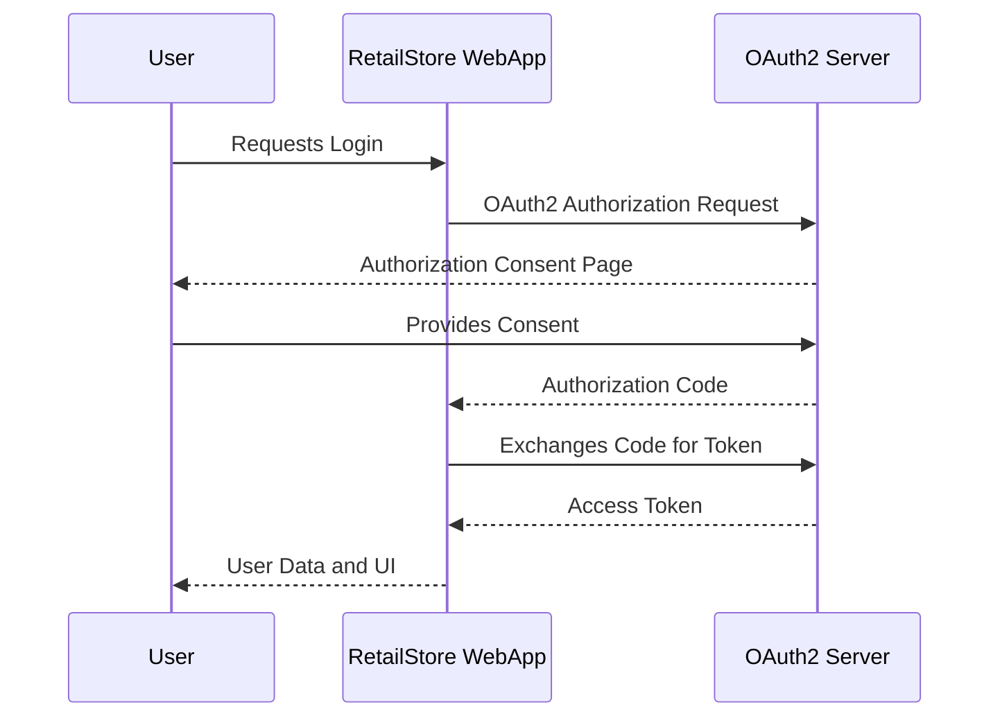

# Retail Store

Building RetailStore WebApp using Thymeleaf and Alpine.js

Refer :: [YouTube Tutorial](https://www.youtube.com/watch?v=_2e7nfgH-u8)

## Keyclock Admin console

For accessing the Admin Console, hit [Admin Console](http://localhost:9191)
and key in below credentials as per docker

```plaintext
username: admin
password : admin1234
```

## Export realm

Once the keycloak instance is up and running, we can create the realm, clients and users and then use the following steps to export the realm configuration.

```shell
$ docker ps
# copy the keycloak container id

# ssh into keycloak container
$ docker exec -it <container-id> bash

# export the realm configuration along with users info
$ /opt/keycloak/bin/kc.sh export --dir /opt/keycloak/data/import --realm retailstore --users realm_file

# exit from the container
$ exit

# copy the exported realm configuration to local machine
$ docker cp <container-id>:/opt/keycloak/data/import/retailstore-realm.json ~/realm/retailstore-realm.json
```

## UI

[Local UI](http://localhost:8080)

To login, use below credentials

```plaintext
username: retail
password : retail1234
```

## OIDC Sequence Diagram


