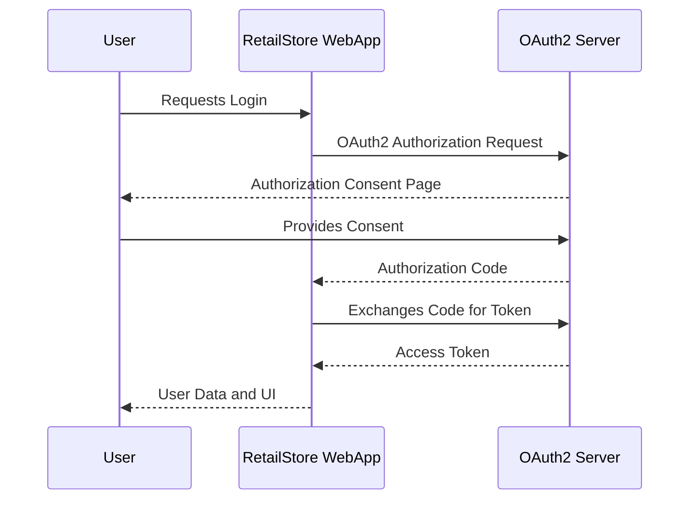

# Retail Store

Building RetailStore WebApp using Thymeleaf and Alpine.js

Refer :: [YouTube Tutorial](https://www.youtube.com/watch?v=_2e7nfgH-u8)

## Prerequisites and Startup Steps

Before starting the retailstore-webapp, ensure that the following prerequisites are met:

1. Make sure Docker and Docker Compose are installed on your system
2. Build all services with Maven (if not already built):
   ```shell
   ./mvnw clean install -DskipTests
   ```
3. Start the entire microservice stack:
   ```shell
   cd deployment
   docker-compose up -d
   ```
   This will start all required services with proper dependencies and health checks.

4. Monitor the startup progress:
   ```shell
   docker-compose logs -f retailstore-webapp
   ```
   Wait until you see the message "Started RetailStoreWebappApplication" in the logs.

5. Access the webapp at [http://localhost:8080](http://localhost:8080)

Note: The docker-compose configuration has been updated to include health checks and proper dependency ordering, ensuring that retailstore-webapp starts only when all required services are ready.

## Keycloak Admin console

For accessing the Admin Console, hit [Admin Console](http://localhost:9191)
and key in the below credentials as per docker

```plaintext
username: admin
password : admin1234
```

## Export realm

### Automated Import (Recommended)
The realm configuration is automatically imported when Keycloak starts up through the volume mount configuration in docker-compose.yml. The existing realm configuration file is located at `./deployment/realm-config/retailstore-realm.json`.

If you need to export an updated realm configuration after making changes in the Keycloak admin console, you can use the manual export method below.

### Manual Export (Alternative)
If you need to manually export the realm configuration, you can use the following steps:

```shell
$ docker ps
# copy the keycloak container id

# ssh into keycloak container
$ docker exec -it <container-id> bash

# export the realm configuration along with users info
$ /opt/keycloak/bin/kc.sh export --dir /opt/keycloak/data/import --realm retailstore --users realm_file

# exit from the container
$ exit

# copy the exported realm configuration to local machine
$ docker cp <container-id>:/opt/keycloak/data/import/retailstore-realm.json ~/realm/retailstore-realm.json
```

## UI

[Local UI](http://localhost:8080)

To login, use the below credentials

```plaintext
username: retail
password : retail1234
```

## OIDC Sequence Diagram


