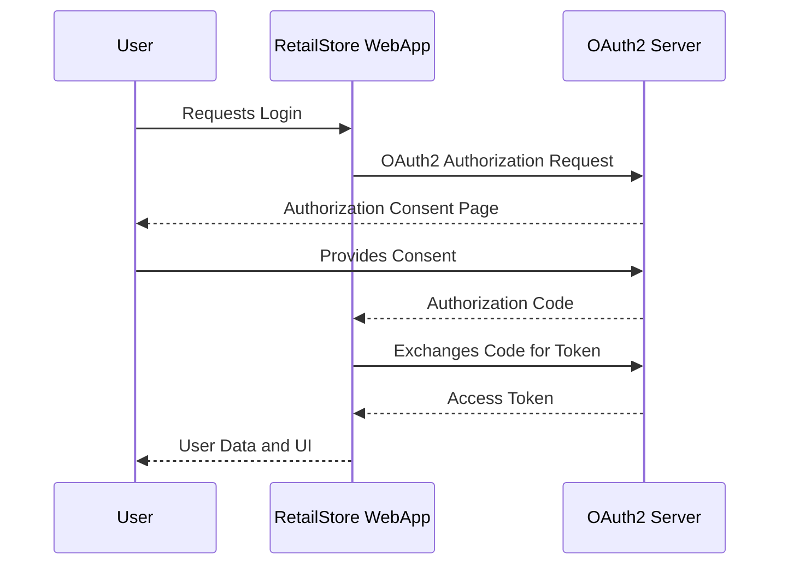

# Retail Store

Building RetailStore WebApp using Thymeleaf and Alpine.js

Refer :: [YouTube Tutorial](https://www.youtube.com/watch?v=_2e7nfgH-u8)

## Prerequisites and Startup Steps

Before starting the retailstore-webapp, ensure that the following prerequisites are met:

1. Make sure Docker and Docker Compose are installed on your system
2. Build all services with Maven (if not already built):
   ```shell
   ./mvnw clean install -DskipTests
   ```
3. Start the entire microservice stack:
   ```shell
   cd deployment
   docker-compose up -d
   ```
   This will start all required services with proper dependencies and health checks.

4. Monitor the startup progress:
   ```shell
   docker-compose logs -f retailstore-webapp
   ```
   Wait until you see the message "Started RetailStoreWebappApplication" in the logs.

5. Access the webapp at [http://localhost:8080](http://localhost:8080)

Note: The docker-compose configuration has been updated to include health checks and proper dependency ordering, ensuring that retailstore-webapp starts only when all required services are ready.

## Keycloak Admin console

For accessing the Admin Console, hit [Admin Console](http://localhost:9191)
and key in the below credentials as per docker

```plaintext
username: admin
password : admin1234
```

## 🔐 Keycloak Security Configuration

To fully access all features of the application (such as the Inventory UI), you must assign your user the `ADMIN` role. Follow these steps to correctly configure the role and ensure it is included in the OIDC tokens so Spring Security can map it:

### 1. Create the ADMIN Client Role
1. Open the Keycloak Admin Console (`http://localhost:9191`).
2. Select the `retailstore` realm.
3. Go to **Clients** -> click on **`retailstore-webapp`**.
4. Go to the **Roles** tab and click **Create Role**.
5. Name the role **`ADMIN`** and click **Save**.

### 2. Map the Client Role to the ID Token
By default, Keycloak only puts client roles inside the Access Token. To ensure the `retailstore-webapp` can see the role during login, we need to map it to the ID Token.
1. On the left menu, go to **Client Scopes**.
2. Select and click on the **`roles`** scope in the list.
3. Go to the **Mappers** tab.
4. Click on the **`client roles`** mapper.
5. Toggle **ON** both **Add to ID token** and **Add to userinfo**.
6. Click **Save**.

### 3. Assign the Role to Your User
1. On the left menu, go to **Users**.
2. Search for your user (e.g., `raja` or `retail`) and click on the username.
3. Go to the **Role mapping** tab.
4. Click **Assign role**.
5. From the dropdown at the top, select **Filter by client roles**.
6. Find `ADMIN`, check the box, and click **Assign**.

## Export realm

### Automated Import (Recommended)
The realm configuration is automatically imported when Keycloak starts up through the volume mount configuration in docker-compose.yml. The existing realm configuration file is located at `./deployment/realm-config/retailstore-realm.json`.

If you need to export an updated realm configuration after making changes in the Keycloak admin console, you can use the manual export method below.

### Manual Export (Alternative)
If you need to manually export the realm configuration, you can use the following steps:

```shell
# export the realm configuration along with users info
# Since the deployment mounts the ./realm-config directory to /opt/keycloak/data/import inside the container,
# running this command will directly update the retailstore-realm.json file in your project!
$ docker exec keycloak /opt/keycloak/bin/kc.sh export --dir /opt/keycloak/data/import --realm retailstore --users realm_file
```

## UI

[Local UI](http://localhost:8080)

To login, use the below credentials

```plaintext
username: retail
password : retail1234
```

## OIDC Sequence Diagram


```mermaid
sequenceDiagram
    participant User as User
    participant WebApp as RetailStore WebApp
    participant AuthServer as OAuth2 Server

    User->>WebApp: Requests Login
    WebApp->>AuthServer: OAuth2 Authorization Request
    AuthServer-->>User: Authorization Consent Page
    User->>AuthServer: Provides Consent
    AuthServer-->>WebApp: Authorization Code
    WebApp->>AuthServer: Exchanges Code for Token
    AuthServer-->>WebApp: Access Token
    WebApp-->>User: User Data and UI
```
