# 🔐 RetailStore WebApp - Authentication & Registration Deep Dive

## 📖 Overview

This document provides an in-depth analysis of the authentication and registration flows in the RetailStore WebApp, mapping each sequence step to specific code components, configurations, and Keycloak integration points.

## 🏗️ Architecture Components

### Core Security Stack
- **Spring Security 6.x** with OAuth2/OIDC support
- **Keycloak 24.x** as Identity Provider
- **JWT Tokens** for stateless authentication
- **CSRF Protection** with cookie-based tokens
- **Role-based Access Control** (RBAC)

---

## 🔑 User Registration Flow - Code Mapping

```mermaid
sequenceDiagram
    participant User as 👤 User
    participant Browser as 🌐 Browser
    participant WebApp as 🛒 RetailStore WebApp
    participant KC as 🔐 Keycloak
    participant Gateway as 🌐 API Gateway
    participant Payment as 💳 Payment Service

    Note over User, Payment: 📝 Registration Flow with Code References

    User->>Browser: Navigate to /registration
    Note right of Browser: URL: http://localhost:8080/registration
    
    Browser->>WebApp: GET /registration
    Note right of WebApp: RegistrationController.showRegistrationPage()<br/>File: RegistrationController.java:29<br/>Returns: "registration" template
    
    WebApp-->>Browser: Registration Form (Thymeleaf)
    Note right of Browser: Template: registration.html<br/>Form fields: username, email, firstName,<br/>lastName, password, phone, address
    
    User->>Browser: Fill form & click Register
    Note right of Browser: JavaScript validation:<br/>- Email format<br/>- Password complexity<br/>- Password confirmation match
    
    Browser->>WebApp: POST /api/register (JSON)
    Note right of WebApp: RegistrationController.register()<br/>File: RegistrationController.java:35<br/>@Valid @RequestBody RegistrationRequest
    
    WebApp->>WebApp: Validate Request
    Note right of WebApp: Bean Validation annotations<br/>in RegistrationRequest record
    
    WebApp->>KC: Register user via Admin API
    Note right of WebApp: KeycloakRegistrationService.registerUser()<br/>File: KeycloakRegistrationService.java:67<br/>Uses admin token for user creation
    
    rect rgb(255, 245, 238)
        Note over WebApp, KC: Keycloak Admin API Flow
        WebApp->>KC: POST /realms/master/protocol/openid-connect/token
        Note right of KC: Get admin access token<br/>Method: getAdminToken()<br/>Credentials: admin/admin1234
        
        KC-->>WebApp: Admin access token
        
        WebApp->>KC: POST /admin/realms/retailstore/users
        Note right of KC: Create user with:<br/>- Basic info (username, email, name)<br/>- Password (non-temporary)<br/>- Role: "user"<br/>Headers: Authorization: Bearer {adminToken}
        
        KC-->>WebApp: User created (201)
    end
    
    WebApp->>Gateway: POST /payment-service/api/customers
    Note right of WebApp: CustomerServiceClient.getOrCreateCustomer()<br/>Creates customer record with $10,000 balance
    
    Gateway->>Payment: Create customer record
    Payment-->>Gateway: CustomerResponse
    Gateway-->>WebApp: Customer created
    
    WebApp-->>Browser: Registration success JSON
    Note right of Browser: JavaScript redirects to:<br/>window.location.href = '/login?registrationSuccess=true'
```



### 🔍 Registration Code Components

#### 1. **RegistrationController.java**
```java
// Location: src/main/java/com/example/retailstore/webapp/web/controller/RegistrationController.java

@GetMapping("/registration")
public String showRegistrationPage() {
    return "registration"; // Maps to registration.html template
}

@PostMapping("/api/register")
public ResponseEntity<Map<String, String>> register(@Valid @RequestBody RegistrationRequest request) {
    registrationService.registerUser(request);
    CustomerRequest customerRequest = new CustomerRequest(/*...*/);
    CustomerResponse customerResponse = customerServiceClient.getOrCreateCustomer(customerRequest);
    return ResponseEntity.ok(Map.of("message", "User registered successfully"));
}
```

#### 2. **KeycloakRegistrationService.java**
```java
// Location: src/main/java/com/example/retailstore/webapp/services/KeycloakRegistrationService.java

public void registerUser(RegistrationRequest request) {
    String adminToken = getAdminToken(); // Get admin access token
    
    // Create user in Keycloak with USER role
    restClient.post()
        .uri(keycloakUrl + "/admin/realms/" + keycloakProperties.getRealm() + "/users")
        .header("Authorization", "Bearer " + adminToken)
        .body(Map.of(
            "username", request.username(),
            "email", request.email(),
            "enabled", true,
            "credentials", List.of(Map.of("type", "password", "value", request.password())),
            "realmRoles", List.of("user")
        ));
}
```

#### 3. **Security Configuration**
```java
// Location: src/main/java/com/example/retailstore/webapp/config/SecurityConstants.java

public static final String[] PUBLIC_URLS = {
    "/api/register",  // Registration endpoint is public
    "/registration",  // Registration page is public
    "/login"         // Login page is public
};
```

---

## 🔐 Authentication Flow - Code Mapping

```mermaid
sequenceDiagram
    participant User as 👤 User
    participant Browser as 🌐 Browser
    participant WebApp as 🛒 RetailStore WebApp
    participant KC as 🔐 Keycloak
    participant Spring as 🔧 Spring Security

    Note over User, Spring: 🔑 OAuth2/OIDC Authentication Flow

    User->>Browser: Navigate to /login
    Browser->>WebApp: GET /login
    
    WebApp->>Spring: Check authentication
    Note right of Spring: LoginController.login()<br/>File: LoginController.java:18<br/>Checks if user already authenticated
    
    alt User not authenticated
        WebApp-->>Browser: Login page (login.html)
        Note right of Browser: Template shows:<br/>"Login with Keycloak" button<br/>href="/oauth2/authorization/retailstore-webapp"
        
        User->>Browser: Click "Login with Keycloak"
        Browser->>WebApp: GET /oauth2/authorization/retailstore-webapp
        
        WebApp->>Spring: OAuth2 Authorization Request
        Note right of Spring: Spring Security OAuth2 Client<br/>Configuration from application.properties<br/>Client ID: retailstore-webapp
        
        Spring->>KC: Authorization Code Request
        Note right of KC: GET /realms/retailstore/protocol/openid-connect/auth<br/>Parameters:<br/>- client_id=retailstore-webapp<br/>- response_type=code<br/>- scope=openid profile<br/>- redirect_uri=http://localhost:8080/login/oauth2/code/retailstore-webapp
        
        KC-->>Browser: Redirect to Keycloak login
        Note right of Browser: Keycloak login form<br/>URL: http://localhost:9191/realms/retailstore/...
        
        User->>Browser: Enter credentials
        Browser->>KC: POST credentials
        
        KC->>KC: Validate credentials
        Note right of KC: Check against user database<br/>Password hash validation<br/>User: raja/retail (pre-configured)
        
        KC-->>Browser: Authorization code redirect
        Note right of Browser: Redirect to:<br/>http://localhost:8080/login/oauth2/code/retailstore-webapp?code=...
        
        Browser->>WebApp: GET /login/oauth2/code/retailstore-webapp?code=...
        
        WebApp->>Spring: Process authorization code
        Note right of Spring: OAuth2LoginAuthenticationFilter<br/>Handles the callback
        
        Spring->>KC: Exchange code for tokens
        Note right of KC: POST /realms/retailstore/protocol/openid-connect/token<br/>Parameters:<br/>- grant_type=authorization_code<br/>- code={authorization_code}<br/>- client_id=retailstore-webapp<br/>- client_secret=P1sibsIrELBhmvK18BOzw1bUl96DcP2z
        
        KC-->>Spring: Access Token + ID Token
        Note right of Spring: JWT tokens containing:<br/>- User info (preferred_username, email)<br/>- Roles and permissions<br/>- Token expiry (300 seconds)
        
        Spring->>Spring: Create Authentication
        Note right of Spring: OAuth2AuthenticationToken<br/>Principal: DefaultOidcUser<br/>Authorities from token claims
        
        Spring-->>WebApp: Authentication successful
        WebApp-->>Browser: Redirect to / (home page)
        
    else User already authenticated
        WebApp-->>Browser: Redirect to / (home page)
    end
```



### 🔍 Authentication Code Components

#### 1. **SecurityConfig.java**
```java
// Location: src/main/java/com/example/retailstore/webapp/config/SecurityConfig.java

@Bean
SecurityFilterChain securityFilterChain(HttpSecurity http) throws Exception {
    http.authorizeHttpRequests(c -> c
            .requestMatchers(SecurityConstants.PUBLIC_URLS).permitAll()
            .anyRequest().authenticated())
        .oauth2Login(oauth2 -> oauth2
            .loginPage("/login")
            .defaultSuccessUrl("/", true))
        .logout(logout -> logout
            .logoutSuccessHandler(oidcLogoutSuccessHandler()));
    return http.build();
}
```

#### 2. **OAuth2 Configuration (application.properties)**
```properties
# OAuth2 Client Registration
spring.security.oauth2.client.registration.retailstore-webapp.client-id=retailstore-webapp
spring.security.oauth2.client.registration.retailstore-webapp.client-secret=P1sibsIrELBhmvK18BOzw1bUl96DcP2z
spring.security.oauth2.client.registration.retailstore-webapp.authorization-grant-type=authorization_code
spring.security.oauth2.client.registration.retailstore-webapp.scope=openid, profile
spring.security.oauth2.client.registration.retailstore-webapp.redirect-uri={baseUrl}/login/oauth2/code/retailstore-webapp

# OAuth2 Provider Configuration
spring.security.oauth2.client.provider.retailstore-webapp.issuer-uri=${REALM_URL}
```

#### 3. **SecurityHelper.java**
```java
// Location: src/main/java/com/example/retailstore/webapp/services/SecurityHelper.java

public String getUsername() {
    Authentication authentication = SecurityContextHolder.getContext().getAuthentication();
    if (authentication.getPrincipal() instanceof DefaultOidcUser principal) {
        return principal.getAttribute("preferred_username");
    }
    return null;
}

public String getAccessToken() {
    OAuth2AuthenticationToken oauthToken = (OAuth2AuthenticationToken) authentication;
    OAuth2AuthorizedClient client = authorizedClientService.loadAuthorizedClient(
        oauthToken.getAuthorizedClientRegistrationId(), oauthToken.getName());
    return client.getAccessToken().getTokenValue();
}
```

---

## 🔒 Token Management & API Calls


### 🔍 Token Management Code

#### 1. **API Client Configuration**
```java
// Location: src/main/java/com/example/retailstore/webapp/clients/ClientsConfig.java

@Bean
OrderServiceClient orderServiceClient(WebClient.Builder webClientBuilder, SecurityHelper securityHelper) {
    WebClient webClient = webClientBuilder
        .baseUrl(applicationProperties.apiGatewayUrl())
        .defaultHeader(HttpHeaders.CONTENT_TYPE, MediaType.APPLICATION_JSON_VALUE)
        .filter((request, next) -> {
            String token = securityHelper.getAccessToken();
            if (token != null) {
                request.headers().setBearerAuth(token);
            }
            return next.exchange(request);
        })
        .build();
    
    return HttpServiceProxyFactory.builderFor(WebClientAdapter.create(webClient))
        .build()
        .createClient(OrderServiceClient.class);
}
```

---

## 🚪 Logout Flow

```mermaid
sequenceDiagram
    participant User as 👤 User
    participant Browser as 🌐 Browser
    participant WebApp as 🛒 RetailStore WebApp
    participant KC as 🔐 Keycloak
    participant Spring as 🔧 Spring Security

    Note over User, Spring: 🚪 OIDC Logout Flow

    User->>Browser: Click logout button
    Browser->>WebApp: POST /logout
    
    WebApp->>Spring: Process logout request
    Note right of Spring: LogoutFilter intercepts<br/>Configured in SecurityConfig
    
    Spring->>Spring: Clear local session
    Note right of Spring: - Invalidate HTTP session<br/>- Clear SecurityContext<br/>- Remove authentication
    
    Spring->>KC: OIDC logout request
    Note right of KC: OidcClientInitiatedLogoutSuccessHandler<br/>POST /realms/retailstore/protocol/openid-connect/logout<br/>Parameters:<br/>- id_token_hint={id_token}<br/>- post_logout_redirect_uri=http://localhost:8080
    
    KC->>KC: Invalidate SSO session
    Note right of KC: - Remove Keycloak session<br/>- Invalidate refresh tokens<br/>- Clear user session
    
    KC-->>Browser: Redirect to post-logout URI
    Note right of Browser: Redirect to: http://localhost:8080
    
    Browser->>WebApp: GET / (unauthenticated)
    WebApp-->>Browser: Redirect to /login
```



### 🔍 Logout Configuration
```java
// Location: src/main/java/com/example/retailstore/webapp/config/SecurityConfig.java

private LogoutSuccessHandler oidcLogoutSuccessHandler() {
    OidcClientInitiatedLogoutSuccessHandler oidcLogoutSuccessHandler =
        new OidcClientInitiatedLogoutSuccessHandler(this.clientRegistrationRepository);
    oidcLogoutSuccessHandler.setPostLogoutRedirectUri("{baseUrl}");
    return oidcLogoutSuccessHandler;
}
```

---

## 🛡️ Role-Based Access Control

```mermaid
flowchart TD
    A[🔐 User Authentication] --> B{Check User Roles}
    
    B -->|Has 'ADMIN' role| C[🔧 Admin Access]
    B -->|Has 'USER' role| D[👤 User Access]
    B -->|No roles| E[❌ Access Denied]
    
    C --> F[📦 Inventory Management]
    C --> G[👥 User Management]
    C --> H[📊 Admin Dashboard]
    
    D --> I[🛒 Shopping Cart]
    D --> J[📋 Order History]
    D --> K[📚 Product Catalog]
    
    F --> L[PreAuthorize hasRole ADMIN]
    G --> M[PreAuthorize hasRole ADMIN]
    I --> N[PreAuthorize authenticated]
    J --> O[PreAuthorize authenticated]
    
    style C fill:#ffcccc
    style D fill:#ccffcc
    style E fill:#ffcccc
    style L fill:#ffe6cc
    style M fill:#ffe6cc
    style N fill:#e6f3ff
    style O fill:#e6f3ff
```



### 🔍 Role-Based Security Code

#### 1. **Method-Level Security**
```java
// Location: src/main/java/com/example/retailstore/webapp/web/controller/InventoryController.java

@GetMapping("/inventory")
@PreAuthorize("hasRole('ADMIN')")
public String inventoryPage() {
    return "inventory";
}

@PutMapping("/inventory")
@PreAuthorize("hasRole('ADMIN')")
public ResponseEntity<InventoryResponse> updateInventory(@RequestBody InventoryUpdateRequest request) {
    // Only admins can update inventory
}
```

#### 2. **Keycloak Role Configuration**
```json
// Location: deployment/realm-config/retailstore-realm.json
{
  "roles": {
    "realm": [
      {
        "name": "user",
        "description": "User role"
      }
    ]
  },
  "users": [
    {
      "username": "raja",
      "realmRoles": ["default-roles-retailstore"]
    }
  ]
}
```

---

## 🔧 Configuration Deep Dive

### 1. **Keycloak Client Configuration**
```json
{
  "clientId": "retailstore-webapp",
  "secret": "P1sibsIrELBhmvK18BOzw1bUl96DcP2z",
  "redirectUris": [
    "http://localhost:8080/login/oauth2/code/retailstore-webapp"
  ],
  "webOrigins": ["http://localhost:8080"],
  "standardFlowEnabled": true,
  "directAccessGrantsEnabled": true,
  "frontchannelLogout": true,
  "attributes": {
    "post.logout.redirect.uris": "http://localhost:8080"
  }
}
```

### 2. **JWT Token Structure**
```json
{
  "header": {
    "alg": "RS256",
    "typ": "JWT",
    "kid": "..."
  },
  "payload": {
    "exp": 1640995200,
    "iat": 1640991600,
    "iss": "http://localhost:9191/realms/retailstore",
    "aud": "retailstore-webapp",
    "sub": "362b5bb3-0e0a-4ee6-9b59-53e2ca1adeac",
    "preferred_username": "raja",
    "email": "rajakolli@gmail.com",
    "realm_access": {
      "roles": ["default-roles-retailstore"]
    }
  }
}
```

### 3. **CSRF Protection**
```java
// Location: src/main/java/com/example/retailstore/webapp/config/SecurityConfig.java

.csrf(csrf -> csrf
    .ignoringRequestMatchers("/api/register") // Registration endpoint exempt
    .csrfTokenRepository(CookieCsrfTokenRepository.withHttpOnlyFalse())
)
```

---

## 🚨 Error Handling & Security

### 1. **Exception Handling**
```java
// Location: src/main/java/com/example/retailstore/webapp/exception/GlobalExceptionHandler.java

@ExceptionHandler(KeyCloakException.class)
public ResponseEntity<Map<String, String>> handleKeycloakException(KeyCloakException ex) {
    return ResponseEntity.status(HttpStatus.INTERNAL_SERVER_ERROR)
        .body(Map.of("message", "Authentication service error"));
}
```

### 2. **Security Headers**
```json
// Keycloak Browser Security Headers
{
  "contentSecurityPolicy": "frame-src 'self'; frame-ancestors 'self'; object-src 'none';",
  "xFrameOptions": "SAMEORIGIN",
  "xContentTypeOptions": "nosniff",
  "xXSSProtection": "1; mode=block",
  "strictTransportSecurity": "max-age=31536000; includeSubDomains"
}
```

---

## 📊 Key Metrics & Monitoring

### Authentication Events
- **Login Success/Failure** rates
- **Token Refresh** frequency  
- **Session Duration** analytics
- **Role-based Access** patterns

### Security Monitoring
- **Failed Authentication** attempts
- **Token Expiry** handling
- **CSRF Attack** prevention
- **Session Hijacking** detection

---

## 🎯 Best Practices Implemented

1. **🔐 Secure Token Storage**: Tokens stored in OAuth2AuthorizedClient, not in browser
2. **🛡️ CSRF Protection**: Cookie-based CSRF tokens for form submissions
3. **⏰ Token Expiry**: Short-lived access tokens (5 minutes) with refresh capability
4. **🚪 Proper Logout**: OIDC-compliant logout with SSO session termination
5. **🔒 Role Separation**: Clear distinction between USER and ADMIN roles
6. **📝 Audit Trail**: Comprehensive logging of authentication events
7. **🌐 CORS Configuration**: Proper cross-origin resource sharing setup
8. **🔧 Configuration Security**: Sensitive configs externalized via environment variables

---

## 🔍 Troubleshooting Guide

### Common Issues & Solutions

| Issue | Symptoms | Solution |
|-------|----------|----------|
| **Token Expired** | 401 Unauthorized on API calls | Implement token refresh logic |
| **CSRF Token Missing** | 403 Forbidden on form submission | Ensure CSRF token in request headers |
| **Role Access Denied** | 403 Forbidden on admin endpoints | Check user roles in Keycloak |
| **Redirect Loop** | Infinite redirects between login/home | Verify OAuth2 redirect URIs |
| **Session Timeout** | Unexpected logouts | Configure session timeout settings |

### Debug Configuration
```properties
# Enable OAuth2 debug logging
logging.level.org.springframework.security.oauth2=DEBUG
logging.level.org.springframework.security.web=DEBUG
```

This comprehensive documentation maps every authentication and registration flow step to specific code components, providing developers with a complete understanding of the security implementation in the RetailStore WebApp.