# RetailStore WebApp - Detailed Sequence Diagram

## Complete User Journey Flow

```mermaid
sequenceDiagram
    participant User as 👤 User
    participant Browser as 🌐 Browser
    participant WebApp as 🛒 RetailStore WebApp<br/>(Port: 8080)
    participant Keycloak as 🔐 Keycloak<br/>(Port: 9191)
    participant Gateway as 🌐 API Gateway<br/>(Port: 8765)
    participant Catalog as 📚 Catalog Service<br/>(Port: 18080)
    participant Inventory as 📦 Inventory Service<br/>(Port: 18181)
    participant Payment as 💳 Payment Service<br/>(Port: 18085)
    participant Order as 🛍️ Order Service<br/>(Port: 18282)

    Note over User, Order: 🔐 User Registration Flow
    User->>Browser: Navigate to /registration
    Browser->>WebApp: GET /registration
    WebApp-->>Browser: Registration Form (Thymeleaf)
    User->>Browser: Fill registration form
    Browser->>WebApp: POST /api/register
    WebApp->>Keycloak: Register user in Keycloak
    Keycloak-->>WebApp: User created
    WebApp->>Gateway: POST /payment-service/api/customers
    Gateway->>Payment: Create customer record
    Payment-->>Gateway: Customer created
    Gateway-->>WebApp: Customer response
    WebApp-->>Browser: Registration success

    Note over User, Order: 🔑 Authentication Flow (OAuth2/OIDC)
    User->>Browser: Navigate to /login
    Browser->>WebApp: GET /login
    WebApp-->>Browser: Login page with OAuth2 button
    User->>Browser: Click "Login with Keycloak"
    Browser->>WebApp: Initiate OAuth2 flow
    WebApp->>Keycloak: Authorization request<br/>(client_id: retailstore-webapp)
    Keycloak-->>Browser: Authorization consent page
    User->>Browser: Provide credentials & consent
    Browser->>Keycloak: Submit credentials
    Keycloak-->>WebApp: Authorization code
    WebApp->>Keycloak: Exchange code for tokens
    Keycloak-->>WebApp: Access token + ID token
    WebApp-->>Browser: Redirect to / (authenticated)

    Note over User, Order: 📚 Product Browsing Flow
    User->>Browser: Navigate to /products
    Browser->>WebApp: GET /products (with auth token)
    WebApp-->>Browser: Products page (Thymeleaf)
    Browser->>WebApp: GET /api/products?page=0 (AJAX)
    WebApp->>Gateway: GET /catalog-service/api/catalog?pageNo=0
    Gateway->>Catalog: Forward request
    Catalog-->>Gateway: PagedResult<ProductResponse>
    Gateway-->>WebApp: Product list
    WebApp-->>Browser: JSON product data
    Browser-->>User: Display products with Alpine.js

    Note over User, Order: 📦 Inventory Management (Admin Only)
    User->>Browser: Navigate to /inventory (Admin role required)
    Browser->>WebApp: GET /inventory (with auth token)
    WebApp->>WebApp: @PreAuthorize("hasRole('ADMIN')")
    WebApp-->>Browser: Inventory page (Thymeleaf)
    Browser->>WebApp: GET /api/inventory?page=0 (AJAX)
    WebApp->>Gateway: GET /inventory-service/api/inventory?pageNo=0
    Gateway->>Inventory: Forward request
    Inventory-->>Gateway: PagedResult<InventoryResponse>
    Gateway-->>WebApp: Inventory list
    WebApp-->>Browser: JSON inventory data
    
    User->>Browser: Update inventory quantity
    Browser->>WebApp: PUT /inventory (with auth token)
    WebApp->>WebApp: @PreAuthorize("hasRole('ADMIN')")
    WebApp->>Gateway: PUT /inventory-service/api/inventory/{id}
    Gateway->>Inventory: Update inventory
    Inventory-->>Gateway: Updated inventory
    Gateway-->>WebApp: Success response
    WebApp-->>Browser: Updated inventory data

    Note over User, Order: 🛒 Shopping Cart & Order Flow
    User->>Browser: Add products to cart (client-side)
    Browser->>Browser: Store in localStorage (Alpine.js)
    User->>Browser: Navigate to /cart
    Browser->>WebApp: GET /cart (with auth token)
    WebApp->>WebApp: SecurityHelper.getUsername()
    WebApp->>Gateway: GET /payment-service/api/customers/name/{username}
    Gateway->>Payment: Get customer by name
    Payment-->>Gateway: CustomerResponse
    Gateway-->>WebApp: Customer details
    WebApp-->>Browser: Cart page with customer info

    User->>Browser: Proceed to checkout
    Browser->>WebApp: POST /api/orders (with auth token + order data)
    WebApp->>WebApp: SecurityHelper.getAccessToken()
    WebApp->>Gateway: GET /payment-service/api/customers/name/{name}
    Gateway->>Payment: Get customer details
    Payment-->>Gateway: CustomerResponse
    Gateway-->>WebApp: Customer data
    WebApp->>Gateway: POST /order-service/api/orders<br/>(with Bearer token)
    Gateway->>Order: Create order with customer ID
    
    Note over Order: Order Service processes:<br/>- Validates inventory<br/>- Creates order record<br/>- Publishes events to Kafka
    
    Order-->>Gateway: OrderConfirmationDTO
    Gateway-->>WebApp: Order confirmation
    WebApp-->>Browser: Order success response
    Browser-->>User: Order confirmation

    Note over User, Order: 📋 Order History Flow
    User->>Browser: Navigate to /orders
    Browser->>WebApp: GET /orders (with auth token)
    WebApp-->>Browser: Orders page (Thymeleaf)
    Browser->>WebApp: GET /api/orders (AJAX with auth token)
    WebApp->>WebApp: SecurityHelper.getAccessToken()
    WebApp->>Gateway: GET /order-service/api/orders<br/>(with Bearer token)
    Gateway->>Order: Get user orders
    Order-->>Gateway: PagedResult<OrderResponse>
    Gateway-->>WebApp: Orders list
    WebApp-->>Browser: JSON orders data

    User->>Browser: Click on specific order
    Browser->>WebApp: GET /api/orders/{orderNumber}
    WebApp->>Gateway: GET /order-service/api/orders/{orderNumber}<br/>(with Bearer token)
    Gateway->>Order: Get order details
    Order-->>Gateway: OrderResponse
    Gateway-->>WebApp: Order details
    WebApp->>Gateway: GET /payment-service/api/customers/{customerId}
    Gateway->>Payment: Get customer details
    Payment-->>Gateway: CustomerResponse
    Gateway-->>WebApp: Customer info
    WebApp->>WebApp: orderResponse.updateCustomerDetails()
    WebApp-->>Browser: Complete order details
    Browser-->>User: Display order details

    Note over User, Order: 🚪 Logout Flow
    User->>Browser: Click logout
    Browser->>WebApp: POST /logout
    WebApp->>Keycloak: OIDC logout request
    Keycloak-->>WebApp: Logout confirmation
    WebApp-->>Browser: Redirect to login page
    Browser-->>User: Logged out
```

## Key Architecture Components

### 🔐 Security & Authentication
- **OAuth2/OIDC**: Keycloak integration with authorization code flow
- **JWT Tokens**: Access tokens for API authentication
- **Role-based Access**: Admin-only endpoints for inventory management
- **CSRF Protection**: Cookie-based CSRF tokens for form submissions

### 🌐 Communication Patterns
- **API Gateway**: Single entry point for all microservice calls
- **REST Clients**: Spring WebClient with HttpServiceProxyFactory
- **Service Discovery**: Routes through API Gateway to backend services
- **Bearer Token**: JWT tokens passed in Authorization headers

### 🎨 Frontend Technology
- **Thymeleaf**: Server-side rendering for initial page load
- **Alpine.js**: Client-side reactivity and state management
- **AJAX**: Asynchronous API calls for dynamic content
- **LocalStorage**: Client-side cart management

### 📊 Data Flow
- **Pagination**: All list endpoints support pagination
- **Error Handling**: Global exception handler with proper HTTP status codes
- **Validation**: Bean validation on request objects
- **Observability**: Micrometer integration for metrics and tracing

## Service Endpoints Summary

| Service | Base URL | Key Endpoints |
|---------|----------|---------------|
| **WebApp** | `http://localhost:8080` | `/products`, `/cart`, `/orders`, `/inventory` |
| **API Gateway** | `http://localhost:8765` | Routes to all backend services |
| **Keycloak** | `http://localhost:9191` | OAuth2/OIDC authentication |
| **Catalog** | `http://localhost:18080` | `/api/catalog` (products) |
| **Inventory** | `http://localhost:18181` | `/api/inventory` (stock levels) |
| **Payment** | `http://localhost:18085` | `/api/customers` (customer mgmt) |
| **Order** | `http://localhost:18282` | `/api/orders` (order processing) |