# 🔍 Spring Security OAuth2 Auto-Configuration Deep Dive

## 📖 Overview

This document explains the "magic" behind Spring Security OAuth2 auto-configuration, revealing how properties automatically create endpoints, filters, and authentication flows.

---

## 🎯 Question 1: Where does `/oauth2/authorization/retailstore-webapp` come from?

### 🔧 **Spring Boot Auto-Configuration Magic**

When you add these properties:
```properties
spring.security.oauth2.client.registration.retailstore-webapp.client-id=retailstore-webapp
spring.security.oauth2.client.registration.retailstore-webapp.client-secret=P1sibsIrELBhmvK18BOzw1bUl96DcP2z
```

Spring Boot **automatically creates** the OAuth2 authorization endpoint pattern:
```
/oauth2/authorization/{registrationId}
```

### 📍 **Auto-Generated Endpoints**


### 🔍 **Behind the Scenes Code**

Spring Security automatically registers this filter:

```java
// This happens automatically when OAuth2 properties are detected
@Configuration
@EnableWebSecurity
public class OAuth2ClientAutoConfiguration {
    
    @Bean
    public OAuth2AuthorizationRequestRedirectFilter oauth2AuthorizationRequestRedirectFilter() {
        return new OAuth2AuthorizationRequestRedirectFilter(
            OAuth2AuthorizationRequestRedirectFilter.DEFAULT_AUTHORIZATION_REQUEST_BASE_URI
        );
        // DEFAULT_AUTHORIZATION_REQUEST_BASE_URI = "/oauth2/authorization"
    }
}
```

### 📝 **How to Find Available Endpoints**

You can discover all auto-generated OAuth2 endpoints:

```java
// Add this to any controller for debugging
@RestController
public class DebugController {
    
    @Autowired
    private ClientRegistrationRepository clientRegistrationRepository;
    
    @GetMapping("/debug/oauth2-endpoints")
    public Map<String, String> getOAuth2Endpoints() {
        Map<String, String> endpoints = new HashMap<>();
        
        clientRegistrationRepository.forEach(registration -> {
            String registrationId = registration.getRegistrationId();
            endpoints.put(registrationId, "/oauth2/authorization/" + registrationId);
        });
        
        return endpoints;
        // Output: {"retailstore-webapp": "/oauth2/authorization/retailstore-webapp"}
    }
}
```

---

## 🎯 Question 2: What do OAuth2 Properties Actually Do?

### 🏗️ **Property-to-Bean Mapping**


### 📋 **Detailed Property Breakdown**

#### 1. **Client Registration Properties**
```properties
# Creates ClientRegistration bean with these values
spring.security.oauth2.client.registration.retailstore-webapp.client-id=retailstore-webapp
spring.security.oauth2.client.registration.retailstore-webapp.client-secret=P1sibsIrELBhmvK18BOzw1bUl96DcP2z
spring.security.oauth2.client.registration.retailstore-webapp.authorization-grant-type=authorization_code
spring.security.oauth2.client.registration.retailstore-webapp.scope=openid, profile
spring.security.oauth2.client.registration.retailstore-webapp.redirect-uri={baseUrl}/login/oauth2/code/retailstore-webapp
```

**Equivalent Java Configuration:**
```java
@Bean
public ClientRegistrationRepository clientRegistrationRepository() {
    ClientRegistration registration = ClientRegistration.withRegistrationId("retailstore-webapp")
        .clientId("retailstore-webapp")
        .clientSecret("P1sibsIrELBhmvK18BOzw1bUl96DcP2z")
        .authorizationGrantType(AuthorizationGrantType.AUTHORIZATION_CODE)
        .scope("openid", "profile")
        .redirectUri("{baseUrl}/login/oauth2/code/retailstore-webapp")
        .authorizationUri("http://localhost:9191/realms/retailstore/protocol/openid-connect/auth")
        .tokenUri("http://localhost:9191/realms/retailstore/protocol/openid-connect/token")
        .userInfoUri("http://localhost:9191/realms/retailstore/protocol/openid-connect/userinfo")
        .jwkSetUri("http://localhost:9191/realms/retailstore/protocol/openid-connect/certs")
        .build();
    
    return new InMemoryClientRegistrationRepository(registration);
}
```

#### 2. **Provider Configuration**
```properties
# Auto-discovers OAuth2 endpoints from issuer
spring.security.oauth2.client.provider.retailstore-webapp.issuer-uri=${REALM_URL}
```

**What happens automatically:**
```java
// Spring makes HTTP GET to: http://localhost:9191/realms/retailstore/.well-known/openid-configuration
// Response contains:
{
  "authorization_endpoint": "http://localhost:9191/realms/retailstore/protocol/openid-connect/auth",
  "token_endpoint": "http://localhost:9191/realms/retailstore/protocol/openid-connect/token",
  "userinfo_endpoint": "http://localhost:9191/realms/retailstore/protocol/openid-connect/userinfo",
  "jwks_uri": "http://localhost:9191/realms/retailstore/protocol/openid-connect/certs"
}
```

### 🔄 **Auto-Created Security Filter Chain**

```java
// This is what Spring Security automatically creates
@Bean
public SecurityFilterChain oauth2SecurityFilterChain(HttpSecurity http) throws Exception {
    http
        .addFilterBefore(oauth2AuthorizationRequestRedirectFilter(), UsernamePasswordAuthenticationFilter.class)
        .addFilterAfter(oauth2LoginAuthenticationFilter(), OAuth2AuthorizationRequestRedirectFilter.class)
        .oauth2Login(oauth2 -> oauth2
            .clientRegistrationRepository(clientRegistrationRepository())
            .authorizedClientService(authorizedClientService())
        );
    return http.build();
}
```

---

## 🎯 Question 3: Which Code Makes Authorization Code Request?

### 🔍 **The Complete Flow with Actual Classes**

```mermaid
%%{init: {'theme':'dark', 'themeVariables': {'primaryColor': '#333333', 'primaryTextColor': '#ffffff', 'primaryBorderColor': '#ffffff', 'lineColor': '#ffffff', 'secondaryColor': '#444444', 'tertiaryColor': '#555555', 'background': '#000000', 'mainBkg': '#333333', 'secondBkg': '#444444', 'tertiaryBkg': '#555555', 'noteBkgColor': '#444444', 'noteTextColor': '#ffffff'}}}%%
sequenceDiagram
    participant User as 👤 User
    participant Browser as 🌐 Browser
    participant Filter1 as 🔧 OAuth2AuthorizationRequestRedirectFilter
    participant Builder as 🏗️ OAuth2AuthorizationRequestBuilder
    participant Keycloak as 🔐 Keycloak
    participant Filter2 as 🔧 OAuth2LoginAuthenticationFilter
    participant Provider as 🔧 OAuth2AuthorizationCodeAuthenticationProvider

    User->>Browser: Click "Login with Keycloak"
    Browser->>Filter1: GET /oauth2/authorization/retailstore-webapp
    
    Note over Filter1: Class: OAuth2AuthorizationRequestRedirectFilter<br/>Method: doFilterInternal()
    
    Filter1->>Builder: Build authorization request
    Note over Builder: Class: OAuth2AuthorizationRequestBuilder<br/>Creates authorization URL with:<br/>- client_id<br/>- response_type=code<br/>- scope<br/>- redirect_uri<br/>- state (CSRF protection)
    
    Builder-->>Filter1: OAuth2AuthorizationRequest
    Filter1-->>Browser: Redirect to Keycloak
    
    Note over Browser, Keycloak: URL: http://localhost:9191/realms/retailstore/protocol/openid-connect/auth?<br/>client_id=retailstore-webapp&<br/>response_type=code&<br/>scope=openid%20profile&<br/>redirect_uri=http://localhost:8080/login/oauth2/code/retailstore-webapp&<br/>state=abc123
    
    Browser->>Keycloak: GET authorization endpoint
    Keycloak-->>Browser: Login form
    User->>Keycloak: Submit credentials
    Keycloak-->>Browser: Redirect with authorization code
    
    Note over Browser: URL: http://localhost:8080/login/oauth2/code/retailstore-webapp?<br/>code=def456&state=abc123
    
    Browser->>Filter2: GET /login/oauth2/code/retailstore-webapp?code=def456
    
    Note over Filter2: Class: OAuth2LoginAuthenticationFilter<br/>Method: attemptAuthentication()
    
    Filter2->>Provider: Exchange code for tokens
    Note over Provider: Class: OAuth2AuthorizationCodeAuthenticationProvider<br/>Makes POST to token endpoint
    
    Provider->>Keycloak: POST /protocol/openid-connect/token
    Note over Provider, Keycloak: Parameters:<br/>grant_type=authorization_code<br/>code=def456<br/>client_id=retailstore-webapp<br/>client_secret=P1sibsIrELBhmvK18BOzw1bUl96DcP2z<br/>redirect_uri=http://localhost:8080/login/oauth2/code/retailstore-webapp
    
    Keycloak-->>Provider: Access Token + ID Token
    Provider-->>Filter2: OAuth2LoginAuthenticationToken
    Filter2-->>Browser: Redirect to success URL
```



### 🔍 **Exact Classes and Methods**

#### 1. **Authorization Request Creation**
```java
// File: OAuth2AuthorizationRequestRedirectFilter.java (Spring Security)
public class OAuth2AuthorizationRequestRedirectFilter extends OncePerRequestFilter {
    
    @Override
    protected void doFilterInternal(HttpServletRequest request, HttpServletResponse response, 
                                  FilterChain filterChain) throws ServletException, IOException {
        
        // Matches: /oauth2/authorization/{registrationId}
        if (this.authorizationRequestMatcher.matches(request)) {
            
            // Get client registration from repository
            ClientRegistration clientRegistration = this.clientRegistrationRepository
                .findByRegistrationId(registrationId);
            
            // Build authorization request
            OAuth2AuthorizationRequest authorizationRequest = 
                OAuth2AuthorizationRequest.authorizationCode()
                    .clientId(clientRegistration.getClientId())
                    .authorizationUri(clientRegistration.getProviderDetails().getAuthorizationUri())
                    .redirectUri(resolveRedirectUri(request, clientRegistration))
                    .scopes(clientRegistration.getScopes())
                    .state(this.stateGenerator.generateKey()) // CSRF protection
                    .build();
            
            // Save request in session for later validation
            this.authorizationRequestRepository.saveAuthorizationRequest(authorizationRequest, request, response);
            
            // Redirect to Keycloak
            this.authorizationRedirectStrategy.sendRedirect(request, response, 
                authorizationRequest.getAuthorizationRequestUri());
        }
    }
}
```

#### 2. **Authorization Code Exchange**
```java
// File: OAuth2LoginAuthenticationFilter.java (Spring Security)
public class OAuth2LoginAuthenticationFilter extends AbstractAuthenticationProcessingFilter {
    
    @Override
    public Authentication attemptAuthentication(HttpServletRequest request, 
                                             HttpServletResponse response) throws AuthenticationException {
        
        // Extract authorization code from callback
        String code = request.getParameter("code");
        String state = request.getParameter("state");
        
        // Validate state parameter (CSRF protection)
        OAuth2AuthorizationRequest authorizationRequest = 
            this.authorizationRequestRepository.loadAuthorizationRequest(request);
        
        // Create authentication token
        OAuth2AuthorizationCodeAuthenticationToken authenticationRequest = 
            new OAuth2AuthorizationCodeAuthenticationToken(
                clientRegistration, 
                new OAuth2AuthorizationExchange(authorizationRequest, authorizationResponse)
            );
        
        // Delegate to authentication provider
        return this.getAuthenticationManager().authenticate(authenticationRequest);
    }
}
```

#### 3. **Token Exchange with Keycloak**
```java
// File: OAuth2AuthorizationCodeAuthenticationProvider.java (Spring Security)
public class OAuth2AuthorizationCodeAuthenticationProvider implements AuthenticationProvider {
    
    @Override
    public Authentication authenticate(Authentication authentication) throws AuthenticationException {
        
        OAuth2AuthorizationCodeAuthenticationToken authorizationCodeAuthentication = 
            (OAuth2AuthorizationCodeAuthenticationToken) authentication;
        
        // Prepare token request
        OAuth2AuthorizationCodeGrantRequest authorizationGrantRequest = 
            new OAuth2AuthorizationCodeGrantRequest(
                authorizationCodeAuthentication.getClientRegistration(),
                authorizationCodeAuthentication.getAuthorizationExchange()
            );
        
        // Make HTTP POST to Keycloak token endpoint
        OAuth2AccessTokenResponse accessTokenResponse = 
            this.accessTokenResponseClient.getTokenResponse(authorizationGrantRequest);
        
        // Create authenticated token
        OAuth2LoginAuthenticationToken authenticationResult = 
            new OAuth2LoginAuthenticationToken(
                authorizationCodeAuthentication.getClientRegistration(),
                authorizationCodeAuthentication.getAuthorizationExchange(),
                accessTokenResponse.getAccessToken(),
                accessTokenResponse.getRefreshToken()
            );
        
        return authenticationResult;
    }
}
```

### 🔍 **HTTP Request Details**

#### **Step 1: Authorization Request**
```http
GET /realms/retailstore/protocol/openid-connect/auth?client_id=retailstore-webapp&response_type=code&scope=openid%20profile&redirect_uri=http%3A%2F%2Flocalhost%3A8080%2Flogin%2Foauth2%2Fcode%2Fretailstore-webapp&state=abc123 HTTP/1.1
Host: localhost:9191
```

#### **Step 2: Token Exchange**
```http
POST /realms/retailstore/protocol/openid-connect/token HTTP/1.1
Host: localhost:9191
Content-Type: application/x-www-form-urlencoded

grant_type=authorization_code&
code=def456&
client_id=retailstore-webapp&
client_secret=P1sibsIrELBhmvK18BOzw1bUl96DcP2z&
redirect_uri=http%3A%2F%2Flocalhost%3A8080%2Flogin%2Foauth2%2Fcode%2Fretailstore-webapp
```

---

## 🔧 **How to Debug OAuth2 Flow**

### 1. **Enable Debug Logging**
```properties
logging.level.org.springframework.security.oauth2=DEBUG
logging.level.org.springframework.security.web.authentication=DEBUG
logging.level.org.springframework.web.client.RestTemplate=DEBUG
```

### 2. **Custom Filter for Request Inspection**
```java
@Component
public class OAuth2DebugFilter implements Filter {
    
    private static final Logger logger = LoggerFactory.getLogger(OAuth2DebugFilter.class);
    
    @Override
    public void doFilter(ServletRequest request, ServletResponse response, FilterChain chain) 
            throws IOException, ServletException {
        
        HttpServletRequest httpRequest = (HttpServletRequest) request;
        String requestURI = httpRequest.getRequestURI();
        
        // Log OAuth2 related requests
        if (requestURI.startsWith("/oauth2/") || requestURI.startsWith("/login/oauth2/")) {
            logger.info("OAuth2 Request: {} {}", httpRequest.getMethod(), requestURI);
            logger.info("Query String: {}", httpRequest.getQueryString());
            
            // Log all parameters
            httpRequest.getParameterMap().forEach((key, values) -> 
                logger.info("Parameter: {} = {}", key, Arrays.toString(values))
            );
        }
        
        chain.doFilter(request, response);
    }
}
```

### 3. **Inspect Auto-Configuration**
```java
@RestController
public class OAuth2InspectionController {
    
    @Autowired
    private ClientRegistrationRepository clientRegistrationRepository;
    
    @GetMapping("/debug/client-registrations")
    public Map<String, Object> inspectClientRegistrations() {
        Map<String, Object> registrations = new HashMap<>();
        
        clientRegistrationRepository.forEach(registration -> {
            Map<String, Object> details = new HashMap<>();
            details.put("clientId", registration.getClientId());
            details.put("authorizationGrantType", registration.getAuthorizationGrantType());
            details.put("redirectUri", registration.getRedirectUri());
            details.put("scopes", registration.getScopes());
            details.put("authorizationUri", registration.getProviderDetails().getAuthorizationUri());
            details.put("tokenUri", registration.getProviderDetails().getTokenUri());
            
            registrations.put(registration.getRegistrationId(), details);
        });
        
        return registrations;
    }
}
```

---

## 📋 **Summary**

### **Key Takeaways:**

1. **`/oauth2/authorization/{registrationId}`** is **auto-generated** by Spring Security based on your properties
2. **OAuth2 properties** automatically create **beans, filters, and endpoints** - no manual configuration needed
3. **Authorization code requests** are handled by **`OAuth2AuthorizationRequestRedirectFilter`**
4. **Token exchange** is handled by **`OAuth2AuthorizationCodeAuthenticationProvider`**
5. **All HTTP calls** to Keycloak are made by Spring Security's built-in classes

### **The Magic Formula:**
```
Properties → Auto-Configuration → Beans → Filters → Endpoints → OAuth2 Flow
```

This auto-configuration is what makes Spring Security OAuth2 so powerful - you get a complete OAuth2 client implementation with just a few properties!